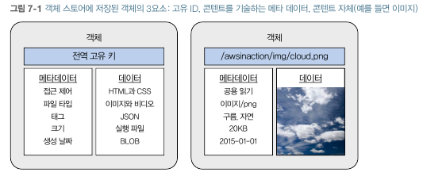
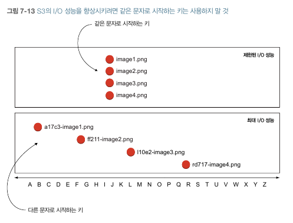

S3
====

## 객체와 객체스토어

### 객체의 구조
고유 식별자, 메타데이터, 콘텐트

### 객체스토어
객체가 저장되는 곳

## 애플리케이션 + S3
애플리케이션에 S3를 통합하면 Stateless Server를 구현가능
* 서버에 로컬 객체를 저장하지 않기 때문

## 아마존 글래시어
오래된 데이터에 대한 백업용으로 사용하면 좋다.

S3에서 객체의 생애주기(LifeCycle)을 정의하여 특정 시점에 글래시어로 이동시킬 수 있다.

## 아마존 S3
HTTPS를 통해서만 접근 가능한 객체스토어
* CLI, SDK, 관리콘솔을 사용하여 객체 업로드/다운로드/관리 가능

### 데이터 일관성 보장
S3는 **최종 일관성** 을 제공한다.

* S3에 객체를 생성, 변경, 삭제하는 작업은 더 이상 쪼개질 수 없다. ~~직역안습~~
* 생성, 변경, 삭제하는 작업이 진행되는 도중에 해당 객체에 접근 시 불완전한 상태의 데이터를 내려받지 않는다는 뜻.
  * 이 경우에는 이전 버전의 데이터를 받게된다.

### 성능향상을 위한 적절한 키 선택
키가 다른 파일들과 동일 문자로 시작할 경우, S3의 I/O 성능에 문제가 생길 수 있다.

여러 파티션에 고르게 배포될 수 있도록 `hashcode-image-id.png` 와 같은 네이밍 형태를 추천한다.

