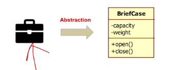
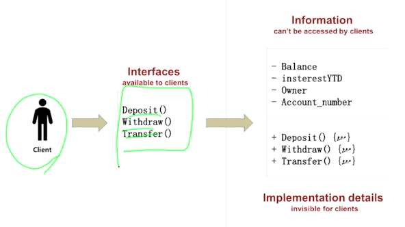
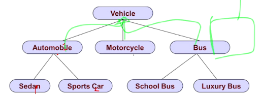
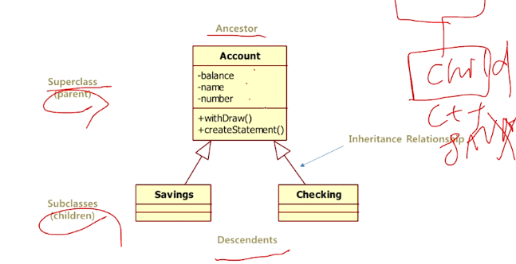
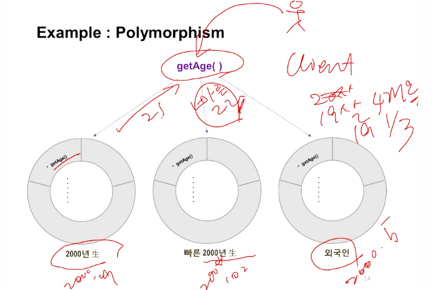
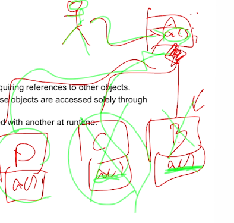
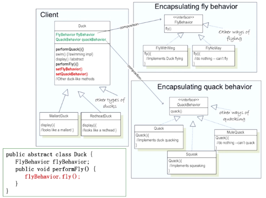

Object-Oriented Principles
====

- 학습목표 : 객체지향 이론을 이해하고 적용할 수 있다.

1. Abstraction (추상화)
2. Encapsulation (캡슐화)
3. Inheritance (상속)
4. Polymorphism (다형성)
5. Composition (포함,합성,구성)

# Basic Object-Oriented Principles

## 1. Abstraction (추상화) (=Modeling)

중요한 것들은 포함하면서 별로 중요하지 않은 부분은 버리는 행위

- Emphasizes relevant characteristics, but Suppresses other characteristics

- 가방의 다른 특성들은 무시하고 수용력과 무게, 열고 닫는 것에만 집중

## 2. Encapsulation (캡슐화)

내부적으로 어떻게 동작하는지 몰라도 사용하는 방법만 알면 사용할 수 있도록 처리하는 행위

> "Design, produce and describe software so that it can be easily used without knowing the details of how it works."
> Also known as information hiding

- 예시 : 자동차를 다룰 때 복잡한 동작은 숨기고 간단한 손잡이나 버튼으로 운전하는 것 (오토)
  - 어떻게 다루는지만 알면 된다!

### Encapsulation as Information Hiding

- Information의 구성을 모르더라도 Interfaces만 알면 된다 => Information을 가린다

## 3. Inheritance (상속) (=generalization)

- "is a kind of", "is-a" relationship

- 공통의 부모를 상속받아서 자식들이 공통부를 이어받음
- OO를 OO답게하는 가장 강력한 도구

### Single Inheritance 

- 하나의 클래스를 상속한다

- Multiple Inheritance : C++은 가능한데 Java 는 안됨

## 4. Polymorphism (다형성)

C에서도 가능은 하지만 흉내내기 정도임

- The ability to **hide many different implementation behind a single interface.**
- The same word or phase can **mean different things in different contexts.**
- 같은 API일지라도 Context에 따라 다른 결과값이 리턴될 수 있다

## 5. Composition (포함,합성,구성)

Object Composition

- **"has a"** relationship between objects.
- 다른 오브젝트를 런타임에 동적으로 가질 수 있다. 
  - 사용자는 A.a()로 일관되게 부르고, 런타임에 B, C, D 등으로 변경되는 것
  - 
- Composition & Polymorphism : 

# Quiz

- 다음의 요구사항은 어떤 OO Basic Principles를 통해 만족시킬 수 있을까요?

  "Desgin, produce and describe software so that it can be easily used without knowing the details of how it works."

  **=> Encapsulation 캡슐화**

- "The ability to hide many different implementation behind a single interface. The same word or phase can mean different things in different context."

  **=> Polymorphism 다형성**

