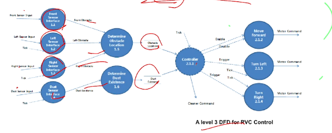
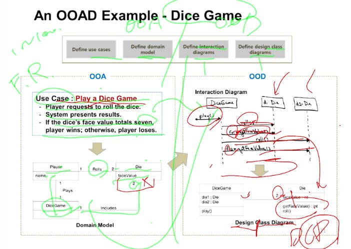
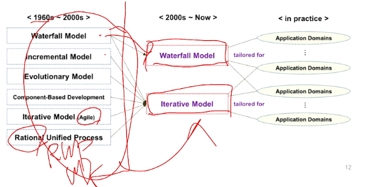
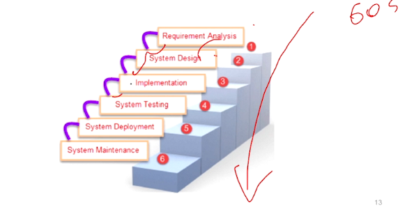
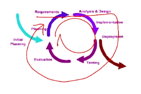
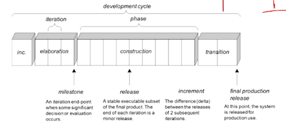

Object-Oriented Development
====

- 학습목표
  - 소프트웨어 개발을 정의할 수 있다.
  - OOAD와 SASD의 차이점을 구분할 수 있다.
  - 다양한 소프트웨어 개발 방법론/프로세스를 구분하고 정리할 수 있다.

# Software Development

"Solving Problems with Software in Computer"

=> 현실의 문제를 컴퓨터의 소프트웨어로 해결하는 것

1. Problems in real world - Natural Language
   - Descriptions of Problems : through Identifying Requirement
2. Solutions in computer - Programming Language
   - Descriptions of Solution : through Designing Programs
3. Program Execution with Computer System

- Procedural Programming : SASD (ex. C, FORTRAN....)
- Object-oriented Programming : OOAD (ex. C++, java ...)

## Procedural Programming

A program is organized with **procedures**.

- Procedure/Function : statements changing values of variables

### SASD (Structured Analysis and Structured Desgin)

- 전통적인 소프트웨어 개발 방법론
- **Top-Down Devide and Conquer**
- Functional view of the problem using DFD (Data Flow Diagram)

## Object-Oriented Programming

C++, Java, Ada 등..

A program is organized with **objects**.

- 객체와 객체간의 커뮤니케이션에 집중한다 :

  - Object : **데이터**와 **오퍼레이션**으로 구성되어있다

  - Object Communication : 다른 객체의 오퍼레이션을 호출하여 데이터와 통신한다

- Providing system functionalities through **object communications**
  - 데이터의 흐름이 외부 노출되지 않는다
  - 오직 객체간의 커뮤니케이션 시퀀스만 존재한다 (시퀀스 다이어그램으로 표현)

### OOAD (Object-Oriented Analysis and Design)

OOA + OOD

- OOA (Object-Oriented Analysis) - 객체를 찾는다 
  - Domain 컨셉을 탐색하고 객체를 정의 (the a of the problem domain)
    - **Domain Model**
  - 요구사항을 명확히 분석
    - **Use Case Model**
- OOD (Object-Oriented Design)
  - Software Object를 정의한다 (static model)
    - **Class Diagram**
  - 요구사항을 만족시키기 위해 Object들이 어떻게 콜라보레이트하고 커뮤니케이션하는지 (dynamic model)
    - **Sequence Diagram**
  - Sequence Diagram을 먼저 그리고 그이후 Class Diagram을 점진적으로 채워나가는 방법

# Software Development Process Model

- Waterfall : 순서대로 크게크게 진행
  - OOA  -> OOD -> 구현 -> 테스팅
- Iteration : 작업의 단위를 나눠서 작업을 반복
  - A기능에 대해서 OOA -> OOD -> 구현 -> 테스팅
  - B기능에 대해서 OOA -> OOD -> 구현 -> 테스팅
  - ... 반복

## Waterfall Model

Software Development Life-Cycle (SDLC) 모델

- 매우 전통적인 오래된 모델

- Requirement가 Fix되어야 하지만 현실에서 그러기는 어려움
- 1인 소규모 프로젝트이거나 초대형 프로젝트인 경우 적합

## Iterative Model - Agile

Waterfall의 단점을 극복하기 위한 방법론

- Rapid Prototyping, Rapid Development
- Lightweight-in terms of documentation and process specification
- 예시 : XP (익스트림 프로그래밍), TDD (테스트 주도 개발)

### Agile 방법의 특징 

- **Iterative** (several cycles)
- **Incremental** (not delivering the product at once)
- Actively involve **users** to establish requirements

### Agile Manifesto

- **individual** over processes and tools
- **Working software** over documentation
- **Customer collaboration** over contract negotiation
- **Responding to change** over following a plan

## Interative Model - UP (Unified Process)

Rational Unified Process (RUP) or UP (Unified Process)

아래와 같은 특징을 가지는 소프트웨어 개발 방법론 이다 : 

- Iterative (Incremental, Evolutionary)
  - 각 Iteration은 작은 단위의 water fall cycle (3주동안만 진행)
  - Requirement workshop을 진행하기도 함
- Risk-driven / Client-driven / Architecture-centric
- User-case-driven

### UP의 Phase들 간략하게 살펴보기

- Iteration (5~10%) : 요구사항 정의 (고객이 OK할때까지)
- Construction (90%) : 구현 

- Transition : 릴리즈를 위한 마무리

# Quiz

- OOAD (Object-Oriented Analysis and Design) 에 대한 다음의 설명 중 올바르지 않은 것은?
  1. **Object-Oriented Program을 위한 소프트웨어 개발 방법론 (Methodology) 중 하나 이다.** => OOAD는 소프트웨어 개발 프로세스이다. 개발 방법론은 UP같은 것들...
  2. OOA (Object-Oriented Analysis) 는 Domain Concepts/Objects를 찾는 단계이다.
  3. OOD (Object-Oriented Design) 단계에서는 Software Object을 정의한다.
  4. OOD에서는 Objects가 서로 어떻게 Collaboration하는지를 정의한다.
  
  > 일반적으로는 네개 다 맞는 말이지만 굳이 디테일하게 들어가자면 정답은 1번
  
- UP 기반 OOAD 방법론에 대한 다음의 설명 중 올바르지 않은 것은?
  1. Iterative, Incremental 및 Evolutionary한 소프트웨어 개발 방법론이다.
  2. Risk-driven 하고 Architecture-centric한 개발 방법론이다.
  3. **Client 보다는 Architecture 관점에서 발생할 수 있는 Risk를 줄이는 것을 중요 하게 생각한다.**
  4. 모든 단계에서 Use Cases가 중요하게 사용된다.
  
  > 모든 단계 : OOA, OOD, OOI
