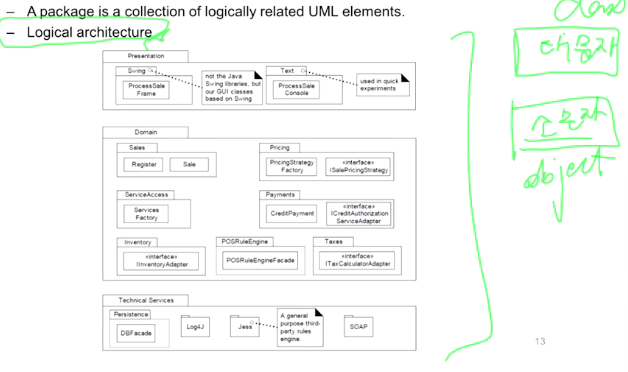

An Introduction to UML
====

# UML (Unified Modeling Language)

13가지 Modeling Language

- Visualizing, Specifying, Constructing, Documenting artifacts of software-intensive systems.

- 다른 분야에서도 범용적으로 사용되고 있음

## UML Semantics

- 4-layers metamodel architecture
  - instance -> model -> meta model -> meta-meta model

- MOF (Meta Object Facility) - 4 layer meta model hierarchy
  - Layer M3 : Meta-meta model layer (The MOF model) (ex. .NET FW)
  - Layer M2 : Meta model layer (The UML meta model)
  - Layer M1 : Model layer (The UML model)
  - Layer M0 : Information layer (the Application)

- MOF and UML are aligned

## UML 2.0 Diagrams

13가지 UML Diagram들이 존재한다 : 

- 기울림체 : Abstract Class
- **메인 다이어그램 : Use Case Diagram, Class Diagram, Sequence Diagram**
  - OOA : Use Case Diagram, Domain Model (Class Diagram 사용)
  - OOD : Sequence Diagram, Class Diagram
- 서브 다이어그램 (개발 진행하다보면 그리게 되는 다이어그램) : Component Diagram, Activity Diagram, State Machine Diagram

# UML 종류들 Overview

## 1. Use Case Diagram

Use case diagram은 사용 케이스의 이름과 사용자 (actor), 그리고 그들간의 관계(relationship)를 표현한다.

- Use case : 성공, 실패 시나리오를 정리. 사용자 (actor)가 어떻게 시스템을 사용하는지.
  - Text Scenario가 핵심!
- Actor : 실제로 사용 및 행동하는 자 (사람 or 컴퓨터 or 조직)

## 2. Class Diagram

Class Diagram은 Class를 정의하고 Class들간의 상호작용관계를 표현한다 (inter-relationship)

- Domain Model
- Design Class Diagram (DCD)

static한 model을 표현 : 

## 3. Object Diagram

현실세계의 객체와 객체들간의 관계를 표현하는데 적절하다.

- 특정 시점의 클래스의 인스턴스들을 표현한다 (일종의 유즈케이스 내 스냅샷...)

> 클래스 다이어그램에서는 몇개까지 가능한지 정의하고, 오브젝트 다이어그램이 이야기하는 그 시점에서는 그게 2개였다는 뜻

## 4. Pacakge Diagram

Class를 Pacakge 로 묶어서 표현하는 것.

대부분 처음부터 그려지지는 않고 Class Diagram이 다수 그려지고나서 그려지는 경우가 많다.

- A package is a collection of logically related UML elements.
- **Logical Architecture** : 의미적으로 묶어놓은 아키첵처

- 네모칸 안에 대문자로 시작하는 단어 : 클래스
- 네모칸 안에 소문자로 시작하고 밑줄이 그어져있으면 : 오브젝트
- 보통은 클래스, 오브젝트, 패키지를 다 함께 그린다

## 5. Component Diagram

실제 개발의 단위. 여전히 Logical한 단위.

- 화살표 모양 : ---( 받고 <--전달--- ㅇ--- 주고

Component diagrams depicts how components are wired together to form
larger components or software systems.

- Illustrate the structure and inter-dependency of arbitrarily complex systems 

## 6. Composite Structure Diagram

Composite structure diagrams are used to explore run-time instances of interconnected instances collaborating over communications links.

- Show the internal structure (including parts and connectors) of components.

## 7. Deployment Diagram

Deployment diagrams depict a static view of the **run-time configuration** of
hardware nodes and the **software components** running on those nodes.

실질적인 Physical한 모델 (실제 하드웨어에 올라가는 소프트웨어...)

## 8. Sequence Diagram

Sequence diagrams model the **collaboration of objects** based on **a time sequence.**

- Show how the objects interact with others <u>in a particular scenario of use cases.</u>

- 시간의 순서가 표현됨 (위에서부터 아래로)

- 시스템이 복잡해지면 그림 사이즈가 매우 커짐

## 9. Communication Diagram

Communication diagrams are used to model the dynamic behavior of the use case. (called collaboration diagram)

- ≈ Sequence diagram
- More focused on showing the collaboration of objects rather than the time
  sequence.

- 그림 자체로는 시간의 순서가 표현되지 않아 화살표와 숫자넘버링을 활용
- 클래스끼리의 커뮤니케이션을 표현함
  - 기대효과는 Sequence Diagram과 동일
- 복잡하긴하지만 사이즈가 커지지 않음
  - 구두로 설명할 때나 교과서에서 설명할 떄 주로 사용

## 10. Timing Diagram

Timing diagrams show the behavior of the objects in a given period of time.

- A special form of a sequence diagram
- The time increases from left to right and the lifelines are shown in separate compartments arranged vertically.

## 11. Interaction Overview Diagram

Interaction overview diagrams focus on the overview of the flow of control of the interactions.

- **A variant of the Activity Diagram,** where the nodes are the interactions or
  interaction occurrences.
- Flow chart 기반으로 현업에서 종종 사용

## 12. State (Statechart) Diagram

State diagrams can show different states of an entity and how an entity responds to various events by **changing from one state to another.**

- Originated from the **Statecharts** formalism
- The history of an entity is modeled by a finite state diagram.
- FSM. 오토마타...
- 시퀀스 다이어그램이나 클래스 다이어그램을 대신할 수 있음.
- 상태기반으로 움직이는 경우라면 그릴 수 있겠음.

## 13. Activity Diagram

Activity diagrams help to describe the flow of control of the target system.

- Exploring complex business rules and operations, describing the use case and
  the business process.
- It is an object-oriented equivalent of **flow-charts and DFDs (data flow diagrams) .**

- 비지니스 프로세스 명세, 일의 순서를 표시할 때
- 일종의 플로우 차트, 데이터 플로우 다이어그램
- State chart Diagram과 비슷하지만 Activity Diagram에서는 넘어가서 동작하는 활동을 정의하는 것이 다르다

---

# Quiz

- UML에 대한 다음의 설명 중 올바르지 않은 것은?
  1. UML은 OOAD 개발방법론이 아니다. => UML은 Modeling Language이다
  2. **UML을 잘 사용하면 Object-Oriented 방식으로 생각 (Design) 도 잘 할 수 있다.** => UML는 언어일 뿐이라 잘 쓴다고해서 OOD 사고를 잘하는 건 아님.
  3. UML로 요구사항/디자인 명세서 (Specification) 내용의 일부 작성할 수 있다. => OOA 단계에서 Use case에 들어갈 수 있고 OOD에서 Sequence Diagram등.. 들어갈 수 있음
  4. UML을 상호간에 의사소통의 도구로서 사용할 수도 있다. => 팀원들간 의사소통 수단

- 다음은 UML 2.2를 구성하는 다양한 다이어그램을 Class Diagram을 이용해서 정리한 그림입니다. 이들 중 3개만 OOAD에서 사용할 수 있다고 한다면, 어떤 다이어그램을 선택해야 할까요? **=> Class Diagram, Use case Diagram, Sequence Diagram**

  
