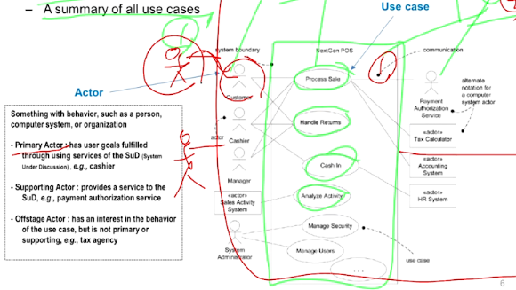
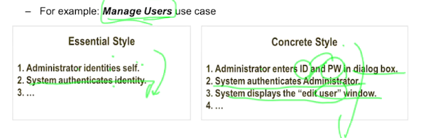
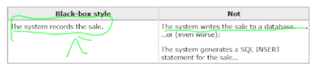

Use Case Diagram
====

# Use Cases

사용자가 시스템을 어떻게 사용하는지에 대해서 서술해둔 **텍스트 스토리.**

- A mechanism to capture (identify and analyze) requirements

- 요구사항을 찾아내고 분석하는데에 사용한다
  - OOAD에서만 사용하는 건 아님
- Use case is not diagram, but a text
  - brief -> casual -> fully dressed
  - fully 로 갈수록 alternative case, exceptional case  등 추가 정보들이 더 정의됨
- output : text, table 등...

# Use Case Diagram

유즈케이스와 사용자들의 이름을 정의하고 그들의 관계를 표현한 것.

- System context diagram
- A summary of all use cases

## 3 Formats of Use Cases

### Brief

- 간단하게 2~3줄로 요약해둔 것

- 보통은 메인 성공 시나리오(Main Success Scenario)나 해피패스를 정의함

### Casual

- OOA
- Informal paragraph format
- 다양한 시나리오를 커버하는 여러 문단들의 모임 
  - Alternative Scenario : 플로우를 벗어나긴 하지만 정상 결과로 돌아오는 경우
  - Exceptional Scenario : 플로우를 벗어나 되돌아오지 못하는 경우 

### Fully Dressed

- OOD/OOI
- 모든 단계와 가능성을 전부 기술하는 부분 (e.g. preconditions...)
- Preconditions, Main Success Scenario, Extensions (Alternative Scenario of success or failure)

## Guideline 

### 1. Write in an Essential Style

사용자의 의도와 시스템의 응답에 대해 중요한 정보만 적어라 (UI Free하도록)

- Essential Style로 적어두면 위 케이스의 경우 지문인증, 홍채인증으로 UA를 확장할 수 있음.

### 2. Write Black-Box Use Cases

시스템의 내부 동작을 서술하지 말아라.

- Define what the system does (analysis), rather than how it does it (design).

## Use Cases는 Functional Requirements일까?

그렇다! OOAD에서는 Use cases가 곧 Functional Requirements 이다.

**Use cases are requirements,** primarily **functional requirements.**

- “F” (functional or behavioral) in terms of FURPS+ requirements types
- Can also be used for other type

-----

# Quiz

- Use-Case에 대한 다음의 설명 중 올바르지 않은 것은?
  1. Use-Case는 외부 Actors가 개발할 시스템을 어떻게 사용하는지를 묘사한 Text Story 이다.
  2. Use-Case Diagram은 시스템의 Boundary (System Context) 를 표시할 수 있다.
  3. **Use-Case는 일반적으로 Use-Case Diagram을 의미하며, Diagram을 그리는 것이 가장 중요하다.** => Use-case 가 가장 중요하다.
  4. Use-Case는 UP의 각 Phase와 Iteration에 따라 다양한 수준으로 개발된다. => 3가지 수준(brief -> casual -> fully dressed)으로 개발됨

- Use-Case에 대한 다음의 설명 중 올바른 것은?
  1. **Use-Case는 가능하면 개발 범위 밖에 있는 UI, HW 등에 Independent하게 작성하는 것이  좋다.**
  2. Use-Case는 UP의 모든 Iteration에서 항상 Fully-Dressed 포맷으로 작성하는 것이 바람직하다. => Iteration마다 3가지 수준으로...
  3. Use-Case는 시스템이 구체적으로 어떻게 동작할 지에 대해서까지 자세히 작성할수록 좋다. => 구체적이면 안됨. 블랙박스여야 함.
  4. Use-Case는 UP Construction Phase까지 지속적으로 Refinement해야 한다. => Construction 단계에서부터는 유즈케이스가 수정되면 안됨.
