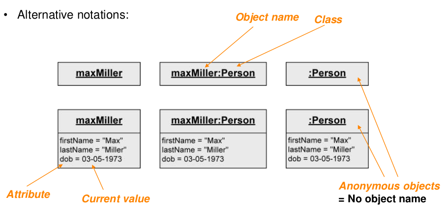
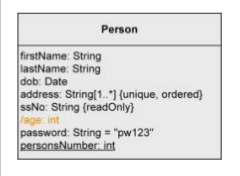
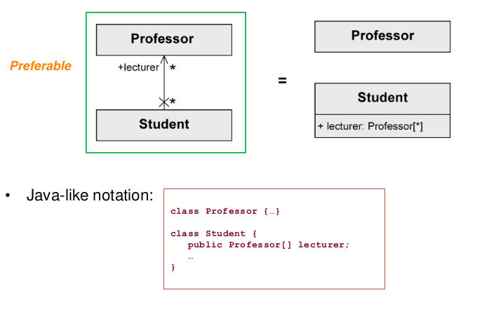
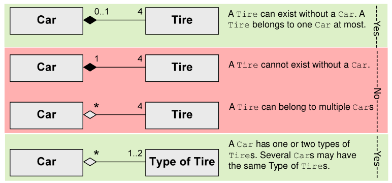
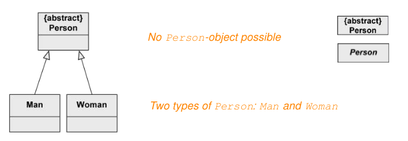

Class Diagram
====

OOAD에서는 두가지 종류로 사용된다 : 

- OOA : Domain Model (Conceptual Perspective)
- OOD : DCD (Design Class Diagram, Design Perspective)

# Object

Object를 표현하고 싶다면 클래스명과 함께 표현한다

## UML Object Diagram

**특정 시점**의 객체들의 관계를 표현한다.

# Class

시스템 내 비슷한 객체들의 세트를 구성한다. (Objects are instances of classes.)

- Attributes : class의 구조적인 특징
- Operations : class의 행동

## Syntax - Basic

### 1. Attribute

#### Visibility

- private(-), public(+), protected(#), package(~)

- default : private (-)

#### Derived Attribute

다른 attribute를 이용하여 만들어지는 attribute (ex. `age`)

- `/변수명` 

#### Type

- Data Type

  - Enumerations : 열거형 타입

  - Primitive : 
    - Pre-defined : Boolean, Integer, Unlimited Natural, String...
    - User-defined : `<<primitive>>`
    - Composite data type (=struct) : `<<datatype>>`

- User-defined classes

#### Multiplicity : `[min, max]`

attribute를 몇개까지 가질 수 있는지 표현

#### Default value : `=value`

#### Properties : `{properties}`

추가적인 정보를 적어둔다. 옵션같은 것..

- Pre-defined properties
  - {readOnly} ... value cannot be changed
  - {unique} ... no duplicates permitted
  - {non-unique} ... duplicates permitted
  - {ordered} ... fixed order of the values
  - {unordered} ... no fixed order of the values
- Attribute specification
  - Set: {unordered, unique}
  - Multi-set (Bag): {unordered, non-unique}
  - Ordered set: {ordered, unique}
  - List: {ordered, non-unique}

### 2. Operation

#### Visibility

- default : public (+)

#### Parameters : `operation(parameter_name: Type)`

operation에 들어오는 파라미터들 정의

- Direction

  - in : 안으로 들어오는 파라미터 (default)

  - out : 밖으로 나가는 파라미터 

  - inout : 안밖 둘 다 가능

    > Java 는 프로그래밍 언어가 out을 지원하지 않으므로 구현 불가능.

### 2-1. Operations vs Methods

- Operation : 선언된 것  (Design까지만 사용하는 용어)
- Method : 코드로 만들어진 것 (Operation을 구현한 결과물)

An operation is not a method.

- A UML operation is a declaration, with a name, parameters, return type,
  exceptions list, and possibly a set of constraints of pre-and post-conditions.
- Not an implementation - rather, methods are implementations.

### 3. Class Variable, Operation

- Class Variable (=Class Attribute, Static Attribute)
- Class Operation (= Static Operation)

### 4. Operation to Access Attributes in DCDs

private attribute에 대한 public getter operation을 만들어서 접근가능하도록 처리

- UML툴에서 생략하기도 하고 자동으로 만들어주기도 함

### 5. Note Symbols

UML 작성자가 주석처럼 적어두는 노트

## Syntax - Relationship

- default : Association

### 1. Dependency

Models **weakest possible relationships between classes**

어떤 객체를 잠시동안 사용하는 경우

- class diagram에서는 자주 사용되지 않지만 component diagram에서는 자주 사용된다. 
- 예시 : operation의 parameter로 특정 클래스의 인스턴스를 받아오는 경우

### 2. Association

Models **possible relationships between instances of classes**

- When objects of one class work with objects of another class for some prolonged amount of time.

어떤 객체를 가지고있는 경우

#### Binary Association

- Navigability : 화살표. public한 것들을 모두 사용할 수 있음. 
  - Student는 Professor의 public attribute, operation 접근 가능

- Non-navigability : X화살표. 아무것도 사용할 수 없음. (생략 가능)
  - Professor는 Student의 attribute, operation 접근 불가

UML 공식적으로는 왼쪽의 방법으로 그리는 것을 추천하나 대부분 오른쪽의 방법으로 그린 후 선으로 관계 표현을 하고 있다. 그리하여 아래와 같은 협상안(?)이 나옴 :

- 원시타입이나 builtin Type들은 클래스 내부에 적고 커스텀 클래스는 관계로 표현하는 방식

#### n-ary Association

2개 이상 객체들이 관계를 이루는 경우

- 방향 화살표로 표현하지 않는다

#### Association Class

Class가 Association에 붙어있는 경우 : 

- 두 클래스의 관계에 대한 데이터가 필요한 경우 (like HashTable, Map 등으로 구현.. )

#### Singleton Classes

단 하나의 인스턴스만 존재하는 클래스

- 가능한 사용하지 않는 것이 좋다. Singleton을 감시하는 감시자가 필요해지기 때문.

  > 그렇지만 DI Library를 활용하게 되면...ㅎ

#### Active Class

자기 자신의 스레드에서 돌아가는 클래스인 경우

- 양옆에 두줄을 그린다

#### Interfaces

interface 구현을 표현하는 몇가지 방법들 : 

- socket + lollipop notation => Component Diagram에서 주로 사용
- Dependency line notation => Component Diagram에서 주로 사용
- Interface implementation

### 3. Aggregation

어떤 오브젝트를 내가 들고있는 경우 (a class is part of anotehr class. association의 특별한 형태)

- 두가지 타입이 존재

  - Shared Aggregation : 공유만 하는 약한 결합으로 Delete가 그냥 각각 되는 경우

    

  - Composition : 강한 결합으로 하나가 Delete되면 같이 Delete되는 경우

    

#### Shared Aggregation

Expresses a **weak belonging** of the parts to a whole

- Parts also exist independently of the whole. (부분이 전체와는 독립적으로 존재한다 = 삭제 연산 등 독립)

### 4. Composition

**Existence dependency** between the composite object and its parts

- One part can only be contained in at most one composite object at one specific point in time. 
- If the composite object is deleted, its parts are also deleted.

- 숫자가 0이면 Shared Aggregation과 동일.

#### Shared Aggregation vs Composition

### 5. Inheritance (Generalization)

Everything of a general class are passed on to its subclasses.

#### Abstract Class : `{abstract}` or *`Class`*

본인은 생성되지 않고 Child 클래스들만 생성될 수 있는 클래스.

#### Multiple Inheritance

Java는 불가능. C++는 가능.

#### Generalization을 사용하는 경우와 사용하지 않는 경우의 차이

- Generalization 사용시 이해는 쉬우나 클래스의 개수가 좀 더 늘어나게 된다

## Class Diagram 그리기

요구사항만 읽고 처음부터 완벽한 클래스 다이어그램을 그리는 것은 불가능하다. 

- 가이드 라인 : 
  - Nouns often indicate classes
  - Adjectives indicate attribute values
  - Verbs indicate operations

# Quiz

- Class에 대한 다음의 설명 중 올바르지 않은 것은?

  1. Attribute의 default visibility는 (-) : Private 이다.
  2. Operation의 default visibility는 (+) : Public 이다.
  3. **모든 Private Attribute에 대해서는 getter와 setter operations을 항상 만들어야 한다.**
  4. **모든 Attributes과 Operations은 Visibility(+/-)가 항상 표시되어야 한다.**

  

- Generalization (Inheritance) 에 대한 다음의 설명 중 올바르지 않은 것은?

  1. **Everything of a general class are passed on to its subclasses.**
  2. Every instance of a subclass is simultaneously an indirect instance of the superclass.
  3. Subclass inherits all characteristics (attributes and operations), associations, and aggregations of the superclass except private ones.
  4. Subclass may have further characteristics, associations, and aggregations.

  

-  다음 Class Diagram의 정보를 가장 잘 해석한 것은?
  1. **모든 책은 그림과 챕터로 구성될 수 있다.**
  2. 대부분의 책은 그림으로 구성되어 있지만 일부는 챕터로 구성된다.
  3. 대부분의 책은 챕터로 구성되어 있지만 일부는 그림으로 구성된다.
  4. 모든 책은 그림과 챕터로 구성되어야 한다.
  5. 책과 그림과 챕터는 다 동등한 개념이다.

-----

# 참고자료

- plantUML : https://plantuml.com/ko/class-diagram
