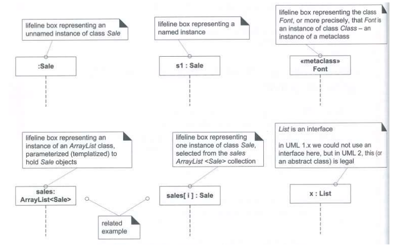
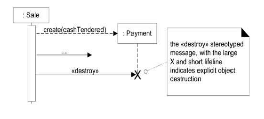

Sequence Diagram
====

Synamic obejct modeling인 Interaction Diagrams 중 하나!

# Interaction Diagrams

- Sequence diagram
- Communication diagram
- Interaction overview diagram
- Timing diagram

## Sequence Diagram vs Communication Diagram

- Sequence Diagram : 시간에 따른 객체간의 collabroraton/communication 표현

   

- Communication Diagrams : 시간 순서보다는 객체간의 collboration을 표현하는 것에 집중

   

### Communication Diagram

- 구성요소 : Link, Message
- A connection path between two objects indicating some form of possible navigation and visibility between the objects

# Sequence Diagram

- 구성요소 : Lifeline boxes, lifelines, Messages

## 구성요소

### Lifeline boxes, Lifelines

- Lifeline boxes : Represent the participants (**roles**) in the interaction, informally and practically

  - object를 표현하기도 하고 class를 표현하기도하고... subsystem, component 등등 표현 

  

  

- Singleton Objects : Box에 1이라고 적어서 표현한다

  

  

### Messages

- 문법 : `return = message (parameter: parameterType) : returnType`

1. Synchronous message
   - 
2. Asynchronous message
   - 
3. Response message (ACK)
   - 응답이 명확한 경우에는 생략 가능
   - 

4. Found message : 화살표 위에 found 텍스트로 표현
5. Lost message : 화살표 위에 lost 텍스트로 표현 
6. Time-consuming message
   - 수평한 선으로 진행되는 메세지 : 거의 즉시 요청/응답이 실행된다고 생각
   - 대각선으로 진행되는 메세지 : 요청/응답에 시간이 걸리는 경우
   - 

## 상호작용 관련

### Instance 가 생성되는 경우

- 점선으로 표시한다
- 생성되는 인스턴스가 좀 더 하단에 있어야 한다

### Object가 제거되는 경우

- destroy message 전달 후 X자로 표시한다

## Fragments & Operators

Sequence Diagram에는 12가지 타입의 Operator들이 존재함

alt, opt, loop, break 를 주로 사용함. 나머지는 MSC에서 사용.

### `alt` Fragment

alternative sequence

- switch 구문과 유사함
- nested 처리 가능

### `opt` Fragment

else가 없는 if문 (an optional sequence)

### `loop` Fragment

반복문 (repeatedly-executed sequences)

### `break` Fragment

속해있는 fragment 밖으로 나가는 조건문 (exception handling)

- break 조건에 걸리면 bread fragment 내부 로직 수행 후 parent fragment  종료 (아래 그림에서 d는 실행되지 않음)

#### `loop` , `break` 예시 

- 로그인을 최대 3번 반복했으나 여전히 패스워드가 불일치하면 에러메세지 수신 후 해당 시퀀스 자체가 종료 (parent fragment 가 없으므로)
- 만약 break 조건에 걸리지 않는다면 (=패스워드가 일치했다면) register부터 쭉 실행됨

### `seq` Fragment

Default order of events

- 보통 `seq` 프래그먼트로 묶어두면, 여러 시나리오 경우의 수를 다 고려하라는 시그널로 씀 : 

### 그 외

`strict`, ` par`,  `critical` Fragment도 존재ㅎㅎ

## 모듈화

### Interaction Reference

특정 시퀀스 다이어그램을 참조하도록 처리할 수 있음

### Iteration Over a Collection

Sending the same message to each object to iterate over all members of a collection (such as a list or map)

Loop 프래그먼트 내에서 index등의 특정 변수에 따른 인스턴스를 지칭하는 표현 가능

## Class Diagram과의 관계

- usecase를 기반으로 sequence diagram을 그림 (OOD)
- iteractive diagram을 기반으로 class diagram을 만들 수 있다 (OOI)
- 클래스 다이어그램을 먼저 그리는 건 어렵다. 유즈케이스를 잘 만들고나서 시퀀스를 먼저 그리자. 

----

# Quiz

- UML Interaction Diagrams에 대한 다음의 설명 중 올바른 것은?

  1. **Interaction Diagram은 4가지 다이어그램에 대한 통칭이며, 실제로 그릴 수 있는 Diagram은 아니다.**
  2. Sequence Diagram은 Communication Diagram 보다 더 Expressive Power가 강력하다.
  3. Communication Diagram은 Sequence Diagram 보다 더 Expressive Power가 강력하다.
  4. Interaction Overview Diagram은 더 큰 시나리오를 하나의 Interaction Diagram으로 그리는 방법이다. => 여러개의 Interaction Diagram으로 그리는 방법 or 하나의 Acitivity Diagram/Flow Chart로 그리는 방법 

  

- 다음의 Sequence Diagram의 Message에 대한 설명 중 올바르지 않은 것은?
  1. Synchronous Message는 Sender가 메시지를 보낸 후, Response Message가 올 때까지 기다린다.
  2. Asynchronous Message는 Sender가 메시지를 보낸 후, Response Message를 기다리지 않는다.
  3. Response Message는 생략이 가능하다.
  4. **일반적으로 수평선으로 그려진 Message는 전송시간을 적게 소비하는 Message이다.**

- 다음의 Sequence Diagram에서 해석이 불가능한 메시지 전송 순서를 고르세요.
  1. a – b – c – d – e
  2. a – c – b – d – e
  3. c – a – d – b – e
  4. **c – d – e – a – b**
