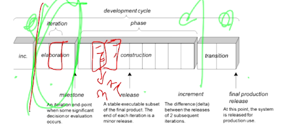
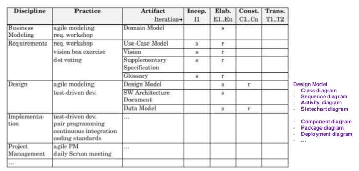

Introduction
====

# OOAD

[OOAD 정리했던 문서 ](../01_OOP/03_Object-Oriented-Development.md)

# UML

- **Sketch Level**
  - Conceptual perspective
  - 정확하게 그리는 건 아니고 컨셉적인 내용으로 그리기 (~OOA)
- **Blueprint Level**
  - Specification perspective
  - 코드 짜기 직전의 UML (OOD)
  - Syntax, Symentic 모두 정확하게 지켜야 함
- Programming Language Level
  - Implementation perspective
  - 요즘은 잘 안씀

## 주의사항

- UML은 OOAD 개발 프로세스가 아니다
- UML은 객체지향 사고/방법을 알려주는 것은 아니다

# UP (Unified Process)

- 정해진 기간안에 이터레이션이 끝나야 한다 (3주간의 미니 워터폴)
- Agile을 기반으로 파생디모
- Flexible
- 기존의 방법론들을 모아놓은 프로세스

## Risk-Driven, Client-Driven Iterative Planning

리스크 기반으로 반복적인 개발을 진행한다.

architecture-centric iteractive development

## UP Phases

작은 네모칸 하나가 3주....

1. Inception
2. **Elaboration** : Requirement를 다 찾아낸다 (리스크 중심으로)
   - Requirement Workshop : 고객, 개발자, 기획자, 사용자, 디자이너 등 모두가 모여서 워크샵 진행
   - 프로토타이핑 진행
   - 끝나고 나면 : 아키텍처가 하나로 Fix됨, 고객이 중요하다고 생각하는 Requirement들이 해결된 상태. 전체 Requirement의 5~10% 정도 차지 (중요한 것들만)
     - Requirement도 이 단계가 끝나면 고정됨 (UseCase는 바뀌지 않아야 함)
3. Construction
   - 디펜던시가 적은 것부터 만들기 시작함 (remaining lower risk and easier elements)
4. Transition

## UP 9 Disciplines

## UP Development Case

- s : 시작한다 

- r : 수정하기 시작한다 

Domain Model -> Use-Case Model (OOA) -----> Design Model (OOD) -----> OOI

## UP Practices

The central idea to UP practices :

- A short timeboxed **iterative**, **evolutionary** and **adaptive** development

Additional best practices and key concepts : 

- Tackle high-risk and high-value issues in early iterations **(→ Risk-driven, Client-driven)**
- Continuously engage users for evaluation and feedback **(→ Client-driven)**
- Build a cohesive, core architecture in early iterations **(→ Architecture-centric)**
- Continuously verify quality; test early, often, and realistically
- Apply use cases where appropriate
- Do some visual modeling (with the UML)
- Carefully manage requirements (configuration management)

## 주의사항

- 대부분의 requirement를 구현전에 다 정의해두고 싶다? => 워터폴
- 처음부터 class diagram을 다 제대로 정의하고 싶다? => 워터폴...
- inception = requirement, elaboration = design, construction = implmentation 이라고 생각된다? => 워터폴...

- 이터레이션 하나가 3개월 정도 될 거라 믿는가? => 워터폴..
- 프로젝트의 처음부터 끝까지 상세하게 계획하고 싶은가? => 워터폴...

# Case Study

- UI elements Layer
- Core application logic Layer (=: business logic layer) 
- OS, database access, collaboration with external SW/HW component Layer (=: technical services layer)

# Quiz

- 다음 중 UP에서 중요하게 생각하는 Best Practice나 Key Concepts이 아닌 것은 무엇인가요?

  1. Tackle high-risk and high-value issues in early iterations
  2. **Make a project plan in detail from start to finish**
  3. Continuously engage users for evaluation and feedback
  4. Build a cohesive, core architecture in early iterations

  

- 다음의 UP에 대한 설명 중 올바른 것은?

  1. We must define most of the requirements before starting design or implementation
  2. Inception = requirements, elaboration = design, and construction = implementation
  3. The purpose of elaboration is to fully and carefully define models, which are translated into code during construction.
  4. **Inception does not require much UML diagramming**

  

- UP Environment Discipline에서 작성되는 Artifact로서, 진행할 프로젝트에서 생성할 UP Artifacts와 사용할 Practices의 선택 결과를 정리한 Artifact는 무엇인가요?

​		**=> Development Case**

