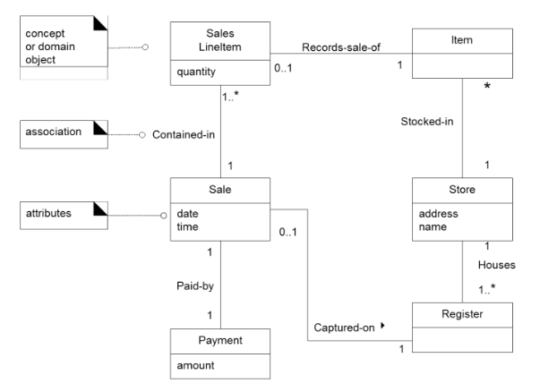

UP - Elaboration - OOA
====

- Domain Model
- Use-case Model

- Operation Contracts (Optional)

# Elaboration

- The core, risky software architecture is programmed and tested.
- **Most requirements are discovered and stabilized.**
  - Elaboration 단계가 끝나면 Requirement 가 Fix되어야 함
- **The major risks are mitigated or retired.**

## Requirement가 점진적으로 구현된다

# Elaboration 단계에서 시작되는 Artifacts

- Domain Model (OOA)
- Design Model (OOD)
- Software Architecture Document
- Data Model
- Use-case storyboards, UI prototypes

## Domain Model (OOA)

a visual representation of conceptual classes or real-situation objects in a domain

- Visual Dictionary

Class diagram 으로 그려짐 (도구로서만 사용)

- **no operations**
- **domain objects** (or conceptual classes)
  - software적으로 구현되지 않는 object들도 존재
- **associations** between conceptual classes
- **attributes** of conceptual classes

Class Diagram의 초기 버전처럼 그려질 수 있음

### Domain Model을 만들어야하는 이유

1. Getting to know the domain (도메인을 파악하기 위해)
2. Inspiring the software classes of the domain layer in the design model
   - lower representation gap을 줄이기 위해
     - lower representation gap :  design layer와 representation layer 사이의 갭
   - 

### Domain Model은 Software Object가 아니다

- 어떤 타입인지는 고민하지 않아도 된다
- 메소드(operation) 생각하지 않아도 된다

### 올바른 도메인 모델이란?

- 하나의 정답만 있는게 아니다. 누가 그리냐에 따라 다 다르게 그려짐.
- Domain Model은 팀 내에서 이해하기와 커뮤니케이션하기가 메인 목적임!
  - Correct << Useful

### Development Case 에서...

- Domain Model은 Const 단계에서는 안쓴다.

## System Sequence Diagram (SSD)

- External Actor와 System만 존재하는 Sequence Diagram
  - the external actor
  - the system
  - the system events
- **Use cases** describe how external actors interact with the software system
  we are interested in creating.
  - During this interaction, an **actor** generates **system events** to a system, usually requesting some **system operation** to handle the event 

- system operation을 도출하기 위해 그린다... 

### System Operation

public interface를 통해서 Black box 시스템에 전달되는 Operation

- a set of system opertaion = system interface

### Guidelines

- System events **should be expressed at the abstract level of intention** rather than in terms of the physical input device.
- Use-Case Model (System Sequence Diagram)

## Operation Contracts (Optional)

- operation의 사전 조건이나 사후 조건을 정의
- contracts of high-level system operations
  - Elaboration 단계의 마지막 즈음에 도출된 system operation에 대해서 만드는 것이 일반적임

### Precondition

### Postcondition

Postconditions describe **changes in the state of objects** in the domain model.

- Instance Creation and Deletion
- Associations Formed and Broken
- Attribute Modification

Only necessary when the outcome of a system operation is **not clear** from the
use case description.

- It will be helpful when there are situations where the details and complexity of required state changes are awkward or too detailed to capture in use cases.

----

# Quiz

- 다음은 Elaboration 단계에 대한 설명이다. 올바르지 않은 것은?

  1. The core, risky software architecture is programmed and tested. => 중요하고 위험요소를 반영한 소프트웨어 아키텍처가 만들어지고 평가된다는 뜻
  2. Most requirements are discovered and stabilized. => Elaboration 단계이후로 requirement가 바뀌면 안됨!
  3. The major risks are mitigated or retired.
  4. **High-level candidate SW architecture is proposed.** => propose만 되면 안되고 programmed, tested까지 되어서 architecture가 fixed되어야 함!!!

  

- 다음의 Domain Model에 대한 설명 중 올바른 것을 모두 고르세요.

  1. Domain Model은 Design Class Diagram의 일종이다. => 해당 도메인에 대한 이해도가 높은 경우에만 Design Class Diagram의 일종이 될 수 있음... 
  2. **Domain Model을 그림으로서 앞으로 개발할 SW가 어떤 환경에서 사용될 지를 가늠할 수 있다.** => SW외적인 부분들도 표현되기 때문
  3. **Domain Model에는 나중에 SW로 구현되지 않는 다양한 Conceptual Classes (Objects)가 포함된다.**
  4. Domain Model이 준비되면 Correctness 여부를 정확하게 검사한 후 사용해야 한다. => Correctness보다는 Useful에 더 가까운 모델임

- 다음의 System Sequence Diagram에 대한 설명 중 올바른 것을 고르세요.
  1. **System을 black box component로 간주하고 분석한다.**
  2. External Actor와 System 간의 모든 Interaction을 System Operation으로 선정 한다.
  3. System이 각 System Operation에 대해서 어떻게 내부적으로 동작할 것인가도 고려해서 분석한다.
  4. UML 2.0을 구성하는 중요한 다이어그램 중 하나이다.

- Operation Contract에 대한 다음의 설명 중 올바르지 않은 것은?
  1. Describe detailed changes to objects in a domain model, as the result of a system operation
  2. Postcondition은 Domain Model을 기준으로 Objects의 상태가 어떻게 변하는가를 기술한다.
  3. **가능하면 모든 System Operations에 대해서 Operation Contracts을 만드는 것이 좋다.**
  4. Elaboration 단계 이후에는 크게 유용하지 않다. => Design Class Diagram 단계에서 더욱 자세히 그릴 수는 있으나 너무 정확해서(?) 유용하지 않다... 
