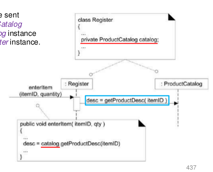

UP - Elaboration - OOI
====

# Designing for Visibility

서로 보여야 커뮤니케이션을 할 수 있다

Visibility 셋팅은 

- Class Diagram에서 
- 구현 단계에서 

## Visibilty Between Objects

Object간에 메세지를 보내기

getter로 visibility!

## Visibility

Visibility is the ability of an object to “**see**” or “**have a reference to**” another object

1. Attribute Visibility => Class Diagram에 표현됨
2. Parameter Visibility => method 외부에서 주입받아 존재하는 temporary한...
3. Local Visibility => method 내에 존재하는 temporary한...
4. Global Visibility => Singleton 이면 확보됨

# Mapping Design to Code

---

# Quiz

- 다음의 설명 중 올바르지 않은 것을 고르세요.

  1. UML Package Diagram은 Logical Architecture를 표현한다.

  2. UML Deployment Diagram은 Physical Architecture를 표현한다.

  3. Layer는 비슷한 기능을 수행하는 Class, Package 또는 Subsystem 등을 모아 (Grouping) 놓은 것이다.

  4. **Layer는 Physical Architecture로서 UML Deployment Diagram으로만 표현되는 것이 바람직하다.** => Logical Architecture. UML로만 표현되는 건 아님.

     => Layer -> Tier로 바꾸면 말이 됨.

  

- Visibility에 대한 다음의 설명 중 올바른 것은?
  1. Visibility는 한 Object이 다른 Object에 정의된 모든 Attributes와 Operations을 볼 수 있는 능력 (Ability) 을 의미한다. => 모든(X). Public한 것들만 볼 수 있음.
  2. Object A에서 Object B로 메시지를 보낼 때, A는 B에게 보여야만 한다. => B가 A한테 보여야 함
  3. **Attribute Visibility는 가장 기본적이고 많이 사용되는 Visibility로서, Class Diagram을 통해서 확인할 수 있다.**
  4. Parameter Visibility는 Local Visibility로 쉽게 바꿀 수 있다. => 쉽게 못바꾼다. 아키텍처를 많이 바꿔야함. Parameter -> Attribute으로 바꾸는게 좀 더 쉬움.
