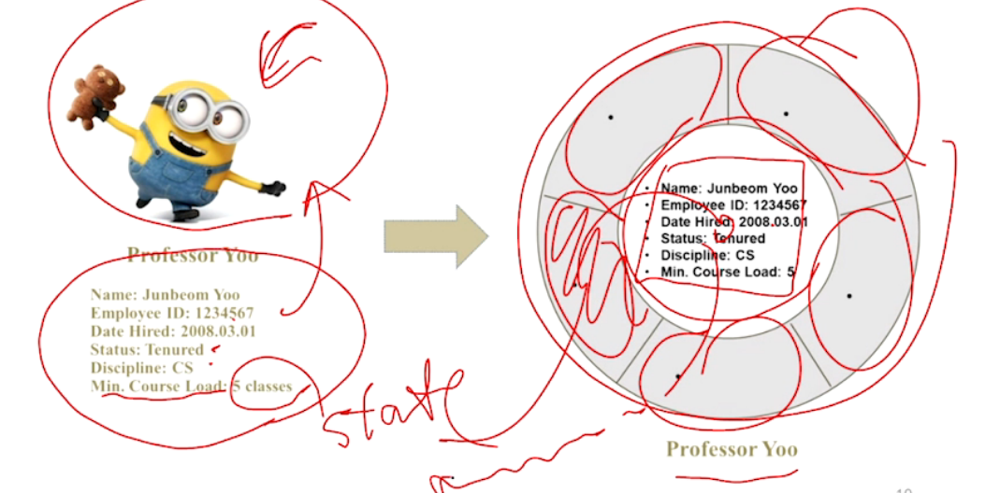
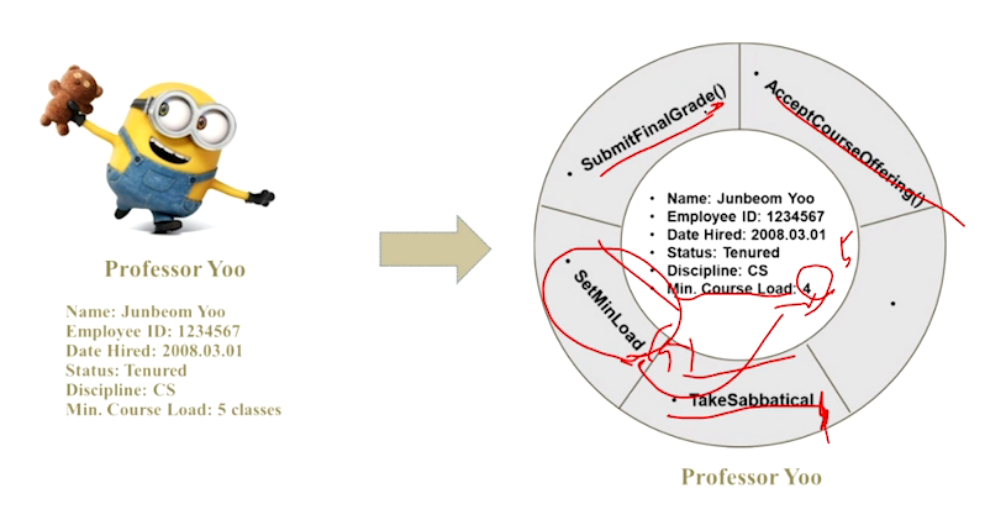
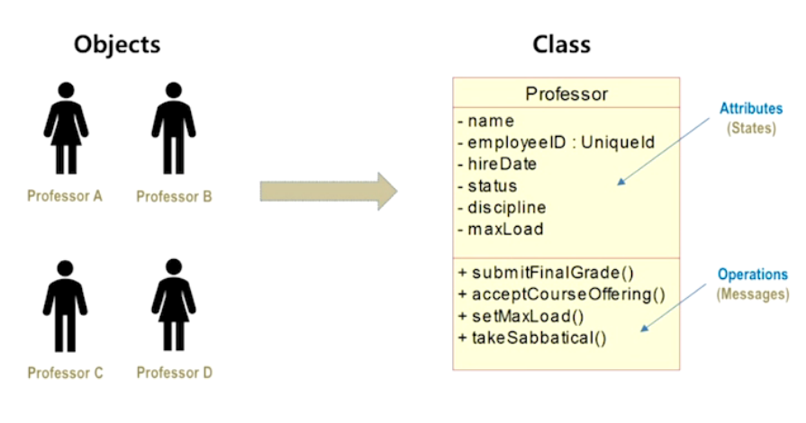
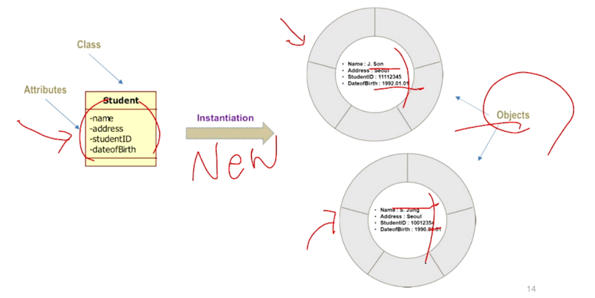
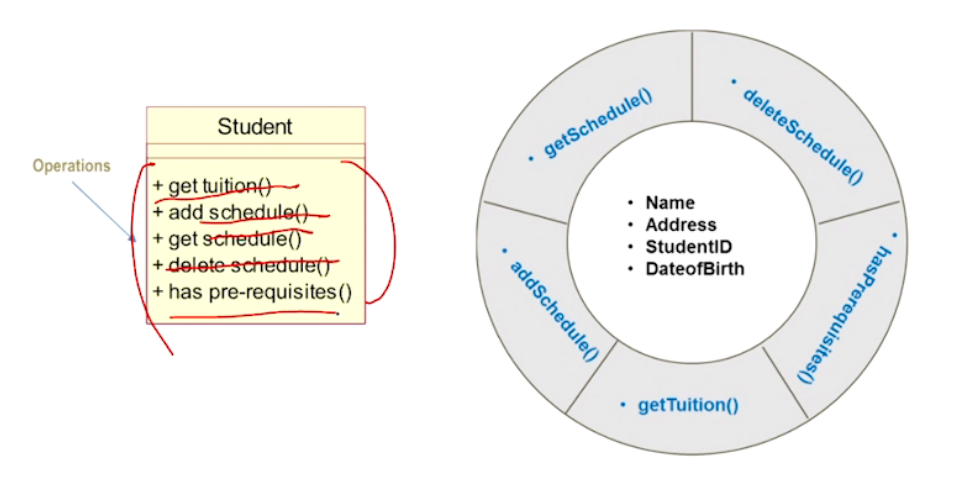
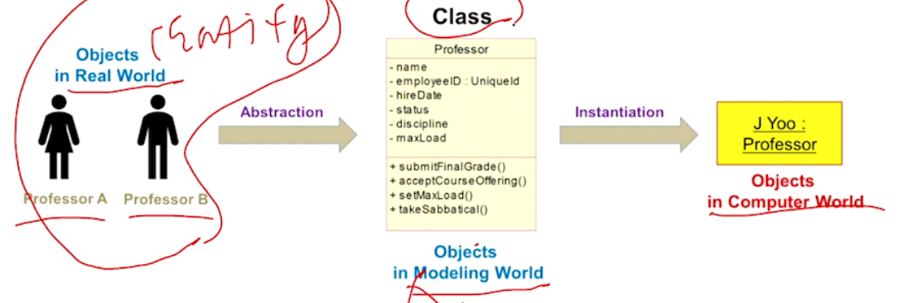
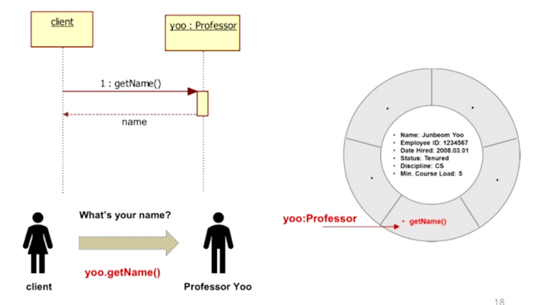

Object Oriented (OO)
=====

# Object

informal : An Object represents an **entity**.

- 어떤 Entity? : Physical (ex. 트럭, 차), Conceptual (ex. Chemical Process), Software (ex. Linked List)

- Object라는 표현 자체는 소프트웨어에서 시작된 건 아니다. 다양한 산업 분야에서 사용하던 용어다. 

formal : An Object is an **entity** with a well-defined <u>boundary</u> and <u>unique identity</u> that encapsulates **state** and **behavior**

- State : Object가 가지는 정보, 관계들 (=: attribute)
- Behavior : Object 가 할 수 있는 행위 (=: operations)

## State

바운더리로 둘러싸여 있음 => 캡슐화를 통해 정보를 은닉함 (public 프로퍼티나 getter로 접근)

## Behavior

Behavior determines how an object acts and reacts.

- Modeled by the set of messages which it can respond to (= operations the object can perform)

object가 수행할 수 있는 동작을 정의. 해당 동작들로 인해 state가 변경되기도 함.

## Collaborate

Objects are useful only when they can collaborate to solve a problem

- Each obejct is responsible for its own behavior and status.
- No one object can carry out every responsibility on its own.

Obejct 들은 어떻게 서로 상호작용 하나? => Collaboration =: Message Pass =: interact through message

Data Manufactual

- Object Oriented에서는 데이터를 사용할 수 있는 Operation을 묶어 Object라고 부름. 이 Object가 이 데이터의 주인. 해당 Operation들만 해당 데이터에 접근 가능.
  - 다른 Object는 내 데이터를 못 씀. 나도 다른 Object 의 데이터를 못 씀. 
  - 데이터 접근은 public getter, setter Operation으로만 가능.

시퀀스 다이어그램

- Object 끼리의 상호작용이 한눈에 보임

# Class

Object를 만드는 틀/템플릿 (An object is an instance of a class)

A class is <u>a description of a set of objects</u> that share the same **state(properties)** and **behavior**.

- Attribute
- Operation

## Attribute

An attribute is <u>a named property of a class</u> that describes a range of values which instances of the property may hold.

- 각 object 들의 항목은 같으나 information은 다르다

## Operation

An operation <u>is the implementation of a service</u> which can be requested from any object of the class to affect behavior.

- operation 을 통해 데이터에 접근한다
- 특정 class의 object들은 동일한 operation을 가진다
  - object diagram : operation 정보는 표현하지 않는다 (어차피 동일하니까)

## Object vs Class

- A Class is an abstract definition of an object.
  - Objects are grouped into classes.
  - An object is an instance of a class.

[Real world] Objects --abstraction--> [SW Modeling World] Class (OOA/OOD) --Instantiation--> [Computer Wolrd] Objects (OOI)

| [Real world] | --abstraction--> | SW Modeling World | --Instantiation--> | Computer World |
| ------------ | ---------------- | ----------------- | ------------------ | -------------- |
| Objects      |                  | Class             |                    | Objects        |
|              |                  | OOA/OOD           |                    | OOI            |

## Class Diagram

- (-) : private (default : attribute)
- (+) : public (default: operation)

## Message

Object들끼리 Communication/Collaboration!

A specification of a **communication** between objects.

- 시퀀스 다이어그램 : 메세지 패싱 (execution..)

