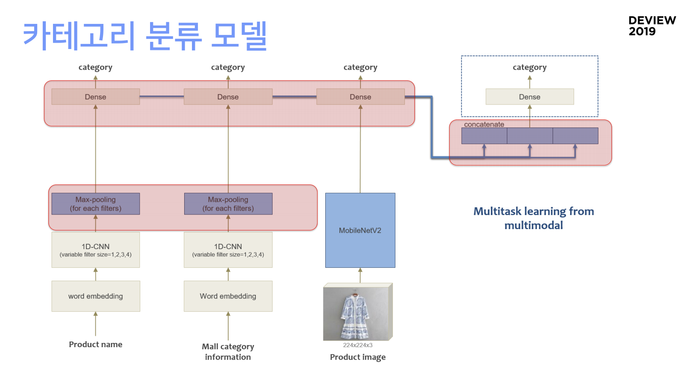

## 엄~청 큰 언어 모델 공장 가동기! (LaRva: Language Representation by Clova)

* 이동준, 김성동 / Clova AI
* [발표자료]([https://deview.kr/data/deview/2019/presentation/[111\]+%E1%84%8B%E1%85%A5%E1%86%B7_%E1%84%8E%E1%85%A5%E1%86%BC+%E1%84%8F%E1%85%B3%E1%86%AB+%E1%84%8B%E1%85%A5%E1%86%AB%E1%84%8B%E1%85%A5+%E1%84%86%E1%85%A9%E1%84%83%E1%85%A6%E1%86%AF+%E1%84%80%E1%85%A9%E1%86%BC%E1%84%8C%E1%85%A1%E1%86%BC+%E1%84%80%E1%85%A1%E1%84%83%E1%85%A9%E1%86%BC%E1%84%80%E1%85%B5.pdf](https://deview.kr/data/deview/2019/presentation/[111]+엄_청+큰+언어+모델+공장+가동기.pdf))

NSP가 필요없다고?! (Next Sentence Prediction ?!)

MLM에 비해 너무 쉬워서... 차라리 긴 시퀀스를 보는 것이 더 도움!)

최근 여러 논문에서 NSP의 필요성에 대한 의문을 던짐 SpanBERT (Joshi et al, 2019) RoBERTa (Liu et al, 2019) ALBERT (ICLR 2020 open review)

### 평가

#### KLUE: 한국어 이해 평가 벤치마크

#### Tokenizer: Cased vs Uncased

대체로 성능은 비슷하나, 자모 분해로 Token 수가 늘어나 기계독해 성능 하락 Cased 우세 감정분석 Task에서는 Uncased이 약간 우세

* Cased 와 Uncased 차이 예시. 
  * Input: 안녕하세요.
  * - (bert-base-multilingual-uncased, do_lower_case=True), ['F', '##Ph', '##녀', '##y', '##하', '##세', '##요']
    - (bert-base-multilingual-cased, do_lower_case=False), ['안', '##녕', '##하', '##세', '##요']

### 실험결과 정리

- 모든 Task 성능 향상이 도움이 되는 요소:

  -  • BatchSize 높을수록 , ModelSize 높을수록 , Optimal Vocab

  -  • Pre-training Methods (Masking Strategy, Full Sentence 등...) 
- 각 Task에 의존적인 요소: 
  - • Tokenizer (Char/Wordpiece), Cased/Uncased 
- Pre-training 외에도 Fine-tuning 단 성능 향상 가능
  -  • Multi-Task Learning - 같은 도메인에서 상대적으로 수가 적은 데이터셋의 성능 향상

### 서비스 단에 올리려면.. (상품화 레벨)

* ㅊㅓ리속도 면 : cuBERT,  Nvidia TensorRT

* 모델 사이즈 면 : 성능 차이가 별로 나지 않으면서도 모델 사이즈를 줄여야 해...

### 추가자료

* [NLP bert](http://www.aitimes.kr/news/articleView.html?idxno=13117)
* [[github] bert](https://github.com/google-research/bert)

* [[github] SentencePiece](https://github.com/google/sentencepiece)
* [[github] FastBPE](https://github.com/glample/fastBPE)

## 감정연기와 외국어가 가능한 인공지능 성우

* [발표자료]([https://deview.kr/data/deview/2019/presentation/[112\]%E1%84%80%E1%85%A1%E1%86%B7%E1%84%8C%E1%85%A5%E1%86%BC%E1%84%8B%E1%85%A7%E1%86%AB%E1%84%80%E1%85%B5%E1%84%8B%E1%85%AA%20%E1%84%8B%E1%85%AC%E1%84%80%E1%85%AE%E1%86%A8%E1%84%8B%E1%85%A5%E1%84%80%E1%85%A1%20%E1%84%80%E1%85%A1%E1%84%82%E1%85%B3%E1%86%BC%E1%84%92%E1%85%A1%E1%86%AB%20%E1%84%8B%E1%85%B5%E1%86%AB%E1%84%80%E1%85%A9%E1%86%BC%E1%84%8C%E1%85%B5%E1%84%82%E1%85%B3%E1%86%BC%20%E1%84%89%E1%85%A5%E1%86%BC%E1%84%8B%E1%85%AE__.pdf](https://deview.kr/data/deview/2019/presentation/[112]감정연기와 외국어가 가능한 인공지능 성우__.pdf))

텍스트 이외의 입력을 받아서 조종이 가능하게 만들자.

* 텍스트, 스타일 (감정, 특정 부분 강조(인토네이션)), 화자(목소리), 언어
  * 화자 컨트롤
  * 스타일 컨트롤 : 비지도 학습으로 했음
  * 언어 컨트롤 : 언어의 유창함 정도

## 챗봇 1만 개의 모델 서빙하기: AI 서비스 어디까지 해봤니

* [발표자료]([https://deview.kr/data/deview/2019/presentation/[113\]%EC%B1%97%EB%B4%87+1%EB%A7%8C+%EA%B0%9C%EC%9D%98+%EB%AA%A8%EB%8D%B8+%EC%84%9C%EB%B9%99%ED%95%98%EA%B8%B0-+AI+%EC%84%9C%EB%B9%84%EC%8A%A4+%EC%96%B4%EB%94%94%EA%B9%8C%EC%A7%80+%ED%95%B4%EB%B4%A4%EB%8B%88.pdf](https://deview.kr/data/deview/2019/presentation/[113]챗봇+1만+개의+모델+서빙하기-+AI+서비스+어디까지+해봤니.pdf))

## 레이블링 조금 잘못돼도 괜찮아

* [발표자료]([https://deview.kr/data/deview/2019/presentation/[114\]%EB%A0%88%EC%9D%B4%EB%B8%94%EB%A7%81%20%EC%A1%B0%EA%B8%88%20%EC%9E%98%EB%AA%BB%EB%8F%BC%EB%8F%84%20%EA%B4%9C%EC%B0%AE%EC%95%84.pdf](https://deview.kr/data/deview/2019/presentation/[114]레이블링 조금 잘못돼도 괜찮아.pdf))

### 레이블 노이즈란ㅋ.ㅋ

같은 범주의 데이터를 잘못 설명하는 **의도되지 않은** 미스레이블링

모델의 피쳐 익스트랙션을 어렵게 한다. => 모델의 성능을 떨어뜨린다.

### 어떻게 해결하지

훈련 모델 = 훈련방법(데이터, 모델)

#### 후보1. 모델 구조를 업그레이드한다.

복잡한 패턴도 잘 인식하는 모델구조를 쓰자... => But 서빙+훈련 계산량 증가...

#### 후보2. 훈련 방법을 업그레이드 한다.

커리큘럼을 만들어서 학습시키자... => But 훈련 계산량 증가, 추가 데이터 필요

#### 후보3. 데이터를 깔끄미하게 만들자

사람이 수동으로 작업하기...... => 시무룩.....

=> 사람 도움 없이 레이블 작업을 할수는 없을까?

### 레이블링 자동화하기

**Automated Feature Engineering**

[AutoML ! ](https://cloud.google.com/automl/?hl=ko)

#### Split - Train - Check 알고리즘

#### MutliSplit - Train - Check - Vote 알고리즘

* MultiSplit: 여러버전의 Split branch를 구성

* Vote: Label update를 위해서 각 branch의 “Split-Train-Check” 결과를 결합

Checker가 확률 형태로 값을 내놓는 다는 것을 활용할 수 없을까???

### PICO: Probabilistic Iterative COrrection 알고리즘

* Checker의 결과를 베이지안 확률 결합한다
* 레이블링의 Interactive Probabilistic correction
* 레이블링 히스토리의 HMM 통한 반영

반복적 확률적 Vote를 통해서 점진적으로 레이블 노이즈를 제거한다

#### 효율 개선

* GPU 리소스 이슈 : branch 수 최소화 + early stopping criterion 도입 예정
* 메모리 부족 이슈 : spark와 sparse matrix 도입하여 해결
* Inference API 서버 부하 이슈 : 팀의 Local serving project의 비호로 해결

#### 품질개선

생성 모델을 통한 Imbalance Dataset문제 해결

다양한 Metric voting 방식 적용

### 요약

* 데이터 품질 전략이 없는 AI프로젝트는 성공하기 어려웡
* AI 데이터 자동정제 파이프라인은 매우 큰 경쟁력
* 네이버 클로바 챗봇 빌더는 PICO를 통해 데이터를 자동 정제해서 서비스 품질을 개선했다
* PICO 아키텍처는 다른 종류 데이터 셋에도 적용 가능하다

=> 매뉴얼 노동에서 벗어난다!

## 이미지와 Text정보들을 이용한 쇼핑 카테고리 분류 AI (대규모 분류 문제를 AI로 해결하기)

* [발표자료]([https://deview.kr/data/deview/2019/presentation/[125\]%EC%9D%B4%EB%AF%B8%EC%A7%80%EC%99%80%20Text%EC%A0%95%EB%B3%B4%EB%93%A4%EC%9D%84%20%EC%9D%B4%EC%9A%A9%ED%95%9C%20%EC%87%BC%ED%95%91%EC%B9%B4%ED%85%8C%EA%B3%A0%EB%A6%AC%20%EB%B6%84%EB%A5%98AI.pdf](https://deview.kr/data/deview/2019/presentation/[125]이미지와 Text정보들을 이용한 쇼핑카테고리 분류AI.pdf))

### 텍스트 데이터 처리 Word2Vec

Vocabulary는 적게! (거의 20% 차이가 났음)

1D CNN

### 이미지 처리

* 백본 : MobileNet V2
* 입력 이미지의 크기에 따른 학습 효율...! 가장 최적의 사이즈를 정하자!

### 전처리

* AutoML을 활용하여 이것저것 돌려보며 파라미터 값들이 어떤 값일 때 성능이 좋은지 판단하기
  * 발표자님은 fcl_dim이 낮을 수록 좋았다고 함
* Data Imbalance problem
* Trend problem
* Selfie - 잘못된 GT는 고치거나 빼자

### 맞춤 튜닝 (Eval & Tunn)

* 이미지 모델이 잘 학습 되었을까? => SHAP
* 텍스트 모델이 잘 학습 되었을까?
  * 어떤 단어로 인해 미스매칭되는지 분석해야 함.
* 토크나이저의 튜닝은 **학습데이터에서 미스매칭하기 쉬운 데이터들을 걸러내는 것**!!!!!

### 분류를 할 수 없는 분류의 문제...

기타

모호한 카테고리

몰 ㅋㅏ테고리가 어뷰징

### 운영 인퍼런스를 위한 노하우

* 병렬 Kafka 큐 처리로 10배의 성능 개선

## Dialog Bert : 100억 건의 메신저 대화로 일상대화 인공지능 서비스하기

* [발표자료](./images/deview2019/[116] Dialog-BERT 100억 건의 메신저 대화로 일상대화 인공지능 서비스하기.pdf)

### 일상대화를 잘 못하는 이유

1. 대화의 주제가 무한하다
2. 필요한 지식과 상식이 무한하다
3. 의도나 목적이 불분명하다. (=정답이 불분명하다)
4. 일상대화에 대한 데이터가 별로 없다

### BERT (Bidirectional Encoder Representation from Transformer)

11개의 다양한 NLP 태스크에서 state of the art 성능(최고성능)을 보였다

* Pre-training : 언어 전반에 대해 깊게 이해하는 단계

* Fine-tuning : 깊은 언어의 이해를 바탕으로 특정 문제에 맞춰 적응하는 단계

#### Next Sentence Prediction (NSP)

다음 문장은 무엇이 나올까?

#### Masked Language Modeling (Masked LM)

빈칸에 어떤 것이 들어갈까?

### 일상대화 데이터

연ㄱㅐ의ㅗkgkr 앱으로 카톡, 라인의 대화 데이터를 가지고있다.

#### 전ㅊㅓㄹl

#### pre-training

고민1. 대화체로 학습시켜도 괜찮을까?

고민2. Turn에 대한 구분이 필요하지 않을까? (화자 이동)