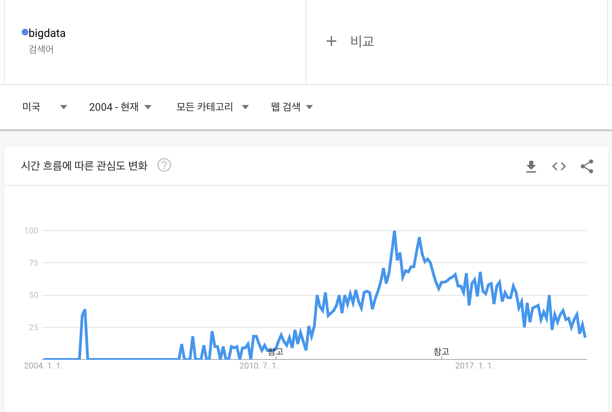

# 1과목. 데이터 이해

* 데이터
* 데이터베이스
* 빅데이터
* 데이터 사이언티스트
* 데이터 관련 기술과 비즈니스 전략

> **예상 출제 문항수 : 10문제 - 8객 / 2주**
> 2문제 정도는 범위 외의 문제들이 나옴 (SQL, 최근 동향 등...)

# 데이터 

> 데이터 분석 준전문가가 알아야하는 기본 소양에 대한 내용! 용어 익히기!

데이터, 데이터베이스의 정의/특징/활용을 이해해보자.

* **데이터 : 추론과 추정의 근거를 이루는 사실**
  * 존재적 특성 : 객관적 사실 (fact, raw material)
  * 당위적 특성 : 추론/예측/전망/추정을 위한 근거 (basis)

## 데이터의 유형

> 비교를 하는 문제들이 자주 출제됨

| 구분                              | 형태 | 예시 | 특징 |
| --------------------------------- | ---- | ---- | ---- |
| 정성적 데이터 (qualitative data)  | 형식과 형태가 정해져있지 않음 (비정형 데이터) 언어, 문자 등 | 리뷰 데이터, 회사 매출이 증가하였음, 주관식 응답 등 | - 저장/검색/분석에 많은 비용(저장공간 등)이 소모 됨 - 데이터가 가지는 의미가 매우 큼 - 빅데이터가 떠오르며 정성적 데이터를 분석하기 용이해짐 |
| 정량적 데이터 (quantitative data) | 수치로 표현됨 (정형데이터) 수치, 도형, 기호 등 | 나이, 몸무게, 주가, 지역별 온도, 풍속, 강우량 등 | - 정형화가 된 데이터로 비용 소모가 적음 - 관리가 용이하여 정량적 데이터를 주로 분석해왔음 |

* 정형 데이터 vs 반정형 데이터 vs 비정형 데이터 

|                    | 정형 데이터                                | 반정형 데이터                                    | 비정형 데이터                                                |
| ------------------ | ------------------------------------------ | ------------------------------------------------ | ------------------------------------------------------------ |
| 형태               | 고정된 필드                                | 스키마, 메타데이터                               | 없음                                                         |
| 연산               | 가능                                       | 불가능                                           | 불가능                                                       |
| 저장               | RDBMS                                      | 파일                                             | NoSQL                                                        |
| 데이터 수집 난이도 | 쉬움                                       | 중간                                             | 어려움                                                       |
| 데이터 처리        | 쉬움                                       | API형태로 제공  => 데이터 처리 기술 필요    | 어려움  => 데이터 형태로 파싱 필요                      |
| 예시               | 관계형 데이터베이스, 스프레드 시트, CSV 등 | XML, HTML, JSON, 로그형태(웹로그, 센서데이터) 등 | 소셜데이터(트위터, 페이스북), 영상, 이미지, 음성, 텍스트(word, PDF 등) 등 |

## 지식의 형태

### 암묵지

학습과 경험을 통해 개인에게 체화되어 있지만 겉으로는 드러나지 않는 지식

* 김치 담그기, 자전거 타기 등
* 전달/공유가 어려움
* 개개인에게 **내면화**되어있는 지식
* 조직의 지식으로 **공통화**되어야 한다

### 형식지

문서나 매뉴얼로 형상화된 지식

* 교과서, 비디오, 데이터베이스 등
* 전달/공유가 매우 용이
* 언어, 기호, 숫자로 **표출화**되어있는 지식
* 개인의 지식으로 **연결화**되어야 한다

### 상호작용

공통화 -> 표출화 -> 연결화 -> 내면화

### 발전단계

암묵지 -> **형식화** -> 형식지 -> **체계화** -> 방법론 -> **내재화** -> 암묵지

## DIKW 피라미드

> DIKW 요소들의 정의, 예시를 묻는 문제가 자주 출제됨

* **Data (데이터)** : 가공되지 않은 순수한 데이터

  * A마트 : 연필 300원, B마트 : 연필 1000원

* **Information (정보)** : 데이터간의 상관관계 이해를 통해 패턴을 인식하고 의미를 부여한 정보

  * A마트의 연필이 더 싸네?

* **Knowledge (지식)** : 정보 패턴을 이해하여 예측한 지식

  * 더 싸니까 A마트에서 연필을 사야겠어!

* **Wisdom (지혜)** : 지식을 이용하여 도출한 창의적인 지혜

  * A마트의 다른 물건들도 B마트보다 싸지 않을까?

  

# 데이터베이스

### 연혁

* 1950년대 :  **미군에서 군비상황을 관리**하기 위해 **데이터(data)의 기지(base)**를 설립함 
* 1975년 : **우리나라에서 데이터베이스 이용이 시작**됨
* 1980년대 중반 : 국내의 데이터베이스 관련 기술 연구/개발
  * 경영정보시스템으로 이용하기 시작함

## 데이터베이스의 개념, 정의

> 내용을 다 외울 필요는 없고 데이터베이스 정의의 흐름을 파악하는 것이 중요!

네트워크와 빅데이터 시대를 지나며 개념과 정의가 확대되기 시작함

### 최초 개념

체계적, 조직적으로 정렬된 데이터 집합을 의미

### 1차 개념 확대 - 정형 데이터 관리

* 대용량의 데이터를 저장/관리/검색/이용할 수 있는 컴퓨터 기반의 데이터베이스

### 2차 개념 확대 - 비정형데이터 포함

* 문자, 기호, 음성, 화상, 영상 등 다수의 콘텐츠를 체계적으로 수집/축적하여 다양한 용도와 방법으로 이용할 수 있도록 정리한 정보의 집합체 

## 데이터베이스의 특징

> 출제포인트 : 특징이 아닌 것을 고르거나, 특징과 설명이 잘못 매칭된 것을 고르거나...

### 일반적 특징

* **통합된 데이터 (Integrated Data) :** 동일한 내용의 데이터가 중복되어 있지 않음
* **저장된 데이터 (Stored Data) :** 데이터가 저장매체에 저장됨
* **공용 데이터 (Shared Data) :** 여러 사용자가 서로 다른 목적으로 공동으로 이용
* **변화되는 데이터 (Changable Data) :** CRUD. 항상 변화하면서도 현재의 정확한 데이터를 유지

### 다양한 측면에서의 특징

* **[중요] 정보의 축적 및 전달 측면**
  * 기계가독성 : 컴퓨터 등의 기기가 읽고 쓸 수 있다
  * 검색가독성 : 다양한 방법으로 필요한 정보를 검색한다
  * 원격조작성 : 정보통신망을 통해 원거리에서도 즉시 이용 가능하다
* 정보 이용 측면 : 다양한 정보를 정확하고 경제적으로 신속하게 획득
* 정보 관리 측면 : 방대한 양의 정보를 체계적으로 축적, 추가, 갱신 용이
* 정보기술 발전 측면 : 기술의 발전을 견인
* 경제/산업 측면 : 정보를 신속하게 제공/이용할 수 있는 인프라 특성을 가짐 => 경제/산업 발전에 기여

## 데이터베이스의 활용

> 출제포인트 : 약어의 의미를 잘못 설명한 것을 찾거나 하는 문제

### 기업내부 데이터베이스

기업 경영 전반에 관한 데이터를 연계하여 일관된 체계로 구축, 운영하는 경영활동의 기반이 되는 전사시스템

#### 1980년대

* OLTP (Online Transaction Processing) : 호스트 컴퓨터가 데이터베이스에 엑세스하고 바로 처리 결과를 돌려주는 형태
* OLAP (Online Analytical Processing) :  다양한 비즈니스 관점에서 쉽고 빠르게 **다차원적인 데이터에 대화식으로** 접근하여 의사결정에 활용할 수 있는 정보를 얻을 수 있게 주는 기술

#### 2000년대

* CRM (Customer Relationship Management, 고객 관계 관리) : 기업과 **고객과 관련된 내/외부 자료**를 분석/통합하여 **고객특성에 맞게 마케팅 활동**을 계획/지원/평가하는 과정
* SCM (Supply Chain Management, 공급망 관리) : 원재료의 생산에서부터 고객에게 유통하는 공급망의 단계까지, **모든 단계에 걸쳐 정보들을 공유하며 원활하게 제품을 생산하고 공급**하는 시스템
* ERP (Enterprise Resource Planning, 전사적 자원 관리) : 경영자원을 하나의 통합 시스템으로 재구축
  * 

* BI (Business Intelligence, 비즈니스 인텔리전스) : 기업의 수많은 데이터를 정리/분석하여 **기업의 데이터 기반 의사결정에 활용**하는 일련의 프로세스 및 **도구**
  * 질의(query), 보고(reporting), 온라인 분석처리(OLAP), 통계분석, 예측, 데이터마이닝 등의 결합이다.
  * BA (Business Analytics) : BI에 쓰이는 분석 툴(**기법**)들

### 분야별 데이터베이스

1. 제조
   * 2000년을 기점으로 전환
   * 클라이언트/서버 기반의 내부 정보 시스템 -> 웹 전환
   * ERP -> SCM 대기업 위주의 발전
   * RTE (Real-Time Enterprise) 을 통한 협업적 IT 화 비중 확대
2. 금융
   * 2000년대 초반
     * EAI (Enterprise Application Integration) : 정보를 중앙집중적으로 통합, 관리, 사용할 수 있는 시스템
   * 2000년대 중반
     * EDW (Enterprise Data Warehouse) : DW(Data Warehouse)를 전사적으로  확장하여 다양한 분석 애플리케이션을 위한 원천
3. 유통
   * 충성도 높은 고객들을 유치 : CRM
   * 빠르고 효율적인 물건 공급 : SCM
   * KMS (Knowledge Manager System, 지식 관리 시스템) : 기업경영을 지식이라는 관점에서 새롭게 조명함
   * RFID : RFID 태그를 이용하여 빠른 정보 인식
   
   

# 빅데이터

빅데이터의 정의, 영향력, 발전, 위기요인 그리고 회의론 등을 이해해보자

## 정의

* 데이터 규모에 중점을 둔 정의 : 일반적인 데이터베이스 소프트웨어로 저장, 관리, 분석할 수 있는 범위를 초과하는 규모의 데이터
* 분석 비용 및 기술에 초점을 둔 정의 : 다양한 종류의 대규모 데이터로부터 저렴한 비용으로 가치를 추출하고 수집/발굴/분석을 지원하도록 고안된 차세대 기술 및 아키텍처

### 3V (Volume, Variety, Velocity)

> 출제포인트 : 용어와 정의를 정확히 이해하기

* **양 (Volume)** : 데이터의 규모 측면 - 센싱데이터, 비정형 데이터
* **다양성 (Variety)** : 데이터 유형과 소스 측면 - 정형, 비정형 데이터 (영상, 사진)
* **속도 (Velocity)** : 데이터 수집과 처리 측면 - 원하는 데이터의 추출 및 분석 속도

* 4V : 가치 (Value), 시각화 (Visualization), 정확성 (Veracity)

## 출현 배경

* 산업계 : 고객 데이터 축적
  * 데이터에 숨어있는 가치를 발굴하여 새로운 성장동력원으로의 기술 확보
* 학계 : 거대 데이터 활용, 과학 확산
  * 기술 아키텍처 및 통계 도구들이 발전함
* 기술발전 : 관련 기술의 발달
  * 디지털화, 저장 기술 발달, 인터넷 보급, 모바일 혁명, 클라우드 컴퓨팅

## 빅데이터의 발전

빅데이터의 발전에 거는 기대를 표현하는 비유들

* 산업혁명의 석탄, 철
* 21세기의 원유
* 렌즈
* 플랫폼

## 빅데이터가 만들어 내는 변화

> 출제포인트 : 과거에서 현재로 어떻게 변화되어 왔는지 체크하자! 예제도 함께 보자!

**1. 사전처리 -> 사후처리**

- 사전처리 : 필요한 정보만 수집하고 필요하지 않은 정보는 버리던 시스템
- 사후처리 : 일단 가능한 많은 데이터를 모으고 그 데이터를 다양한 방식으로 조합해 숨은 정보를 찾아내는 시스템

**2. 표본조사 -> 전수조사**

* 데이터 수집 비용의 감소, 클라우드 컴퓨팅 기술의 발전, 데이터 처리 비용의 감소

  => 샘플을 가지고 분석할 필요가 없어짐 => 전수조사!

* 표본조사 : 일부 추출(샘플)한 데이터로 분석

* 전수조사 : 모든 데이터를 분석

**3. 질 -> 양**

* 예전에는 질좋은 샘플을 뽑아내는 것이 중요했음
* 이제는 풍부한 정보를 가질 수 있도록 양에 더 포커스를 맞추고 있음
* 모든 데이터를 활용할 때, 훨씬 더 많은 가치를 추출할 수 있다는 관점

**4. 인과관계 -> 상관관계**

* 인과관계 : 두 변수 사이의 선형 관계 (회귀) (ex. 화재가 발생하면 소방차가 모인다)
* 상관관계 : 두 변수 사이의 상관 관계 (ex. 소방차가 많이 모여있는 곳에는 화재가 발생해있다)
* 사실은 인과관계가 훨씬 정확하겠지만.... 빅데이터 세상이 되면서 상관관계 만으로도 유의한 관련성을 뽑아낼 수 있게 되었음.

## 빅데이터의 가치 산정

아래의 이유(특징)들로 인해, 특정 데이터의 가치를 측정하기 **어려움**

> 출제포인트 : 이유가 아닌 것을 고르는 문제

* **데이터 활용 방식 :** 재사용/재조합/다목적용 데이터 => 언제/어디서/누가/어떤 목적으로 활용하게 될지 예측하기 어려움 => 가치 산정 어려움
* **새로운 가치 창출 :** 기존에 없던 가치를 창출하게 됨 => 가치 측정 어려움
* **분석 기술 발전 :** 미래에 새로운 분석 기법이 등장하여 큰 가치를 만들어 낼 가능성이 있음 => 가치를 단정짓기 어려움

## 빅데이터의 영향

> 출제포인트 : 분야 - 영향 - 예시를 연결짓는 문제들 가끔 출제

* 기업 : 혁신, 경쟁력 제고, 생산성 향상
  * 소비자의 행동 분석, 시장 변동 예측 => 비즈니스 모델 혁신 / 신사업 발굴
  * 예시 : 구글, 월마트, 라쿠텐, 자라, 넷플릭스
* 정부 : 환경 탐색, 상황 분석, 미래 대응
  * 기상, 인구 이동, 통계, 법제 데이터 등 수집
  * 사회 변화 추정, 관련 정보 추출 => 어떻게 발전시킬 수 있을지에 대한 근거 자료
* 개인 : 목적에 따른 활용
  * 빅데이터 분석 비용 하락
  * 정치인/대중가수 등 인지도 향상에 이용
  * 예시 : 대선 때 오바마 후보의 빅데이터 활용 (웹페이지 로그 분석, 고객 성향 파악 등...)

## 빅데이터의 활용

### 활용 3요소

데이터, 기술, 인력

* 데이터 : 모든 것의 데이터화 (Datafication)
* 기술 : 진화하는 알고리즘, 인공지능
* 인력 : 데이터 사이언티스트, 알고리즈미스트

### 빅데이터 활용 기본 테크닉 7가지

연관 규칙 학습, 유형분석, 유전 알고리즘, 기계학습, 회귀분석, 감정분석, 소셜네트워크분석(사회관계망 분석)

> <출제포인트>
>
> 과거에는 정형데이터를 주로 활용했다. 최근에는 SNS가 발달하며 비정형 데이터를 많이 활용하게 되었다.
>
> - 정형 데이터 : 연관 규칙 학습, 유형 분석, 유전 알고리즘, 기계학습, 회귀분석
> - 비정형 데이터 : 감정분석, 소셜네트워크 분석

| 테크닉                                          | 설명                                                         | 예시                                                         |
| ----------------------------------------------- | ------------------------------------------------------------ | ------------------------------------------------------------ |
| 연관 규칙 학습 (Association Rule Learning) | 장바구니 분석 변수들간에 **상관관계**가 있는지 찾아내는 방식 | A를 구매한 사람이 B를 더 많이 사는가? 커피를 사면 텀블러도 많이 사는가? |
| 유형 분석 (Classification Analysis)        | 특정 아이템이 속하게 될 **범주를 찾아내는 일**               | 이 사용자는 어떤 특성을 가진 집단에 속하는가? 문서를 분류 조직을 그룹으로 나누기 온라인 수강생들을 특성에 따라 분류 |
| 유전 알고리즘 (Genetic Algorithms)         | **최적화** 분석 - 자연선택, 돌연변이 등의 매커니즘 사용 - 점진적 진화 | 최대의 시청률을 얻으려면 어떤 프로그램을 어떤 시간대에 방송해야 하는가? |
| 기계 학습 (Machine Learning)               | 훈련데이터로부터 학습한 알려진 특성을 활용해 **예측**하는데 초점 (분류 분석, 예측 분석, 군집화 분석, 연관성 분석 등...) | 기존의 시청기록을 바탕으로 시청자가 현재 보유한 영화중에서 어떤 것을 가장 보고싶어 할까? |
| 회귀 분석 (Regression Analysis)            | 독립변수를 조작하며 종속변수가 어떻게 변하는지를 보면서 두 변수의 관계를 파악 (**인과관계**) | 구매자의 나이가 구매차량의 타입에 어떤 영향을 미치는가?      |
| 감정 분석                                       | 비정형 데이터 음성, 텍스트 등의 데이터로부터 감정을 분석 | 새로운 환불 정책에 대한 고객의 평가는 어떤가?                |
| 소셜네트워크 분석                               | 비정형 데이터 특정인과 몇 촌 정도의 관계인지, 영향력있는 찾아내기 | 고객들 간의 관계망은 어떻게 구성되어 있나?                   |

## 빅데이터의 위기 요인 & 통제 방안

사생활 침해, 책임 원칙 훼손, 데이터 오용

> 출제포인트 : 위기 요인, 예시, 통제방안

1. **사생활 침해**

   * **통제 방안 : 익명화(Anonymization) 기술 발전 필요**
     * 미국의 소비자 프라이버시 보호 3대 권고사항
     * 좀 더 포괄적인 해결책 : 동의제 -> 책임제

   * 예시 : 여행 사실을 트윗한 사람의 집을 강도가 노림

2. **책임 원칙 훼손** : 예측 알고리즘의 희생양 발생 가능

   * **통제 방안 : 결과 기반 책임 원칙 고수 필요**

   * 예시 : 마이너리티 리포트 - 범죄를 저지르기 전에 체포 등..

3. **데이터 오용**

   * 과거 데이터에 의존하기 때문에 이를 바탕으로 미래를 예측하는 것이 항상 옳을 수는 없다
   * 잘못된 지표를 사용하는 경우도 있다
   * **통제 방안 : 알고리즘 접근 허용 필요 => 부당함 반증의 기회**
     * 알고리즈미스트 : 알고리즘을 해석할 능력을 가진 전문가

### 개인정보 비식별 기술

개인을 식별할 수 있는 요소를 전부 혹은 일부 삭제하거나 다른 값으로 대체하여 개인을 특정할 수 없도록 하는 기술

* 데이터 마스킹 : 데이터의 속성은 유지하면서 데이터를 익명화 하는 것
  * 김예나, 28세, 서울 거주, 포메이커스 재직 => 김OO, 28세, 서울 거주, OOO 재직
* 가명처리 : 일부 데이터를 아예 다른 이름으로 변경 (규칙 노출 조심)
  * 김예나, 28세, 서울 거주, 포메이커스 재직 => 이보림, 20대, 서울 거주, 포메스 재직
* 총계처리 : 전체 데이터의 통계 값을 보여줌으로서 세부 데이터를 가린다
  * 김예나, 28세 / 유재연, 37세 / 이보림, 30세 / 김진기 29세 => 포메이커스 전체 나이 합 124세 , 평균 나이 31세
* 데이터값 삭제 ; 필요 없는 값이나 중요한 값을 삭제한다
  * 김예나, 28세, 서울 거주, 포메이커스 재직 => 28세, 서울 거주
* 데이터 범주화 : 데이터의 값을 범주형 데이터로 치환하여 구체적인 값을 숨긴다
  * 김예나, 28세 => 김예나, 25~30세

## 빅데이터 회의론

2016년을 기점으로 빅데이터에 대한 관심도가 줄어들었다!
=>  "빨리 끓어 오른 냄비가 빨리 식는다" 라는 거품 현상에 대한 우려 존재

### 원인 

* 투자효과를 거두지 못했던 부정적 학습효과
* 부적절한 성공 사례
  * 빅데이터가 필요 없었던 분야
  * CRM 분석 성과를 빅데이터 분석 성과로 과대 포장

### 진단

* 데이터만 모은다고 되는 것이 아님 => 단순히 빅데이터에만 포커스를 두면 안됨
* 데이터분석은 사실 "사람"이 가장 중요함
  * 수집하고 분석하는 기술 & 도메인 지식 => **통찰력**
* 빅데이터 분석을 통해 가치를 만드는 것에 집중해야 한다
  * 비즈니스의 핵심에 대해 보다 객관적이고 종합적인 통찰을 줄 수 있는 데이터를 찾아야 함

## 전략적인 통찰 (인사이트)

전략적인 통찰을 가지고 핵심적인 비즈니스 이슈에 집중해야 한다

* 일차원적인 분석 :  하나의 목적을 해소하기 위한 분석법 (질낮은 분석이 아님)
  * 급변하는 환경속에서 새로운 기회를 포착하기 어려움
  * 병원 : 가격 책정, 고객 로열티, 수익 관리
  * 에너지 : 트레이딩, 공급/수요 예측
  * 정부 : 사기 탐지, 사례 관리, 범죄 방지, 수익 최적화
* 전략 도출 가치기반 분석 : 전략적인 통찰력 창출에 포커스
  * 일차원적인 분석을 통해 분석 경험을 쌓아간 후, 분석의 활용 범위를 더 넓고 전략적으로 변화시켜야 함
  * 사업성과 견인 요소 / 차별화 기회 <= 전략적 인사이트를 주는 가치기반 분석 단계 필요

# 데이터 사이언스 & 데이터 사이언티스트

가치기반 분석, 데이터 사이언스, 가치 패러다임의 변화를 이해해보자

## 데이터 사이언스

>  출제 포인트 : 데이터 사이언스에 대해 묻는 문제

데이터로부터 의미 있는 정보를 추출해내는 학문

* 다양한 분야의 능력이 필요 : 분석, 데이터 이해, 컴퓨팅 기술, 비즈니스 전문 지식, 도메인 전문성, 소통력 등...

### 구성요소

**Analytics, IT, 비즈니스 분석**

**"데이터 사이언스는 과학과 인문학의 교차로에 서있다"**

## 데이터 사이언티스트

데이터 홍수속에서 적절한 데이터를 찾고 복잡한 대용량 데이터를 구조화하고 불완전한 데이터를 서로 연결해야 함

* 갖춰야 할 역량 중 하나 : **강력한 호기심**

* **인문학적 요소와 소프트 스킬이 더 중요하다**
  * 도메인 지식
  * 스토리텔링, 커뮤니케이션, 창의력, 열정, 직관력, 비판적 시각, 글쓰기 능력, 대화 능력

### 통찰력 있는 분석

직관/전략, 경영 프레임워크, 경험이 혼합되어야 함

* 보다 큰 그림을 그릴 수 있어야 한다
* 전체 업계의 흐름을 읽을 수 있어야 한다
* 고객이 무엇을 중시할지에 대한 비전을 가지고 분석해야 한다

### 인문학 열풍의 이유

기존 사고의 틀에서 벗어나, **비즈니스 핵심 가치를 이해**하고 **고객과 지원의 내재된 니즈를 이해**하는 능력 필요

* 컨버전스 -> 디버전스
  * 단순 세계화에서 복잡한 세계화로 변화
  * 규모의 경제, 세계화, 표준화, 이성화 -> 복잡한 세계, 다양성, 관계, 연결성, 창조성
* 생산 -> 서비스
  * 싸고 많이, 튼튼하게 -> 뛰어난 서비스 (좀 더 정성적인 영역)
* 생산 -> 시장창조
  * 공급자 중심의 기술 경쟁 -> 무형자산의 경쟁

## 데이터 사이언스의 미래

미래 가치 패러다임의 변화

> 출제포인트 : 순서, 시기 매칭

* 과거 : Digitalization
  * 아날로그 정보들을 디지털 정보로 효과적으로 디지털화하여 가치 창출
* 현재 : Connection
  * 디지털화된 정보들을 효율적으로 연결하여 제공
* 미래 : Agency
  * 복잡한 연결들을 얼마나 효율적이고 믿을 수 있게 관리하는가에 포커스
  * 사실... 현재 진행형임 (카카오, 네이버 등)

### 한계와 인문학

* 분석과정 등에서 인간의 해석이 개입되는 단계를 반드시 거친다
* 동일한 분석결과도 사람에 따라 다르게 해석될 수 있다
* 모든 분석은 가정에 근거한다
* 인문학 : 데이터에 묻혀 있는 잠재력을 풀어내고 새로운 기회를 찾을 수 있다. 창조의 밑그림!

> 내 생각 : 현재는 연결에 중점을 두고 있지만, 앞으로는 전부 연결될테니 연결된 정보들을 어떻게 활용하고 인사이트를 도출해낼 수 있는가 더 중요해질 것임.. 점점 더 인문학적 접근/도메인전문가들이 더 중요해질 것 같다. 고 생각했었다.....
> 페이스북에서 아래의 새로운 글을 발견하였는데, 이 관점에서 접근하기 시작하면 사실 도메인전문가나 인문학적 지식이 하나의 고정관념을 형성할 수 있어 오히려 제대로 된 분석에 방해가 될 수 있다. 고정관념으로 인한 인과관계 추정에서 벌어진 현상 그 자체를 받아들이는 상관관계 분석으로의 방향이 오히려 더 정확할 수 있다는 것. 이것도 컴퓨팅 기술이 발달하면서 가능해지는 듯. 
> 이렇게 점점 인간의 직관도 설 자리를 잃어가는 걸까... 흠....

<iframe src="https://www.facebook.com/plugins/post.php?href=https%3A%2F%2Fwww.facebook.com%2Fyenarue%2Fposts%2F3150999614963021&width=500" width="500" height="415" style="border:none;overflow:hidden" scrolling="no" frameborder="0" allowTransparency="true" allow="encrypted-media"></iframe>

## 용어들

* 데이터 웨어하우스 (Data Warehouse, DW) : 의사결정과정을 지원하기 위해 주제 중심적으로 통합적이며 시간성을 가지는 비휘발성 데이터의 집합
  * 데이터베이스의 집합이라고 부르기도 한다
  * 구조적 정형 데이터를 차곡차곡 모으는 방식
* 데이터 레이크 (Data Rake, DR) : 데이터의 종류와 관계 없이 모두 모은다
  * 빅데이터 시대가 도래하면서 정형화 되어있지 않은 데이터들까지 모두 모으게 되었음
  * https://byline.network/2018/07/5-17/

