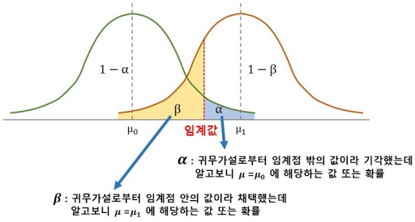

# 3과목. 데이터 분석

* 데이터 분석
* R 프로그래밍 기초
* 데이터 마트
* 통계 분석
* 정형 데이터 마이닝

> **예상 출제 문항수 : N문제**
> 데이터분석 ~ 데이터 마트까지는 빠르게 학습하고 통계분석, 정형 데이터 마이닝은 문제 풀이 위주로 학습하기

# 4. 통계분석

* 통계에 대한 개념
* 기초 통계 (기술 통계)
* 회귀 분석
* 시계열 분석
* 다차원 척도법
* 주성분 분석

# 통계

특정 집단을 대상으로 수행한 조사나 실험을 통해 나온 결과에 대한 요약된 형태의 표현

## 통계 자료 획득 방법

* 총 조사 / 전수 조사 : 대상 집단 모두를 조사

  * 많은 비용, 시간 소요 => 자주 사용되지는 않음

* 표본조사 : 모집단에서 샘플을 추출하여 진행하는 조사

  * 대부분의 조사가 표본조사로 진행됨

  * **용어**

    

    * 모집단 (population) : 조사하고자하는 대상 집단 전체
    * 원소 (element) : 모집단을 구성하는 개체
    * 표본 (sample, 샘플) : 조사하기 위해 추출한 모집단의 일부 원소
    * 통계량 : 표본을 관측한 결과
    * 모수 (parameter) : 통계량을 통해 추정한 모집단에 대한 정보

## 표본조사 - 표본 추출 방법

모집단을 대표할 수 있는 표본을 추출해야 하므로 방법에 따라 결과에 큰 차이가 있다

> 출제포인트 : 표본 추출 방법 4가지. 영어 용어도 기억하기.

### 단순 랜덤 추출법 (Simple Random Sampling)

임의의 n개를 추출하는 방법

* 각 샘플의 추출 확률은 동일함
* 표본의 대표성이 가장 큰 방법
* 집합이 매우 커도 가능한 방법
* 복원 : 한번 추출한 표본을 다시 집합에 넣어서 추출하는 방식
* 비복원 : 한번 추출한 표본은 집합에서 제외하고 추출하는 방식

### 계통추출법 (Systematic Sampling)

구간을 나눠 첫 구간에서 랜덤 추출한 후, 그 지점에서 K개 만큼씩 띄어서 n개의 표본을 추출하는 방식

* 단순 랜덤 추출의 변형된 방식
* 데이터에 주기성, 특정한 경향성이 존재하지 않는 경우에 사용
* 모집단이 큰 대용량 데이터에 적용하기는 살짝 어렵다

### 집락추출법 (Cluster Random Sampling)

군집을 먼저 추출한 후, 군집내 자료를 전체 이용하거나 일부를 추출하여 이용하는 방식

(지역 표본 추출, 다단계 표본 추출)

* 다른 추출법에 비해 표본에 대한 오차가 커질 가능성이 높음
* 모집단이 큰 경우 용이하게 사용
* 시간, 비용을 줄일 수 있음

### 층화추출법 (Stratified Random Sampling)

유사한 원소끼리 몇 개의 집단(층)으로 나누어 각 집단에서 랜덤 추출하는 방식

(비례 층화 추출법, 불비례 층화 추출법)

* 모집단에 대한 사전지식이 필요 => 시간과 노력이 많이 듦
* 중요 집단이 표본에서 제외되는 것을 막을 수 있음

## 통계 자료 측정 방법

> 출제포인트 : 자주 출제됨 - 종류, 설명, 예시, 분류 암기

| 측정 종류                | 설명                                                         | 예시                           | 분류                                   |
| ------------------------ | ------------------------------------------------------------ | ------------------------------ | -------------------------------------- |
| 명목척도                 | 어느 집단에 속하는지 분류하는 척도                           | 성별, 출생지                   | 질적척도 (범주형 자료, 계산 불가) |
| 순서척도 (서열척도) | 서열관계를 관측하는 척도 숫자의 크기가 의미를 가짐      | 만족도, 선호도, 학년, 신용등급 | 질적척도 (범주형 자료, 계산 불가) |
| 구간척도 (등간척도) | 속성의 양. 구간, 간격이 의미있는 자료 절대적 기준인 0이 존재하지 않음. 사칙연산 중 더하기 빼기만 가능 | 온도, 지수                     | 양적척도 (수치형 자료, 계산 가능) |
| 비율척도                 | 간격(차이)에 대한 비율이 의미를 가지는 자료 절대적 기준인 0이 존재 (없음을 의미하는 기준). 사칙연산 모두 가능 | 무게, 나이, 시간, 거리         | 양적척도 (수치형 자료, 계산 가능) |

# 통계 분석

**불확실한 현상**을 대상으로 자료를 수집하고 적절한 통계분석 방법을 이용해 의사결정을 하는 과정

### 기술 통계 (Descriptive Statistics)

모집단으로부터 추출한 샘플로 통계적 결과를 계산하는 것

데이터 그 자체를 분석하는 것

> 분석 예시 : "20대 여성의 키는 얼마인가?" => 20대 여성 500명으로 샘플링하여 키 조사

* 예시 : 평균, 표준편차, 중위수, 최빈값, 그래프, 왜도, 첨도 등
* 기술통계 -> EDA로 발전 -> 시각화로 발전

### 통계적 추론 (추측 통계, Inference Statistics)

모집단으로부터 추출한 샘플을 통해 모집단을 추정하는 것

기술통계의 결과를 이용하여 모집단을 추정

> 분석 예시 : 기술통계에서 추출한 500명의 평균키를 이용하여 20대 여성의 평균키를 추론하는 것

* 모수 추정 : 표본집단으로부터 모집단의 특성인 모수를 분석하여 모집단을 추론
* 가설 검정 (hypothesis test) : 모집단에 대한 가설 설정 후 표본관찰을 통해 가설 채택 여부를 결정
* 예측 (forecasting) : 미래의 불확실성 해소 (예 : 회귀분석, 시계열분석 등)
* 분류

> 기술통계, 통계적추론에 대해서는 추후 더 자세히 알아볼 예정

# 확률 및 확률 분포

### 용어 정리

* 확률 : 특정 사건이 일어날 가능성의 척도

* 표본공간 (Sample Space) : 어떤 실험을 실시할 때 나타날 수 있는 모든 결과들의 집합

* 원소 (Element) : 나타날 수 있는 개개의 결과들

* 사건 (Event) : 관찰자가 관심이 있는 사건으로 표본공간의 부분집합

* 확률변수 (Random Variable) : 특정 값이 나타날 가능성이 확률적으로 주어지는 변수

  > 출제포인트 : 이산형/연속형 확률변수의 종류, 정의, 특징

  * 이산형 확률 변수 : 변수가 끊어짐
  * 연속형 확률 변수 : 변수가 연속적임 (구간을 가짐)

* 확률분포 : 확률변수가 특정한 값을 가질 확률

* 확률분포표

## 확률분포 1. 이산형 확률 분포

0이 아닌 확률 값을 갖는 확률 변수를 셀 수 있는 경우

* 확률값 계산 : 확률 질량 함수
* 예시 : 동전 2개를 던져 앞/뒷면이 나오는 경우의 수
* 종류
  * 베르누이분포
  * 이항분포
  * 기하분포
  * 다항분포
  * 포아송분포

### 베르누이분포 (Bernoulli Distribution)

결과가 2개만 나오는 경우 (동전 던지기, 합격/불합격 등)

* 예시 : 추신수가 안타를 칠 확률은 베르누이 분포를 따른다

### 이항분포 (Binomial Distribution)

베르누이 시행을 n 반복했을 때 k번 성공할 확률

* 예시 : 추신수가 오늘 경기에서 5번 타석에 들어와 3번 안타를 칠 확률은 이항 분포를 따른다 (n=5, k=3)
* 성공할 확률 p가 0이나 1에 가깝지 않고 n이 충분히 크면 정규분포를 따른다
* 성공할 확률 p가 1/2에 가까우면 종모양이 된다

### 기하분포 (Geometric Distribution)

성공확률이 p인 베르누이 시행에서 첫번째 성공이 있기까지 x번 실패할 확률

* 예시 : 추신수가 오늘 경기에서 5번 타석에 들어와 3번째 타석에서 안타를 칠 확률은 기하분포를 따른다

### 다항분포 (Multinomial Distribution)

이항분포를 확장한 것

세가지 이상의 결과를 가지는 반복 시행에서 발생하는 확률 분포

* 예시 : 주사위를 3번 던져서 1이 1회, 2또는 3이 2회 나올 확률

### 포아송분포 (Poisson Distribution)

시간과 공간내에서 발생하는 사건의 발생횟수에 대한 확률 분포

* 예시 : 책에 오타가 10페이지당 5개씩 나온다고 할 때, 한페이지에 오타가 3개 나올 확률
* 예시 : 추신수가 최근 5경기에서 10개의 홈런을 쳤다고 할 때, 오늘 경기에서 홈런을 못칠 확률은 포아송분포를 따른다

## 확률분포 2. 연속형 확률 분포

가능한 값이 실수의 어느 특정구간 전체에 해당하는 확률 변수

* 확률값 계산 : 확률 밀도 함수
* 예시 : 신생아 5000명의 몸무게
* 종류
  * 균일분포
  * 정규분포
  * 지수분포
  * t-분포
  * 카이제곱(x^2) 분포
  * F-분포

### 균일 분포 (Uniform Distribution)

모든 확률변수 X가 균일한 확률을 가지는 확률 분포

### 정규 분포 (Normal Distribution)

평균이 μ이고 표준편차가 σ인 x의 확률밀도함수

* 표준편차가 클수록 그래프 모양이 퍼진다

### 지수 분포 (Exponential Distribution)

어떤 사건이 발생할 때까지 경과시간에 대한 연속확률분포

* 예시 : 전자레인지의 수명시간, 정류소에 버스가 올 때까지의 시간 등..

### t-분포 (t-distribution)

평균이 0을 중심으로 좌우가 동일한 분포

* 표본의 크기가 커질수록 (=자유도가 증가할수록) 표준정규분포와 거의 같은 분포가 됨
* 연속형 데이터에 활용
* 두 집단의 **평균이 동일한지 확인**할 때 사용

### x^2-분포 (Chi-square Distribution)

모평균, 모분산이 알려지지 않은 모집단의 모분산에 대한 가설 검정에 사용되는 분포

* 범주형 데이터에 활용 (관측값과 기대값의 차이 => 적합성 검정)
* 두 집단의 **동질성 검정**에 사용

### F-분포 (F-distribution)

* 두 집단간 **분산의 동일성 검정**에 사용
* 카이제곱 분포와는 달리 자유도가 2개
* 자유도가 커질수록 정규분포에 가까워짐

# 추정과 가설 검정

## 추정

표본으로부터 미지의 모수를 추측하는 것

* 표본의 통게량으로부터 모수의 특성을 추측

### 점추정 (Point Estimation)

**모수가 특정한 값일 것이라고 추정**하는 것

* 예시 : 20대 여자의 평균키는 160cm이다

* 표본의 정보로부터 모집단의 모수를 하나의 값으로 추정
* 표본의 평균, 중위수, 최빈값 등을 사용함
* 점추정의 조건 : 불편성, 효율성, 일치성, 충족성

### 구간추정 (Interval Estimation)

**모수가 특정 구간에 있을 것이라 추정**하는 것

* 예시 : 20대 여자의 평균키는 155~165cm 사이이며 신뢰수준은 95%이다
* 점추정의 정확성 보완을 위한 추정
* 항상 **추정량 분포에 대한 전제**와 **신뢰수준**이 주어져야 함
* 모분산을 알거나 대표본인 경우 : 표준정규분포 활용
* 모분산을 모르거나 소표본일 경우 : t-분포 활용

## 가설검정

모집단에 대한 가설을 설정한 뒤, 그 가설의 채택여부를 결정하는 방법

* 귀무가설과 대립가설 중 하나를 채택하는 과정
* 귀무가설이 옳다는 전제하에 검정 통계량을 구한 후 채택여부를 결정

### 용어

> 출제포인트 : 용어에 대한 설명

* 귀무가설 (null hypothesis, H0) : '비교하는 값과 차이가 없다, 동일하다' 는 가설
  * 틀렸다는 것을 증명하고 싶은 내용
  * 귀무가설은 기각이 목표 (? 기각이 아니어도 가치가 있는 가설이긴 한데ㅎㅎ)
* 대립가설 (alternative hypothesis, H1) : 귀무가설의 반대
  * 뚜렷한 증거가 있을 때 주장하는 가설
  * 귀무가설이 기각될 때 받아들여지는 가설
  * 새로운 주장 / 실제로 입증하고픈 가설
* **p-value : 귀무가설이 옳다는 가정 하에 얻은 통계량이 귀무가설을 얼마나 지지하는지를 나타내는 확률**
* 유의수준 (significance levle, α) : 귀무가설을 기각하게 되는 확률의 크기 
  * 귀무가설이 옳은데도 이를 기각하는 확률의 크기
  * **p-value < 0.05 이면 H0를 기각하고 H1를 선택한다**
  * p-value 1종 오류 0.05 유의수준
  * 신뢰수준 : 1- α
* **임계값 : 주어진 유의수준에서 귀무가설의 채택과 기각을 결정할 때 그 기준이 되는 값**
* 기각역 : 귀무가설이 옳다는 전제하에서 구한 검정통계량 분포에서 확률이 유의수준 α인 부분
* 채택역 : 기각역의 반대

### 제1종오류와 제2종오류

|                  | **H0 사실이라고 판정** | **H0가 사실이 아니라 판정** |
| ---------------- | ------------------ | ----------------------- |
| **H0가 사실임**  | 옳은 결정!         | **제 1종 오류 (α)**     |
| **H0가 사실이 아님** | **제 2종 오류 (β)** | 옳은 결정!              |

* 제1종 오류 : 귀무가설(H0)이 옳은데 옳지 않다고 판정
  * p-value를 통해 이 판정이 맞는지 아닌지 확인할 수 있음
* 제2종 오류 : 귀무가설(H0)이 틀린데 옳다고 판정

## 모수 검정과 비모수 검정

### 모수 검정

검정하고자 하는 **모집단의 분포에 대한 가정을 한 뒤**, 그 가정 하에서 검정통계량과 검정 통계량의 분포를 유도해 검정을 실시하는 방법

* 가설 설정 : 가정된 분포의 모수에 대해 가설 설정
* 검정 방법 : 관측된 자료의 표본평균, 표본분산 등을 이용해 검정 실시
* 이용 예시
  * 모평균과 표본평균의 차이 : z분포, t분포
  * 모분산과 표본분산의 차이 : F분포, 카이제곱분포
  * 모집단의 평균에 대한 검정
    * 표본크기가 n > 30 : 정규분포로 가정, z분포 이용
    * 표본크기가 n <= 30 : t분포 이용, 자유도 고려

### 비모수 검정

> 출제포인트 : 비모수적 방법에 해당하지 않는 것에 대한 문제 출제

자료가 **추출된 모집단의 분포에 아무런 제약을 가하지 않고 검정을 실시**

* 이용하는 경우
  * 관측된 자료가 특정 분포를 따른다고 가정할 수 없는 경우 이용
  * 관측된 **자료의 수가 많지 않은 경우** (30개 미만)
  * 자료가 개체간 **서열 관계**를 나타내는 경우
* 가설 설정 : 가정된 분포가 없으므로 **분포의 형태에 대해 설정** (예 : '분포의 형태가 동일하다')
* 검정 방법 : 관측값들의 순위, 두 관측값 차이의 부호 등이용
* 이용 예시
  * 부호 검정
  * 윌콕슨의 순위합검정
  * 윌콕슨의 부호순위합검정
  * 만-위트니의 U검정
  * 런검정
  * 스피어만의 순위상관계수
