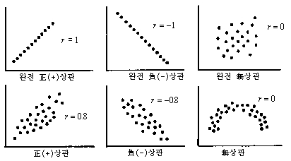

# 3과목. 데이터 분석

* 데이터 분석
* R 프로그래밍 기초
* 데이터 마트
* 통계 분석
* 정형 데이터 마이닝

> **예상 출제 문항수 : N문제**
> 데이터분석 ~ 데이터 마트까지는 빠르게 학습하고 통계분석, 정형 데이터 마이닝은 문제 풀이 위주로 학습하기

# 4. 통계분석

* 통계에 대한 개념
* 기초 통계 (기술 통계)
* 회귀 분석
* 시계열 분석
* 다차원 척도법
* 주성분 분석

# 기술 통계 (Descriptive Statistics)

자료의 특성을 표, 그림, 통계량 등을 사용해 쉽게 파악할 수 있도록 정리/요약하는 것

* 자료를 요약하는 기초적 통계
* 목표 : 데이터에 대한 대략적인 이해, 분석에 대한 통찰력 획득

## 자료 정리 1. 통계량 이용

### 분포에 대한 측도

#### 왜도

분포의 비대칭 정도를 나타내는 측도

####첨도

분포의 중심에서 뾰족한 정도를 나타내는 측도

## 자료정리 2. 그래프 이용

* 범주형 자료 (예 : 직업, 종교, 음식 등)
  * 막대그래프
  * 파이차트
  * 모자이크 플랏
* 연속형 자료 (예 : 몸무게, 성적, 연봉 등)
  * 히스토그램
  * 줄기-잎 그림 (Stem and Leaf Plot) : 계산량 적음
  * 상자그림 (Box Plot) : 사분위수 적용

## [R] 기술통계 관련 함수들

* `head(data, n)` : 데이터 n번째줄까지 보여줌
* `summary(data)` : 요약된 기초통계량
* `mean(data$column)` : 평균
* `median(data$column)` : 중앙값
* `sd(data$column)` : 표준편차
* `var(data$column)` :  분산

* `quantile(data$coulmn)` : 분위수

## 인과관계 이해

* 독립변수 (x, 설명변수) : 영향을 주는 변수
* 종속변수 (y, 반응변수) : 영향을 받는 변수
* 산점도 (Scatter Plot) : 좌표평면에 점으로 표현된 그래프
  * 선형관계, 함수관계, 이상값, 집단개수 확인 가능
  * 
* 공분산 (Covariance)
  * 공분산이 양수 : 두 변수는 양의 방향성을 가진다
  * 공분산이 음수 : 두 변수는 음의 방향성을 가진다
  * 공분산이 0 : 두 변수는 독립이다

## 상관관계 분석 (Correlation Analysis)

두 변수간의 관계를 상관계수를 이용해서 알아보는 분석 방법

* 상관계수가 1에 가까울수록 : 강한 양의 상관관계
* 상관계수가 -1에 가까울수록 : 강한 음의 상관관계
* 상관계수가 0인 경우 : 상관이 없다 (무상관)
* **[주의] 상관계수는 인과관계를 설명하는 것이 아니다**

|              | 피어슨                                         | 스피어만                                                     |
| ------------ | ---------------------------------------------- | ------------------------------------------------------------ |
| **개념**     | 등간척도 두 변수들의 상관관계 측정 방식        | 서열척도 두 변수들의 상관관계 측정 방식                      |
| **특징**     | 연속형 변수, 정규성 가정 대부분 많이 사용 | 순서형 변수, 비모수적 방법, 비선형적 상관관계 가능 순위를 기준으로 상관관계 측정 |
| **상관계수** | 피어슨 r (적률상관계수)                        | 순위상관계수 (ρ, 로우)                                       |

### 상관분석을 이용한 가설 검정

* 귀무가설 채택 
  * 상관계수 = 0
* 대립가설 채택
  * 상관계수 != 0
  * t-검정통계량의 p-value < 0.05 => 통계적으로 유의하므로 변수간 상관관계가 있으며 도출한 상관계수 활용 가능

