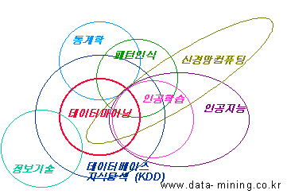

# 3과목. 데이터 분석

* 데이터 분석
* R 프로그래밍 기초
* 데이터 마트
* 통계 분석
* 정형 데이터 마이닝

# 5. 정형 데이터 마이닝

> **예상 출제 문항수 : 10문제**
> 점점 문제 수가 증가해가는 추세
>
> * 출제 포인트 : 알고리즘에 대한 디테일한 내용보다는 어떤 컨셉으로 동작하는지 어떤 특장점이 있는지, R에서 어떻게 사용하고 어떻게 해석해야 하는지

# 데이터 마이닝

> 출제 포인트 : 데이터 마이닝의 정의와 종류, 프로세스에 대한 이해

**대용량 데이터**에서 의미있는 패턴(관계, 연관성)을 파악하거나 예측하여 의사결정에 활용하는 방법

* 데이터 마이닝 기법 : 분류분석, 예측분석, 군집분석 등...
* 사용분야
  * 병원에서 환자데이터를 이용하여 발생 가능한 병을 예측 => 분류분석
  * 기존 환자가 응급실에 왔을 때 어떤 조치를 먼저 해야하는지 결정 => 분류분석
  * 신용평가모델 => 분류분석
  * 세관 검사에서 입국자의 이력과 데이터를 이용하여 관세물품 반입 여부 예측 => 분류분석

## vs 통계분석

* 통계분석 : 가성, 가정에 따른 분석이나 검증
* 데이터마이닝 : 다양한 알고리즘을 이용하여 데이터로부터 의미있는 정보를 찾아내는 방법

## 분석 방법

* 지도 학습 (교사학습, Supervised Learning)
  * 의사결정나무
  * 인공신경망
  * 판별분석
  * 일반화선형 모형
    * 회귀분석
    * 로지스틱 회귀분석
  * 사례기반추론
* 비지도 학습 (비교사학습, Unsupervised Learning)
  * OLAP
  * 연관성 규칙분석
  * 군집분석
  * **SOM (Self Organization Map)**

## 데이터 분할

* 구축용 (training data) 50% : 훈련용 데이터
* 검정용 (validation data). 30% : 구축된 모형을 미세조정할 때 활용하는 데이터
* 시험용 (test data) 20% : 모델 성능 검증에 활용하는 데이터

### 데이터의 양이 충분하거나 입력변수에 대한 설명이 충분한 경우

* 홀드아웃 방법 (hold-out) : **학습용**과 **시험용**, 2가지로 데이터를 분리
* 교차확인 (교차 검증, 교차 학습, cross-validation) : k개의 하부집단으로 구분하여 k-1개의 집단을 학습용으로 나머지는 검증용으로 설정하여 모형 학습 => K번 반복 측정한 결과를 평균낸 값을 최종값으로 활용 (k-fold)

## 성과분석

> 출제 포인트 : 매번 시험에 나온다

### 오분류표

> 출제 포인트 : 오분류표를 보고 계산하는 문제들이 항상 나옴

* **정분류율 (Accuracy) : 제대로 맞춘 것**
  * TN + TP / TN + TP + FN + FP
* 오분류율 (Error Rate) : 못맞춘 것
  * 1 - Accuracy = FP + FN / TN + TP + FN + FP
* 정확도 (Precision)
  * TP / TP + FP
* **민감도 (Sensitivity), 재현율 (Recall)**
  * TP / TP + FN
* **특이도 (Specificity)**
  * TN / TN + FP

* **F1 Score**
  * 2 x Precision x Recall / Precision + Recall

### ROC Curve

> 출제 포인트 : 가끔 출제. AUROC에 대한 설명, 측정기준에 대한 문제가 단답형으로 자주 출제

* 가로축 :  FPR (False Positive Rate = 1-특이도)
* 세로축 : TPR (True Positive Rate = 민감도)

* AUROC (Area under ROC) - 정확도의 측정 기준
  * 볼록할수록 좋은 모델
  * 0.9~1.0 : excellent
  * 0.8~0.9 : good
  * 0.7~0.8 : fair
  * 0.6~0.7 : poor
  * 0.5~0.6 : fail

### 이익도표 (Lift Chart, 향상도 도표)

분류모형 성능을 평가하기 위한 척도

반응검출률, 반응률, 리프트 등의 정보를 산출하여 나타내는 도표

* Frequency of "Somthing" : Somthing이 일어난 빈도
* % Captured Response : 반응검츌율 = 해당 등급의 실제 빈도 / 전체 빈도
* % Response : 반응률 = 해당 등급의 실제 빈도 / 구간 크기
* Lift : 향상도 = 반응률 / 기본 향상도

**좋은 모델 = Lift가 빠르게 감소해야 함**

* 등급별로 향상도가 급격하게 변동할수록 좋은 모델
* 등급별로 향상도가 들쭉날쭉하면 좋은 모델이 아님

