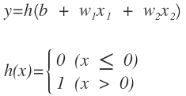
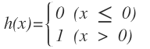
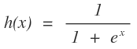
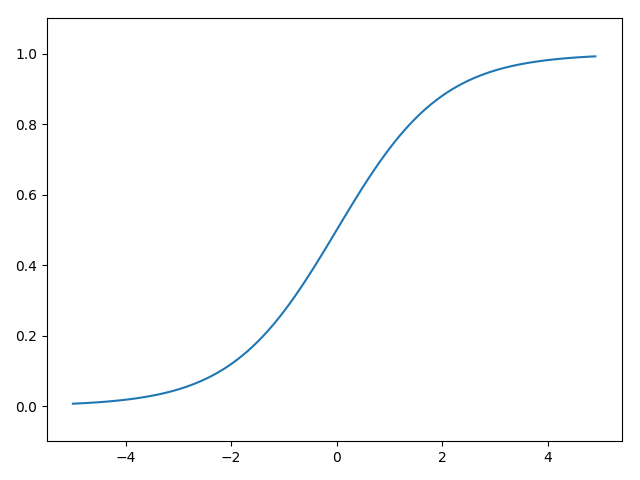
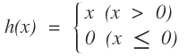
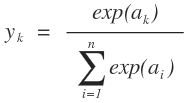

신경망
====

* 퍼셉트론의 좋은면과 나쁜면
  * Good : 퍼셉트론으로 복잡한 함수도 모두 표현할 수 있다. 심지어 컴퓨터까지! (이론상)
  * Bad : 가중치를 설정하는 작업은 여전히 사람이 수동으로 해야한다.

**가중치 매개변수의 적절한 값을 데이터로부터 자동으로 학습** 할 수 있다면 얼마나 좋을까? => 신경망!

## 구조


* 입력층 (Input Layer)
* 은닉층 (Hidden Layer)
* 출력층 (Output Layer)


## 퍼셉트론

### 퍼셉트론 기본 차트


### 바이어스를 포함한 퍼셉트론 차트
바이어스는 입력이 1이고 가중치가 b(bias)인 뉴런으로 표현할 수 있다.


### 퍼셉트론 공식을 간결하게 바꿔보자


위의 공식에서 0과 1로 나뉘는 로직을 함수로 빼서 간결화 해보자.



여기서 h(x) 는 입력(x)이 어떤 출력값을 끌어낼지 결정해주는 역할을 하는데, 이 함수를 **활성화 함수**라 부른다.


## 활성화 함수

입력 값의 총합을 결과적으로 활성화(1) 시킬지 말지를 결정하는 함수라 활성화 함수라는 이름을 가지고있다!

이 흐름에 따라 다시 보면, 퍼셉트론은 **총합을 계산하는 공식**과 **그 결과값을 활성화 함수에 입력해 활성화 결과를 확인**하는 2가지 단계로 나뉜다.


이 과정을 차트로 그려보면 아래와 같다. 입력값과 가중치값을 조합한 결과가 `a` 노드가 되고 활성화 함수인 `h()`를 통해 `y`라는 결과값 노드로 변환되는 과정이다.


### 계단함수

경계값(임계값)을 기준으로 출력이 바뀐다. 단층 퍼셉트론에서 사용했던 함수임.



```python
import numpy as np
import matplotlib.pylab as plt

def step_function(x):
    return np.array(x > 0, dtype=np.int)

def main():
    x = np.arange(-5.0, 5.0, 0.1)
    y = step_function(x)
    plt.plot(x, y)
    plt.ylim(-0.1, 1.1) # y 축의 범위 지정
    plt.show()
```


### 시그모이드 함수

신경망에서 자주 사용하는 활성화 함수. 



```python
def sigmoid(x):
    return 1 / (1 + np.exp(-x))
```



### 비교해보기

* 계단함수 : 0 or 1
* 시그모이드 : 0 ~ 1
* 공통점 
  * 입력이 중요할 수록 큰 값을 출력한다.ㅔ
  * 비선형 함수

### 비선형 함수

신경망은 활성화 함수로 비선형 함수만을 사용해야 한다.

선형 함수를 사용하면 은닉층의 의미가 없어지기 때문이다.

> example)
>
> h(x) = cx를 활성화 함수로 사용하여 3층 신경망을 만들어보자.
>
> y = h(h(h(x))) = c * c * c * x = ax (a=c^3)
>
> 위와 같이 결국 원형으로 회귀함을 알 수 있다.


### ReLU (Rectified Linear Unit, 렐루)

최근에 신경망에서 주로 사용하는 활성화 함수.

0 이하는 0을 출력하고 0 초과는 그대로 출력하는 함수이다.




```python
def relu(x):
    return np.maximum(0, x)
```


## 출력층

### 분류와 회귀

* 분류(Classification) : 데이터가 어느 클래스에 속하는가
* 회귀(Regression) : 입력 데이터의 연속적인 수치를 예측

### 출력충의 활성화 함수

출력층의 활성화 함수는 풀고자하는 문제의 성질에 맞게 정한다.

- 회귀 : 항등 함수
- 2클래스 분류 : 시그모이드 함수
- 다중 클래스 분류 : 소프트맥스 함수

#### 항등 함수 (identity function) 

입력과 출력이 같은 함수 (입력 신호 = 출력 신호)


* 회귀에서 주로 사용된다.

```python
def identity_function(x):
    return x
```


#### 소프트맥스 함수 (softmax function)



위의 수식에서 알 수 있듯이, 소프트 맥스 함수는 모든 입력 신호의 합을 분모로 가진다. 즉, 모든 입력 신호를 필요로 한다.


* 다중 클래스 분류에서 주로 사용된다.

```python
def softmax(a):
    exp_a = np.exp(a)
    sum_exp_a = np.sum(exp_a)
    y = exp_a / sum_exp_a
    
    return y
```

위의 구현은 이론적으로는 틀린 점이 없지만 실제로 컴퓨터로 연산해보면 오버플로우가 발생할 수 있다.

이를 개선하기 위해 수식을 변경해보면 다음과 같다.

 

소프트맥스의 지수함수(exp()) 계산시에는 어떤 수를 더해도 결과는 바뀌지 않는다는 뜻이다.

* `C'`에는 일반적으로 입력 신호 중 가장 큰 값을 대입한다.

```python
def softmax(a):
    c = np.max(a)
    exp_a = np.exp(a - c)
    sum_exp_a = np.sum(exp_a)
    y = exp_a / sum_exp_a

    return y
```

* 소프트맥스 함수 출력의 총합은 **1**이다. => 이 때문에 '확률'로도 해석할 수 있다.
* 출력값의 대소관계는 소프트맥스 함수를 적용해도 변하지 않는다. 정규화 시키는 것에 의미가 있을 뿐이다.
  * 실제로 연산량을 관리하기 위해 출력층의 소프트맥스 함수를 생략하는 경우도 많다.


### 출력층의 뉴런 수 정하기

* 분류 : 분류하고 싶은 클래스의 수
* 회귀 : ????흐음??


## 학습

훈련 데이터로부터 **가중치 매개변수의 최적값을 자동으로 획득**하는 것

* 목표 : 손실함수의 결과값을 작게 만드는 가중치 매개변수를 찾는 것!

* 손실함수 : 신경망이 학습을 할 수 있도록 하는 지표.  


### 데이터 주도 학습

사람의 개입없이 데이터만으로 규칙을 찾아내는 것!

특징(feature)을 추출한다 -> 특징의 패턴을 기계학습으로 학습한다

* 특징 (feature) : 입력 데이터에서 본질적인 중요한 데이터를 뽑아낸 것


### 기계학습과 딥러닝의 차이


* 기계학습 : 특징을 추출한 데이터에서 규칙을 찾아내는 것은 기계가 하지만 **특징을 정의하는 것은 사람이 직접 설계해야 한다. (중요)**
* 딥러닝 : 그 특징까지도 기계가 스스로 학습한다! (=종단간 기계학습, end-to-end machine learning)


### 훈련데이터와 시험데이터

* 훈련 데이터 (training data) : 이 데이터만 사용하여 학습하면서 최적의 매개변수를 찾는다
* 시험 데이터 (test data) : 그 이후 시험 데이터를 사용하여 위에서 훈련된 모델의 성능을 평가한다

훈련 데이터에 포함 되어있지 않는 데이터도 잘 풀어내는지 (**범용능력**) 확인하기 위해 위와 같이 나눈다.

* 오버피팅 (overfitting) : 훈련 데이터가 지역성을 가지는 경우. 학습이 특정 데이터셋에만 지나치게 최적화된 상태.

* **딥러닝의 최종목표 : 범용 능력을 획득하고 오버피팅을 지양한다.**


### 손실 함수 (loss function)

신경망 성능의 나쁨을 나타내는 지표. 이 지표를 기준으로 최적의 매개변수 값을 탐색한다.

#### 손실함수의 종류 - 평균 제곱 오차 (mean squared error, MSE)


```python
def mean_squared_error(y, t):
    return 0.5 * np.sum((y - t) ** 2)

def main():
    t = [0, 0, 1, 0, 0, 0, 0, 0, 0, 0]
	y = [0.1, 0.05, 0.6, 0.0, 0.05, 0.1, 0.0, 0.1, 0.0, 0.0]
	print(mean_squared_error(np.array(y), np.array(t)))       ## 0.09750000000000003
    
	y = [0.1, 0.05, 0.1, 0.0, 0.05, 0.1, 0.0, 0.6, 0.0, 0.0]
	print(mean_squared_error(np.array(y), np.array(t)))       ## 0.5975
```


#### 손실함수의 종류 - 교차 엔트로피 오차 (cross entropy error, CEE)


log를 사용하여 정답에 가까워질수록 0에 가까워지다가 1일 때 0이 된다. 다를수록 점수가 급감한다.

정답에서 멀어질수록 격차를 크게 벌려 점수를 차등 지급한다는 의미를 가진다.

```python
def cross_entropy_error(y, t):
    delta = 1e-7
    return -np.sum(t * np.log(y + delta))

def main():
    t = [0, 0, 1, 0, 0, 0, 0, 0, 0, 0]
	y = [0.1, 0.05, 0.6, 0.0, 0.05, 0.1, 0.0, 0.1, 0.0, 0.0]
	print(cross_entropy_error(np.array(y), np.array(t)))       ## 0.510825457099338
    
	y = [0.1, 0.05, 0.1, 0.0, 0.05, 0.1, 0.0, 0.6, 0.0, 0.0]
	print(cross_entropy_error(np.array(y), np.array(t)))       ## 2.302584092994546
```


#### MSE vs CEE

* [MSE vs CEE](https://djyoon1125.blog.me/221297576523)

