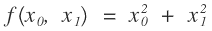
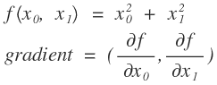

신경망 학습
====

## 학습
훈련 데이터로부터 **가중치 매개변수의 최적값을 자동으로 획득**하는 것

- 목표 : 손실함수의 결과값을 작게 만드는 가중치 매개변수를 찾는 것!
- 손실함수 : 신경망이 학습을 할 수 있도록 하는 지표.  


### 데이터 주도 학습

사람의 개입없이 데이터만으로 규칙을 찾아내는 것!

특징(feature)을 추출한다 -> 특징의 패턴을 기계학습으로 학습한다

- 특징 (feature) : 입력 데이터에서 본질적인 중요한 데이터를 뽑아낸 것


## 기계학습과 딥러닝의 차이


- 기계학습 : 특징을 추출한 데이터에서 규칙을 찾아내는 것은 기계가 하지만 **특징을 정의하는 것은 사람이 직접 설계해야 한다. (중요)**
- 딥러닝 : 그 특징까지도 기계가 스스로 학습한다! (=종단간 기계학습, end-to-end machine learning)


## 훈련 데이터와 시험 데이터

훈련 데이터에 포함 되어있지 않는 데이터도 잘 풀어내는지 (**범용능력**) 확인하기 위해 데이터셋을 다음과 같이 나눈다.

- 훈련 데이터 (training data) : 이 데이터만 사용하여 학습하면서 최적의 매개변수를 찾는다
- 시험 데이터 (test data) : 그 이후 시험 데이터를 사용하여 위에서 훈련된 모델의 성능을 평가한다

### 오버피팅 (overfitting)

훈련 데이터가 지역성을 가지는 경우. 학습이 특정 데이터셋에만 지나치게 최적화된 상태.

### 딥러닝의 최종목표

**범용 능력을 획득**하고 **오버피팅을 지양**한다


## 손실 함수 (loss function)

**신경망 성능의 나쁨을 나타내는 지표.** 이 지표를 기준으로 최적의 매개변수 값을 찾는다.

E : error

y : output

t : training data

### 손실함수의 종류 - 평균 제곱 오차 (mean squared error, MSE)


손실함수의 결과 값이 클수록 오차가 크다 = 학습이 잘 되지 않았다는 뜻

```python
def mean_squared_error(y, t):
    return 0.5 * np.sum((y - t) ** 2)

def main():
    t = [0, 0, 1, 0, 0, 0, 0, 0, 0, 0] # 원-핫 인코딩
    
    # 정답을 추측한 경우 (인덱스 2 : 0.6)
	y = [0.1, 0.05, 0.6, 0.0, 0.05, 0.1, 0.0, 0.1, 0.0, 0.0]
	print(mean_squared_error(np.array(y), np.array(t)))       ## 0.09750000000000003
    
    # 오답의 경우 (인덱스 2 : 0.1 / 인덱스 7 : 0.6)
	y = [0.1, 0.05, 0.1, 0.0, 0.05, 0.1, 0.0, 0.6, 0.0, 0.0]
	print(mean_squared_error(np.array(y), np.array(t)))       ## 0.5975
```


### 손실함수의 종류 - 교차 엔트로피 오차 (cross entropy error, CEE)


손실함수의 결과 값이 0에서 멀어질수록 오차가 크다.

- 자연로그 (밑이 e인 log)


위의 자연로그 그래프에서 볼 수 있듯이, x가 1인 경우 y가 1이다.

CEE는 자연로그를 사용하여, 정답일 확률 값 y가 커질수록 0에 가까운 결과 값이 나온다. (y=1일때는 값이 0이 나온다.) 반대로 정답일 확률 값(y)이 작아질수록 오차가 급감한다.

```python
def cross_entropy_error(y, t):
    delta = 1e-7 # np.log(x)의 매개변수 x가 0이 되지 않게 하기 위함. (마이너스 무한대(-inf)방지)
    return -np.sum(t * np.log(y + delta))

def main():
    t = [0, 0, 1, 0, 0, 0, 0, 0, 0, 0]
    
    # 정답을 제대로 추측한 경우 (인덱스 2 : 0.6)
	y = [0.1, 0.05, 0.6, 0.0, 0.05, 0.1, 0.0, 0.1, 0.0, 0.0]
	print(cross_entropy_error(np.array(y), np.array(t)))       ## 0.510825457099338

    # 오답의 경우 (인덱스 2 : 0.2)
	y = [0, 0.05, 0.2, 0.0, 0.05, 0.1, 0.0, 0.6, 0.0, 0.0]
	print(cross_entropy_error(np.array(y), np.array(t)))		## 1.6094374124342252
    
    # 오답의 경우2 (인덱스 2 : 0.1)
	y = [0.1, 0.05, 0.1, 0.0, 0.05, 0.1, 0.0, 0.6, 0.0, 0.0]
	print(cross_entropy_error(np.array(y), np.array(t)))       ## 2.302584092994546

    # 오답의 경우3 (인덱스 2 : 0.05)
	y = [0.15, 0.05, 0.05, 0.0, 0.05, 0.1, 0.0, 0.6, 0.0, 0.0]
	print(cross_entropy_error(np.array(y), np.array(t)))		## 2.9957302735559908
```

**정답인 y 인덱스 2의 값(=인덱스 2가 정답일 확률)에 따라 CEE의 결과 값이 결정**되는 것을 알 수 있다.

정답이 아닌 애들은 어차피 0이 곱해져서 무시되기 때문임!


### [MSE vs CEE](http://fbsight.com/t/loss-function/114616)

- MSE
  - Regression 에 주로 사용된다.
    - 경사하강법(Gradient Descent) 사용시 언제나 답을 찾을 수 있다.
    - 
  - [Gradient Vanishing](https://www.youtube.com/watch?v=Y1Z7YWr5PQE) 문제로 학습속도가 느리다. [#1](https://www.youtube.com/watch?v=QAhlSzRLSos) [#2](https://www.youtube.com/watch?v=SKMpmAOUa2Q)
- CEE
  - 시그모이드나 소프트맥스 함수를 사용하는 Classification 시에는 학습속도 측면에서 더 빠르다.
  - 확률을 통하여 계산하기 때문에 분류, 원핫인코딩 처럼 Output을 확률값으로 줄 수 있다면 CEE를 사용하면 좋다. (그 반대는 MSE)


### 미니배치

#### 여기서 다시보는 '학습'의 정의

훈련 데이터로부터 **가중치 매개변수의 최적값을 자동으로 획득**하는 것

- 목표 : 손실함수의 결과값을 작게 만드는 가중치 매개변수를 찾는 것!

즉, **훈련데이터에 대한 손실 함수의 값을 구한다 -> 그 값을 최대한 줄여주는 매개변수를 찾아낸다**

#### 여러개의 훈련데이터에 대한 손실 값 구하기
교차 엔트로피 오차 : 


모든 훈련데이터의 손실 값을 더한 후 평균을 구한다.

```python
def cross_entropy_error(y, t):
    # 차원이 1이면
    if y.ndim == 1:
        t = t.reshape(1, t.size)
        y = y.reshape(1, y.size)

    batch_size = y.shape[0]
    delta = 1e-7
    return -np.sum(t * np.log(y + delta)) / batch_size

def cross_entropy_error_non_one_hot(y, t):
    if y.dim == 1:
        t = t.reshape(1, t.size)
        y = y.reshape(1, y.size)

    batch_size = y.shape[0]
    delta = 1e-7
    return -np.sum(np.log(y[np.arange(batch_size), t] + delta)) . batch_size
```


#### 빅데이터처럼 겁나 큰 데이터는 어쩌지?

전부 다 더하기에는 너무 시간이 오래걸린다ㅠㅠ

#### 일부만 계산하자!

학습데이터에서 일부데이터만 추려 **근사치**로서 이용한다.

**일부데이터 = 미니배치**


### 미니배치 학습

#### 학습에 쓰이는 훈련데이터도 마찬가지!

학습에 쓰이는 훈련데이터도 양이 많아질수록 효율이 떨어지는 것은 마찬가지.

그래서 훈련데이터에서도 일부만 골라 학습을 수행하는 경우가 많다. => **미니배치 학습**

```python
import sys, os
sys.path.append(os.pardir)
import numpy as np
from dataset.mnist import load_mnist

(x_train, t_train), (x_test, t_test) = load_mnist(normalize=True, one_hot_label=True)

print(x_train.shape) # (훈련데이터 개수=60000, 입력데이터 크기(28x28 이미지)=784)
print(t_train.shape) # (훈련데이터 개수=60000, 정답레이블의 라인 수=10)

# 훈련데이터에서 무작위로 10장의 이미지만 빼내기
train_size = x_train.shape[0] # 60000
batch_size = 10
batch_mask = np.random.choice(train_size, batch_size) # 0~60000 랜덤 숫자를 10개 꺼낸다
x_batch = x_train[batch_mask]
t_batch = t_train[batch_mask]

print(x_batch.shape) # (10, 784)
print(t_batch.shape) # (10, 10)
```


## 경사법 (gradient method)

기울기(경사) 값을 기준으로 나아갈 방향(학습의 방향)을 정하는 방법


### [손실함수를 사용하는 이유](https://umbum.tistory.com/210) : [미분](./Math/Derivative.md)

**손실함수는 연속적인 값을 리턴하기 때문**에 학습을 진행할 수 있다.

'정확도' 함수는 계단형식으로 그려지기 때문에 대부분의 구간에서 미분 값(기울기)이 0이다. 

기울기가 0이 되면 가중치를 변경하더라도 결과 값이 달라지지 않아 학습을 멈추게된다.

실제 동작시에는 학습시와는 환경이 다를 확률이 높기 때문에 확률적으로 학습해야 하는데, 불연속적인 값을 리턴하는 '정확도' 함수로 학습을 하게되면 제대로 된 학습이 불가능해진다.

> 활성화 함수로 계단함수를 사용하지 않는 이유와 같다.


### 미분

**한 순간의 변화량**을 표시한 것

#### 수치 미분 (numerical) vs 해석적 미분 (analytic)

- 해석적 미분 : 오차를 포함하지 않는 진정한 미분. 즉 정말정말 **특정 '한 순간'의 변화량**.
  - 걍 우리가 수학시간에 배웠던 그 미분.
- 수치 미분 : 해석적 미분을 근사치로 계산하는 방법.
  - 아주 작은 차분으로 미분하는 것. 즉, **한 시점에서 특정 시점까지의 변화량.**
  - 차분 : 임의 두 x에서의 f(x) 값 차이

#### 수치 미분


x의 변화량 h에 비해 결과값이 얼마나 변화하였는가를 나타내고있다.

```python
## 오차가 발생하는 수치 미분
def bad_numerical_diff(f, x):
    h = 10e-50  # 1. 반올림 오차 발생 (걍 0으로 나올 수 있음)
    return (f(x+h) - f(x)) / h  # 2. 차분으로 인한 오차 발생

## 오류를 보정한 수치 미분
def numerical_diff(f, x):
    h = 1e-4    # 1. 적당한 h 값 사용하기 : 10^-4
    return (f(x+h) - f(x-h)) / (2 * h)  # 2. 차분 오차 줄이기 : 중앙 차분 사용

### 수치 미분의 오차는 어느정도일까?
def __function_1(x):
    return 0.01*x**2 + 0.1*x

numerical_diff(__function_1, 5)		# 0.1999999999990898
numerical_diff(__function_1, 10)	# 0.2999999999986347
```

#### 편미분

특정 장소의 기울기를 구하는 것이 목적인 것은 일반 미분과 동일하다.



위 방정식의 경우에는 인수가 2가지이기 때문에 미분시 어떤 인수(어떤 장소)를 기준으로 미분할 것인지를 정해야한다.

여러 변수 중 목표 변수 하나에만 초점을 맞추고 다른 변수들의 값을 고정시킨다.

그것이 바로 편미분!!! 

```python
# x0에 대한 편미분을 한 경우 (x0 = 3.0, x1 = 4.0)
def __function_tmp0(x):
    return x**2 + 4.0**2

numerical_diff(__function_tmp0, 3.0)

# x1에 대한 편미분을 한 경우
def __function_tmp1(x):
    return 3.0**2 + x**2

numerical_diff(__function_tmp1, 4.0)
```


### 기울기 (gradient)

모든 변수의 편미분을 벡터로 정리한 것



이를 특정 공식에 적용하여 그래프를 그려보면 아래와 같은 양상으로 그려진다.


* **특정 한 점(최솟값)을 가르키는 것** 처럼 보여진다.

* 그 점에서 **멀어질수록 화살표의 길이가 길어진다.**

* 즉, 기울기는 **각 지점에서 낮아지는 방향**을 가리킨다.

  * 기울기는 **각 장소에서 함수의 출력 값을 가장 크게 줄이는 방향**을 가리킨다.


* 다시 되돌아보는 학습의 의미 : 손실 함수가 **최솟값**이 될 때의 매개변수(가중치) 값을 구하자!
  * 기울기를 잘 이용하면 손실 함수의 최소값 또는 가능한 작은 최적값을 구할 수 있다!


#### 경사법 (경사 하강법, gradient descent method)

현 위치에서 기울어진 방향으로 일정거리만큼 이동하고 이동한 위치에서 이를 반복하면서 함수의 값을 줄이는 방법

* 주의할 점 : 기울기를 이용하다보니 정말 그 끝에 최소값이 있을지는 보장할 수 없음... 굴곡이 많은 그래프를 떠올리면 이해됨.

  * 기울기가 0이되는 지점 : 극소값 (local), 최소값 (global), 안장점 (saddle)

    


##### η : 학습률 (learning rate)

갱신하는 양. 한번의 학습으로 얼만큼 학습할 것인가.

미리 상수로 정해두어야 한다. Ex) 0.01, 0.001

##### 구현

```python
# f : 최적화 하려는 함수
# init_x : 초기값
# lr : 학습률 (learning rate)
# step_num : 반복 횟수
def gradient_descent(f, init_x, lr=0.01, step_num=100):
    x = init_x

    for i in range(step_num):
        grad = numerical_gradient(f, x)
        x -= lr * grad

    return x

### 테스트코드
def __function_2(x):
    return x[0]**2 + x[1]**2

import numpy as np

init_x = np.array([-3.0, 4.0])
print(gradient_descent(__function_2, init_x=init_x, lr=0.1, step_num=100))
# [-6.11110793e-10  8.14814391e-10] : 거의 [0,0]에 가까운 값이 도출되었다.
```


##### 적절한 학습률을 정해야한다

```python
# 학습률이 적절한 경우
print(gradient_descent(__function_2, init_x=np.array([-3.0, 4.0]), lr=0.1, step_num=100))
# [-6.11110793e-10  8.14814391e-10]

# 학습률이 너무 큰 경우
print(gradient_descent(__function_2, init_x=np.array([-3.0, 4.0]), lr=10.0, step_num=100))
# [-2.58983747e+13 -1.29524862e+12] # 값이 더 커진다

# 학습률이 너무 작은 경우
print(gradient_descent(__function_2, init_x=np.array([-3.0, 4.0]), lr=1e-10, step_num=100))
# [-2.99999994  3.99999992] # 값의 변화가 거의 없어진다
```

* 하이퍼 파라미터(hyper parameter) : 사람이 직접 설정해줘야하는 파라미터. 시험을 통해서 가장 잘 학습되는 데이터를 찾아야 한다.


#### 신경망에서의 기울기

경사법을 신경망 학습시에 활용해보자.

=> 가중치 매개변수에 대한 손실함수의 기울기를 구할 때 사용하면 됨


가중치(W)변경에 따른 손실함수의 값(L)의 변화량


```python
import sys, os
sys.path.append(os.pardir)  # 부모 디렉터리의 파일을 가져올 수 있도록 설정
import numpy as np
import common.active_function as active_function
import common.loss_function as loss_function
import common.gradient as gradient


class simpleNet:
    def __init__(self):
        self.W = np.random.randn(2,3)   # 정규분포로 초기화

    # 예측
    def predict(self, x):
        return np.dot(x, self.W)

    # 손실함수 값
    def loss(self, x, t):
        z = self.predict(x)
        y = active_function.softmax(z)
        loss = loss_function.cross_entropy_error(y, t)

        return loss

x = np.array([0.6, 0.9])    # 입력 데이터
t = np.array([0, 0, 1])     # 정답 레이블

net = simpleNet()

# 가중치 매개변수
print(net.W) # [[-0.60456848 -0.19225631 -0.85626496]
             #  [ 0.28959083  1.23033185  0.0823353 ]]
# 예측값
print(net.predict(x))   # [-0.10210934  0.99194488 -0.43965721]
# 예측 최대값의 인덱스
print(np.argmax(net.predict(x)))    # 1
# 손실값
print(net.loss(x, t))   # 1.885083063775067


f = lambda w: net.loss(x, t)
dW = gradient.numerical_gradient(f, net.W)

print(dW)
# [[ 0.12766289  0.38124696 -0.50890986]
#  [ 0.19149434  0.57187044 -0.76336478]]
```

dW값 = W를 h만큼 변화시키면 손실함수의 값은 dW*h만큼 변화한다는 뜻

즉, 위의 예제에서..

* dW11은 약 0.12 => W11을 h만큼 변화시키면 손실함수의 값이 0.12h 만큼 **증가**한다 => W11은 **음의 방향으로 갱신**해야 손실함수의 값을 줄일 수 있음
* dW23은 약 -0.76 => W23을 h만큼 변화시키면 손실함수의 값이 0.76h만큼 **감소**한다 => W23은 **양의 방향으로 갱신**해야 손실함수의 값을 줄일 수 있음

위의 기울기 정보를 바탕으로 경사법을 태워서 가중치 매개변수를 갱신하면 된다 :-D


## 학습 알고리즘 구현하기!

* 키워드 : 손실함수, 미니배치, 기울기, 경사하강법

### 확률적 경사 하강법 (stochastic gradient descent)

확률적으로 무작위로 골라낸 데이터에 대해 수행하는 경사하강법 학습

0. 전제 : 가중치와 편향을 훈련 데이터에 적응하도록 조정하는 과정이 '학습'이다. 
1. 미니 배치 : 훈련데이터 중 무작위로 일부 데이터를 가져와서 효율적으로 학습한다. 미니배치의 손실값을 줄이는 것이 목표
2. 기울기 산출 : 손실값을 줄이기 위한 가중치 매개변수의 기울기를 구한다. (기울기 : 손실함수의 값을 줄이는 방향을 제시함)
3. 매개변수 갱신 : 가중치 매개변수를 기울기 방향으로 조금 갱신한다. (갱신량 = 학습률)
4. 반복 : 1~3 단계 반복


### 시험데이터로 평가하기

확률적 경사하강법으로 훈련한 것은 '훈련 데이터의 미니배치에 대한 손실함수' 값을 조정한 것이므로 '범용능력'이 보장된 것은 아니다.

=> 범용능력 평가가 필요함

=> 학습도중 정기적으로 훈련데이터와 시험데이터를 대상으로 정확도를 기록하자.

1에폭별 훈련데이터와 시험데이터에 대한 **정확도(accuracy)**를 기록한다.

> 에폭(epoch) : 1에폭 = 학습에서 훈련데이터를 모두 소진했을 때의 횟수
>
> ex) 훈련데이터 10,000개를 100개의 미니배치로 학습 : SGD를 100회 반복하면 모든 훈련데이터가 소진됨 (100회 = 1에폭)


* TMI) **조기 종료 (early stopping) 기법** : 정확도가 떨어지는 지점 = 오버피팅이 시작되는 지점 => 이 지점에서 학습을 중단하면 오버피팅 예방가능