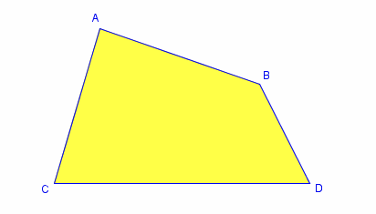

## 1. [질문] AI를 통해 Finance의 어떤 문제들을 해결할 수 있을까요? (Day 1)

1. Increasing security: security와 관련된 빅데이터 분석을 통한 보안 향상. (Anti-Money Laundering, fraud detection 등등)
2. Reducing processing times: financial documentation 처리에 걸리는 시간을 줄여주는 효과.
3. Algorithmic trading: trading pattern을 찾고, trends를 예측하기 위하여 AI를 적용시켜서, 더 성공적인 stock trading decisions을 내리도록 함.
4. Customer recommendation / Credit lending : consumer data, financial lending 혹은 insurance results등의 자료를 기반으로, 고객들의 관심분야를 추천에서부터, 대출 여부를 평가하는 등의 분야에도 적용 가능함.
5. Portfolio Management : (ex: 로보 어드바이져)  포트폴리오 매니지먼트의 경우 일종의 자산 배분 관리 개념으로 고객의 자산을 고객이 선호하는 분야나 감수 가능한 리스크 정도, 기대하는 수익률에 따라 어느 곳에 배분하여 투자하면 좋을지를 도와주는 시스템을 말합니다!

	* https://banksalad.com/contents/로보-어드바이저-완벽-개념정리-825d (

한편 3. Alogrithmic trading 관련해서 이 분야는 딥러닝은 여러가지 툴 중 한가지로 사용되는 큰 도메인으로 본 강의에서는 딥러닝으로 해결할 수 있는 문제 위주로 다룰 예정이지만, 이 도메인 자체에 대해 관심있으신 분은 아래 영상 또는 책을 통해 다양한 알고리즘 트레이딩 전략에 대해 살펴보실 수 있습니다.
- https://www.youtube.com/watch?v=_3nWYUtameM
- <인공지능 투자가 퀀트> _ 권용진

## 2. [질문] Deep Learning Predictor를 이용한 방법은 Traditional Predictors에 비해 어떤 이점이 있을까요? (Day2)

1. 가장 좋은 모델을 만들기 위한 feature를 자동적으로 선택하므로, input 데이터를 보다 유연하게 확장시킬 수 있습니다.
2. over-fitting 문제를 보다 쉽게 회피할 수 있습니다. (Cross validation, Dropout for model selection, Regularization techniques 등을 통해 - 3주차에서 보다 자세히 다룸)
3. 선형모델로 표현 및 해결할 수 없는 문제들을 Deep Learning은 비선형적으로 표현할 수 있습니다.

한편 deep learning은 모델로 부터 causual factor를 해석할 수 없다는 단점이 있어 인과관계를 추론하는 문제에는 적합하지 않습니다. 예를 들어 강의자료에 있던 예시처럼 소방관이 몰린 것과 불이 난 것의correlation을 통해 deep learning은 소방관이 몰린 정도 feature로부터 불이 난 것에 대한 예측을 도출할 수 있고 단순 예측 문제에는 적합하지만, 이를 소방관이 몰린 것이 불이 난 사건의 원인이라 해석해서는 안되며 이에 따라 불이난 것을 인식하여 자동으로 물을 뿌리는 시스템 구현 문제에는 적합하지 않습니다. (이 경우 소방관이 몰리면 물이 뿌려지는 불상사가...)

즉 요지는 해결하고자 하는 문제의 종류에 따라 각 모델의 장단점을 잘 고려하여 사용해야 하는데,
저희가 앞으로 다룰 주제는 financial time series prediction 문제로 인과추론 보다는 예측을 목표로 하므로 deep learning의 이점 (input 데이터 확장성, 오버피팅 회피 용이성, 비선형성)이 효과적이며, 하지만 위와같은 단점에 대한 인지없이 사용하면 문제의 종류에 따라 오류가 발생할 수 있으므로 인지하고 사용할 필요가 있습니다.

* http://www.dodomira.com/2016/01/12/데이터-분석의-유형/ 

## 4. [질문] Data Feature를 Well-Representation하는 것이 왜 중요한가요? (Day3)

위 Classify 문제를 풀때 어떤 Feature를 잘 Representation하면 Classify에 성공할 수 있을까요? 해당 문제에서는 Corner의 개수가 Representation으로 사용될 수 있습니다.
사각형: 4, 삼각형: 3, 원: 0
따라서 Corner를 찾는 룰을 하드 프로그래밍 하는 방식으로 문제를 풀수도 있고요. (코너의 개수를 세어 그 개수에 따라 도형을 분류한다)

그런데 만약 이런 모양이 들어오면 어떻게 대처해야 해야 할까요?
위 도형은 사각형과 동일한 Corner 개수를 지니고 있습니다. 이에 따라 기존 프로그래밍 방식으로 처리할 수 없고 또 다른 로직의 추가가 필요합니다. 이처럼 일반적인 문제에서 Data Representation을 잘하기 위해서는 굉장한 전문지식을 필요로 하게 됩니다. (모든 조건을 다 고려해 반영해야하므로) 하지만 Deep Learning은 deep network를 통해 자동적으로 이러한 Representation을 학습한다고 보시면 됩니다.

한편, 문제에 따라 필요한 Feature Representation 이 차이가 날 수 있기 때문에, 네트워크 구조, 레이어의 수, 노드 수, 모델의 복잡성을 주어진 상황에 따라 잘 정하는 것이 중요합니다. 필요한 정도에 비해 과도하게 복잡한 모델을 사용할 경우 오버피팅이 발생할 수 있어 비슷한 결과를 낸다면 가능한 단순한 모델을 선택하는 것이 지향되고 (오캄의 면도날), 오히려 약간의 오류는 noise로 해석하는게 보다 일반화(generalization)된 모델이 될 수 있습니다. 물론 주어진 문제가 충분히 복잡하다면 그에 맞는 복잡한 모델이 필요할 것이구요.