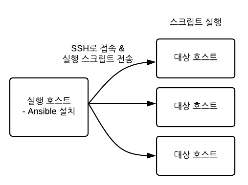

프로비저닝 도구
=====
인프라 구축 작업을 자동화하는 구성 관리 도구.

# 현황
프로비저닝 도구에는 대표적으로 Ansible, Chef, Puppet 이 존재한다.

[Ansible vs Chef vs Puppet 구글 트렌드를 확인](https://trends.google.co.kr/trends/explore?cat=5&date=today%205-y&q=ansible,chef,puppet)해보니 최근에는 Ansible이 대세인 듯 하다.

각 도구들의 구체적인 차이점은 다음과 같다.

 도구명 | 개발언어 | 정의 | Agent/SSH | 통신방법 | github와의 연동성 
------ | ------ | -------- | -------- | -------- | --------
 puppet | ruby | DSL | Agent | http ssl | 중 
 chef | ruby | DSL | Agent | Reset / STOMP | 중 
 ansible | python | YAML | SSH | json | 상 

# Ansible이란?
Python 으로 구현된 오픈소스 IT 자동화 도구.
* 대부분이 멱등성을 제공함.
    * 멱등성을 제공하지 않는 모듈들 : shell, command, file module)
* Agent-less
    * 굳이 Agent 도구를 따로 설치할 필요 없이 SSH로 접속하여 실행 가능.
* 이해하기 쉽다 (SSH, YAML)
    * `playbook`(ansible에서 태스크를 기술하는 파일)이 YAML 형식으로 되어있어 읽기 편하다.
* 다양한 모듈
* 애드혹 (Ad-hoc) 명령
    * 일일히 `playbook`을 작성하지 않아도 `ansible`명령으로 단일 모듈만을 실행할 수 있다.

## 이용 환경

* 실행 호스트 : Windows 환경 지원 X, Python 2.6 이상 (Python3은 지원 X)
* 대상 호스트 : SSH로 접속가능한 모든 OS 지원, Python 2.4 이상 (Python3은 지원 X)

# 관련자료
* [Naver D2 김용환 님의 'Ansible의 이해와 활용' 발표자료](https://www.slideshare.net/deview/1a7ansible)