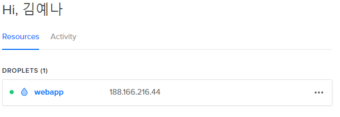

인프라CI
=====

개발과 마찬가지로 인프라 코드도 계속해서 수정되어야 한다. (요건 변경, 미들웨어 업데이트 등...)

인프라 구축이 코드화 되면 개발과 마찬가지로 CI를 이용할 수 있게 된다.

`테스트 서버 생성` -> `프로비저닝` -> `테스트` -> `테스트 파기`

## 장점
* 감지의 신속화 (에러 상황, 코드 변경 등..)
* 로컬 환경 문제 감지 용이
* tacit knowledge 제거 가능
* 재작업 감소 & 품질 보장

# 여기서의 환경구성
* Chef, ServerSpec -push-> GitHub
* CircleCI -> Terraform -> DigitalOcean에 테스트용 VM 생성 -> knife-solo로 프로비저닝 -> Terraform으로 테스트용 VM 파기

## Terraform 설정 파일 만들기

### `TF_VAR_ssh_keys_id` 설정
digitalocean에 등록한 SSH 공개키의 ID는 API를 통해 얻을 수 있다.

```bash
$ curl -X GET -H "Content-Type: application/json" -H "Authorization: Bearer ${DIGITALOCEAN_TOKEN}" "https://api.digitalocean.com/v2/account/keys" | jq
  % Total    % Received % Xferd  Average Speed   Time    Time     Time  Current
                                 Dload  Upload   Total   Spent    Left  Speed
100   572  100   572    0     0    418      0  0:00:01  0:00:01 --:--:--   417
{
  "ssh_keys": [
    {
      "id": 여기있는 ID를 복사한다,
      "fingerprint": "DigitalOcean에 등록된 FingerPrint",
      "public_key": "DigitalOcean에 등록한 SSH 공개키",
      "name": "yenarue-home-ubuntu"
    }
  ],
  "links": {},
  "meta": {
    "total": 1
  }
}

# Default var.ssh_keys_id 참조 환경변수
$ export TF_VAR_ssh_keys_id=복사한_ID를_붙여넣는다
```

DigitalOcean상에 VM을 생성하기 위한 설정 파일을 만든다.
```bash
# digitalocean.tf
variable "ssh_keys_id" {}

resource "digitalocean_droplet" "webapp" {
    image = "centos-7-x64"
    name = "webapp"
    region = "sgp1"
    
    size = "512mb"
    ssh_keys = [ "${var.ssh_keys_id}" ]

    provisioner "local-exec" {
        command = "echo ${digitalocean_droplet.webapp.ipv4_address} ${digitalocean_droplet.webapp.name} >> /tmp/hosts.txt"
    }   
}
```

해당 파일이 정상적으로 설정되었는지 확인한다.
```bash
$ terraform init
Initializing provider plugins...
- Checking for available provider plugins on https://releases.hashicorp.com...
- Downloading plugin for provider "digitalocean" (0.1.3)...

The following providers do not have any version constraints in configuration,
so the latest version was installed.

To prevent automatic upgrades to new major versions that may contain breaking
changes, it is recommended to add version = "..." constraints to the
corresponding provider blocks in configuration, with the constraint strings
suggested below.

* provider.digitalocean: version = "~> 0.1"

Terraform has been successfully initialized!

You may now begin working with Terraform. Try running "terraform plan" to see
any changes that are required for your infrastructure. All Terraform commands
should now work.

If you ever set or change modules or backend configuration for Terraform,
rerun this command to reinitialize your working directory. If you forget, other
commands will detect it and remind you to do so if necessary.

$ terraform plan
Refreshing Terraform state in-memory prior to plan...
The refreshed state will be used to calculate this plan, but will not be
persisted to local or remote state storage.


------------------------------------------------------------------------

An execution plan has been generated and is shown below.
Resource actions are indicated with the following symbols:
  + create

Terraform will perform the following actions:

  + digitalocean_droplet.webapp
      id:                   <computed>
      disk:                 <computed>
      image:                "centos-7-x64"
      ipv4_address:         <computed>
      ipv4_address_private: <computed>
      ipv6_address:         <computed>
      ipv6_address_private: <computed>
      locked:               <computed>
      name:                 "webapp"
      price_hourly:         <computed>
      price_monthly:        <computed>
      region:               "sgp1"
      resize_disk:          "true"
      size:                 "512mb"
      ssh_keys.#:           "1"
      ssh_keys.0:           "환경변수에 설정했던 ssh key id"
      status:               <computed>
      vcpus:                <computed>


Plan: 1 to add, 0 to change, 0 to destroy.

------------------------------------------------------------------------

Note: You didn't specify an "-out" parameter to save this plan, so Terraform
can't guarantee that exactly these actions will be performed if
"terraform apply" is subsequently run.
```

## Terraform을 이용하여 DigitalOcean에 VM 생성하기
`digitalocean.tf`를 이용하여 실제로 DigitalOcean에 VM을 생성한다.

```bash
$ terraform apply
```

[DigitalOcean Cloud](https://cloud.digitalocean.com)에 접속하여 실제로 생성되었는지 확인한다.



아래와 같이 생성된 vm 정보를 확인할 수도 있다.
```bash
$ terraform show
digitalocean_droplet.webapp:
  id = 94639630
  disk = 20
  image = centos-7-x64
  ipv4_address = 188.166.216.44
  locked = false
  name = webapp
  price_hourly = 0.00744
  price_monthly = 5
  region = sgp1
  resize_disk = true
  size = 512mb
  ssh_keys.# = 1
  ssh_keys.0 = 20993234
  status = active
  tags.# = 0
  vcpus = 1
```

## Terraform을 이용하여 VM 삭제해보기
삭제가 가능한 VM리스트를 아래와 같이 확인할 수 있다.
```bash
$ terraform plan -destroy
Refreshing Terraform state in-memory prior to plan...
The refreshed state will be used to calculate this plan, but will not be
persisted to local or remote state storage.

digitalocean_droplet.webapp: Refreshing state... (ID: 94639630)

------------------------------------------------------------------------

An execution plan has been generated and is shown below.
Resource actions are indicated with the following symbols:
  - destroy

Terraform will perform the following actions:

  - digitalocean_droplet.webapp


Plan: 0 to add, 0 to change, 1 to destroy.

------------------------------------------------------------------------

Note: You didn't specify an "-out" parameter to save this plan, so Terraform
can't guarantee that exactly these actions will be performed if
"terraform apply" is subsequently run.
```

실제 삭제는 destroy로 한다.
```bash
$ terraform destroy
digitalocean_droplet.webapp: Refreshing state... (ID: 94639630)

An execution plan has been generated and is shown below.
Resource actions are indicated with the following symbols:
  - destroy

Terraform will perform the following actions:

  - digitalocean_droplet.webapp


Plan: 0 to add, 0 to change, 1 to destroy.

Do you really want to destroy?
  Terraform will destroy all your managed infrastructure, as shown above.
  There is no undo. Only 'yes' will be accepted to confirm.

  Enter a value: yes

digitalocean_droplet.webapp: Destroying... (ID: 94639630)
digitalocean_droplet.webapp: Still destroying... (ID: 94639630, 10s elapsed)
digitalocean_droplet.webapp: Destruction complete after 13s

Destroy complete! Resources: 1 destroyed.
```
이후 DigitalOcean에 접속해보면 VM이 삭제되었음을 알 수 있다.

