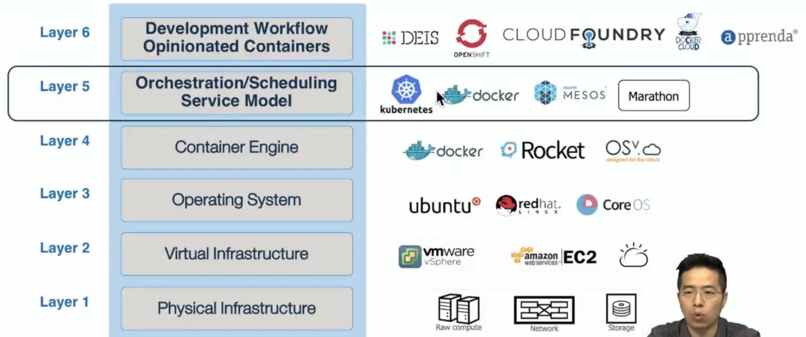

Docker
======
> "Package software into standardized units for development, shipment and deployment"

# 기존
개발 환경에서 프로덕션 환경으로 올릴때마다 환경이 달라져 제대로 동작하지 않았던 적이 많았음.
표준화되어있지 않은 방법으로 개발하고 배포하고 있었음.

# Container
컨테이너는 격리된 공간에서 프로세스가 동작하는 기술이다. 굉장히 좋은 기술이었으나 그렇게 자주 쓰이진 않았다.

## Container vs VM
Container는 가상화가 아니다!

- | Container | VM
------ | ------ | ------
비교 |  | 
특징 | 가상화X. Infrastructure위에 그냥 HostOS가 깔리고 그 위 Docker 엔진이 각각의 컨테이너를 **격리**만시킨다. | Infrastructure (물리서버) - Hypervisor (VMware) - 이 위에 아예 OS가 올라간다.
비교 |격리된 파일시스템/네트워크/프로세스 관리. **커널을 공유하기 때문에 꼭 필요한 라이브러리/바이너리만 배포함으로서 용량이 크게 감소한다.** | OS 자체를 포함하다보니 이미지 용량이 너무 크다. 새로운 이미지를 만들때 시간이 너무 오래걸린다.
결론 | 컨테이터 배포/운영하는 과정에서 부담이 줄어든다. 좀 더 클라우드 환경에 적합해짐 | 스케일업 할 때 힘들다. 마이크로서비스/클라우드 환경에서는 가상머신이 한계가 있다.

즉, Container와 VM은 전혀 다른 개념. 아래와 같이 함께 쓸 수도 있다.

## Container의 큰 특징
* Ship More Software
    * 환경설정의 어려움 제거, 환경 간 차이점 해결 => 클라우드에 올려놓고 그냥 쓰면 된다.
    * 개발, CI, CD 파이프라인 가속화. => 평균적으로 Docker 사용자가 SW를 7배 더 자주 출하한다.
* Resource Efficiency
    * 커널 부분만 공유하고 이미지는 공통 파일을 공유하는 계층화된 파일시스템 구조이기 때문에 디스크/RAM을 많이 잡아먹지 않고 효율적으로 사용할 수 있다.
* App Portability
    * App 종속성 및 구성/설정 까지 함께 패키징 된다. 이 컨테이너는 어떤 환경/인프라로 이동하더라도 동일하게 동작한다. (멱등성?)

# Docker
## Container의 혁명을 일으켰다.
Image System 통일. 배포. => 컨테이너를 쉽게 쓸 수 있도록 해줌

## Docker의 Mission
어떤 앱이든 어떤 환경이든 표준화된 프로세스로 개발하고 묶어서 보낸다음에 운영까지 걱정없이 똑같은 환경에서 돌아갈 수 있도록 하자!

> Build -> Ship -> Run -> Any App (Ubuntu, CentOS, MySQL, Node.js, Wordpress, mongoDB, redis, Nginx, Hadoop 등...) -> AnyWhere (HDD, VMware, OpenStack, AWS, MS Azure, IBM Bluemix 등...)

## 기본적인 용어
* Image : 운영해야 할 환경이 구성되어있는 일종의 FS. ReadOnly Snapshot :-)
* Container : Image를 Docker에 띄우면 Conatiner가 된다.
* Docker Hub : Public Docker Registry
    * Docker Registry : Image들을 보관하는 곳. 여기에 보관한 Image들을 끌어다가 배포해서 Container로 만든다.
    * Private Docker Registry : SaaS, Enterprise... (AWS, IBM Bluemix, MS Azure 등... 아무데나)
* Docker Engine : Container를 관리하는 Docker 프로세스.

# Kubernetes
Docker 클러스터를 관리하는 컨테이너 오케스트레이션 플랫폼.
* 컨테이너를 실행하고 관리함
* 이식성이 뛰어나다. (다양한 클라우드, 환경 지원)
* 100% Open Source
* Manage Applications, not machines.
* 스케쥴링, 스토리지, 네트워킹 관련 Plugin이 겁나 많다.

## Container Stack

## 구조
[Kubernetes Master] ------ [Worker Nodes]