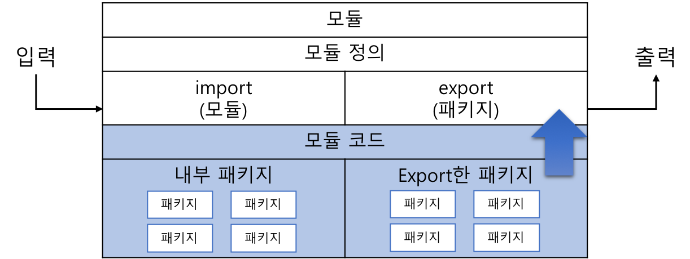

## 자바9 변화점

* REPL (Read-Eval-Print-Loop) 에서 자바 코드 일부를 실행하는 `jshell` 지원 추가
* HTTP 2.0 지원
* **모듈화** : 아래의 목표를 달성하기 위함!
  * 분할 정복 접근법 / 재사용성
  * 캡슐화 / 잘 정의된 인터페이스

* JRE, JDK 도 모듈화 개념을 활용하여 재작성됨 => 코어 자바 플랫폼 자체가 모듈화 되었다!


# 모듈화

## 모듈화 이전


## [자바 플랫폼 모듈 시스템 (JPMS, Project Jigsaw)](https://jcp.org/en/jsr/detail?id=376)

자바 모듈을 만들기 위해서는 아래 정보들을 제공해야 한다.

필요한 입력/출력의 정보를 명시한다 -> 클래스 패스보다는 훨씬 낫다.

* 모듈 이름 : 유일해야함
  * 패키지 명명 규칙을 따르는 것을 추천함 (`com.yenarue.analytics`)
* 모듈 입력 (import) : 모듈이 필요로 하는 것/사용하는 것. 모듈을 컴파일하고 실행하는데 필요한 것. / 모듈단위
  * 모듈을 생성할 때 명시적으로 어떤 **모듈**이 필요한지 지정한다. (`requires` 구문에 필요한 모듈들을 지정)
* 모듈 출력 (export) : 모듈의 출력 / 다른 모듈에 export 하는 것 / 패키지 단위
  * 외부로 출력(export)할 **패키지**를 지정함. `public` 으로 지정되어 있더라도 export되지않으면 보여지지 않음!

> import 을 모듈단위로 하는 이유 : 모듈의 export가 패키지이기 때문. 즉, 모듈에만 접근해도 export된 패키지에 다 접근할 수 있으니까! 매우 편리함!




### JPMS의 주요 목표

* **강한 캡슐화 (strong encapsulation)** : 접근 지시자의 제한에서 벗어나 더 거시적이고 강제적인 캡슐화가 가능하도록 한다.
* **신뢰성 있는 설정 (reliable configuration)** : 필요한 모듈을 미리 정의하므로 동작하기 전에 필요한 것들이 구비되어있는지 검사할 수 있다.


### Project Jigsaw

자바 플랫폼 자체를 모듈화하는 프로젝트.

주요 목표 (= 플랫폼의 모듈화가 주는 영향이라고 봐도 좋음)

* 확장성 있는 플랫폼 : 모놀리틱 런타임에서 ~~드디어~~ 벗어나 제한된 자원을 가진 소형기기에서도 사용가능!
* 보안과 유지 보수성 플랫폼 : 내부 API를 숨기고 플랫폼 보안을 향상시킬 수 있는 모듈화된 인터페이스 제공!
* 응용 프로그램 성능 : 꼭 필요한 것만 포함한 작은 플랫폼! => 성능 향상!
* 쉬운 개발자 경험 : 응용 프로그램과 라이브러리를 손쉽게 만들 수 있다!


### 버전 관리

특정 모듈에 의존성을 가질 때, 그 모듈의 어떤 버전에 대한 의존성인지 선언할 수 있을까? => **No!**

**JPMS 는 버전관리를 지원하지 않음!** => 왜지.......???


## Java9 의 모듈

자바9의 모듈은 다른 부가 프레임워크를 조합하여 사용하던 모듈과는 다르다. (like Gradle...)

코드베이스를 구조화할 때 완전히 새로운 사고방식이 필요하다.


### 이전 방식

`프로젝트 루트 폴더` - `소스폴더` - `패키지 폴더` - `*.java 파일` 의 트리형태로 이루어져있었음.

Ex) `/src/main/java`, `/src/main/java/com/yenarue/app/Main.java`


### 모듈이란?

> "**명확한 인터페이스를 제공하는 재사용 가능한 이상적인 컴포넌트**"

클래스와 패키지와 같은 레벨. 일급 시민(?!)임. 새로운 프로그램 컴포넌트.

자바 프로그램에서 생성하고 호출할 수 있는 코드와 데이터의 집합

다수의 자바 패키지를 가질 수 있다. 리소스나 속성 파일도 포함할 수 있다.


### Java9 이후의 방식

문제를 먼저 모듈 단위로 나눈다. (클래스나 패키지 단위로 나누는 것이 아니다!)


#### 0. 모듈의 목적 파악하기

이 모듈이 무엇을 위한 것인지 파악하자.

단일 코드베이스 보다는 재사용 가능한 하위프로젝트로 쪼개자. resusable library!


#### 1. 모듈 이름 정하기

**이 모듈이 무엇인가? + 해결하고자 하는 문제가 무엇인가? = 모듈 이름**

이름 충돌을 방지하기 위해 범용적이고 일반적인 이름은 지양하자. (`util`, `service` 등...)

>  추천 방법 : 패키지 네이밍시 사용하던 방법 (`com.yenarue.stringutil`)


#### 2. 루트 폴더 생성하기

모듈의 최상위 폴더를 생성한다. 모듈과 같은 이름을 가진다.


#### 3. 모듈 코드 추가하기

`프로젝트 폴더` - `소스 폴더` - **`모듈 루트 폴더`** - `패키지 폴더` - `자바 소스`

예시 : `com.yenarue.stringutil`/`com.yenarue.util`/`StringUtil.java`


#### 4. 모듈 기술자(module descriptor) 생성 및 설정하기

- 모듈 기술자 : 모듈의 메타데이터를 저장하는 파일. (import & export 정보)

  - `com.yenarue.stringutil/module-info.java` 파일

  ```java
  module com.yenarue.stringutil {
  }
  ```

  > 의도적으로 일반적이지 않은 네이밍과 형식을 채택함. -> 개발자들이 다른 자바 파일들과 구분할 수 있도록...

 

### 실습


```java
// Main.java
package packt.addressbook;

public class Main {
    public static void main(String[] args) {
        System.out.println("Hello World!");
    }
}

// module-info.java
module packt.addressbook {

}
```

```bash
# 컴파일 # `module-source-path`는 이전 버전의 `sourcepath`와 매칭된다
$ javac --module-source-path src -d out src/packt.addressbook/packt/addressbook/Main.java src/packt.addressbook/module-info.java
# 컴파일된 코드 실행하기 # `module-path`는 이전 버전의 `classpath`와 매칭된다
$ java --module-path out --module packt.addressbook/packt.addressbook.Main
Hello World!

```

