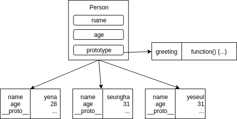

프로토타입
=====
자바스크립트는 프로토타입 기반 객체 지향 언어이다.

## 개요

## 함수도 객체다
자바스크립트에서는 함수도 객체이다. 기본적으로 `prototype` readonly 프로퍼티를 가지고 있다. 모든 인스턴스가 프로토타입 객체를 상속한다.

```js
function myFunc(){};
console.log(myFunc.prototype); // Object {}
```

## 메모리 관리의 효율성
생성자에서 함수를 선언하고 인스턴스를 생성할 수 있긴 하지만, 이 경우엔 동일한 로직의 함수가 각 인스턴스별로 따로 만들어지기 때문에 비효율적이라 할 수 있다. `prototype`을 이용하면 인스턴스에 메서드를 추가하지 않고 프로토타입 객체의 메서드를 참조하기 때문에 좀 더 효율적인 구조가 만들어진다.



```js
function Person(name, age) {
    this.name = name;
    this.age = age;
}

const yena = new Person("yena", 28);

Person.prototype.greeting = function() {
    alert('hi! I\'m ' + this.name);
}

yena.greeting();
```

## 참고자료
* [[위키백과] 프로토타입 기반 프로그래밍](https://ko.wikipedia.org/wiki/%ED%94%84%EB%A1%9C%ED%86%A0%ED%83%80%EC%9E%85_%EA%B8%B0%EB%B0%98_%ED%94%84%EB%A1%9C%EA%B7%B8%EB%9E%98%EB%B0%8D)
* [[StackOverflow] prototype based vs. class based inheritance](https://stackoverflow.com/questions/816071/prototype-based-vs-class-based-inheritance)