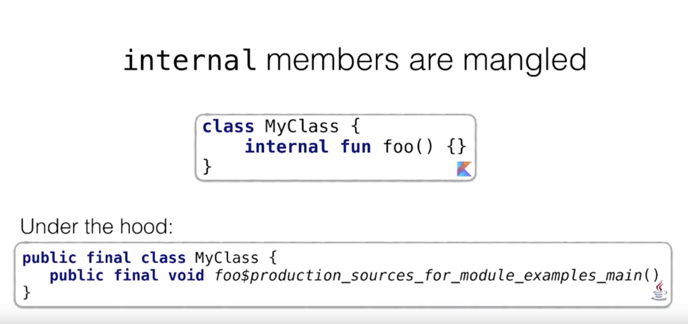
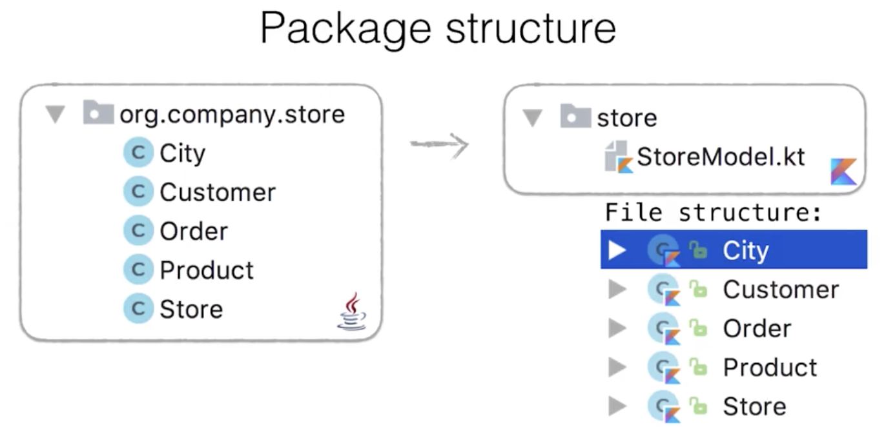
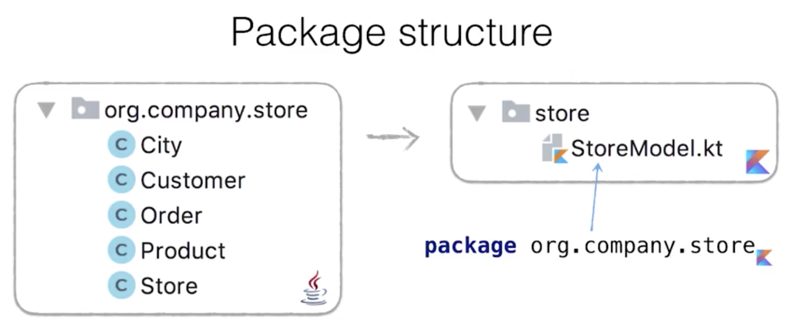
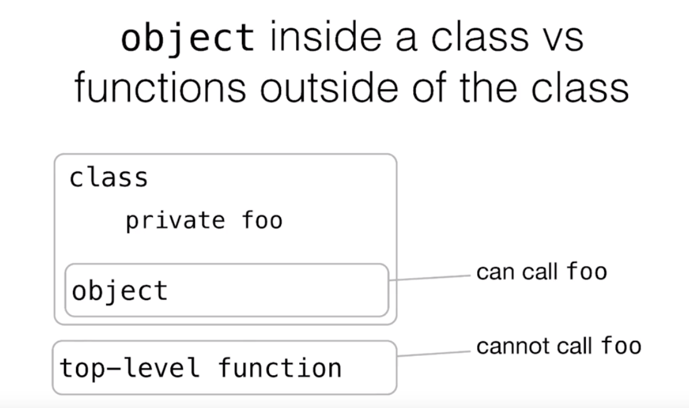

OOP, Object Oriented Programming
====

Kotlin brings many small messages and practical improvements.

## 기본 값이 다르다 (The defaults are different)

* 수정 제한자
  * **final : default**, 재정의 될 수 없다
  * open : non-final, 재정의 될 수 있다
  * abstract :  반드시 재정의 되어야 한다.
* 접근 제한자 (Modifier) : **`public` 이 default 이다.**

| Modifier  | Class Member             | Top-level Declaration   |
| --------- | ------------------------ | ----------------------- |
| public    | visible everywhere       | visible everywhere      |
| internal  | visible in the module    | visible in the module   |
| protected | visible in subclasses    | ----                    |
| private   | visible in **the class** | visible in **the file** |

### Kotlin 접근제한자는 Java에는 어떻게 매칭될까?

여기서 눈여겨봐야할 점은 **`internal` 이 `package private` 의 매핑버전이 아니라는 것**이다. Kotlin에서는 `package private`이 사라졌기 때문에 새로 추가된 `internal` 이 마치 `package private` 을 대체하는 것처럼 느껴질 수 있지만 절대 아니다! `package private ` 은 top-level 에서 선언된 `private` 이 대체한다. 그렇다면 kotlin의 `internal` 은 무엇일까?

| Kotlin modifier | JVM level                     |
| --------------- | ----------------------------- |
| public          | public                        |
| internal        | **public & name mangling**    |
| protected       | protected                     |
| private         | private / **package private** |

`internal` 은 jvm level 에서는 `public final` 으로 변환된다. 이를 네임 맹글링 (name mangling) 시켜 아래와 같이 이름을 변경하여 Java에서 기존 메소드 명으로 불릴 수 없도록 처리한다. 



### Kotlin은 왜 기본값을 Java와 다르게 설정했을까?

가장 **일반적으로(자주) 사용**되며, **가능한 많은 기능을 사용**할 수 있으면서도 **리스크가 적은 설정**이라고 판단하였기 때문이다. 이 기준으로 판단하여 가시성 측면에서는 public, 상속/오버라이딩 측면에서는 final 이 선정되었다.

단적인 예로, open에서 final로 변경하는 것은 어렵지만 final에서 open으로 변경하는 것은 상대적으로 수월하다는 점을 들 수 있다.

## 패키지 (Package)

Kotlin 의 패키지 구조는 Java에 비해 좀 더 심플하고 작다.

* 하나의 파일이 여러개의 클래스와 top-level 함수들을 포함시킬 수 있다:

  

* 패키지 네임이 꼭 디렉토리를 따라가지 않아도 된다:

  하지만 Kotlin 스타일 가이드에서는 기존 prefix를 붙이는 것을 권장한다.

  

## 생성자 (Constructors)

### 인스턴스 생성하기

Kotlin에서는 `new` 키워드가 사라졌다. 그냥 call 하면 된다. 

```kotlin
class A
val a = A()
```

### 주 생성자 (Primary Constructor)

클래스 선언 시 디폴트 생성자와 멤버 변수를 바로 정의할 수 있다:

```kotlin
class Person(val name: String, val age: Int)
```

전형적인 보일러 플레이트 코드였던 멤버변수 초기화용 생성자는 아래와 같이 심플하게 변경 가능해진다.

```kotlin
class Person(val name: String)

// 위 선언은 아래와 100% 동일하다
							// val이나 var 키워드 없이 정의되면 그냥 생성자의 파라미터가 된다
class Person(name: String) {
  val name: String
  init {
    this.name = name
  }
}
```

생성자에서 좀 더 디테일하고 복잡한 처리를 하고싶다면 아래와 같이 `init {}` 구문을 통해 커스텀마이징 할 수 있다:

```kotlin
							// constructor parameter
class Person(name: String) {
  init {
    // constructor body
  }
}
```

### 접근제한

클래스의 생성자에 접근제한을 걸고 싶다면 `접근제한자 constructor` 키워드를 사용하면 된다.

```kotlin
class InternalComponent internal constructor(name: String) {}
```

### 부 생성자 (Secondary constructor, 추가 생성자)

`constructor` 키워드를 사용하여 추가적인 생성자 정의도 가능하다. 이 경우, `this` 키워드는 해당 클래스의 다른 생성자를 뜻한다.

```kotlin
class Rectangle(val height: Int, val width: Int) {
  constructor(side: Int) : this(side, side) { ... }
}
```


## 상속 (Inheritance)

Kotlin에서는 상속의 문법이 조금 달라졌다.

### 확장(`extends`)과 구현(`implements`)의 문법이 동일해졌다 : `:`

Kotlin 에서는 클래스에 대한 상속(확장, `extends`)과 인터페이스에 대한 상속(구현, `implements`)를 동일한 문법인 `:` 으로 제공한다. 차이점이 있다면 클래스에 대한 상속의 경우에는 생성자를 호출하도록 하였다는 점이다.

```kotlin
interface Base
class BaseImpl: Base

open class Parent // 기본 설정이 final 이기 때문에 상속 가능하게 하려면 open 해야 한다
class Child : Parent()	// 생성자 호출
```

이러한 차이가 처음에는 이상해보일 수 있으나, 부모 클래스의 구현이 포함되고 부모 클래스의 생성자가 먼저 호출된다는 것이 매우 명시적으로 드러나므로 Java 보다 좀 더 명확한 표현이라고 볼 수 있다.

#### 부모 클래스의 생성자 부르기

클래스에 대한 상속인 경우, 부모 클래스의 생성자를 이용할 수 있다

```kotlin
open class Parent(val name: String)
class Child(name: String) : Parent(name)
```

상속 선언 시 생성자를 호출해주지 않아도, `super` 키워드를 통해 부모의 생성자를 호출할 수도 있다.

```kotlin
open class Parent(val name: String)
class Child : Parent {
  constructor(name: String, parent: Int) : super(name)
}
```

### 프로퍼티 오버라이딩 (Overriding a property)

아래의 코드는 과연 무엇을 출력할까?

```kotlin
open class Parent {
  open val foo = 1
  init {
    println(foo)
  }
}

class Child: Parent() {
  override val foo = 2
}

Child()
```

**정답은 1도 2도 아닌 0이다!** 그럼 당황하지 않고, 왜 0이 출력되는지를 알아보자.

프로퍼티 세션에서 알아봤듯이, Kotlin 의 프로퍼티는 필드에 대한 접근자들을 뜻한다. 즉, 프로퍼티를 오버라이딩 하는 것은 프로퍼티의 getter 를 오버라이딩 하는 것과 동일하다.

위 코드의 경우, 부모의 생성자가 불리며 `foo` 에 접근하게 될 때 `foo` 의 getter가 호출되게된다. 상속을 했으므로 자식의 getter가 불리게 되는데, 이 타이밍에 자식의 `foo` getter가 아직 정의되지 않았기 때문에 `Int`의 기본 값인 0을 반환하는 것이다.

위 코드에서는 `Int` 였기때문에 기본적으로 0으로 초기화되어있어 괜찮았지만, String 등의 객체인 경우에는 NPE가 발생할 수 있는 상황이다. 이는 Kotlin에서 컴파일타임에 NPE를 잡아내지 못하는 사례이므로 주의해야한다. (물론 IDE에서 경고메세지를 띄우기는 한다: ` Accessing non-final property value in constructor `)

이를 방지하고 기존 생각대로 2가 반환되게 하려면 어떻게 해야할까?

```kotlin
open class Parent(val foo: Int) {
    init {
        println(foo)
    }
}

class Child: Parent(foo=2) {
}
```

위와 같이 부모의 생성자를 이용하여 값을 받도록 해야한다. (흠… 다른 방법은 없을까ㅠ 오버라이드 사용해서 해결하는 방법을 없는걸까ㅠ)

##  Class Modifiers

Kotlin 에서는 자주 사용되는 유스케이스들을 위하여 class modifiers를 제공한다 : `enum`, `data`, `sealed`, `inner` 

위 키워드들을 사용하면 필요한 메소드를 자동으로 생성해주고, 필요한 제약사항(constraints)들을 자동으로 추가해준다.

### `enum` class

자바의 enum과 유사하다. (자바와의 차이점은?)

```kotlin
enum class Color {
  BLUE, ORANGE, RED
}
```

### `data` class

Lombok 의 `@data` 와 유사하다. `equals`, `hashCode`, `copy`, `toString` 등의 메소드들을 자동으로 생성해준다. (Lombok의 경우엔 getter, setter 도 생성해주지만 그건 이미 코틀린의 프로퍼티 개념에서 수행하므로...)

> 코틀린에서는 자바스크립트의 그것과 유사한 `===` 연산자를 제공하여 인스턴스까지 동일한지 검사해준다. ( `==` 연산자는 인스턴스가 달라도 값이 동일하면 true)

* `equals ` 의 경우에는 주 생성자의 프로퍼티에 대해서만 값 동일 여부를 검사한다

  ```kotlin
  data class User(val email: String) {
    var nickname: String = null
  }
  
  val user1 = User("voldemort@gamil.com")
  user1.nickname = "Voldemort"
  
  val user2 = User("voldmort@gmail.com")
  user2.nickname = "YouKnowWho"
  
  user1 == user2 // true
  user1 === user2 // false
  ```

### `sealed` class

제한된 계층 구조를 표현하는 추상 클래스이다. 이 키워드 사용시에는 **하위 클래스들이 반드시 동일 파일내에 정의**되어야 한다.

`sealed` 클래스는 내부적으로 private 기본 생성자를 가지고 있어,  Java에서 혹시나 실수로 하위 클래스를 만들게될 가능성이 배제된다.

`sealed` 키워드를 사용하게되면 계층구조가 제한되기때문에 `when()` 의 파라미터로 사용가능해진다.

```kotlin
sealed class Expr
class Num(val value: Int) : Expr()
class Sum(val left: Expr, val right: Expr) : Expr()

fun eval(e : Expr): Int = when(e) {
  is Num -> e.value
  is Sum -> eval(e.left) + eval(e.right)
}
```

### `inner` class 와 nested class

| In Java            | In Kotlin         | 다른 클래스 안에서<br />선언될 때 |
| ------------------ | ----------------- | --------------------------------- |
| **static** class A | class A (디폴트)  | 중첩 클래스 (nested class)        |
| class A (디폴트)   | **inner** class A | 내부 클래스 (inner class)         |

## Class delegation : `by`

Kotlin 에서는 위임 패턴 (delegation, delegation pattern)을 문법적으로 제공한다.

> 위임 패턴 : 어떤 객체의 동작의 일부를 다른 객체에게 넘기는 패턴. (위탁자(delegator) -> 수탁자(delegate)) 즉, 한 객체가 기능의 일부를 다른 객체로 넘겨주어 대신 수행하도록 하는 것. 이를 통해 한 객체의 변경이 다른 객체에 미치는 영향을 줄일 수 있다.

```kotlin
interface Repository {
  fun getById(id: Int): Customer
  fun getAll(): List<Customer>
}

interface Logger {
  fun logall()
}

class Controller( val repository: Repository, val logger: Logger) : Repository, Logger {
  override fun getById(id: Int): Customer = repository.getById(id)
  override fun getAll(): List<Customer> = repository.getAll()
  override fun logAll() = logger.logAll()
}
```

위와 같은 위임 패턴의 override 메소드들은 일종의 보일러 플레이트 코드이다. Kotlin에서는 이를 간결하게 표현하기 위해 `by` 키워드를 제공한다. 위의 코드는 아래 코드와 동일하다:

```kotlin
class Controller(val repository: Repository, val logger: Logger) : Repository by repository, Logger by logger
```

## Objects

Kotlin 에서는 `object` 키워드를 두가지 용도로 사용한다.

### 1. `object` 선언 (object declaration)

`object` 선언은 싱글톤 클래스를 나타낸다.

```kotlin
object KSingleton {
  fun foo() {}
}

KSingleton.foo()
```

```java
// java
Ksingleton.INSTANCE.foo();
```

### 2. `object` 표현식 (object expression)

Kotlin의 `object` 표현식은 Java의 익명 클래스를 대체한다.

interface가 1개의 메소드만 가질 경우에는 lambda 표현식으로, 2개 이상을 가질 경우에는 `object` 표현식으로 표현할 수 있다.

```kotlin
window.addMouseListener (
  object : MouseAdapter() {
    override fun mouseClicked(e: MouseEvent) { ... }
    override fun mouseEntered(e: MouseEvent) { ... }
  }
)
```

### `companion object`

싱글톤 클래스인 object declaration 을 클래스 내부에 사용하여 nested object로서 사용할 수 있다. 이 때, `companion` 키워드를 추가하면 nest object 멤버에 대한 접근 코드를 간소화 할 수 있다. (**유틸리티성 메소드/프로퍼티 구현시 유용하다**)

```kotlin
class A {
  companion object {
    fun foo() = 1
  }
}

A.foo()	// 이렇게 nested object에 대한 접근이 간소화 된다. 마치 멤버 메소드인 마냥....
```

Java에서는 이와 같은 목적으로 `static` 메소드를 사용한다. (Kotlin 에는 `static` 키워드가 없다)

Java의 `static` 메소드보다 companion object가 가지는 장점은 다음과 같다.

#### 1. interface 를 구현할 수도 있다:

```kotlin
interface Factory<T> {
  fun create(): T
}

class A {
  private constructor()
  
  companion object : Factory<A> {
    override fun create() = A()
  }
}

fun <T> createNewInstance(factory: Factory<T>)
createNewInstance(A)
A.create() 
```

#### 2. Companion object에 대한 확장함수를 구현할 수 있다:

정적 유틸리티성 기능을 구현할 수 있다! (fromJSON이나 parseFrom 처럼...)

```kotlin
class Animal(val name: String) {
  companion object { }
}

// Animal 클래스에 대한 확장함수
fun Animal.printName() { println(this.name) }

// Animal 클래스의 companion object에 대한 확장함수
fun Animal.Companion.fromJSON(json: String) : Animal {
  return Animal(convertJsonToMap(json)["name"])
}

val animal = Animal.fromJSON("{ name : 'hi' }")
animal.printName()	// hi
```

### Kotlin 에는 `static` 키워드가 없다

Kotlin 에서는 Java의 `static` 키워드를 다양한 문법으로 대체하고 있다.

1. top-level 에 정의한다

   : 클래스의 private 멤버에 접근하지 않으면 top-level 에 정의하는 것을 지향. 그 외에는 2, 3번의 방향으로 고고!

2. 싱글톤 클래스인 object 내부에 정의한다

3. 클래스 내부의 companion object에 정의한다

그렇다면 왜 Kotlin에서는 `static` 키워드를 버린 것일까?

Java의 static 멤버변수와 멤버함수의 경우 클래스의 멤버이면서도 클래스의 동작과는 무관하게 동작했으므로(게다가 static 멤버변수와 멤버함수끼리는 서로 상호동작이 가능했으므로 한 클래스에 두가지 동작이 있는 것과 동일한 상황이었다. 두가지 상태….) 의미적으로 굉장히 모호하다는 평이 많았다. 이 점을 개선하기 위해 좀 더 명시적으로 companion object 개념을 추가한 것이다.



#### @JvmStatic

해당 어노테이션이 붙은 메소드와 변수는 Java에서 static으로 선언된다.

```kotlin
class C {
  companion object {
    @JvmStatic fun foo() {}
    fun bar() {}
  }
}
```

```java
// Java
C.foo();
C.Companion.foo();
C.Companion.bar();
```

하지만, 변수에 대해서는 static으로 선언될 뿐 여전히 getter와 setter로 접근하는 것은 그대로 남게되어 직접 접근은 불가능하다.

## 상수 (Constants)

Kotlin에 `static` 키워드가 없다면, Java 에서 `static final` 로 선언하는 상수를 Kotlin 에서는 어떻게 선언할까?

- `const` : 원시타입과 String을 위한 상수 키워드
- `@JvmField` : accessors(getter, setter)를 제거하고 필드에 직접 접근이 가능하도록 하는 어노테이션 (=`static`)