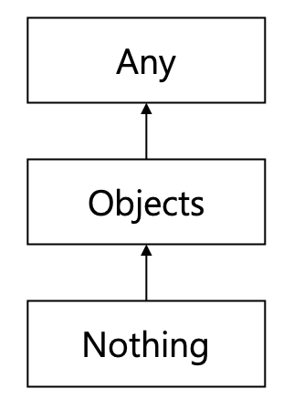
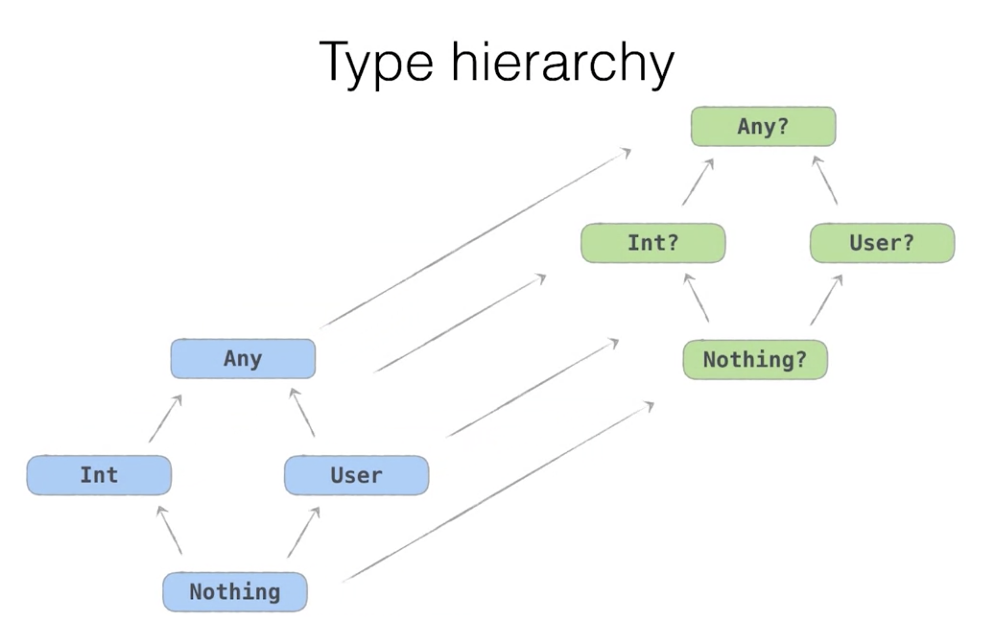

Types
====

Kotlin에는 개발자의 **편의성** (ex. 원시/레퍼런스 타입 구분 제거), **혼란 감소** (ex. 혼란을 야기할 수 있는 메소드 제거 및 변경), **안전성 개선** (ex. Nullable/NonNullable 구분을 타입 단위로 추가) 등을 의도하여 새롭게 정의한 Type들이 존재한다. 해당 Type들의 내부 구조에 대해서 조금 더 자세히 알아보도록 하자.

## 기본 타입들 (Basic types)

Kotlin은 원시타입과 레퍼런스 타입을 구분하지 않는다. 기존 원시타입들은 그 타입이 wrapping된 wrapper클래스로 제공된다. 그렇다면 실제로는 byte code로 어떻게 변환되는지 (보기 편하게) Java Code로 어떻게 재변환해서 확인해보자.

> IntelliJ나 Android Studio에서 `show kotlin bytecode` 메뉴로 들어가면 Kotlin 파일이 어떻게 바이트코드화 되는지 확인할 수 있다. 바이트코드를 Java 코드로 변환해서 보려면 `Decompile` 버튼을 클릭하면 된다.

### Java의 원시타입들

```kotlin
// kotlin
fun foo(): Int = 1
fun bar(): Int? = 1
```

```java
// java
public static final int foo() {
  return 1;
}

@Nullable
public static final Integer bar() {
  return Integer.valueOf(1);
}
```

위와 같이 Kotlin의 `Int` 는 Java 원시타입인 `int` 로, `Int?` 는 Java 래퍼타입인 `Integer` 로 변환됨을 알 수 있다. 이를 표로 나타내면 다음과 같다.

| Kotlin    | Java     | Kotlin   | Java    |
| --------- | -------- | -------- | ------- |
| `Int`     | `int`    | Int?     | Integer |
| `Double`  | `double` | Double?  | Double  |
| `Boolean` | boolean  | Boolean? | Boolean |
| `Float`   | float    | Float?   | Float   |
| `Long`    | long     | Long?    | Long    |

`Int` 가 단독으로 쓰인 경우에는 위와 같이 변환되지만 콜렉션등의 제네릭타입으로 쓰인 경우에는 Java 래퍼타입으로 변환된다. Java 원시타입으로 변환시키고 싶다면 `IntArray` 를 사용하면 된다.

| Kotlin       | Java            |
| ------------ | --------------- |
| `List<Int>`  | `List<Integer>` |
| `Array<Int>` | `Integer[]`     |
| `IntArray`   | `int[]`         |

### `kotlin.String`

Kotlin의 `String` 은 그대로 `String` 으로 변환된다.

| Kotlin          | Java               |
| --------------- | ------------------ |
| `kotlin.String` | `java.lang.String` |

타입 자체는 그대로 `String` 으로 변환되지만 Kotlin의 `String` 은 엄밀히 이야기하면 Java `String` 의 래퍼클래스로서 몇가지 다른점이 존재한다.

* 혼란을 유발시킬 수 있는 몇가지 메소드를 감췄다 (`@hide` 처리)

  | Java                                                 | Kotlin                                                       |
  | ---------------------------------------------------- | ------------------------------------------------------------ |
  | `"one.two.".replaceAll(".", "*") // ********` | `"one.two.".replace(".", "*") // one*two*`<br />`"one.two".replace(".".toRegex(), "*") // ********` |


### `Any`

Kotlin의 `Any` 는 **모든** 타입의 상위 클래스(super class)이다.

Kotlin의 `Any`는 Java에서는 `Object` 로 변환된다.

| Kotlin | Java               |
| ------ | ------------------ |
| `Any`  | `java.lang.Object` |

 Java에서 `Object` 는 레퍼런스 타입을 위한 최상위 클래스였지만 Kotlin의 `Any` 는 모든 타입의 상위 클래스이다. 이를 처리하기위해 Kotlin의 `Any` 는 문맥에 따라 적절히 자동 변환(auto boxing)이 이루어지도록 구현되어있다.

```kotlin
val nullableInt: Int? = 1				// Java에서 래퍼타입으로 변환되는 Int?
println(nullableInt is Any)			// true

val nonNullableInt: Int = 1			// Java에서 원시타입으로 변환되는 Int
println(nonNullableInt is Any)	// true
```

위 Kotlin 코드는 아래와 같은 Java 코드로 변환된다 

```java
Integer nullableInt = 1;
boolean var = nullableInt instanceof Object;
System.out.println(var);

int nonNullableInt = 1;
boolean var2 = true;			// true로 바로 변환된 것을 알 수 있다
System.out.println(var2);
```

### Function types

Kotlin의 Lambda 는 Java에서 Kotlin의 라이브러리(`kotlin.jvm.functions`)인 Function계열 함수로 변환된다.

| Kotlin              | Java                       |
| ------------------- | -------------------------- |
| `() -> Boolean`     | `Function0<Boolean>`       |
| `(Order) -> Int`    | `Function1<Order, Int>`    |
| `(Int, Int) -> Int` | `Function2<Int, Int, Int>` |

만약에 Lambda가 인라인으로 정의되어있다면, 해당 함수 정의부가 그대로 코드에 병합되어 들어간다. (통상적인 인라인 변환)

Lambda를 직접 호출하는 경우에는 `invoke()` 메소드가 호출된다:

```kotlin
// Kotlin
val popularity: (Order) -> Int
...
popularity(order)
```

```java
// Java
Function1<Order, Integer> popularity;
...
popularity.invoke(order);
```

`invoke()` 는 Kotlin에서도 직접 호출이 가능하긴하지만 굳이 그럴 필요가 없다보니 잘 쓰이지 않는다. 하지만 Lambda 변수 자체가 Nullable 인 경우에는 유용하게 사용될 수 있다:

```kotlin
val g: (() -> Int)? = null
g?.invoke()
```

## Kotlin 타입 계층 (Kotlin type hierarchy)

Kotlin 에는 Type에 계층이 존재한다. 간단히 살펴보자면, 최상위 클래스는 `Any`, 최하위 클래스는 `Nothing` 이다.



이를 어떻게 활용할 수 있을까?

### `Unit` vs `Nothing` vs `void`

`Unit`, `Nothin` 은 Kotlin의 타입, `void` 는 Java의 타입이다. 

#### `Unit`

`Unit` 은 '이 함수로부터 의미있는 값이 리턴되지 않는다.' 라는 뜻을 가진다.

Kotlin에서 `Unit` 은 언제나 `void` 대신으로 사용된다. 실제로 바이트코드로 변환하면 Java의 `void`로 전환된다.

```kotlin
// 아래의 코드는
fun ask() {
  println("Alles gut?");
}

// 아래와 같이 변경되어 컴파일된다
fun ask() {
  println("Alles gut?");
  return Unit
}
```

#### `Nothing`

Kotlin에서 `Nothing` 은 '이 함수는 절대 반환하지 않는다.' 라는 뜻을 가진다. 얼핏보면 Java의 `void` 와 동일해보이지만 그렇지 않다. Kotlin의 `Nothing` 은 정말로 아무런 값도 반환하지 않는다. (Exception이 발생한다든지...)

```kotlin
fun answer(): Nothing {
  throw Exception("Nicht wirklich")
}

fun nothing(): Nothing {
  return
}
```

하지만 바이트코드로 변환시켜보면 `Nothing` 또한 Java에서 `void`로 변환된다는 것을 알 수 있다.

여전히 `Unit` 과 무슨 차이가 있는건지 혼란스럽다. 그렇다면 아래 표를 살펴보자:

| Unit                                                         | Nothing                                                   |
| ------------------------------------------------------------ | --------------------------------------------------------- |
| 단 **하나의 값**만을 허용하므로 정보를 보유 할 수없는 타입 (a type that allows only **one value** and thus can hold no information) | **값을 가지지 않는** 타입 (a type that has **no values**) |
| one value = this function completes **successfully**         | no values = the function **never completes**              |
| The function completes **normally**                          | The function completes **abnormally**                     |

즉, `Nothing` 타입은 이 함수가 비정상적으로 끝난다는 뜻을 담고있다. 그러니까 정말 아무것도 아닌(Nothing) 타입인 것이다. 비정상 종료를 뜻하기 때문에 아래와 같이 절대 끝나지 않는 코드도 `Nothing` 타입이 될 수 있다. (물론 실용적인 코드는 아니다) :

```kotlin
fun infiniteLoop(): Nothing {
  while(true) {}
}
```

그렇다면 실용적인 코드로서 `Nothing` 타입은 어떻게 쓰일 수 있을까? 바로, **에러처리** 구문 작성시 이다! :

```kotlin
fun fail(): Nothing {
  throw IllegalStateException("wtf!")
}

val answer: Int = if (timeHasPassed()) {
  42
} else {
  fail("No answer yet")
}
```

실제로 Kotlin 표준 라이브러리에는 `Nothing` 타입을 반환하는 `TODO()` 메소드가 존재한다!:

```kotlin
inline fun TODO(reason: String): Nothing {
  throw NotImplementedError("An operation is not implemented: $reason")
}

val answer: Int = if (timeHasPassed()) {
  42
} else {
  TODO("Needs to be done")
}
```

개발자가 구현해야할 코드를 깜빡 잊을수도 있는 경우나 예외처리 로직을 추후에 개발할 예정일때 유용하게 사용될 수 있다. 다른 팀원이 이 에러를 만나게 되더라도 에러 로그를 보고 안심하게 될 것이다. (또는 분노하거나?ㅋㅋ 그래도 최소한 이유는 알게되고 일반 주석처리보다는 살아있는 프로그램 상에서 비구현되었음을 알려주게되니 좀 더 명시적으로 보여 일반 주석보다는 나아보인다)

안전성 외에도 `Nothing` 의 존재가 아주 중요한 이유가 있다. 먼저, Kotlin 타입 계층구조를 다시 한번 살펴보자 : `Nothing` -> Objects -> `Any`. `Nothing` 은 모든 클래스의 최하위 클래스이다. 위에서 들었던 `answer` 변수의 예시를 다시 들어보자:

```kotlin
// fail이 Unit타입이면
fun fail(message: String) {
  throw IllegalStateException(message)
}

// answer은 Any 타입이 된다
val answer: Any = if (timeHasPassed()) {
  42									// Int
} else {
  fail("Not ready")		// Unit
}
```

위와 같이, `fail()` 이 `Unit` 타입을 반환하면, `answer` 는 `Int` 타입일수도, `Unit` 타입일수도 있기 떄문에 이 모두를 아우를 수 있는 `Any` 타입이 된다. 그렇다면 `fail()` 이 `Nothing` 타입을 반환하게 되면 어떻게 바뀔까? :

```kotlin
// fail이 Nothing타입이면
fun fail(message: String): Nothing {
  thrwo IllegalStateException(message)
}

// answer은 Int 타입이 된다!
val answer: Int = if (timeHasPassed()) {
  42									// Int
} else {
  fail("Not ready")		// Nothing
}
```

**`Nothing` 은 모든 것에 대한 최하위 타입이기 때문에 `answer` 은 그대로 `Int` 로 선언되게 된다!**  `else` 구문으로 빠지면 해당 함수는 언제나 비정상 종료를 하게되기 떄문에 논리적으로도 `answer` 변수가 값을 가지게 된다면 무조건 `Int` 일 수 밖에 없음을 추론할 수 있다. Kotlin은 이를 타입 계층으로 구현한 것이다.

Java에는 이러한 개념자체가 존재하지 않기떄문에 이를 표현해낼 수 없다. 그렇기때문에 `Nothing` 타입도 `void`로 변환되는 것이다.

### 다시한번 살펴보는 Kotlin 타입 계층



기존 타입계층이 각각의 Nullable 타입을 상속하는 구조

다른 것은 다 이해되겠지만 `Nothing?` 타입에 대해서는 조금 모호하게 느껴질 것이다.

#### `Nothing?` 타입

실무적으로 이 타입을 사용할 일은 거의 없다. 가끔 실수했을 경우에는 볼 수도 있는데, `Nothing?` 타입을 쉽게 이야기하자면 `null` 의 타입을 뜻하기 떄문이다.

```kotlin
var user = null
user = User("Jane Doe")
// Error: Type mismatch: inferred type is User but Nothing? was expected
```

그럼 정말 처음엔 null이다가 나중에 셋팅해야 할 때는 어떻게 해야하나ㅠㅠ 싶을 수도 있다. 이럴때는 당황하지 않고 이전 챕터에서 익혔던 대로 Nullable 타입을 사용하면 된다:

```kotlin
var user: User? =. ull
user = User("Jane Doe")
```

## Nullable Types

Kotlin에서는 Nullable 타입과 Non-Nullable 타입을 구분한다. Java에서 구현된 함수나 변수를 Kotlin에서 사용할 때는 그럼 어떻게 변환될까? 

* Java에서 구현시  `@Nullable` 또는 `@NotNull` 을 명시한 경우 : 각각 Nullable 타입, Non-Nullable 타입으로 해석된다
* Java에서 구현시 Nullability 어노테이션을 명시하지 않은 경우 : **Nullability 여부를 알 수 없다는 제 3의 타입**으로 해석된다.

### Platform type: `Object!`

Kotlin의 또 다른 타입. Java로 부터 온 타입으로서, **Nullability를 알 수 없는 타입**이다.

이 타입의 변수에 접근할 때에는 반드시 safe access로 접근 해야한다.

일단 정확한 타입을 알아보기 위해 아래의 Java 코드를 Kotlin에서 호출하여 의도적으로 다른 타입의 변수에 넣어보자.

```java
// java
public class Session {
  public String getDescription() {
    return null;
  }
}
```

```kotlin
val session = Session()
val description: Boolean = session.description // Compile error : Type mismatch: inferred type is String! but Boolean was expected
```

위와 같이 `String!` 타입으로 변환되는 것을 확인할 수 있다. `Object!` 타입이 바로 Platform 타입이다.

그러면 타입을 제대로 설정하고 받아보면 어떻게될까?

```kotlin
val description: String! = session.description
description.length // NullPointerException
```

컴파일 에러는 발생하지 않지만 런타임시 NullPointerException이 발생하게 된다. Nullable 타입(`object?`)의 경우에는 접근 시 `?` 연산자 없이 접근하면 컴파일 에러를 발생시킨다. 하지만 Platform 타입( `Object!` )의 경우에는 Nullability를 알 수 없는 타입이기때문에 이에 대한 컴파일 에러는 발생시키지 않는 것이다. 아래와 같이 `?` 연산을 이용하여 safe access 를 하면 NPE를 피할 수는 있다.

```kotlin
description?.length
```

#### `?` 연산을 쓰지 않아도 컴파일 에러가 안나니까 불안해요!

그렇다. Platform 타입은 Nullable 타입처럼 NPE 발생위험이 존재하지만 Nullable 타입과는 달리  `?` 를 쓰지 않아도 컴파일 에러가 나지 않는다. 의식적으로 `?` 를 붙여주는 방법도 있겠지만 더 좋은(편한) 방법이 없을까?

1. Java 코드에 Nullability 어노테이션 붙이기 (`@Nullable`, `@NonNull`)
   - [관련 Kotlin 플러그인](<https://www.jetbrains.com/help/idea/annotating-source-code.html>) 을 설치한 후 Java 코드에 Nullability 어노테이션을 붙여주면 Kotlin에서 호출 시 Nullable 혹은 Non-Nullable 타입으로 인식할 수 있게 된다.
   - 각각의 메소드별로 어노테이션을 붙이기 번거롭다면 패키지나 클래스에 디폴트 Nullability 어노테이션을 설정할 수 있다. (`@NotNull` 를 디폴트로 선언 -> null 이 발생할 위험이 있는 Java 메소드에만 `@Nullable` 어노테이션을 붙인다!)
   - 디폴트 어노테이션을 사용하는 것보다 명시적으로 적어주는 것이 더 가독성이 좋고 안전한 코드이기 때문에 명시적으로 적는 것을 지향하는 게 좋다.
2. Kotlin의 변수를 Nullable이나 Non-Nullable 타입으로 명백하게 선언하기
   * 외부 라이브러리인 경우에는 어노테이션을 직접 붙일 수 없다. Java의 클래스나 메소드를 사용하고 반환값을 저장하는 Kotlin 변수의 타입을 명확하게 해줌으로서 Nullability를 설정할 수 있다. 만약 Kotlin 변수의 Nullablity 타입이 잘못 설정되었다면 컴파일 에러(IllegalStateException)가 발생하기 때문에 좀 더 안전하다.

## Collection Types

Kotlin의 Collection 타입은 안전성 및 가독성(의도 파악)을 위해 Mutability 타입을 도입했다. (ex. `MutableList`)

* Mutable type : `add()`, `remove()`, `clear()` 등과 같이 수정 가능한 기능들이 제공되는 타입이다. 

* Read Only type : 읽기 전용 타입으로서 Mutable 타입에서 제공되는 수정 가능 기능들이 제공되지 않는다. **하지만 Immutable 하지는 않다!** Mutable 타입을 Read Only 타입으로 선언된 변수에 넣고 Mutable 타입의 컬렉션을 수정하면 Read Only 타입도 내용이 수정된다. 같은 레퍼런스에 접근권한만 다르다고 보면 된다.

```kotlin
val mutableList = mutableListOf(1, 2, 3)
val list: List<Int> = mutableList
println(list)	// [1, 2, 3]
mutableList.add(4)
println(list)	// [1, 2, 3, 4]
```

Mutable 타입과 Read Only 타입은 서로 호환이 가능하기 때문에 아래와 같이 접근 제한을 의도할 수 있다.

```kotlin
object Shop {
  private val customers = mutableListOf<Customer>()
  fun getCustomers(): List<Customer> = customers	// Read Only 타입으로만 외부에 공개
}

val customers = Shop.getCustomers()
customers.add()	// compile error!
```

Mutability 관련 타입 또한 Java에는 존재하지 않는 타입이다. Java에서 정의된 함수를 Kotlin에서 호출하면 그 함수의 Mutability 는 어떻게 처리 될까?

### Platform Type

이 역시 **Mutability 여부를 알 수 없는 타입**으로서 Platform 타입으로 처리된다. 즉, Platform 타입은 **Unknown Nullability + Unknown mutability** 라고 볼 수 있다.

사실 Java의 Collection의 Mutability여부는 Mutable 이라 볼 수 있다 (수정 가능 하니까). 그렇기 때문에 Kotlin에서는 Mutable 타입의 변수든 Read Only 타입의 변수든 Java의 컬렉션을 할당할 수 있다. 개발자는 그냥 로직의 흐름에 맞게 Mutability를 결정해주면 된다.

## 참고자료

* [코틀린 입문 스터디 **(17) Types**](<https://medium.com/@kbm1378/%EC%BD%94%ED%8B%80%EB%A6%B0-%EC%9E%85%EB%AC%B8-%EC%8A%A4%ED%84%B0%EB%94%94-17-types-d5644ea8ec81>)
* [[Coursera] Kotlin for Java Developers > Types > Kotlin type hierarchy](<https://www.coursera.org/learn/kotlin-for-java-developers/lecture/zxwAb/kotlin-type-hierarchy>)
* [Kotlin’s ‘Nothing’ Type](<https://proandroiddev.com/kotlins-nothing-type-946de7d464fb>)
