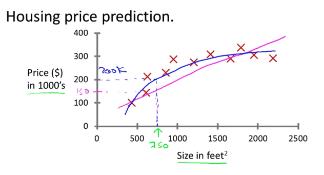
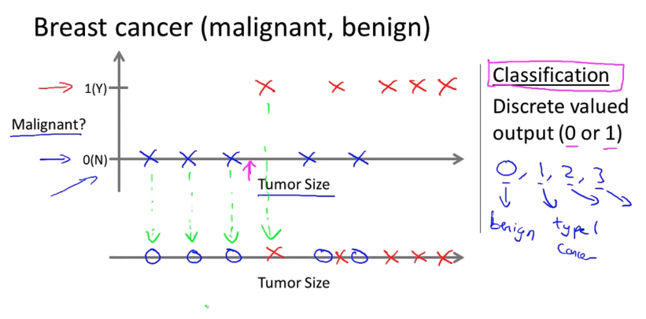
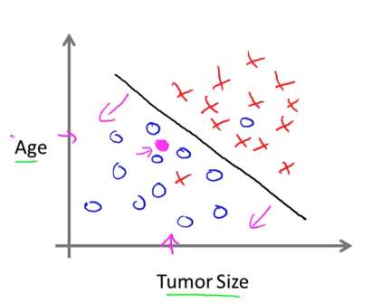
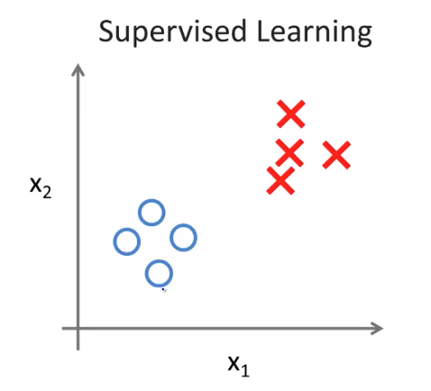
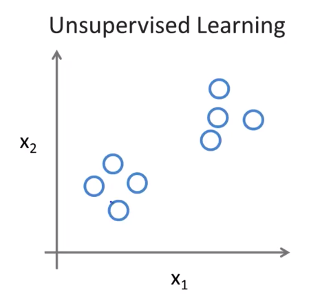
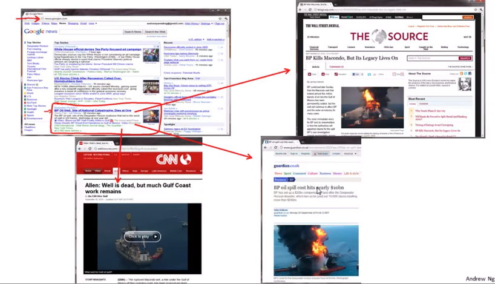
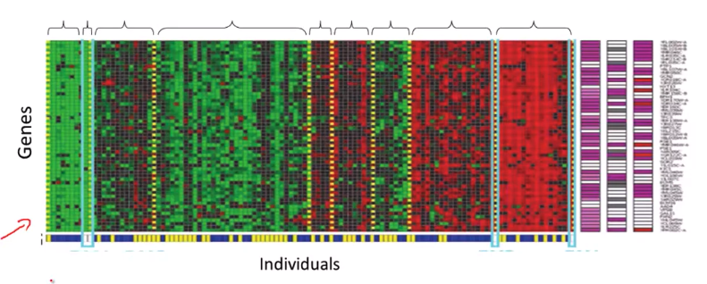
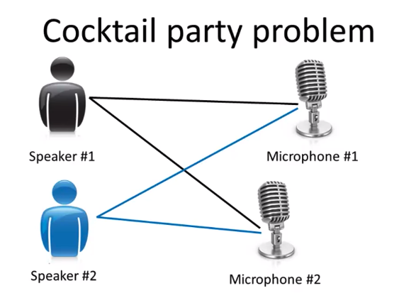

Coursera의 유명 강의, Andrew Ng 교수님의 Machine Learning 를 들으며 정리한 개인 학습자료입니다.


# Machine Learning

기계학습(Machine Learning)은 인공지능 분야에서 발전하여 파생되어 나온 분야로서 컴퓨터에 새로운 능력을 불어넣고 있다 (New capability for computers).

* 기초과학, 산업 여러분야에서 활용된다
* 기계학습이 필요한 분야가 점차 확산되고 있다

* 예시
  * 데이터베이스 마이닝
  * 손으로 프로그래밍을 할 수 없을 때 사용하는 자동화 학습 프로그램 분야 (학습)
    * 스스로 학습하여 헬리콥터가 날게하는 것
    * 손글씨 인식
    * 자연어 처리 기법
    * 컴퓨터 비전
  * 스스로 프로그래밍을 할 수 있는 학습 알고리즘
    * 아마존, 넷플릭스 추천시스템
  * 인간의 학습방법을 이해하기 (두뇌, 인공지능)


# W1-1. Introduction

## What is Machine Learning?

기계학습이란 무엇일까? 사실 "기계학습"에 대한 판별 기준에 대한 합의가 아직 이루어지지 않았다. 그 대신, 그 동안 제시된 정의들을 하나씩 살펴보자:

*  Arthur Samuel (1959) - "기계학습이란, 컴퓨터가 명시적(explicit) 프로그램이 없어도 스스로 학습할 수 있는 능력을 연구하는 학문 분야이다"
  * 약간 오래된 느낌의 정의 (전통적 정의)
  * 사무엘은 체스 게임을 둘 줄 몰랐지만, 프로그램에게 체스게임을 여러번 반복하게 만들어서 상황에 따라 어떤 수의 좋고 나쁨을 학습하게 하였다.
*  Tom Mitchell (1998) - "학습 과제 중심으로 정의 (Well-posed Learning Problem)"
   * 프로그램이 일정 수준의 **작업 성능(P)**를 가지고 **작업(T)**을 수행한다고 했을 때, **경험(E)**이 증가함에 따라 작업(T)를 수행하는 성능(P)이 향상될 수 있다. 이 때, **프로그램이 경험(E)으로부터 학습(Learn)을 했다**고 표현한다.
   *  체커게임 예시
      * 경험 (E, experience) : 같은 게임을 수만번 반복하는 과정
      * 작업 (T, task) : 체커 게임을 수행하는 행위
      * 작업 성능 (P, performance) : 프로그램이 다음 판을 새로운 상대로 했을 때 그 판을 이길 확률 (probability)

### 지도학습과 비지도학습
* 지도 학습 (Supervised Learning) : 작업을 수행할 수 있는 방법을 가르친다
* 비지도 학습 (Unsupervised Learning) : 컴퓨터가 스스로 학습하도록 유도한다

### 강화학습과 추천시스템

강화학습과 추천시스템도 기계학습 알고리즘이지만, 가장 많이 사용되는 알고리즘은 지도학습과 비지도학습이다.

### 앤드류 응 교수님의 교수철학

실무를 강조하시는 편 :-) 좋다!

> "학습 알고리즘을 가르친다는 것은 여러분께 도구를 드리는 것입니다. 어쩌면 도구 그 자체보다 더 중요한 것은 이 도구를 잘 활용할 수 있는 방법을 가르쳐 드리는 것입니다. 공부하는 것은 목수가 되는 것과 유사합니다. 누군가 여러분에게 목수가 되는 방법을 가르쳐 주고 있습니다. 망치, 드라이버, 톱 하나씩 던져주기만 하고 알아서 하라고 하면 어떨까요? 도움이 안 되겠죠? 도구는 많겠지만 가장 중요한 것은 도구를 활용하는 방법을 배우는 것입니다."

* 기계학습 알고리즘을 '잘 활용할 줄 아는 사람'과 알고리즘을 '잘 활용하지 못하는 사람' 간에는 큰 차이가 있다.
* 어떻게 접근해야 최적화된 시스템을 만들 수 있는가
* ML, AI 분야의 Best Practice를 다룰 예정
* 최고의 시스템을 설계할 수 있도록


## 지도 학습 (Supervised Learning)

**정확한 답(right answers)을 알고있는 데이터를 가지고 학습을 수행하는 방식.**

입력과 출력사이에 어떤 관계(상관 관계)가 있을 것이라는 생각에서 출발했다.

* 분류 (Classification) :  값이 이산값 (Discrete)
* 회귀 (Regression) : 연속된 값 (Continuous)


### 회귀 문제 (Regression Problem)

**연속된 값(continous output)을 가진 결과를 예측**한다.

물가와 같이 "연속"이라는 특징을 가진 값을 예측한다.

**입력 변수를 연속 함수에 매핑하는 방식으로 예측**하는데, 이는 **부동산 가격 예측**을 예로 들어 살펴보도록 하자.



* 빨간색 X 표시 : 실제 부동산 가격
* x축 : 평수
* y축 : 가격
* 분홍색 선 : 빨간색 X 표시의 경향을 나타내는 1차원 함수 그래프
  * 이 선을 따라 예측(회귀)하면 750 평수의 집 값이 대략 150으로 예상된다
* 파란색 선 : 빨간색 X 표시의 경향을 나타내는 2차원 함수 그래프
  * 이 선을 따라 예측(회귀)하면 750 평수의 집 값이 대략 200으로 예상된다


### 분류 문제 (Classification Problem)

**불연속적인 결과 값(이산 값)을 예측**한다.

**입력 변수를 이산 범주로 매핑하는 방식으로 예측**하는데, 이번에는 **유방암 여부를 판단하는 경우**를 예로 들어 살펴보도록 하자.

* x축 : 종양 크기
* y축 : 악성 여부
* 빨간 X표시 : 악성 종양 데이터
* 파란 X표시 : 양성 종양 데이터
* 분홍색 화살표 : 악성 여부를 분류하고자하는 데이터



악성 여부를 y축으로 놓고 2차원 그래프로 확인하던 내용을 표현방식을 바꿔 1차원으로 표현하였다.

* 파란 O 표시 : 양성
* 빨간 X 표시 : 악성

여기서 만약 "종양 크기" 정보 외에 "나이" 정보를 추가로 알고 있다면 아래와 같이 2차원 그래프에 표현할 수 있다.



악성 여부를 구분지을 수 있는 직선을 하나 그려서 악성 종양과 양성 종양을 구분해보았다.

분홍색 점이 양성인 쪽에 존재하므로 양성일 가능성이 높다고 판단할 수 있다.

이 구분선이 바로 양성/악성 종양을 나누는 Classification 학습 모델이다.

* 고려된 특성(Feature) : Age, Tumor Size
  * 그 외 고려될 수 있는 후보들 : Clump Thickness, Uniformity of Cell Size, Uniformity of Cell Shape 등...

위의 예시에서는 간단하게 2가지 특성만을 가지고 분류를 해보았지만 현실세계에서는 겨우 1~2가지 특성만을 고려하는 경우는 거의 없다. 거의 무한대의 특성을 고려해야 수많은 특성이나 신호(cue)를 통해 높은 정확도의 예측을 할 수 있게되기 때문이다.

그렇다면 무한대의 특성은 어떻게 다뤄야 할까? 메모리가 터질텐데 말이다...

* Support Vector Machine (SVM) 등의 알고리즘을 사용하면 컴퓨터가 무한한 개수의 특성을 다룰 수 있게 된다 => 추후 자세히 살펴보도록 하자!

### 회귀문제를 분류문제로 변환시키기

Given data about the size of houses on the real estate market, try to predict their price. Price as a function of size is a continuous output, so this is a regression problem.

We could turn this example into a classification problem by instead making our output about whether the house "sells for more or less than the asking price." Here we are classifying the houses based on price into two discrete categories.


## 비지도 학습 (Unsupervised Learning)

지도 학습과는 달리 "정답"이 주어지지 않고 "데이터"만 주어진다. 데이터의 구성에서 어떤 형태나 특징을 찾아내어 군집(Cluster, 클러스터)화 하여 스스로 답을 유추하여 학습하도록 한다.

| 지도학습                                  | 비지도학습                                      |
| ----------------------------------------- | ----------------------------------------------- |
|  |  |

위 그래프 중 비지도 학습 그래프를 살펴보자. 뭔가 패턴을 찾을 수 있는데 바로 2개의 클러스터로 묶일 수 있다는 점이다. 비지도 학습 알고리즘은 이 데이터를 두가지 서로 다른 클러스터로 구분 지을 수 있다. => 클러스터링 알고리즘

### 클러스터링 (Clustering) 예시 

#### 구글 뉴스

연관성 있는 기사들끼리 묶어서 보여준다.



#### 사람의 유전자 정보

여러 사람들의 유전자 정보를 입력하였을 때, 비슷한 유전자의 패턴을 묶어서 각 사람들을 서로 다른 분류 또는 타입으로 분류할 수 있다.



#### 그 외 예시

* 컴퓨팅 클러스터 구조화하기
* 소셜 네트워크 분석하기 (인간관계 그룹으로 나누기)
* 시장 세분화 (Market Segmentation) : 판매 데이터 & 고객 데이터를 이용해 그룹화하고 자동으로 세분화된 시장을 찾아내어 타겟 마케팅
* 천문학 데이터 분석

### 비 클러스터링 (non-Clustering) 예시

#### 칵테일 파티 문제 (Cocktail party problem)

칵테일 파티처럼 여러 사람들이 모여 이야기를 나누는 상황속에서는 발화자를 구분해내기 쉽지 않다. 이처럼 데이터가 섞여 혼란스러운 환경속에서 규칙이나 구조를 찾아내야하는 문제를 "칵테일 파티 문제"라고 하는데, 이 문제도 비지도 학습으로 풀 수 있다.



두개의 마이크에서 동시 녹음을 한 뒤, 비지도 학습을 이용하여 발화자를 구분한다.

> 내 생각 : 약간 인간의 눈이 2개이기 때문에 깊이를 구별할 수 있는 것과 비슷한 느낌..

같은 방식으로, 배경음악과 사람 목소리를 구분하는 것도 가능하다.

### 구현 방법

비지도 학습을 구현하기 위해서는 굉장히 복잡한 알고리즘이 필요할 것 처럼 보이겠지만, 사실 아래의 수식 하나로 가능하다.

```
[W,s,v] = svd((repmat(sum(x. * x, 1), size(x, 1), 1). * x) * x');
```

* [Octave](https://www.gnu.org/software/octave/)
* [SVD (Singualr Value Decomposition, 특이값 분해)]([https://ko.wikipedia.org/wiki/%ED%8A%B9%EC%9D%B4%EA%B0%92_%EB%B6%84%ED%95%B4](https://ko.wikipedia.org/wiki/특이값_분해))
  * 예전에 특이값분해에 대해 이해할 때 도움이 크게 되었던 [포스팅](https://angeloyeo.github.io/2019/08/01/SVD.html)


