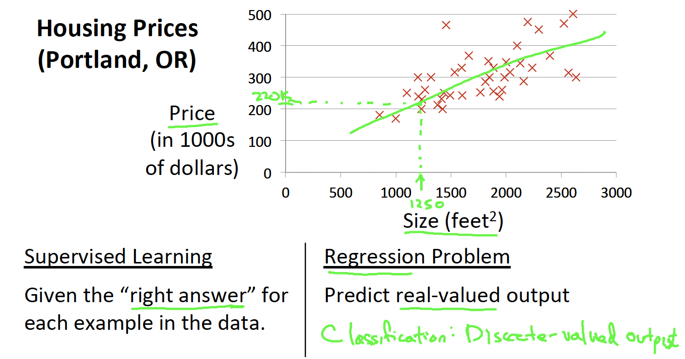
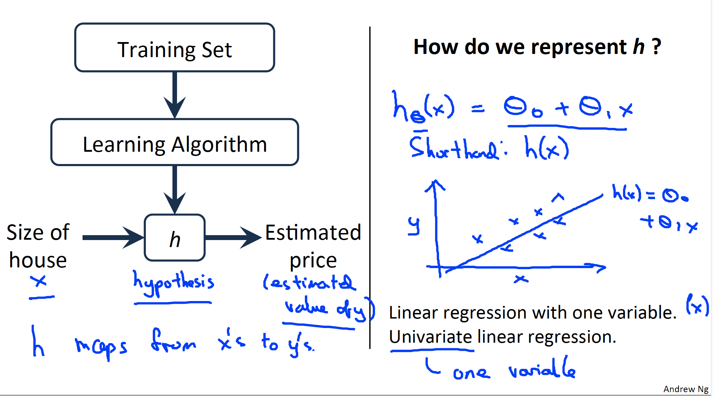
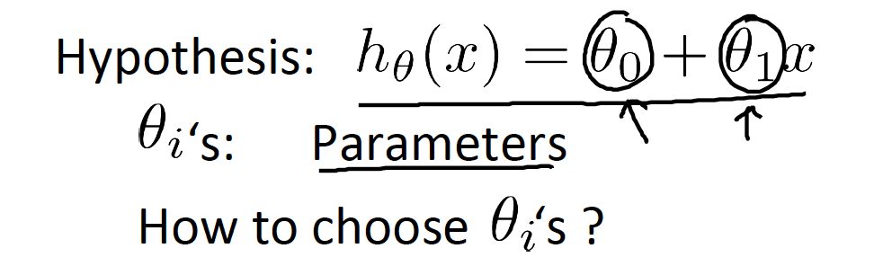
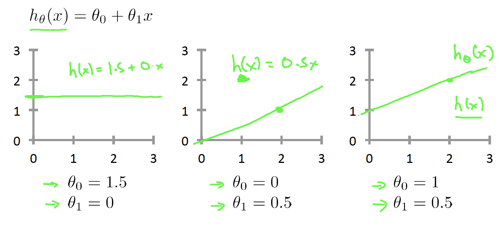
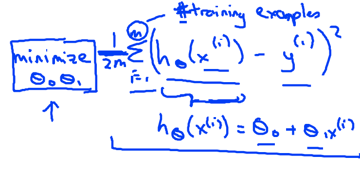
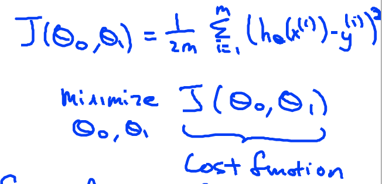

Coursera의 유명 강의, Andrew Ng 교수님의 Machine Learning 를 들으며 정리한 개인 학습자료입니다.

# W1-2. Supervised Learning - Linear Regression

지도학습 (Supervised Learning) 중의 하나인 선형 회귀 (Linear Regression) 에 대해서 알아보자.

## Model Representation

Week1 - 1. Introduction 에서 살펴봤듯이, 선형회귀는 **데이터의 양상을 가장 잘 표현할 수 있는 선형의 직선을 그려, 새로운 input(x) 값이 들어왔을 때 그에 적합한 ouput(y)을 예측하는 것**이다.

위의 스크린샷에서 집 값 예시를 살펴보며 선형 회귀를 이해해보자.

빨간색 x로 표현된 기존 데이터의 양상을 표현하는 선형의 선을 그으면, 1250 feet^2 라는 새로운 input 값이 제시되었을 때 그 선을 기반으로 집 값이 220,000 달러 정도 될 것이라 예측할 수 있다.

여기서 "선형의 선"을 그은 것이 데이터를 표현하는 모델을 선정한 것이며, 이것이 바로 선형 회귀의 모델 표현법이다.

### 모델 표현법을 도식화 & 수식화 해보자

위 흐름을 플로우 차트로 도식화 해보면 아래와 같이 표현된다.

**학습 데이터(Training Set)**를 통해 **학습 알고리즘(Learning Algorithm)**을 이용하여 **가설(h)**을 만들어내는 흐름으로 도식화 되었다. 각 파트를 자세히 살펴보면 아래와 같다 : 

* 학습 데이터 (Training Set) : 학습에 사용될 데이터 셋
  * 집 값 예시 : feet^2와 집 값에 대한 데이터들

* 학습 알고리즘 (Learning Algorithm) : 학습 데이터를 학습하는 방식
  * 집 값 예시 : "직선의 방정식으로 학습하겠다"는 방식
* h (Hypothesis, 가설) : 학습데이터를 학습 알고리즘으로 학습한 결과물
  * Error가 최소이거나 최적인 모델
  * 집 값 예시 : 도출된 직선 (1차 방정식의 형태)

#### 여기서 가설 (Hypothesis) 에 대해서 좀 더 살펴보도록 하자 :

* h (Hypothesis, 가설) : x에서 y으로까지의 연결지도 (h maps from x to y)

  * input(x)이 들어오면 h(가설)을 통해 예측된 값을 output(y)으로서 내놓는다.

  > 여기서 h는 "가설"이라는 단어의 사전적 의미와는 조금 다르다. 이는 그냥 기계학습 초기에서부터 사용되어오던 용어다. 앤드류 응 교수님께서도 이 단어가 과연 적합한지에 대해 의문을 품고 계신다. 그냥 머신러닝 전문용어니까 그러려니 하자고한다 (!)

* 하나의 변수를 가지는 선형함수 **h(x) = Θ0 + Θ1x**
  * 단일변량 선형 함수 = 하나의 변수를 가지는 선형 함수
  * 처음 보면 좀 어려워 보일 수 있지만 그냥 1차 방정식이다. (f(x) = ax + b 와 동일한 형태)

지금까지 선형 회귀 모형에 대해서 알아보았다. 이제 이 모형을 어떻게 실행할 것인지에 대해 살펴보자.

## Cost Function (비용 함수)

**비용함수를 이용하면 데이터에 가장 가까운 일차함수 그래프를 알아 낼 수 있다.**

비용함수를 알아보기 앞서 가설의 형태를 다시한번 살펴보자:

여기서 **Θ0, Θ1은 모형의 파라미터**를 뜻한다. 각 파라미터 값에 따라 아래와 같이 가설함수가 달라진다.

선형회귀에서는 훈련집합에 가장 잘 적합하는 직선을 구해야한다. 위 그림에서 알 수 있듯이 Θ0, Θ1값에 따라 직선의 형태가 결정되므로 모형의 성능을 결정하는 값들임을 의미하며 선형회귀에서는 이 **Θ0, Θ1 파라미터 값을 어떻게 고를 것인지가 중요 포인트**라고 볼 수 있다

그렇다면 Θ0, Θ1가 데이터와 잘 일치하는지는 어떻게 알 수 있을까? (평가)

### 최소화 문제 (minimize Θ0, Θ1)

다시한번 우리의 목적을 살펴보자. 우리는 **훈련집합을 가장 잘 표현하는 직선**을 구하고싶다. 이것을 바꿔 이야기하면 해당 **직선을 통해 예상된 결과값과 실제 결과값의 차이를 최소화하는 Θ0, Θ1의 값**을 찾고 싶은 것이다. 이것을 수학적 표현(수식)으로 표현해보자.

* h(x) : x가 입력되었을 때의 예상 결과 값
* y : 실제 결과값
* 1/2m : 평균을 내기 위함
* m : 훈련집합의 크기 (개수)

위 수식을 해석해보면, 가설(직선)을 통해 예상된 결과값(h(x))과 실제 결과값(y)의 차이의 평균을 구하고있다. 즉, 오차의 평균을 구하는 것이다. 우리는 이제 이 값을 최소화하는 Θ0, Θ1를 구하면 된다. 이것을 "최소화 문제"라고 하며, minimize Θ0, Θ1이라고도 한다.

보통 이러한 기능을 하는 함수를 J(Θ0, Θ1) 로 표현한다. 그리고 이것이 바로 이번 장에서 알아보고있는 **비용함수 (cost function)** 이다. 

### Linear Regression 의 Cost Function

비용함수 (cost function) 은 하나의 역할자를 칭하는 명칭으로서 학습 목적에 따라 다양한 함수가 적용될 수 있다.

지금까지 우리가 알아본 비용함수는 **제곱오차함수(Squared error function)** 으로서 "오차의 제곱의 평균을 구하는 함수"이다. 제곱오차함수는 통상적으로 선형회귀(Linear Regression)에서 비용함수로 자주 사용되는 함수이다.

>  [한줄 요약] Linear Regression에서는 Cost Function으로 주로 Squared Error Function을 이용한다!

