Coursera의 유명 강의, Andrew Ng 교수님의 Machine Learning 를 들으며 정리한 개인 학습자료입니다.

# W2-1. Linear Regression with Multiple Variables

복수개의 Variables나 Features를 다루기 위한 선형회귀에 대해 알아봅시다.

## Multiple Features (Variables)

지금까지는 집의 크기에 따라 집 값을 예측하는 것과 같이, 결과를 결정하는 피쳐가 1개인 경우의 선형회귀를 살펴보았습니다. 하지만 실제 세상에서는 침실의 개수, 연식 등의 요소들과 같이 매우 다양한 요소들이 모여 집 값을 결정하게 됩니다. 보통 이러한 각 요소들을 Feature라고 부릅니다.

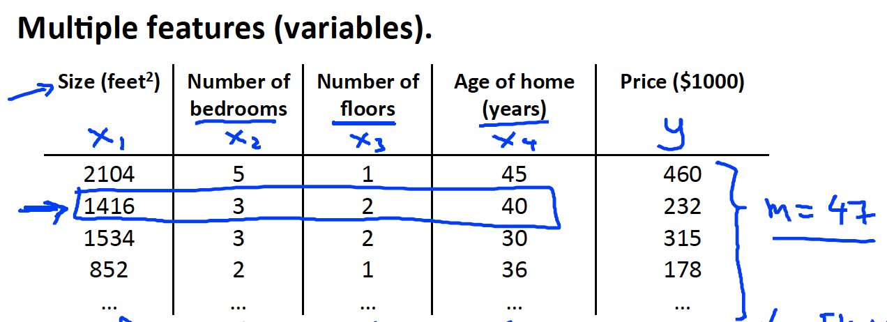

집 값(Price) 예시에서 집 크기(Size) Feature 외에 방 개수 (Number of bedrooms), 층 개수 (Number of floors), 집 연식 (Age of home) Feature를 추가해보았습니다. 각 Feature는 순서대로 x1, x2, x3, x4 로 표현됩니다.

### 가설함수의 형태 

이렇게 여러개의 Feature가 있는 경우에는 가설함수가 어떤 형태를 가지게 될까요?

우선, 1개의 Feature 만을 가지던 단일 선형회귀의 가설함수는 아래와 같았습니다 : 

h(x) = theta0 + theta1 x

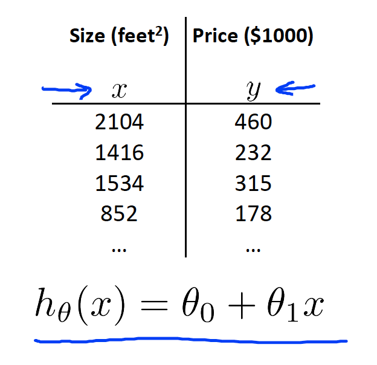

고려할 변수가 x 하나이기때문에 x값의 기울기를 결정하는 세타1과 높낮이를 결정하는 세타0만이 존재합니다.

총 4개의 피쳐를 가지는 경우에는 4개의 x에 대한 기울기를 결정하는 파라미터들이 필요합니다. 그에 따라 4개의 피쳐를 가지는 선형회귀 가설함수는 아래와 같이 정의됩니다 : 

h(x) = theta0 + theta1 x1 + theta2 x2 + theta3 x3 + theta4 x4

이어서 같은 흐름으로, n개의 피쳐를 가지는 선형회귀 가설함수를 정의해보겠습니다 :

h(x) = theta0 + theta1 x1 + ... + thetan xn
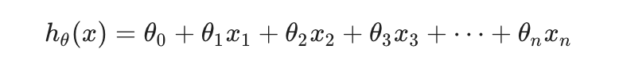

여기서 사실 숨겨진 x0가 있습니다. x0는 1입니다. 그래서 위 수식에는 theta0만 남아있는 것입니다. 이제 이 수식에 x0을 넣어보겠습니다 : 

h(x) = theta0 x0 + theta1 x1 + ... + thetan xn

이 수식은 행벡터 [theta0, theta1 ... thetan] * 열벡터 [x0;x1;....;xn] 과 동일합니다. 즉, theta^T X (theta transfer X)와 동일하다는 뜻입니다.

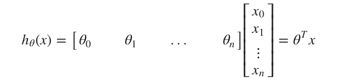

이제 여러개의 Feature를 가지는 선형회귀의 가설함수를 아래와 같이 축약하여 표현할 수 있게 되었습니다 : 

h(x) = theta^T X

이렇게 여러개의 Feature를 가지는 선형회귀를 **"다변량 선형회귀 (multivariate linear regression)"** 라고 부릅니다. 여기서 다변량(multivariate) 은 Y값을 예측하는 여러개의 feature 혹은 variable를 뜻하는 표현입니다.

## Gradient Descent for Multiple Variables

여러개의 피쳐를 가지는 선형회귀에서 경사 하강법 (Gradient Descent)을 어떻게 적용하는지 알아봅시다.

단일 선형회귀에서는 아래와 같이 진행됩니다:

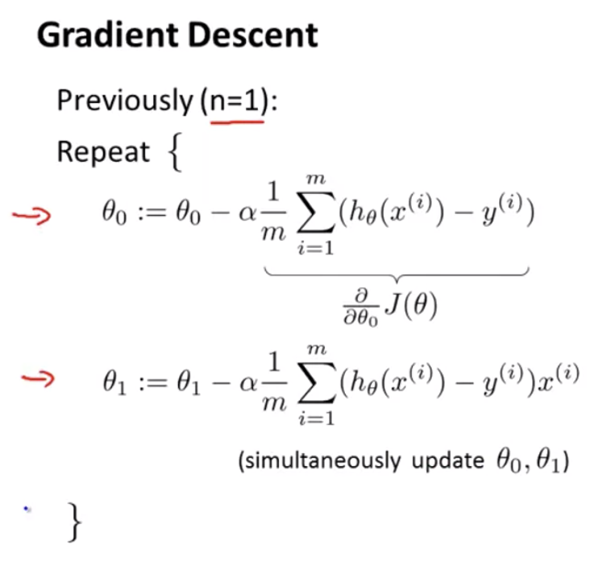

피쳐가 n개인 다변량 선형회귀에서는 아래의 우측과 같이 진행됩니다 : 

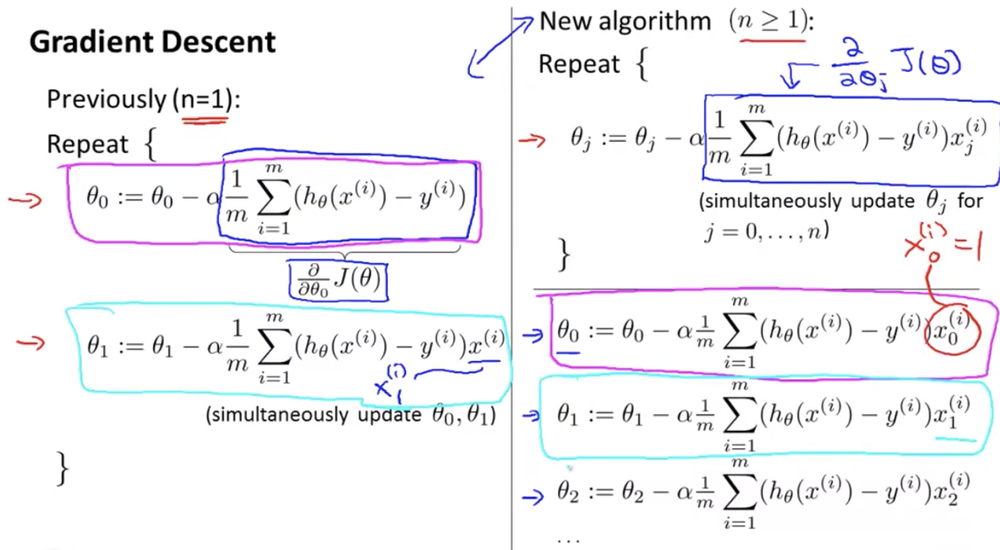

이는 결국 단일 선형회귀에서 표현했던 세타편미분 비용함수와 동일합니다. 실제로 0, 1을 대입해보면 단일 선형회귀의 공식과 동일함을 알 수 있죠.

이제 Gradient Descent를 잘 활용할 수 있는 몇가지 방법들을 살펴봅시다.

### Feature Scaling

여러개의 Feature + Feature의 단위크기가 비슷하다면 Gradient Descent는 더 적은 스텝으로 더 빠르게 수렴할 수 있습니다.

Feature Scaling은 서로 다른 Feature들을 비슷한 크기로 만들어서 빠르게 수렴하도록 만드는 방법입니다.

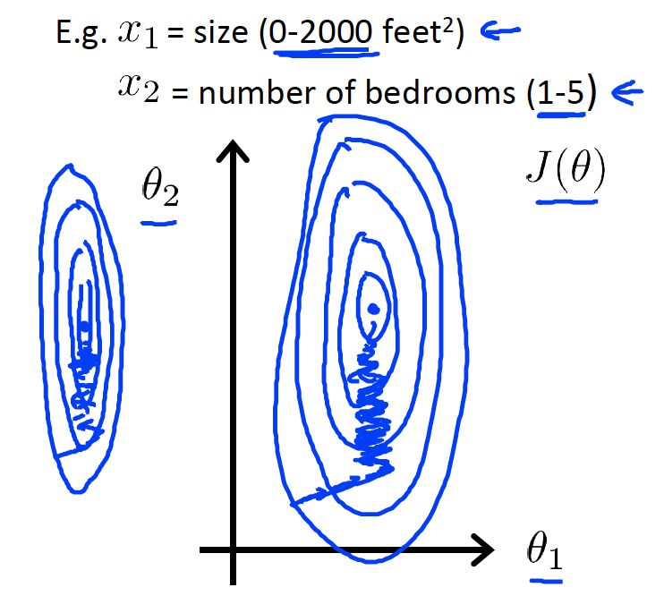

예를 들어 각 피쳐 세타0와 세타1의 크기가 달라 위와 같이 얇고 긴 등고선 그래프를 가지는 비용함수인 경우를 살펴볼까요? 이 경우에는 Gradient Descent 적용시 최소값을 찾아가는데 난해한 경로로 복잡한 궤도를 그려갑니다. 따라서 매우 많은 스텝이 필요하며 그에 따라 오랜 시간이 걸리게 됩니다.

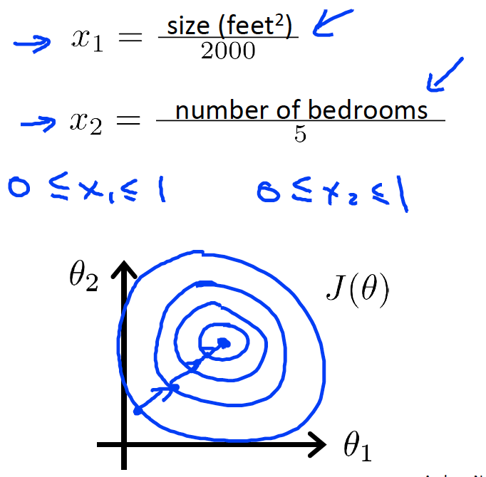

반면에 세타0과 세타1의 크기가 같거나 비슷해 위와 같이 동그란 등고선 그래프를 가지는 경우에는 상대적으로 짧은 스텝으로 최소값을 찾아가게 됩니다.

이렇게 피쳐들이 비슷한 크기 일수록 Gradient Descent의 성능이 좋아집니다. 하지만 모든 피쳐의 크기가 비슷하기는 당연히 현실적으로 어렵겠죠. 그래서 Feature Scaling을 통해 피쳐들의 크기를 맞춰주는 작업이 필요합니다.

보통은 Feature Scaling 시, 모든 피쳐가 대략 -1에서 +1 사이의 값을 가지도록 조정합니다. "대략" 이기 때문에 근사하기만 해도 됩니다. Feature가 정확하게 똑같은 범위나 크기가 아니더라도 걱정할 필요는 없습니다. 관련하여 아래 예시를 볼까요:

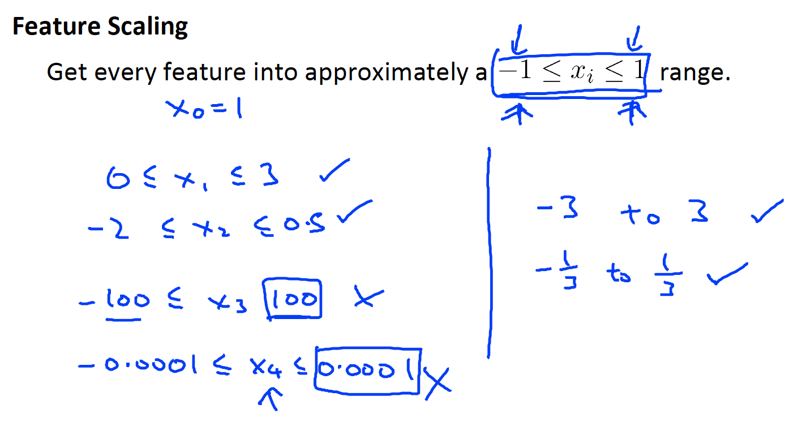

x1, x2는 "대략" -1에서 +1 사이를 가지므로 OK입니다. 하지만 x3, x4는 -1, +1보다 엄청 크거나 엄청 작은 값이기 때문에 좋은 피쳐가 아닙니다. 조정해야할 대상인 것이죠.

이제 Feature Scaling 기법을 알아봅시다.

#### Mean Normalization (평균 정규화)

Mean Normalization은 Feature의 평균이 대략 0이 되도록 피쳐들의 값을 조정하는 방식입니다.

x_i  = x_1 -  μ_i / s_1

=> 해당피쳐 - 평균 / 최대값 - 최소값

이렇게 하면 -0.5 < x < 0.5 으로 만들 수 있습니다.

보통 s_1은 표준편차를 쓰지만 최대값 - 최소값으로 사용해도 괜찮습니다.

뭔가 얼렁뚱땅인 느낌이 들 수 있겠지만 사실 Feature Scaling은 너무 정확할 필요는 없습니다. 그냥 Gradient Descent가 더 빨라지기만 하면 되기 때문이죠. :-) 

### Learning Rate (학습률, α)

디버깅을 통해 Gradient Descent가 제대로 동작하는지 확인해보고 Learning Rate 를 정하는 방법에 대해 살펴봅시다.

#### Debugging for Gradient Descent

다시 한번 언급해보자면, Gradient Descent의 목적은 Cost Function (비용함수)의 값을 최소화할 수 있는 파라미터(세타)의 값을 찾는 것입니다.

위 그래프에서 x 축은 경사 하강 반복 횟수, y축은 찾아낸 비용함수의 최소값입니다. 횟수가 늘어날수록 찾아낸 비용함수의 최소값은 감소합니다. 매 반복시마다 조금씩 줄어들지만 300~400 회 구간쯤은 거의 변화가 없음을 알 수 있습니다. => 거의 수렴하였다. 

수렴하는데에 필요한 반복횟수는 정해져있는 것은 아니고, 경우에 따라 다르기 때문에 Gradient Descent 가 수렴하는데 얼마나 반복해야하는지 사전에 알기 어렵습니다. 그래서 위와 같이 비용함수와의 그래프를 그려 눈으로 확인하게 되는데요. 이를 자동화하여 지금 Gradient Descent가 수렴하는지 아닌지 자동으로 검사해주는 알고리즘인 automatic convergence test 가 있습니다.

Automatic Convergence Test는 0.0001과 같이 어떤 작은 값을 임계값으로 설정하고 비용함수의 감소량이 그 값보다 작을때 알려주는 방식입니다. 하지만 앤드류 응 교수님께서는 이 임계값을 결정하기도 꽤나 어렵다보니 실제로 그래프를 주로 그려 확인하고 Auttomatic Convergence Test 는 잘 사용하지 않는다고 하십니다. 그래도 임계값만 잘 설정한다면 꽤나 편리한 방법일 것으로 보여지네요 :-)

#### Learning Rate 정하기

선형회귀에서 Learning Rate가 적절하게 작으면 비용함수 J는 매 반복마다 감소합니다. 그러므로 감소하지 않는다면 현재 설정된 Learning Rate가 너무 크다는 뜻이겠죠.

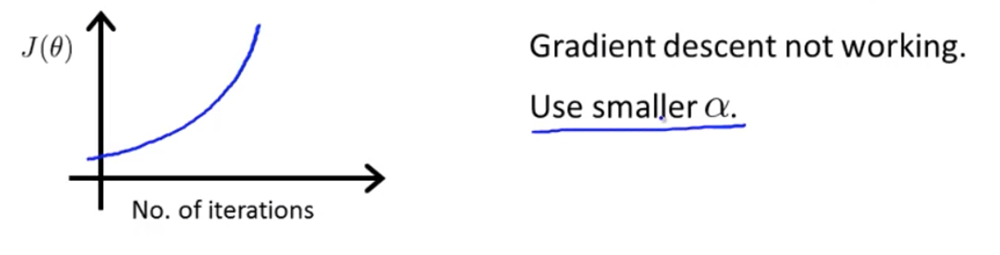

만약 그래프가 위와 같이 그려진다면 경사 하강 반복시마다 최소값이 증가하고있는 것이므로 Gradient Descent가 제대로 동작하고 있지 않다는 뜻입니다. 이럴 때에는 학습률을 좀 더 작게 설정해야 합니다.

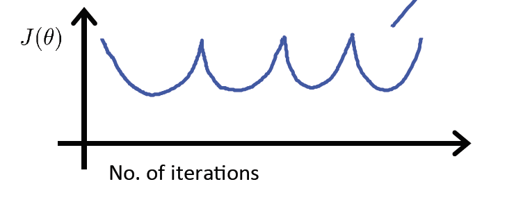

위와 같이 올라갔다 내려갔다를 반복하는 경우에도 Gradient Descent가 제대로 동작하고 있지 않다는 뜻입니다. 이 경우에도 학습률을 좀 더 작게 설정해주면 해결됩니다.

물론 Learning Rate를 너무 작게 설정하면 너무 천천히 수렴하게 되므로 이것 또한 지양해야 합니다.

잠시 퀴즈를 풀어봅시다. 

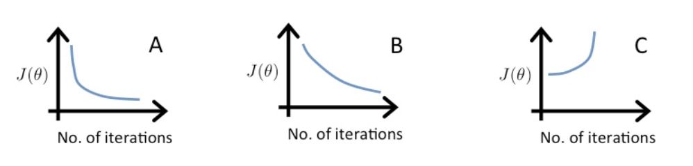

위 그래프들은 학습률이 0.01, 0.1, 1로 구성된 그래프들입니다. 각 그래프를 세가지 학습률에 매칭시켜봅시다! 

우선 C 그래프는 값이 증가하고 있네요. Learning Rate가 크다는 뜻입니다. 셋중에 가장 큰 값인 1을 Learning Rate로 가짐을 유추할 수 있습니다.

A, B 그래프는 둘 다 최소값을 잘 찾아가고 있습니다. 다만 B 그래프는 A 그래프에 비해 최소값을 찾아가는 속도가 느리네요. Learning Rate가 상대적으로 더 작음을 알 수 있습니다. 즉, A가 0.1, B가 0.01을 Learning Rate로 가짐을 유추할 수 있겠죠 :-)

학습률에 대해 정리해보자면,

* Learning Rate가 너무 작으면 : 천천히 수렴한다
* Learning Rate가 너무 크면 : 매 반복시 비용함수가 감소/수렴하지 않는다. 심하면 증가한다.

그렇다면 Learning Rate로 설정할 값 후보군은 어떻게 정할까요? 보통은 Learning Rate를 선택할 때 0.001, 0.003, 0.01, 0.03, 0.1, 0.3, 1 과 같이 각 3배만큼 차이나도록 후보군을 만들고 그래프를 그려서 비용함수가 빠르게 감소하는 Learning Rate를 선택합니다. 약간의 수작업이 필요하지만 아직까지는 이런 방법이 더 효과적인 듯 하네요 :-)

## Features and Polynomial Regression

Feature를 적절하게 선택함으로서 강력한 학습 알고리즘을 만드는 방법에 대해 알아봅시다.

집 예시)

집의 너비 (가로 길이), 집의 깊이(세로 길이)

새로운 피쳐를 만들어도 된다. 집의 면적 = 너비 * 깊이 <= 이 피쳐 하나로 단일 선형회귀를 만들어 좀 더 단순화 시킬 수 있다.

이와 같이 반드시 기존 피쳐를 그대로 사용할 필요는 없다. 경우에 따라 새로운 피쳐를 만들어 더 좋은 모델을 만들 수 있다.

### Polynomial Regression

Polynomial Regression (다항 회귀) - 선형 회귀를 이용하여 복잡한 비선형 함수에도 적용하는 것

집값 예시

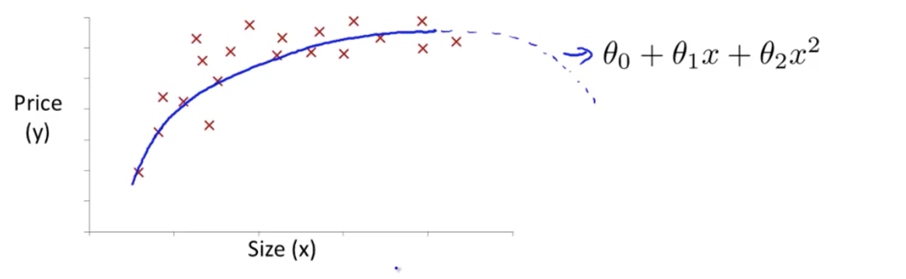

위 그래프는 2차 함수로 표현될 수 있음

하지만 집값은 보통 사이즈에 따라 상승하게되는데... 2차 함수그래프는 볼록하게 그려지기 때문에 제대로 표현한다고 보기 어렵다.

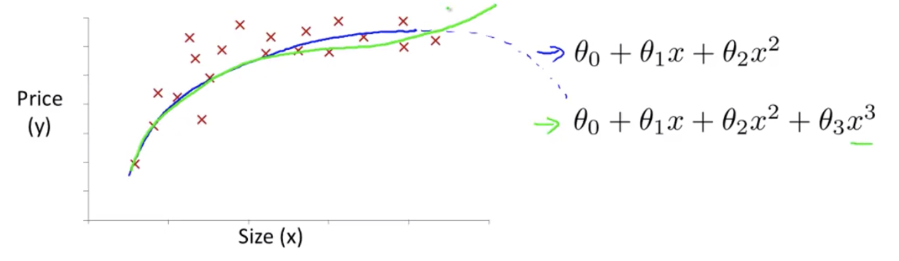

3차 함수 그래프로 표현하면 위와같이 데이터를 적합하게 잘 표현할 수 있게 된다.

이 3차함수 그래프는 아래와 같이 다변량 선형회귀 가설로 표현될 수 있다.

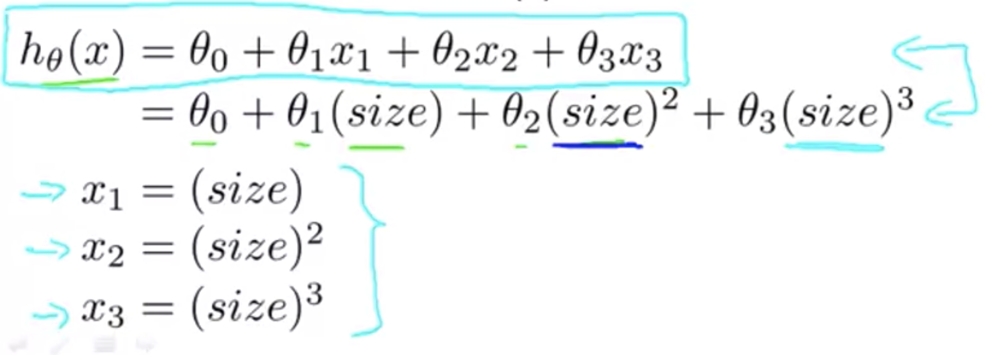

x1 = 1차 x, x2 = 2차 x, x3 = 3차 x 로 표현되었을 뿐 동일한 형태이다.

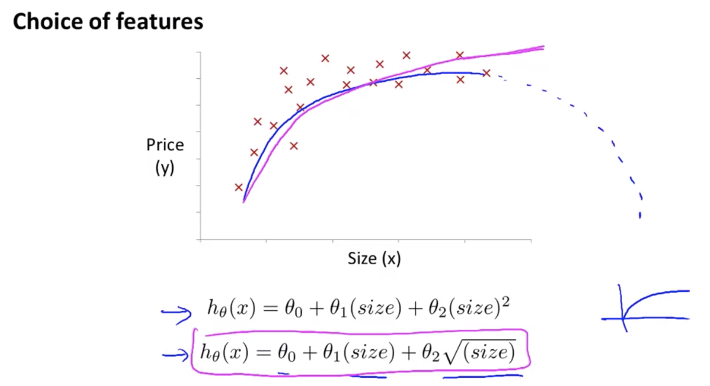

집 값 그래프를 표현하는 또 다른 방법은 2차항에서 제곱근을 사용하는 방법이다. 이렇게 하면 3차항으로 까지 갈 필요없이 적합한 모델을 그릴 수 있게 된다. 물론 그래프의 모양이 3차함수때와는 조금 다르지만 S자 곡선을 그리는 것보다는 완만하게 증가하는 형태가 좀 더 현실적인 듯 하다.

다항식을 어떻게 데이터에 맞게 표현하는지를 배웠다. 그리고 피쳐를 사용하는 방법도 다양하다는 것도 배웠다. 

이제 어떤 피쳐를 사용할지 자동으로 골라주는 알고리즘에 대해 배워보자. 이 알고리즘은 데이터를 보고 자동으로 2차함수, 3차함수 등 여러 함수들 중 알맞은 것은 선택한다.

