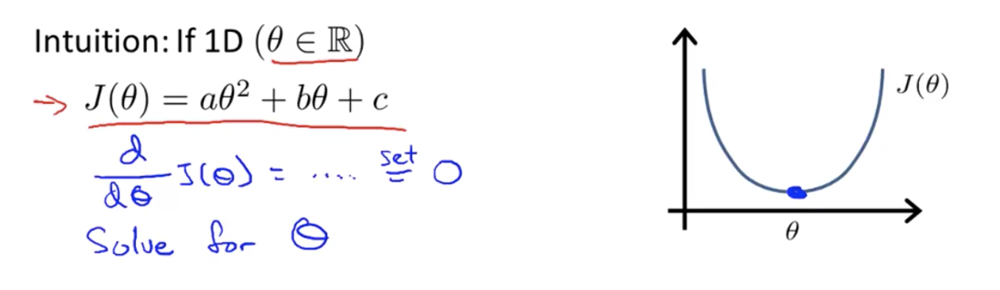
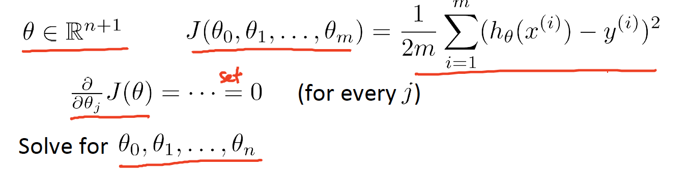
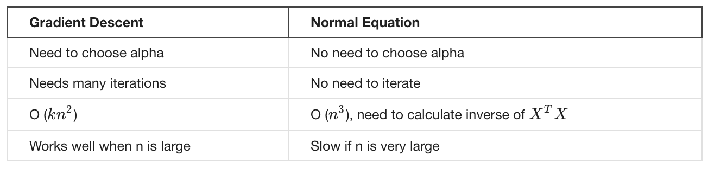

Coursera의 유명 강의, Andrew Ng 교수님의 Machine Learning 를 들으며 정리한 개인 학습자료입니다.

# W2-2. Computing Parameters Analytically

## Normal Equation (정규 방정식)

Normal Equation은 선형 회귀 문제에서 최적의 파라미터 값을 구하는데 효과적인 방법입니다.

Gradient Descent 의 경우에는 비용함수 J의 값을 최소화하는 파라미터(세타)를 구하기위해 수차례에 걸쳐 계산 반복합니다. 하지만 Normal Equation은 파라미터의 값을 분석적으로 구하는 방법으로서 **최적의 파라미터 값을 한 번에 구할 수 있습니다.**

Normal Equation의 개념을 알아보자.

세타가 스칼라인 경우)

2차함수를 최소화 하는 방법 => 미분하여 값이 0인 지점의 세타값

세타가 벡터인 경우)

각각 모든 파라미터에 대해 차례차례 미분하고 모두 0이 되게하면 모든 파라미터에 대한 답을 구할 수 있다. 그때의 파라미터를 대입하면 비용함수 J를 최소화 할 수 있다.

데이터가 4개(m=4)인 경우의 예시를 살펴보자.

feature는 x1, x2, x3, x4로서 총 4개(n=4)이다. 

피쳐들의 데이터를 나타내는 행렬인 X는 m x (n+1)

Y는 = m 차원의 벡터 (m x 1)

여기서 계산되는 세타의 값(`pinv(X' * X) * X' * y`)이 비용함수를 최소화하는 값이다.

### Gradient Descent vs Normal Equation

Normal Equation을 사용하면 Feature Scaling이 필요없다. 왜냐하면 피쳐 값 그대로 즉각적인 계산을 수행하기 때문이다. 물론 Gradient Descent를 사용할 때에는 Feature Scaling이 필요하다.

* Gradient Descent
  * Learning Rate를 정해야 한다.
  * 여러 반복을 수행하며 수렴을 확인해야 한다.
  * feature가 많아도 잘 동작한다 (n의 개수가 커도 잘 동작함)
* Normal Equation
  * Learning Rate를 정할 필요가 없어서 편리하고 구현이 간단하다
  * 반복이 없다. 비용함수를 그리거나 수렴을 확인하는 작업이 필요 없다.
  * X transpose X의 역행렬을 계산해야 한다. (n x n 행렬) => O(n^3)
  * feature의 수가 많으면 매우 느려진다.

n의 크기가 작다면 Normal Equation을, n의 크기가 크다면 Gradient Descent를 사용하는 것이 더 낫다 :-)

n=100, 1000 => Normal Equation

n = 10^5 부터는 Normal equation이 좀 느려지기 시작함 But 쓸만하다.

n = 10^6 부터는 => Gradient Descent

분류 알고리즘 중 Logistic Regression 과 같이 정교한 학습 알고리즘에 Normal Equation은 적합하지 않다. Gradient Descent는 복잡한 알고리즘에도 적용이 가능하므로 매우 유용한 알고리즘이다. 선형회귀에서도 매우 많은 Feature를 가지는 경우가 많기 때문에 Gradient Descent를 더 많이 사용하긴한다. 그래도 특정 모델에 대해서는 Normal Equation이 더 빠르기도 하므로 두가지 알고리즘 모두 알아두는 편이 좋다.

## Normal Equation Noninvertibility (정규 방정식 비가역성)

역행렬이 없는 경우에 대해 살펴보자. 약간 어려울 수 있으나 이해를 하지 못하더라도 정규방정식을 사용하거나 선형회귀를 하는데에는 큰 지장은 없을 것이다.

역행렬을 구할 수 있는 행렬은 한정적이지만 X transpose X의 역행렬이 존재하지 않는 경우는 거의 없다. 

### X transpose X의 역행렬이 존재하지 않는 경우

* 불필요한 Feature를 가지고 있는 경우
* 비슷한 속성을 나타내는 피쳐를 지운다. (예 : feet^2와 m^2 둘 다 존재하는 경우, 둘 다 크기를 나타내는 속성이므로 하나를 지운다. => 두 피쳐간에 선형관계가 존재하면 지운다)
* 너무 많은 피쳐를 가지고 있는 경우 (데이터 개수(m) <= 피쳐 개수(n))

  * 피쳐개수보다 데이터개수가 더 적으면 피쳐를 표현하기에는 데이터가 충분하지 않다.
  * 피쳐 몇가지를 없애거나 Regularization(정규화)을 한다.

Octave에서 `pinv` 함수를 사용하면 역행렬이 존재하지 않더라도 정상적으로 계산을 진행해준다.

## 참고자료

* [Linear regression을 처리하는 또 다른 방법 (Normal Equation)](https://daeson.tistory.com/172)