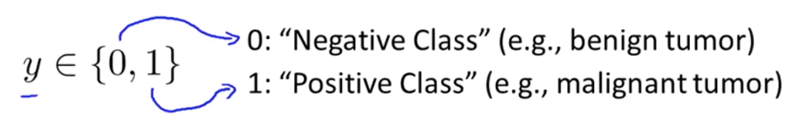
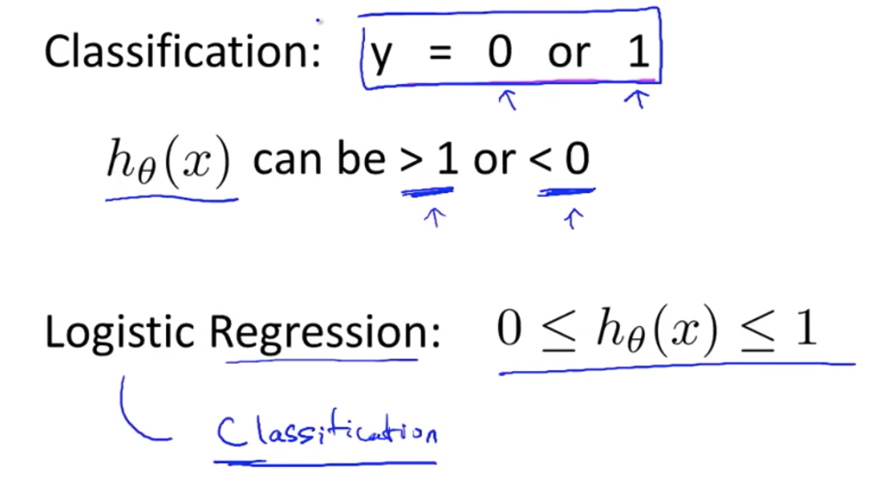
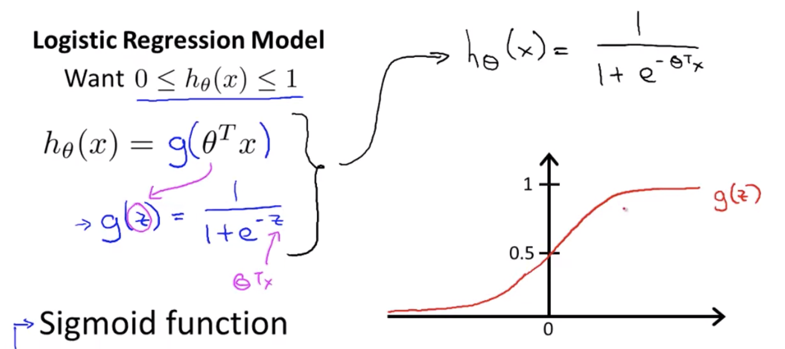
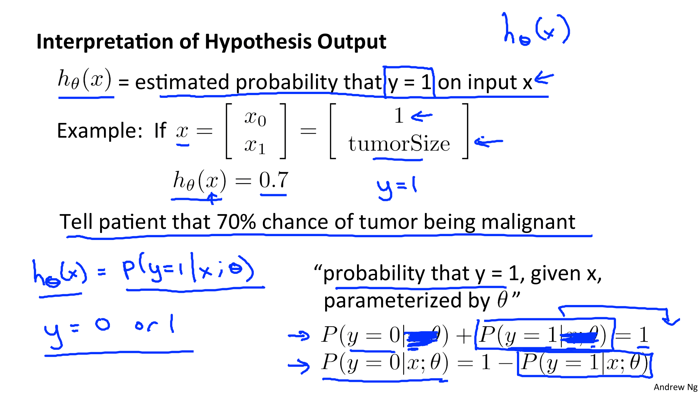

Coursera의 유명 강의, Andrew Ng 교수님의 Machine Learning 를 들으며 정리한 개인 학습자료입니다.

# W3-1. Classification and Representation

예측하고자 하는 y변수가 이산형 값 (discrete valued) 을 가지는 경우에 대해 알아봅시다.

## Classification (분류)

여러가지로 분류하는 다중 분류 (multiclass classification) 문제를 다루기 전에 일단 2가지 종류로 분류하는 이진 분류 (binary classification) 의 과정을 알아보자.

### 이진 분류 문제

다음은 2가지 종류로 분류되는 문제들의 예시이다 : 

* 스팸 이메일 vs 일반 이메일
* 사기 거래 vs 정상 거래
* 악성 종양 vs 양성 종양

이중에서 악성 종양 여부를 판단하는 문제로 이진 분류를 살펴보자.

<악성 종양 그래프 스샷>

데이터가 추가됨에 따라 직선이 변경되는데 매우매우 부정확해지는 것을 볼 수 있음.

위와 같은 이슈로 인해 선형회귀를 분류문제에 적용하는 것은 좋은 생각이 아니다. 

이진 분류 문제에서는 y가 0 또는 1이어야 한다. 하지만 선형 회귀를 적용하면 값이 1보다 훨씬 크거나 0보다 작을 수 있다. 학습데이터가 0과 1으로만 이루어져 있을지라도 그러하다.

그래서 로지스틱 회귀가 제안되었다. 로지스틱 회귀를 적용하면 가설의 값은 언제나 0과 1사이가 되기 때문에 분류문제를 푸는데에 아주 적합한 알고리즘이다!

이름이 "회귀"로 되어있어 혼란스러울 수 있지만 이는 그냥 역사적으로 정해진(?) 이름이라고 한다. 로지스틱 회귀는 회귀이지만 분류 알고리즘을 뜻한다!

이제 로지스틱 회귀에 대해 알아보도록 하자 :-)

## Hypothesis Representation

로지스틱 회귀의 표현 모델. 분류 문제를 풀 때 우리의 가설을 표현하기 위해 사용할 함수 h.

### Sigmoide function (시그모이드 함수, 로지스틱 함수)

g(z) = 1 / 1+e^-z

지금까지 로지스틱 가설 모형을 알아봤다. 

이제 로지스틱 회귀분석의 가설함수의 형태를 알아보자!

## Decision Boundary (결정 경계)

헉.. 영어다ㅠ

일단 y=1, y=0을 결정하는 경계선을 구하는 가설함수를 정의하는 내용임.

