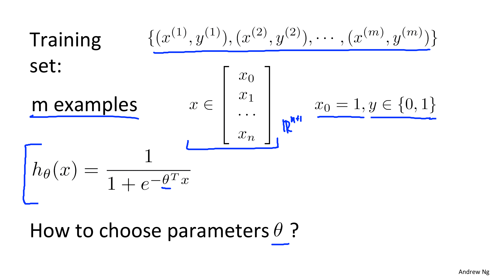
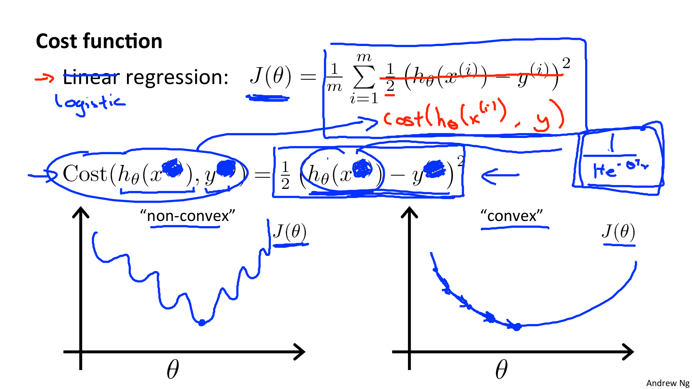
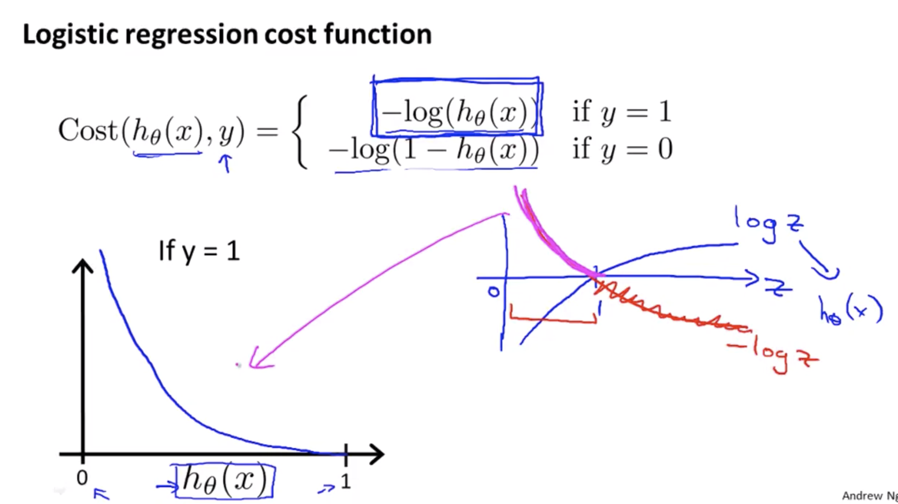
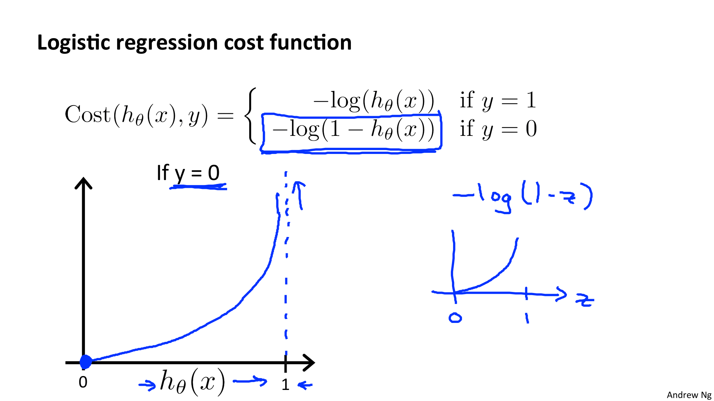
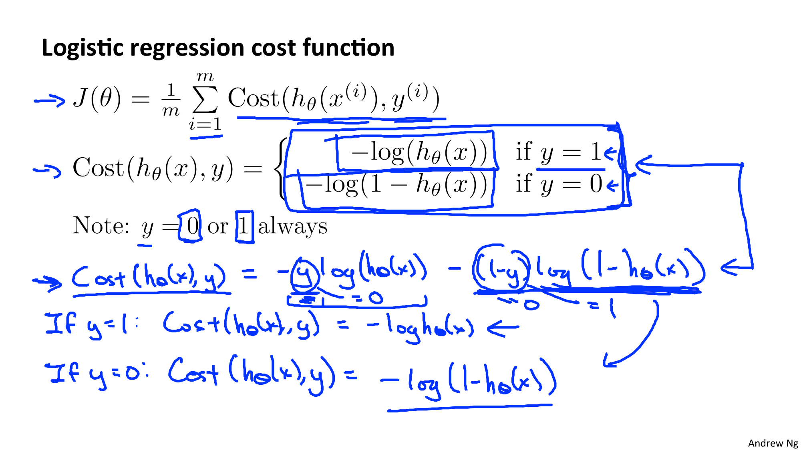
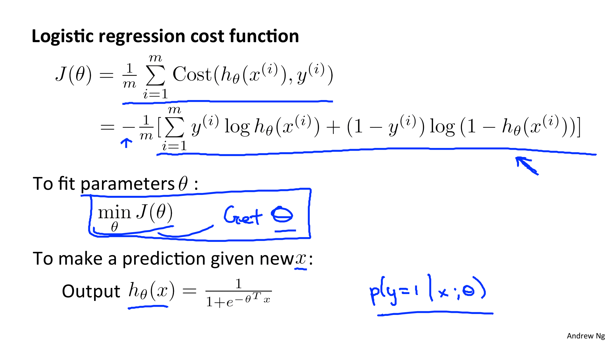
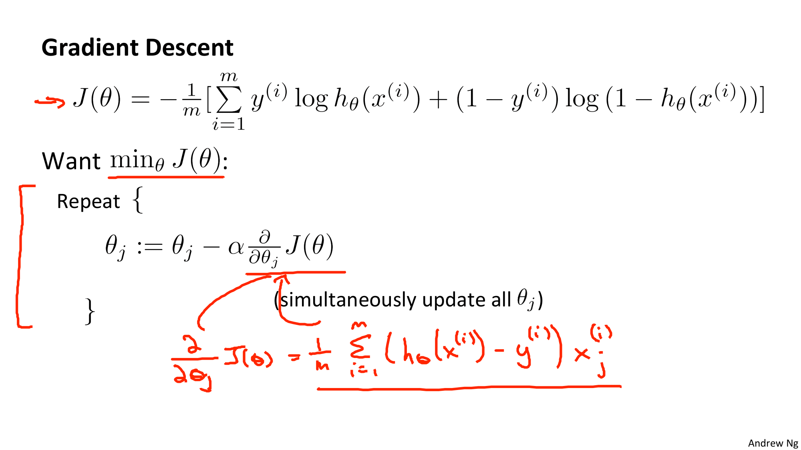
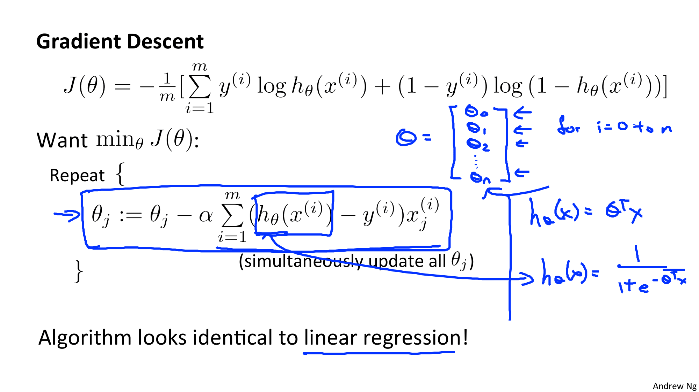
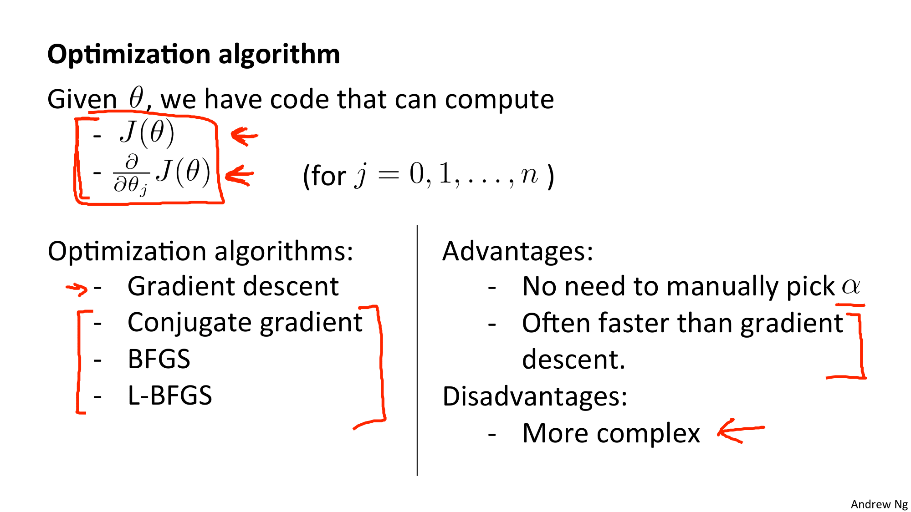

Coursera의 유명 강의, Andrew Ng 교수님의 Machine Learning 를 들으며 정리한 개인 학습자료입니다.

# W3-2. Logistic Regression Model

## Cost Function (비용 함수)

로지스틱 회귀에서는 어떻게 적합한 매개변수 세타 값을 찾아내는지 알아보자.

* m : 학습 예제의 수
* n + 1 차원

먼저 Linear Reggression의 경우를 살펴보자:

Linear Regression 의 비용함수를 살짝 다르게 표현해보면 위와 같이 Cost(h(x), y)로 표현할 수 있다. 이는 오차의 제곱에 1/2를 곱한 것이다.

이 비용함수는 선형회귀를 다룰 때에는 큰 문제가 없었다. 하지만 로지스틱 회귀를 하는 경우에는 문제가 된다. 매개변수 세타에 대해 그래프가 볼록하지 않다. (non-convex)

* 비볼록함수 (non-convex) : 국소점이 매우 많다. => 전체 함수의 최소값에 도달할 수 있다는 보장이 없다.

* 볼록함수 (convex) : 반드시 전체함수의 최소값에 도달하게 된다.

로지스틱 회귀에서 오차가 제곱된 비용함수를 사용함으로서 생기는 문제점
=> 가운데 있는 h가 비선형 함수(1/1+e^세타전함수x)이기 때문에 비볼록 함수가 된다.
=> 다른 비용함수가 필요하다

비용함수는 "알고리즘이 지불해야하는 값"을 도출하는 함수이다.

y=1일때에 대한 새로운 비용함수 그래프를 그려보면 위 그래프처럼 그려진다.

=> y를 0이라 예측하게되면 무한대에 가까운 엄청난 비용을 지불하게 된다.

y=0 일때에 대한 새로운 비용함수 그래프를 그려보면 위 그래프처럼 그려진다.

=> y를 1이라 예측하게되면 무한대에 가까운 엄청난 비용을 지불하게 된다.

## Simplified Cost Function and Gradient Descent

비용함수를 좀 더 간단하게 사용하는 방법에 대해 알아보고 Gradient Descent를 적용하여 로직스틱 회귀의 매개변수를 피팅하는 방법을 알아보자.

비용함수를 더욱 간단하게 적으면 `-y*log(h(x)) - (1-y) * log(1-h(x))` 이다.

-를 기준으로 각 항은 y값이 0, 1일 때 사라지므로 비용함수와 동일한 것이다. (y=1, y=1의 두 식을 함축하였다)

### 최대 우도 측정법 (maximum likelihood estimation)

서로 다른 모델에 대한 매개변수를 효율적으로 찾는 방법에 대한 통계에서 나온 아이디어.

이 비용함수는 볼록(convex)한 특성을 가진다.

=> 로지스틱 회귀 모형을 적용할 때 필수적으로 사용하는 비용함수이다.

### Gradient Descent

Gradient Descent 공식은 선형회귀 시와 동일하다.

하지만 로지스틱 회귀에서는 h(x) 함수가 달라지므로 값은 당연히 달라진다.

## Advanced Optimization

또 영어자막이다.. 흑흑ㅠ 한국어 번역가분들 힘내세요..ㅠㅠㅠ

최적화 알고리즘에 대한 이야기 (계산이 복잡해지니까)

