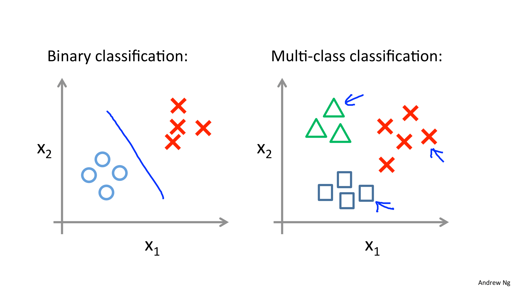

Coursera의 유명 강의, Andrew Ng 교수님의 Machine Learning 를 들으며 정리한 개인 학습자료입니다.

# W3-3. Multiclass Classification

멀티클래스 분류 문제에 대해 로지스틱 회귀를 어떻게 적용하는지 설명해보자.

y = 0, y = 1 로만 구분되던 분류에서 더 나아가 y = 2, y =3 등이 생겨남

결과값이 여러개로 분류되는 문제 예시 :

* 이메일을 폴더별로 구분하는 경우 : Work, Home, Business, Friend
* 의학적 진단 : 병에걸리지 않음, 감기, 독감
* 날씨 : Sunny, Cloudy, Rain, Snow

이진 분류에서는 직선으로 구분가능하기도 했음. 

## One vs All (One vs Rest)

one vs all 방법을 사용하여 이진분류에서의 방식을 멀티클래스 분류에도 적용할 수 있다. 즉, 하나의 집단과 나머지를 분류하는 것을 여러번 반복함으로서 여러개의 집단을 분류해내는 방식이다.

위 멀티클래스 분류 문제를 세가지의 바이너리 분류 문제로 바꿔보면 오른쪽과 같다!

이렇게 이진 분류의 로지스틱 회귀를 세번 반복하면 세가지의 분류를 Fitting할 수 있게 된다.

세개의 가설을 새로운 x에 대해 전부 돌려보고 최대값이 나오는 i를 구하면 된다.

세개의 h 중 가장 신뢰가 높고 가장 열정적으로 이것이 올바른 클래스다라고 말하는 가설을 선택한다. ㅋㅋㅋㅋ해석왜이러징

 

