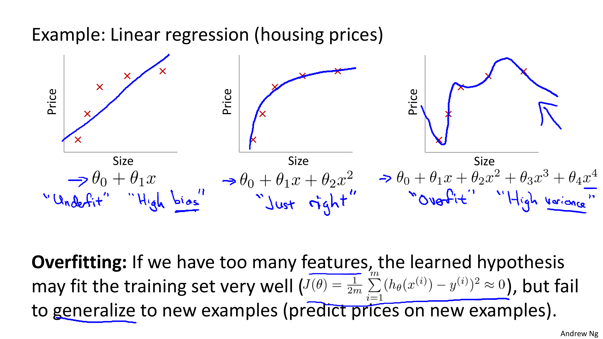
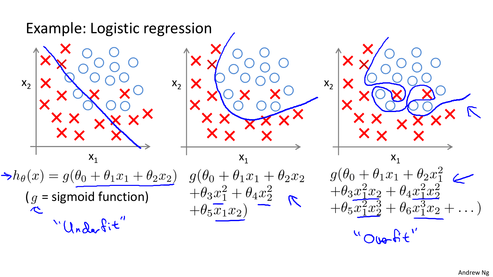
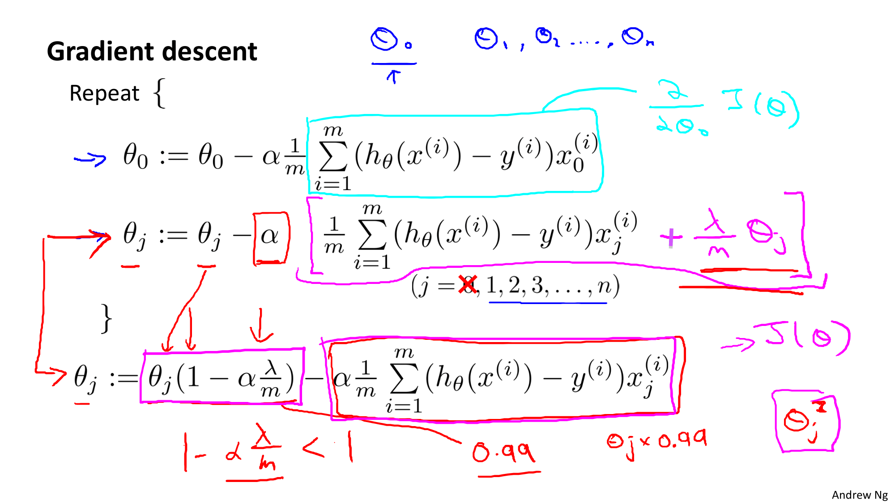
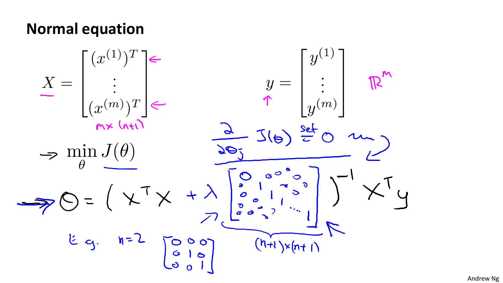
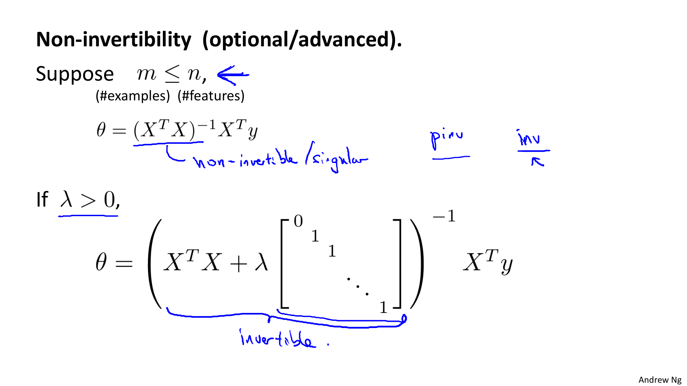

Coursera의 유명 강의, Andrew Ng 교수님의 Machine Learning 를 들으며 정리한 개인 학습자료입니다.

# W3-4. Solving the Problem of Overfitting

학습 시, 과적합 문제에 빠지면 알고리즘의 성능이 잘 나오지 않을 수 있다. 과적합이 무엇인지와 이를 해결하기 위해 정규화(regularization) 기술에 대해 알아보자.

## Regularization : The problem of overfitting

Overfitting 이란, 너무 많은 피쳐를 가지고 있을 때 학습된 가설이 학습용 데이터에 매우 잘 적합되지만 새로운 데이터에 대해 일반화하여 예측하는 것에는 실패하는 경우를 뜻한다.

먼저 선형회귀에서의 예시를 보자:

 

* 첫번째 그래프 - Underfitting : 강한 편향 High Bias (강한 선입견 High Preconception)
  * 모델이 데이터에 잘 맞지 않는다.

* 두번째 그래프 - 올바른 학습 (적당)
* 세번째 그래프 - Overfitting : 높은 분산 High Varience
  * 학습 데이터에 너무나 알맞게 학습되어 예측력이 떨어지는 경우

다음은 로지스틱 회귀의 예시이다:

 

그렇다면 학습중에 어떻게 과적합인지를 알 수 있을까? 일단 간단한 방법으로는 그래프를 그려보며 무슨일이 일어나는지 보면서 적당한 다항식을 선택하는 방법이 있다.

피쳐가 많아지면(차수가 너무 깊어지면) 그래프로 그리기도 힘들어진다. 하여.. 보통 피쳐가 너무 많은데 학습데이터는 적은 경우에 과적합이 발생한다.

1. 피쳐의 개수를 줄인다. (Reduce number of Features)

   * 어떤 피쳐를 남길지 직접 정하기
   * 모델을 선택하는 알고리즘 (Model Selection Algorithm)

2. 정규화 시키기 (Regularization)

   * 모든 피쳐들을 남기되 피쳐들의 영향 규모를 줄인다. (=세타값이 미치는 영향을 줄인다)

     => 과적합 해결에 매우 적합함

## Regularization - Cost Function

정규화의 작동 방식에 대한 주요 흐름을 알아보고 정규화를 할 때 사용하는 비용함수에 대해 알아보자.

<스샷 + 람다붙은거>

정규화시에 사용하는 비용함수는 위와 같이 매우 작은 값을 형성하는 값을 추가한다. 이를 적용하면 아래와 같이 과적합되지 않은 완만한 곡선이 그려진다.

* 람다값이 극단적으로 큰 값이면 underfitting이 생긴다.

영어의 벽..^^... 일단 듣고 이해는 했다.....흑

when lambda is set to 1, we use regularization to penalize large values of theta. Thus, the params, theta, obtained will in general have smaller values. 

## Regularization - Regularized linear regression

선형 회귀 정규화하기

아니 왜 다 영어야 흑흑... 내가 번역할까..ㅠㅠ

### Normal Equation

### [가역행렬 (Non-invertibility Matrix)](https://ko.wikipedia.org/wiki/가역행렬)

## Regularization - Regularized logistic regression

로지스틱 회귀 정규화하기

