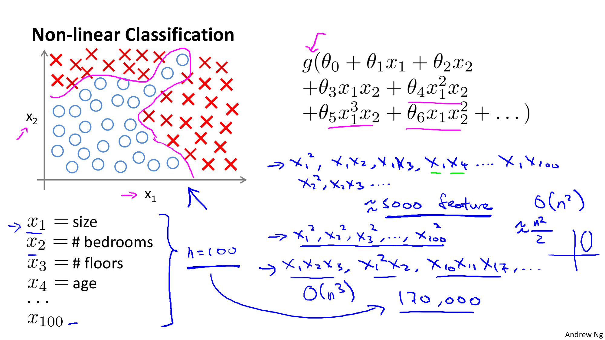
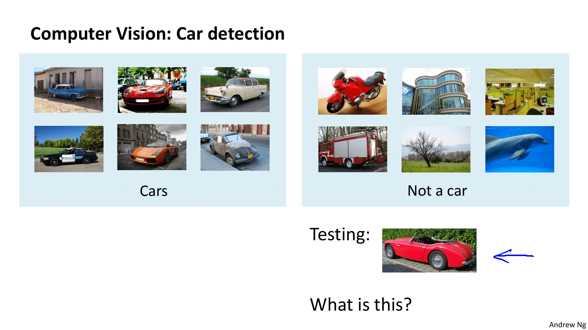
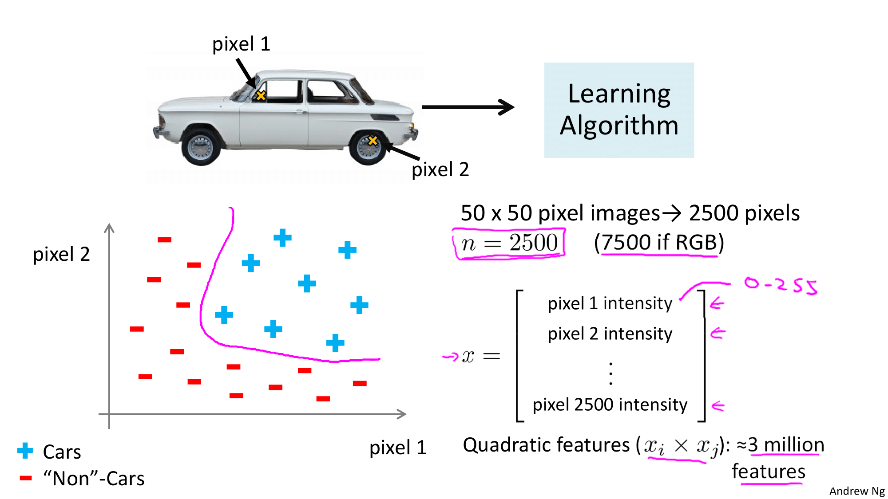

Coursera의 유명 강의, Andrew Ng 교수님의 Machine Learning 를 들으며 정리한 개인 학습자료입니다.

# W4. Neural Networks: Representation

신경망(Neural Network) 학습 알고리즘은 오래전에 제시되었으나 주목을 받지 못했던 알고리즘입니다. 오늘날에는 신경망 알고리즘을 동작시키기 위한 환경들이 만들어져 다양한 분야에 적용하여 높은 성능을 이끌어내고 있는데요. 그럼 신경망 알고리즘에 대해 알아봅시다.

# W4-1. Motivations

선형회귀, 로직스틱 회귀가 존재함에도 왜 Neural Network 학습 알고리즘을 필요로 하는 걸까요? 이제 왜 Neural Network가 필요한 것인지, 어떻게 동작하는 것인지에 대해 알아봅시다.

## Non-linear Hypotheses (비선형 가설)

### 지도 학습 분류 문제에서의 비선형 가설

로지스틱 회귀를 적용

g함수 = 시그모이드 = 수많은 다항식들을 포함할 수 있음

충분한 수의 다항식이 추가 되면 분류가능. 

지금까지는 2가지 분류인 경우임

여러가지 종류... 100가지 종류를 분류해야하는 경우를 생각해보면 다항식이 정말 미친듯이 길어지고 차수가 심하게 증가함

피쳐수가 너무 많아져서 훈련데이터에 너무 과하게 적합하는 오버피팅이 발생할 위험이 큼

=> 부분집합만 고려하기로해서 제곱항만 가지고 분류한다고해도 타원이 그려져 제대로 분류하지 못함

=> n이 커질수록 매우 커짐

### 컴퓨터 비전에서의 비선형 가설

자동차와 자동차가 아닌 것들의 사진으로 학습을 시킨 후, 새로운 자동차 사진을 입력하였을때, 그것이 자동차인지 아닌지를 맞추는 문제를 예시로 살펴보자.

이미지의 크기가 50x50px 이라 가정하면 총 2500px이 존재하므로 n = 2500이다. (RGB를 사용하면 n=7500임... 일단 간단한 예시를 위해 픽셀로!)

픽셀의 밝기를 피쳐로 사용하여 X를 만들었다. 모든 이차 요소들을 포함하는 비선형 가설을 학습하려하면 xi * xj이므로... 2500픽셀이 3백만개에 달하는 요소항으로 늘어난다. => 너무 많음 => 매번 300만개의 특징을 찾고 연산.. .=> 오래걸림 

<quiz!>

이제까지 알아본 바와 같이 이차, 삼차 특징들과 함께 n이 클때 복잡한 비선형 가설을 학습하는데 로지스틱 회귀를 사용하는 것은 적합하지 않다. (너무 피쳐와 요소항들이 많기 때문)

신경망 알고리즘은 피쳐 공간(n)이 큰 복잡한 비선형 가설을 학습하는데 훨씬 좋은 방법이다!

## Neurons and the Brain

신경망 알고리즘은 뇌를 모방할 수 있는 기계를 만들기 위해 고안된 아주 오래된 알고리즘이다. 이는 기계학습에서 매우 잘 동작하지만 논리적이지는 않다. 80년대~90년대 초에 매우 넓게 사용되었으나 90년대 후반에 인기가 줄어들었고 최근 컴퓨터 성능이 매우 좋아지며 다시 부상하게 되었다. 이와 같은 흐름에서도 알 수 있듯이, 신경망 알고리즘은 비용이 꽤 큰 알고리즘이다.

