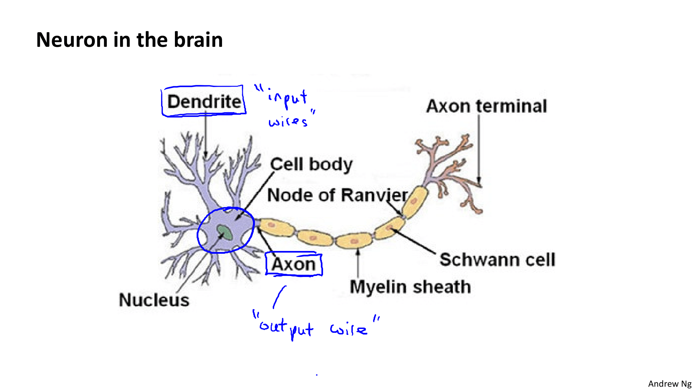
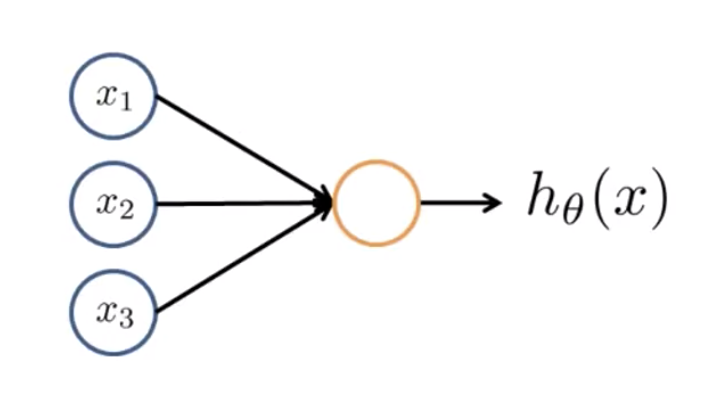
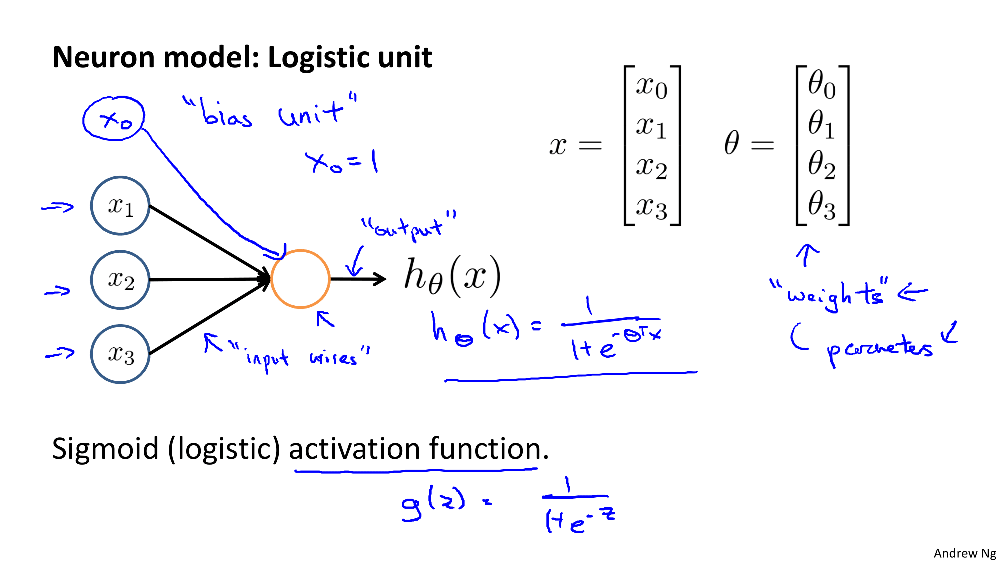
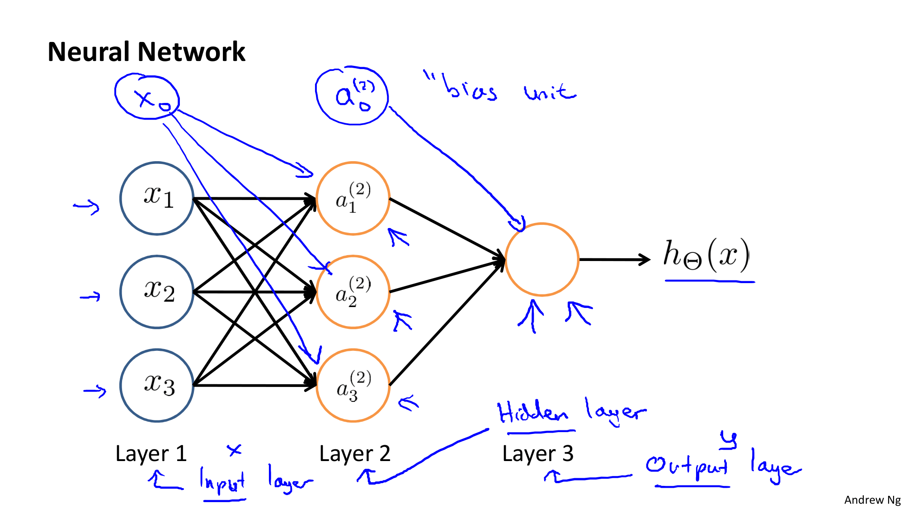
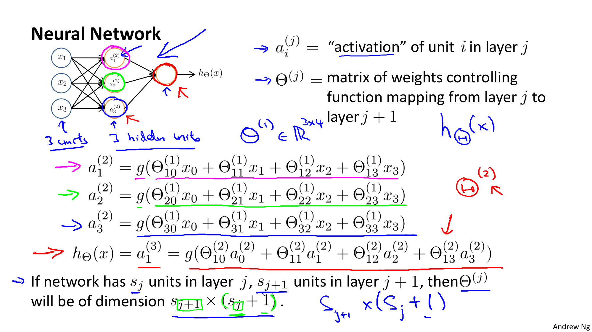
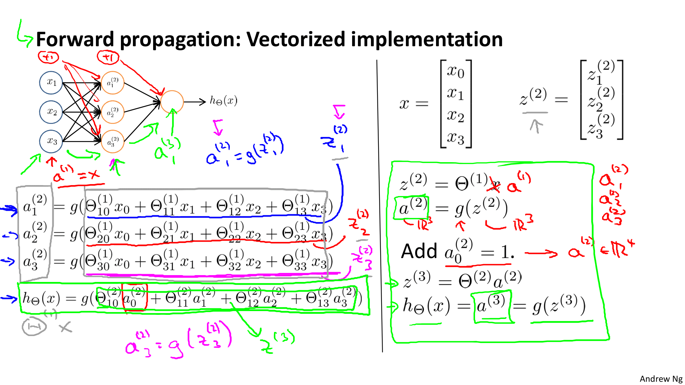
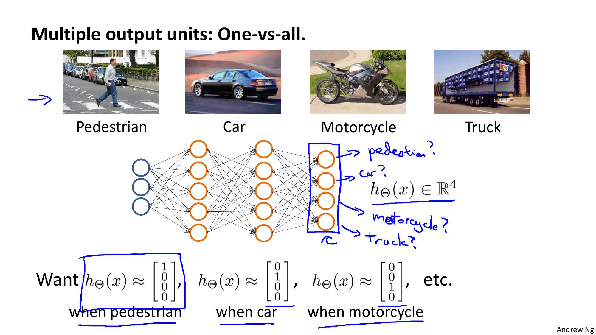

Coursera의 유명 강의, Andrew Ng 교수님의 Machine Learning 를 들으며 정리한 개인 학습자료입니다.

# W4. Neural Networks: Representation

신경망(Neural Network) 학습 알고리즘은 오래전에 제시되었으나 주목을 받지 못했던 알고리즘입니다. 오늘날에는 신경망 알고리즘을 동작시키기 위한 환경들이 만들어져 다양한 분야에 적용하여 높은 성능을 이끌어내고 있는데요. 그럼 신경망 알고리즘에 대해 알아봅시다.

# W4-2. Neural Networks

인공 신경망을 표현하는 방법, 즉, 인공 신경망을 사용할 때 가설이나 모델을 어떻게 표현할지에 대해서 알아봅시다.

## Model Representation

인공 신경망에 대해 알아보기 전에 뇌속의 단일 뉴런을 먼저 살펴볼까요? : 

뉴런은 세포체(Cell body)와 수상돌기(dendrite)라는 입력부(input)와 축삭돌기(Axon)라는 출력부(output)로 구성되어 있습니다. 사실은 복잡한 구조로 되어있지만 간단하게 추상화시켜 살펴보면 **입력부로 다른 뉴런으로부터 신호를 받고 출력부를 이용해 다른 뉴런으로 신호를 전달한다**고 볼 수 있죠.

이렇게 추상화시킨 뉴런을 그림으로 표현해보면 아래와 같습니다 : 

이렇게 뉴런을 논리적인 단위로 단순화하여 컴퓨터 상에서 구현한 것이 인공 신경망입니다!

일단 인공 신경망에서 쓰이는 용어에 대해서 알아보겠습니다.

* 이 뉴런은 Artificial Neuron with a sigmoid (시그모이드 인공 뉴런), logistic activation function (로지스틱 활성 함수) 등으로 불리기도 합니다. 
* 입력부에 가끔은 x0도 표시하는데 이것이 바로 **bias(편향)**입니다. x0으로 표시하기보다는 b로 표시하곤 합니다.

* 지금까지 가설의 파라미터로 theta를 사용해왔습니다. 이 theta가 바로 모델의 **weight(가중치)**입니다.

위의 뉴런은 단일 뉴런입니다. 우리의 뇌에서 뉴런은 여러개가 모여 데이터를 전달합니다. 인공 신경망도 위의 단일 뉴런을 여러개 쌓아 "신경망"을 만듭니다:

신경망에서는 각 층(layer)에서 계산 후 다음 층으로 데이터를 보냅니다.

* 첫번째 레이어 : Input Layer (입력값이 들어오는 레이어)
* 마지막 레이어 : Output Layer (가설을 계산한 최종값을 출력하는 레이어)
  * 마지막 레이어는 최종값을 출력하는 단 하나의 뉴런만을 가집니다.
* Hidden Layer
  * Input Layer와 Output Layer는 사용자의 눈에 보이지만 이 Hidden Layer는 보이지 않습니다. (위 그림에서는 Layer2)
  * 예를 들면, 지도학습의 경우에 학습 데이터에서 Input Layer와 Output Layer에서 입력/출력되는 데이터를 확인할 수 있지만 Hidden Layer의 값은 확인할 수 없지요.
  * Hidden Layer는 여러층으로 구성될 수 있습니다.

각 노드별로 가중치(weight)를 뜻하는 theta가 곱해져 다음 노드의 값을 도출한다. 역기서 입력노드에 x0이 생략되어있으므로 가중치 theta의 차원(dimension)은 (다음 노드의 개수) x (x의 개수+1) 이다.

## Forward Propagation: Vectorized implementation

신경망이 어떻게 가설을 계산하는지, 즉, 어떻게 학습하는지를 알아보자.

순전파 빵야빵야~

## Multiclass Classification (다중 분류)

one vs all의 확장된 방법

단순히 자동차인지 아닌지를 판별하는 문제가 아니라, 어떤 자동차인지 판별하는 문제 => 다중 분류

지금까지는 신경망이 어떻게 가설을 표현하는지에 대해서 살펴보았다 (순전파)

다음부터는 신경망의 파라미터(가중치)들을 자동으로 학습하는(적절한 값으로 설정) 것에 대해서 살펴보겠다 (역전파)

