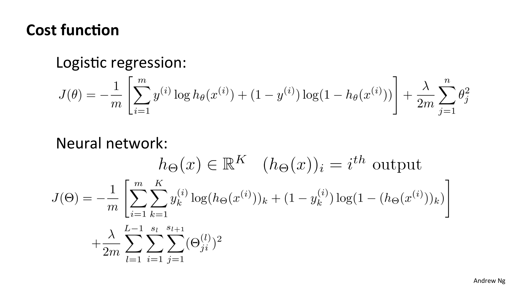
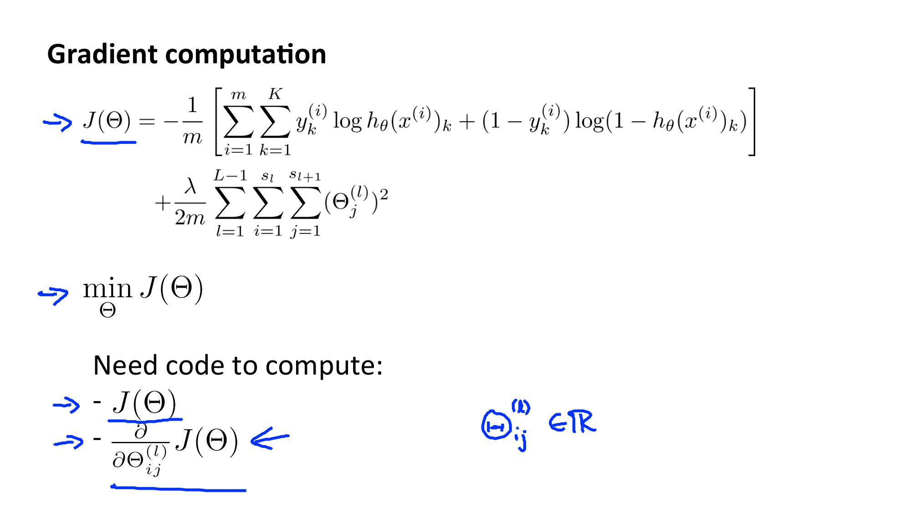
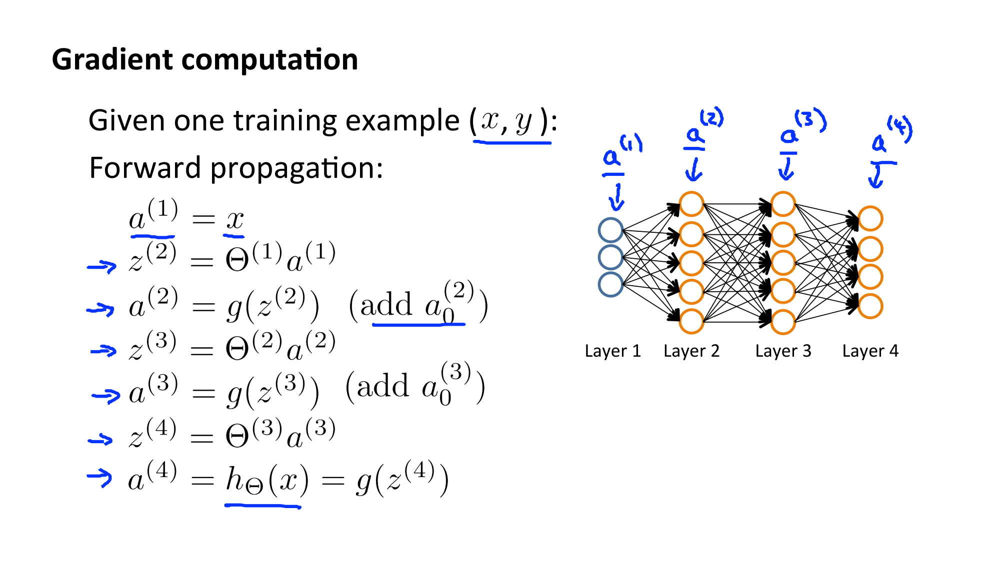
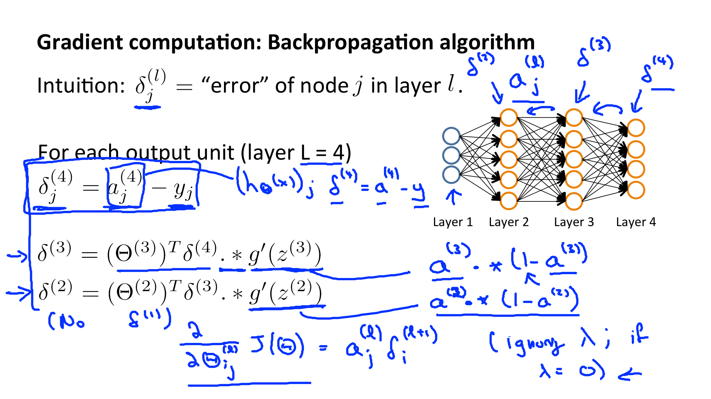
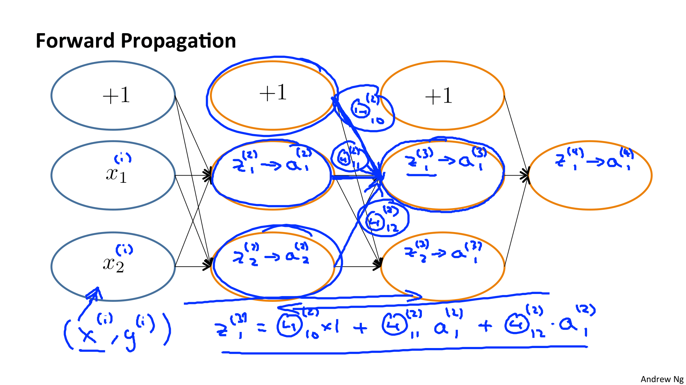
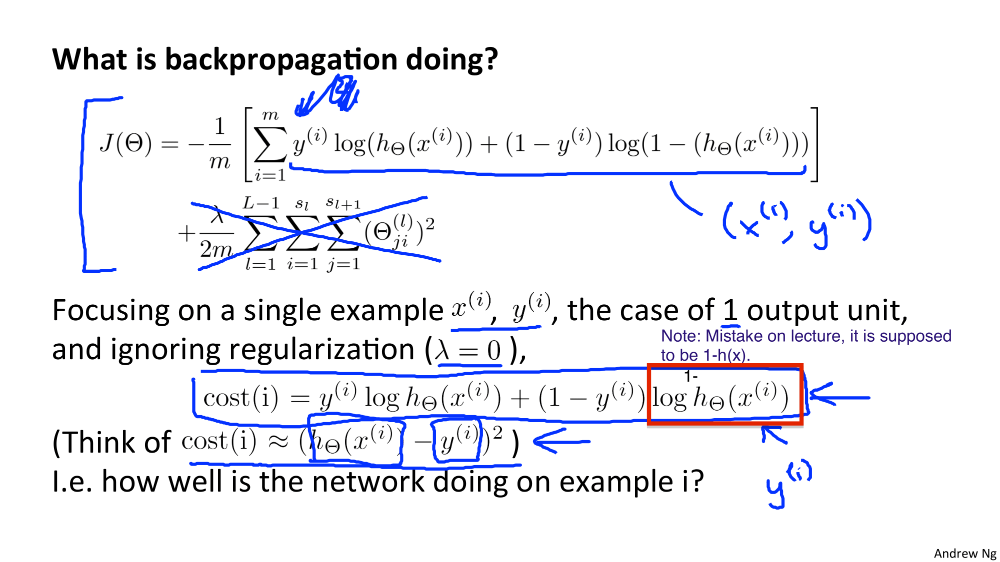
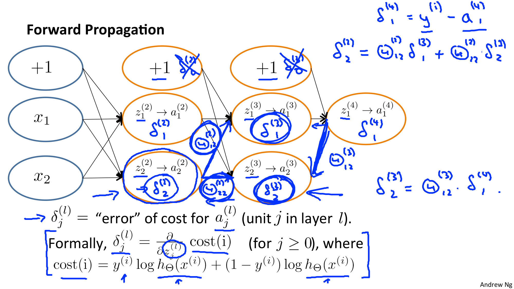

Coursera의 유명 강의, Andrew Ng 교수님의 Machine Learning 를 들으며 정리한 개인 학습자료입니다.

# W5. Neural Networks: Learning

Neural Networks (신경망) 알고리즘이 학습데이터를 기반으로 어떻게 파라미터(가중치)를 학습시키는지를 알아봅시다.

# W5-1. Cost Function and Backpropagation

신경망의 파라미터를 적절하게 맞추기(fit)위한 비용함수에 대해서 먼저 알아보도록 합시다.

## Cost Function (비용 함수)

다른 학습 앍고리즘과 마찬가지로 신경망 또한 비용함수를 이용하여 파라미터가 적절하게 셋팅되었는지(=적절하게 학습되었는지)를 체크합니다.

### 사용하는 용어

* L : 레이어의 총 수
* Si : Layer i의 unit 수 (노드 수)
* K : 출력 노드(군집)의 수

Logistic Regression 의 비용함수를 다시 살펴보자 : -1/m * 비용함수(오차) + 정규화를 위한 extra term

Neural Network 의 비용함수는 Logistic Regression의 비용함수를 일반화시킨 것이지만 조금 더 복잡하다. 여러개의 결과 노드들을 도출학 위해 중첩된 계산들 (nested summations)이 존재한다. 

정규화 계산식(extra term) 부분에서는, 다차원의 세타 행렬을 고려해야한다. 

Logistic Regression에서나 Neural Network에서나 i=0 (j=0) 인 경우, 즉, x0, bias(편향)인 경우는 계산하지 않았다. 더해봤자 큰 차이 없이 거의 동일하게 동작한다. 대부분의 경우 더하지 않음.

> - the double sum simply adds up the logistic regression costs calculated for each cell in the output layer
> - the triple sum simply adds up the squares of all the individual Θs in the entire network.
> - the i in the triple sum does **not** refer to training example i

## Backpropagation (역전파)

cost function을 최소화하는 알고리즘

다른 학습 알고리즘에서와 마찬가지로 J(theta)를 최소화하는 파라미터를 찾아야 한다.

=> Gradient Descent 등의 알고리즘 사용해야 함

=> theta 편미분 (theta는 실수(R) 임)

theta를 어떻게 편미분하는지 살펴보자(? 표현이 뭔가 어색한뎈) : 

먼저 Forward Propagation(순전파)를 수행하여 x에 대한 가설(출력)을 계산해야한다. 

* a(i) : i번째 레이어의 activation value (활성값)

각 레이어의 출력(a)을 다음 레이어가 입력으로 받아 g함수(sigmoid)에 넣어 계산하고  그 값을 또 다음 레이어에 넘겨주는 과정을 반복한다. 마지막 층이 출력층, 즉, 가설(h)이다.

이제 Backpropagation (역전파) 알고리즘을 수행하여 미분을 계산해보자.

역전파는 각 노드에 대해 에러가 있는지 살펴보는 것이라 생각하면 된다. (델타항) 

* δ(델타)항 : 에러 (오차)
  * 가설들의 출력항 중 하나와 훈련 세트의 y벡터에서 j번째 요소인 yj 사이에 대한 차이

출력층부터 시작하여 이전 층으로 하나씩 이동해가며 델타 값을 구한다.

델타 값은 활성화함수를 미분한 값과 수학적으로 동일하다.

델타^1 항은 존재하지 않는다 : 첫번째 층은 입력층이기 때문!

### 직관적으로 이해하기

순전파의 계산 :  위 슬라이드의 하단 수식

역전파는 오른쪽에서 왼쪽으로 흐른다

cost(i) = (h(xi)-yi)^2

비용함수 값 = (신경망의 출력 - 실제 값)^2 와 유사하다

지금까지 비용함수의 미분을 계산하고 가중치를 업데이트하기 위해 오차역전파법을 어떻게 사용할 것인가에 대해 알아보았다.