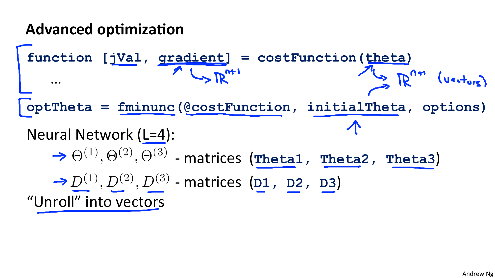
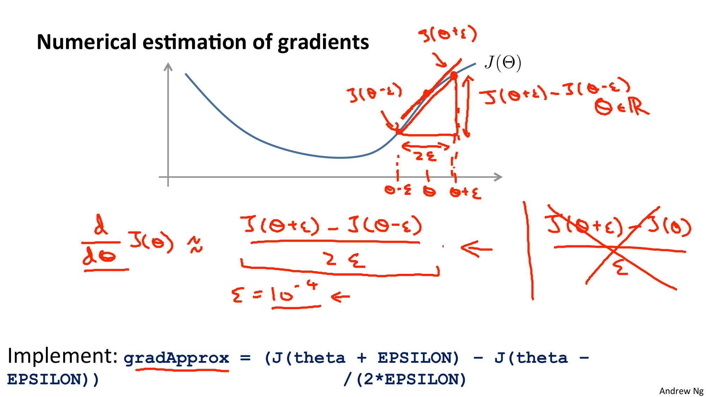
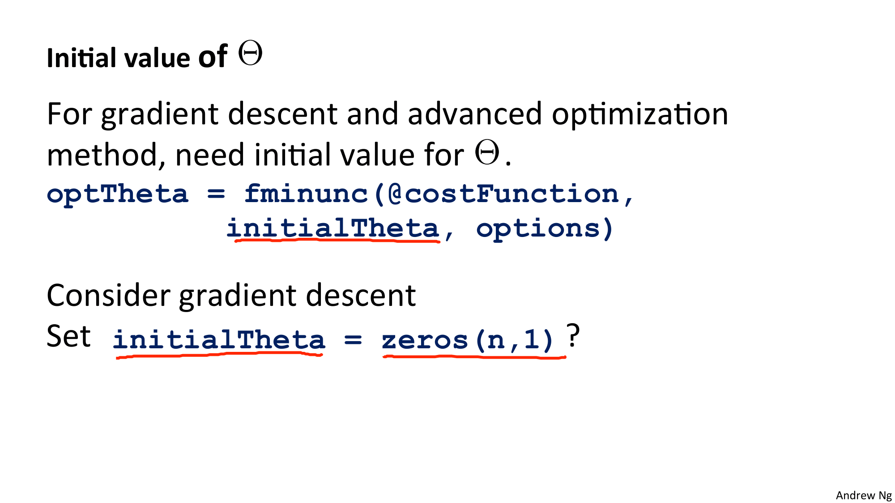
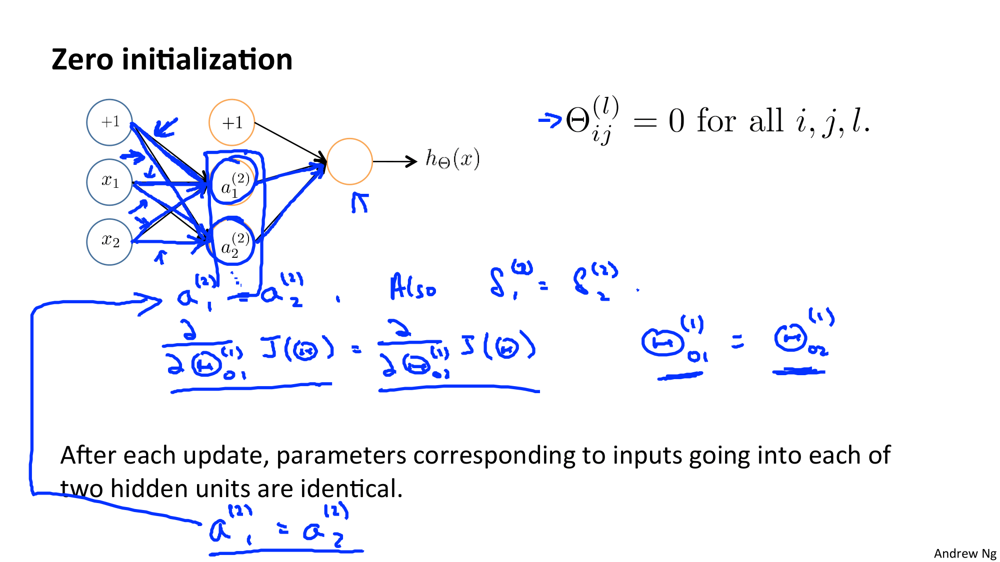
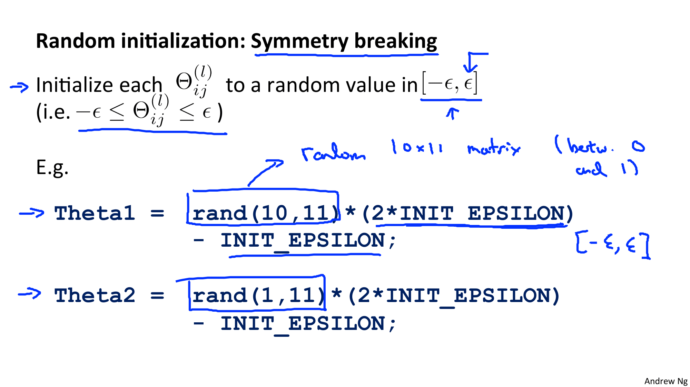

Coursera의 유명 강의, Andrew Ng 교수님의 Machine Learning 를 들으며 정리한 개인 학습자료입니다.

# W5. Neural Networks: Learning

Neural Networks (신경망) 알고리즘이 학습데이터를 기반으로 어떻게 파라미터(가중치)를 학습시키는지를 알아봅시다.

# W5-2. Backpropagation in Practice

고급 최적화 루틴을 사용하기 위해 필요한 매개 변수를 행렬에서 벡터로 펼치는 실제 구현 세부 사항에 대해 빠르게 알려 드리고자합니다.

* `fminunc` : 최적화 알고리즘

## Gradient Checking

비용함수 J의 미분 = 기울기!

## Random Initialization (랜덤 초기화)

경사하강법과 고급 최적화를 수행하기 위해서는 파라미터 초기값을 선택해야한다.

가중치(파라미터)의 초기값을 적절히 잘 설정하면 **각 층의 활성화 값 분포가 적당히 퍼지면서 학습이 원활하게 수행하게 된다.** (그리고 그 방법에는 정규화도 있다. 일단 초기값 설정하는 것부터 알아보자)

그렇다면 어떻게 초기화해야할까?

0으로 초기화는 방법이 떠오른다. 결론부터 이야기하자면 이 방법은 로지스틱 회귀에서는 잘 동작하지만 신경망에서는 잘 동작하지 않는다.

신경망에서 가중치를 0으로 초기화하면 어떻게 되는지 살펴보자 : 

모든 은닉층의 노드들이 완전히 동일한 계산을 수행하게 된다. 즉, 가중치의 값이 모두 똑같은 값으로 갱신된다.

=> 가중치를 여러개 두는 의미가 사라짐...

사실 0으로 초기화해서 그렇다기보다는... 정확하게는 가중치를 "균일한 값"으로 설정하면 안된다. => 즉, 초깃값을 무작위로 설정해야 한다.

* Xavier 초기값 : 활성화함수가 선형일때
* He 초기값 : 활성화함수로 ReLU 사용시

## 참고자료

* 플밍숙제 : https://www.apdaga.com/2018/06/coursera-machine-learning-week-5.html