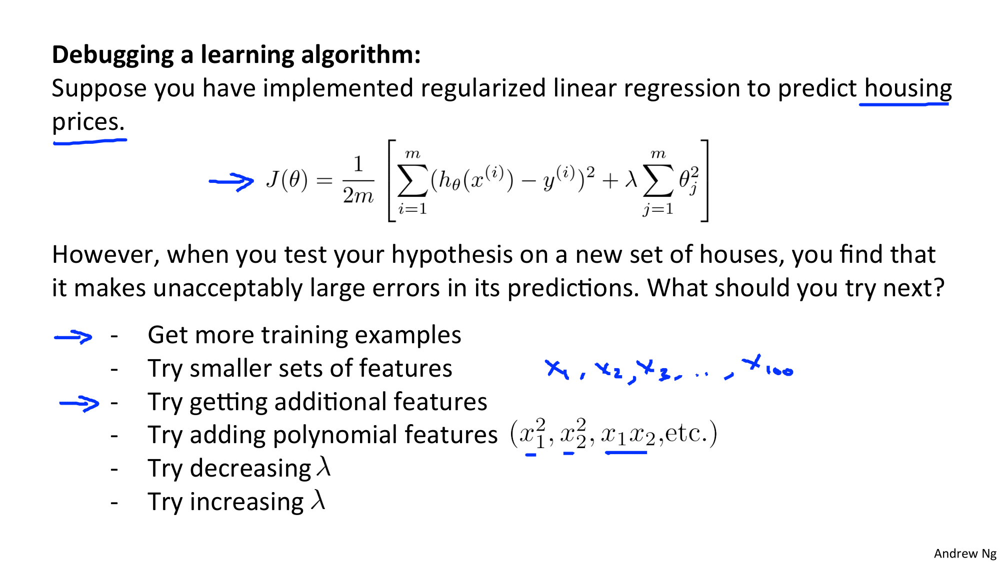
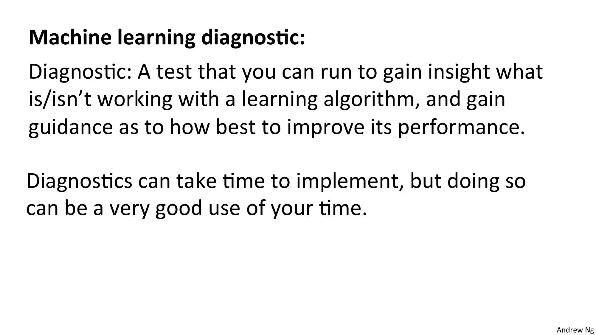
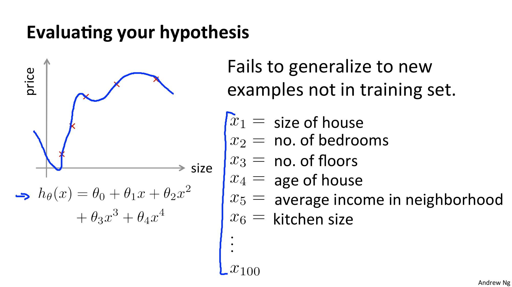
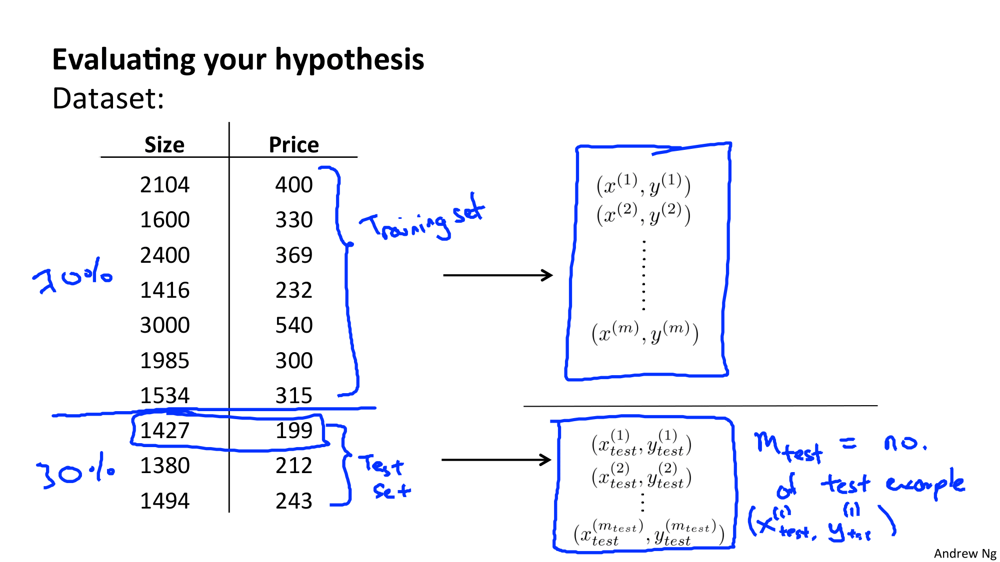
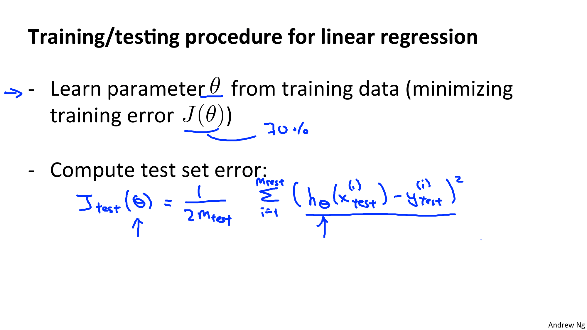
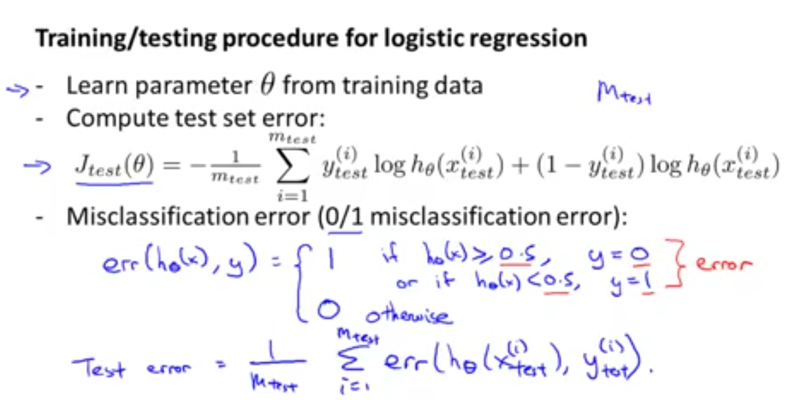
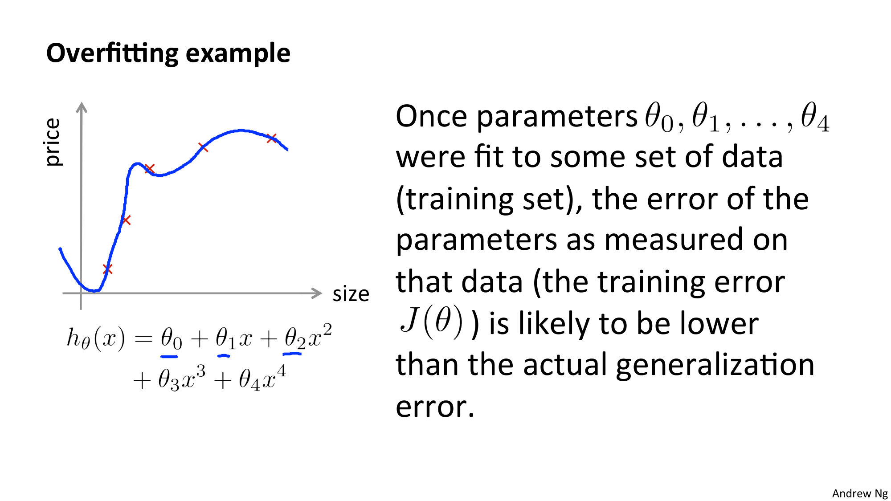
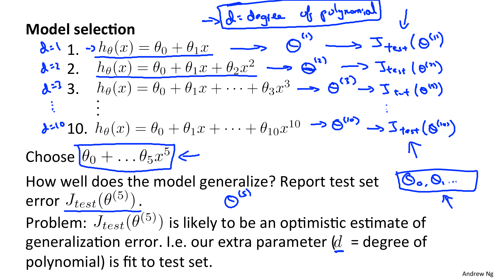
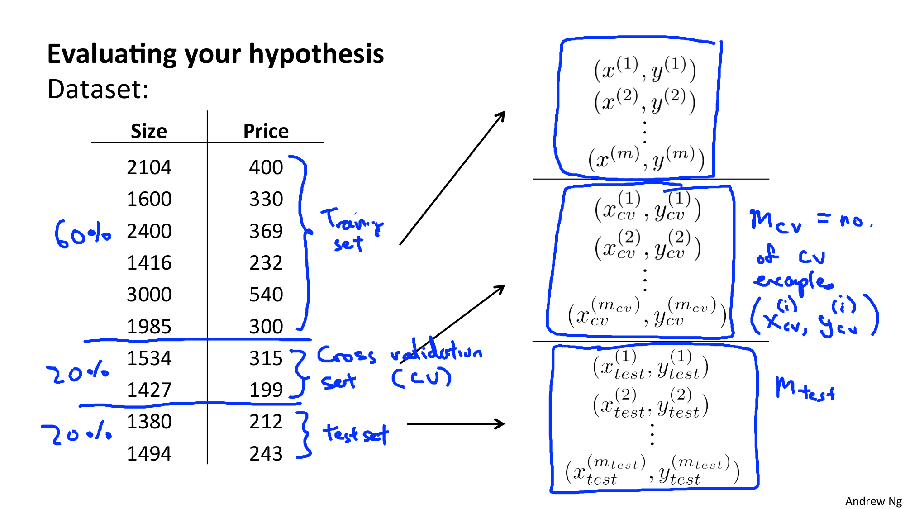
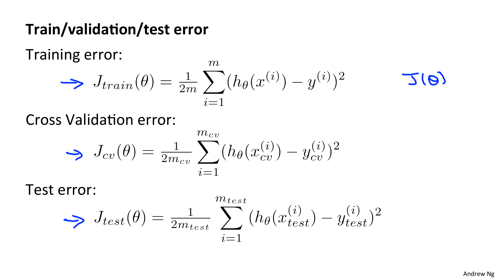

Coursera의 유명 강의, Andrew Ng 교수님의 Machine Learning 를 들으며 정리한 개인 학습자료입니다.

# W6. Advice for Applying Machine Learning

학습 알고리즘을 강력하고 효율적으로 사용하는 방법에 대해서 알아보자.

# W6-1. Evaluating a Learning Algorithm (학습 알고리즘 평가하기)

## Deciding What to Try (무엇을 시도할지 결정하기)

집값을 예측하는 모형에서 썩 좋지 않은 예측 결과를 보였다고 가정하자. 그렇다면 이를 개선하기 위해서 우리는 어떻게 해야할까?

* 더 많은 트레이닝 데이터를 사용한다
  * 언제나 워킹하는 방법은 아님. 트레이닝 데이터가 많다고해서 언제나 도움이 되는 것은 아님 => 다음 강의에서 자세히 풀어줄 예정
* 피쳐의 수를 줄인다
* 피쳐를 추가한다
  * 현재 피쳐가 충분한 정보를 가지고 있지 않은 경우
* 다항식 추가하기
* 람다 정규화 매개변수를 줄이기
* 람다 정규화 매개변수를 늘리기

* Diagnostic (진단?) : 무엇이 작동하고 작동하지 않는지에 대한 인사이트를 얻을수 있다
  * 시간이 꽤 걸리지만 궁극적으로는 큰 도움이 된다.
  * 좋지 않은 선택을 하지 않을 수 있게 도와주기 때문

## Evaluating a hypothesis (가설 평가하기)

* 학습의 오차를 최소화하는 매개변수를 결정해야 한다.

학습의 오차를 매우 작게 하는 것이 좋은 것이라 느껴질수도 있지만 이는 오버피팅으로 이어질 수 있기 때문에 좋지 않다. => 트레이닝 데이터에서는 굿 / 일반적인 데이터에는 똥망

그렇다면 오버피팅이 되고 있음을 어떻게 캐치할 수 있을까?

가설 h(x) 그래프를 그려서 확인할수도 있긴하지만 피쳐(feature)가 여러개인 경우에는 가설을 세우고 그래프를 그리는것이 어렵거나 불가능하다.

=> 가설을 평가하는 다른 수단이 필요하다.

훈련 데이터와 테스트 데이터를 7:3 비율로 나눈다.

### Linear Regression의 경우

* 훈련 데이터(70%)로부터 파라미터를 학습하여 비용함수 J를 최소화한다.
* 테스트 데이터(30%)로부터 오차를 계산한다.
  * 선형회귀일 때의 테스트 세트 오차의 정의임. 제곱오차 측정 사용함

### 로지스틱 회귀 (분류)의 경우

* 훈련데이터(70%)로부터 파라미터를 학습한다.
* 테스트 데이터(30%)로 부터 오차를 계산한다.
* 오분류(오판) 오차를 구한다.

지금까지 학습한 가설을 평가하는 표준 기술을 알아봤다.

## Model Selection and Train/Validation/Test Sets

무슨 피쳐을 포함시킬지 선택하고 몇차 다항식까지 적합할지 결정..............@@

데이터 셋에 잘 맞는 다항식이 몇차 다항식인지 찾아내야 한다고 가정하자. 학습 알고리즘에 어떤 피쳐를 포함시켜야 하는지를 고민할 것이다. 학습 알고리즘의 정규화 파라미터 람다를 선택하고자 한다고 가정해보자. 어떻게 할지 고민하지? => Selection Model Problem (모델 선택 문제)

* 데이터를 세가지로 분할 : Training Sets, Validation Sets, Test Sets

이 데이터를 모델 선택을 하기 위해 어떻게 사용하는지 살펴보자

지금까지 여러 오버피팅 사례를 보았고 트레이닝 셋에 잘 적합한다고 해서 반드시 좋은 가설이라고 할 수는 없다는 사실을 알아봤다.

모델 평가시 트레이닝 셋으로 평가하면 당연히 높은 점수가 나올 것임 => 트레이닝 셋의 오차로 예측 지표를 판단하기는 어렵다는 뜻. => 트레이닝 셋에서 찾아볼 수 없는 새로운 예제로 일반화하자

=> 트레이닝 셋을 사용해도 되고 다른 데이터셋을 사용해도 된다

### Model Selection Problem

몇 차원의 다항식을 선택하는 것이 좋은지 고민하고 있다면, 선형함수(1차함수), 2차함수, 3차함수... 10차 함수... 등... 몇 차 함수를 고르는 것이 좋을까 검토하고 있을 것이다.

여기서 다항식의 차원은 매개변수의 개수와도 같다. (d = degree of polynomial, 다항식의 차수)

위 슬라이드 :  파라미터를 테스트 세트에 피팅함 => 새로운 데이터에서는 적합하지 않음

가설을 평가할 줄 알아야 개선도 할 줄 아는법. 평가방법에 대해 알아보자

우선 데이터 셋을 삼등분한다. (훈련/검증/테스트용)

* 60% : 트레이닝 셋 (훈련용, Training Set)
* 20% : 교차 검증 셋 (Cross Validation Set)
* 20% : 테스트 셋 (Test Set)

데이터 셋을 삼등분 했으므로 각 세트별로 오류 값을 구해봐야 한다 : 

각 가설에 대해서 교차 검증 세트를 이용하여 오류값을 뽑아보고 테스트 세트로 generalization error 를 측정한다.

### 왜 모델의 성능을 평가해야 하는가?

* Test Accuracy 측정 가능
  * Test Data나 일반 데이터에 대해 좋은 성능을 내야하기 때문 => 최종적인 성능 평가
  * 결국 중간중간 unseen data에 대해 얼마나 잘 동작하는지 확인 필요
  * 그 중간중간 평가를 수행할 때, Training Data로 성능을 평가하면 당연히 높은 점수일테니 Validation Set을 만들어서 검증하는 것 
* 평가 후 튜닝을 통해 모델의 성능을 높일 수 있음
  * 오버피팅 방지 (Training Accuracy 은 높고 Validation Accuracy가 낮은 경우)
  * => Training Accuracy와 Validation Accuracy를 맞춰줘야 함
  * Ex) DeepLearning 모델 구축 시 Regularization 하거나 epoch을 줄이거나 하는 방식으로 오버피팅 해결

---

일부 사람들은 교차 검증 세트를 사용하지 않고 여전히 테스트 세트로만 측정하고 있음. 이 방법은 테스트 세트가 많으면 괜찮겠지만... 대부분 그렇지 않을테니 좋지 않은 방법임.

## 추가 학습 자료

* [Machine Learning에서 Validation Set을 사용하는 이유](https://3months.tistory.com/118)
  * 모델의 성능을 평가하기 위해서 (training을 한 후에 만들어진 모형이 잘 예측을 하는지 그 성능을 평가하기 위해서 사용함)
  * 데이터 셋의 크기가 너무 작다면 Cross Validation Set을 사용함 => Training Set을 k-fold 방식으로 쪼갬 => 모든 데이터를 Training과 Validation 과정에 사용할 수 있도록 함

