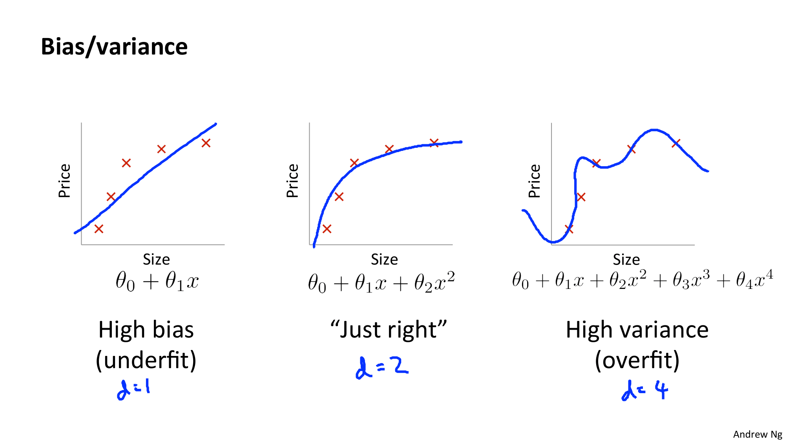
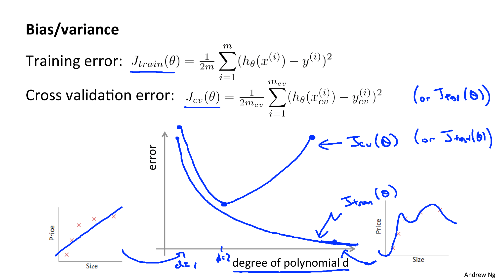
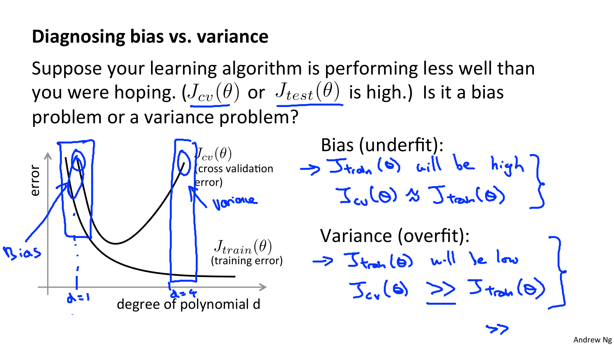
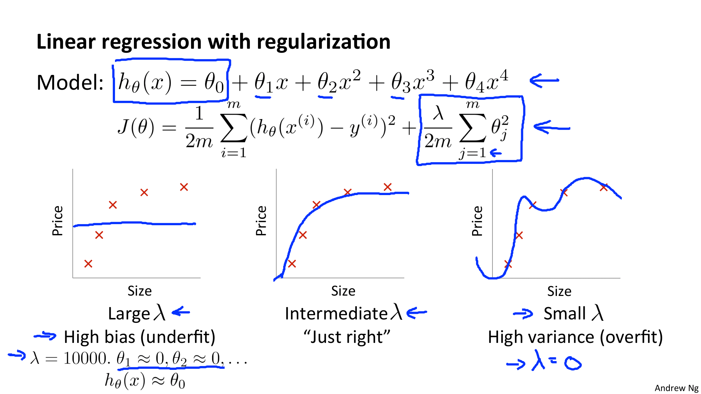

Coursera의 유명 강의, Andrew Ng 교수님의 Machine Learning 를 들으며 정리한 개인 학습자료입니다.

# W6. Advice for Applying Machine Learning

학습 알고리즘을 강력하고 효율적으로 사용하는 방법에 대해서 알아보자.

# W6-2. Bias vs Variance

## Diagnosing Bias vs Variance (편향과 분산 진단하기)

학습 알고리즘이 원하는대로 동작하지 않는다면 거의 대부분의 경우, 편향이 심하거나 분산 문제가 심하기 때문이다. => 과소적합, or 과대적합

편향때문인지 분산때문인지.. 어느쪽 문제인지를 구분하는 것이 중요하다.

편향때문인지 분산때문인지.. 어느쪽 문제인지를 구분하는 것이 중요하다.

저번 시간에 익혔던 훈련 오류와 교차 검증 오류를 이용하여 살펴보자. (제곱오차)

* x 축 : 다항식의 차수 (d)
* y 축 : 에러

왼쪽 그래프는 심플한 경우로서 d=1인 경우이다. (과소적합)

오른쪽 그래프는 좀 더 복잡한 고차원 다항식에 대한 그래프이다. (d 값이 훨씬 큼) (과대적합)

* 훈련 오류 : 다항식의 차수가 증가할수록 트레이닝 세트에 더 잘 적합하게 된다.
  * d=1 이면 훈련오류가 높다.
  * d가 커지면 훈련오류가 낮다.
  * theta의 J Subscript train???
* 교차 검증 오류 
  * 훈련 세트를 과소적합하면 교차 검증 오류가 매우 높아진다.
  * d=2가 되면 교차 검증 오류가 훨씬 낮아질 것이다.
  * d가 너무 높으면 과적합 상태라 교차 검증 오류가 또 매우 높아진다.
  * => 2차함수 그래프와 유사하게 그려짐
  * => Jcv of theta 커브 곡선

* 왼쪽 영역 : 훈련 오류 높음, 교차 검정 오류 높음 (훈련 오류와 비슷함)
  * => 높은 편향 (High Bias)
  * => Underfit
* 오른쪽 영역 : 훈련 오류 낮음, 교차 검정 오류 높음 (훈련 오류보다 훨씬 더 큼)
  * => 높은 분산 (High Variance)
  * => Overfit

### 핵심

* 높은 편향 문제가 있는 경우 
  * => 훈련 오류도 높을 것이다.
  * => 훈련세트에도 적합하지 않는다
* 높은 분산 문제가 있는 경우
  * => 훈련 오류는 낮다. 교차 검증 오류보다 훨~씬 낮다.
  * => 훈련 세트에는 적합한다.

어떻게 해결하는지는 다음 시간에 알아볼 것이다... (엌)

## Regularization and Bias/Variance (정규화와 편향/분산)

저~번 시간에 정규화가 오버피팅을 방지하는데에 어떻게 도움이 되는지 살펴보았다. 그렇다면 정규화는 학습알고리즘의 편향과 분산에 어떤 영향을 미칠까?

위와 같이 고차원의 다항식으로 학습을 진행한다고 가정하자. 오버피팅을 방지하기 위해서는  위 슬라이드에서 J(theta)로 표시된 것과 같은 정규화를 사용해야 한다. (가장 마지막 항이 정규화항)

* 정규화 매개변수 (람다) 의 값이 매우 큰 경우
  *  
* 정규화 매개변수 (람다) 의 값이 매우 작을 경우
  * 

## Learning Curves (러닝 커브, 학습 곡선)

## Deciding What to Do Next Revisited (다음에 수행할 작업 결정하기)

Our decision process can be broken down as follows:

- **Getting more training examples:** Fixes high variance

- **Trying smaller sets of features:** Fixes high variance

- **Adding features:** Fixes high bias

- **Adding polynomial features:** Fixes high bias

- **Decreasing λ:** Fixes high bias

- **Increasing λ:** Fixes high variance.

### **Diagnosing Neural Networks**

- A neural network with fewer parameters is **prone to underfitting**. It is also **computationally cheaper**.
- A large neural network with more parameters is **prone to overfitting**. It is also **computationally expensive**. In this case you can use regularization (increase λ) to address the overfitting.

Using a single hidden layer is a good starting default. You can train your neural network on a number of hidden layers using your cross validation set. You can then select the one that performs best.

**Model Complexity Effects:**

- Lower-order polynomials (low model complexity) have high bias and low variance. In this case, the model fits poorly consistently.
- Higher-order polynomials (high model complexity) fit the training data extremely well and the test data extremely poorly. These have low bias on the training data, but very high variance.
- In reality, we would want to choose a model somewhere in between, that can generalize well but also fits the data reasonably well.