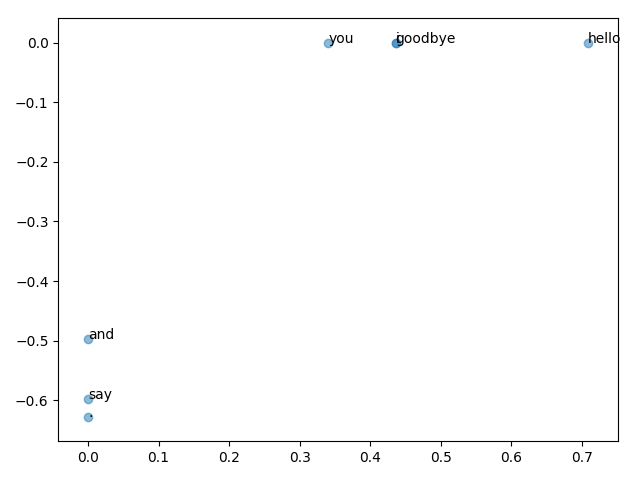

02_자연어와 단어의 분산 표현
====

자연어 처리의 전처리와 딥러닝이 등장하기 이전의 고전적인 방법을 소개한다.

## 자연어 처리 (NLP)

* 자연어 (Natural Language) : 우리가 평소에 쓰는 말
* 자연어 처리 (Natural Language Processing) : 우리의 말을 컴퓨터에게 이해시키기 위한 기술

### 자연어의 특징

* 부드러움, 유연함
  * 같은 의미도 다양한 문장으로 표현 가능
  * 같은 단어도 시대에 따라 뜻이 변하기도 함
  * 새로운 단어가 나타나기도 함

* 단어
  * 의미의 최소 단위

### 단어를 이해시키자
언어의 최소단위라고 볼 수 있는 단어를 이해시키는 것이 중요

* 시소러스(thesaurus, 유의어 사전)를 활용한 기법
* 통계 정보로 부터 단어를 표현하는 통계 기반 기법
* 신경망을 활용한 추론 기반 기법 (word2vec)


## 시소러스

유의어들이 한 그룹으로 분류되어 있는 사전.


자연어 처리 시의 시소러스에는 **단어 사이의 상하 관계**와 **전체/부분 관계** 등의 세부 관계들까지 정의하여 단어들의 관계를 그래프로 표현할 수 있다. 이 단어 네트워크 그래프를 통해 단어 사이의 관계를 컴퓨터에게 가르칠 수 있다.


### [WordNet](https://wordnet.princeton.edu/)

자연어 처리 분야에서 가장 유명한 시소러스.

프린스턴 대학교에서 1985년부터 구축하기 시작한 전통 있는 시소러스.

* 유의어/단어 네트워크
* 단어 사이의 유사도 측정

#### WordNet 맛보기

---추후 진행 후 업데이트하기---

### 문제점

사람이 수작업으로 레이블링하는 방식의 결점이 그대로 존재한다.

* 시대 변화에 대응하기 어렵다 (자연어의 유연함에 대처하기 어려움)

  * > 내 생각 : 그럼 어반딕셔너리의 경우에는..??? WordNet도 위키류 문서들처럼 널리 퍼트리면 해소되는 문제 아닐까?

* 엄청난 인적 리소스 (인건비)

* 단어의 미묘한 차이를 표현할 수 없다

  * 뜻이 비슷한 단어들 끼리 묶다보니 미묘한 차이를 극복하기가 어려움 (의미는 같지만 용법이 다른 경우도 포함)


## 통계 기반 기법

corpus로 부터 '단어의 의미'를 자동으로 추출하는 방법.

* 말뭉치 (corpus, 코퍼스) : 대량의 텍스트 데이터. 특히, 자연어 처리 연구나 앱을 위해 수집된 텍스트 데이터를 뜻한다.

### 1. 말뭉치 전처리하기

텍스트 데이터를 단어로 분할하고 그 분할된 단어들을 단어 ID 목록으로 변환해보자

```python
# 일단 말뭉치대신 연습삼아 한 문장을 전처리 해보자.
>>> text = "You say goodbye and I say hello."
>>> text = text.lower()
>>> text = text.replace('.', ' .')      # 정규표현식을 사용하는 것이 더 좋음
>>> text
'you say goodbye and i say hello .'
>>> words = text.split(' ')
>>> words
['you', 'say', 'goodbye', 'and', 'i', 'say', 'hello', '.']
```

단어를 텍스트 그대로 조작하기에는 불편하므로 ID를 부여해보자

```python
>>> word_to_id = {}
>>> id_to_word = {}
>>> for word in words:
...     if word not in word_to_id:
...             new_id = len(word_to_id)
...             word_to_id[word] = new_id
...             id_to_word[new_id] = word
... 
>>> word_to_id
{'you': 0, 'say': 1, 'goodbye': 2, 'and': 3, 'i': 4, 'hello': 5, '.': 6}
>>> id_to_word
{0: 'you', 1: 'say', 2: 'goodbye', 3: 'and', 4: 'i', 5: 'hello', 6: '.'}
>>> id_to_word[1]
'say'
>>> word_to_id['hello']
5
```

인덱싱 활용을 위해 단어 리스트를 단어 ID 리스트로 변경해보자

```python
>>> import numpy as np
>>> corpus = [word_to_id[w] for w in words]		# 파이썬의 내포(comprehension) 표기법
>>> corpus = np.array(corpus)
>>> corpus
array([0, 1, 2, 3, 4, 1, 5, 6])
```

위의 내용들을 하나의 함수로 작성하여 사용하면 편리하다.

```python
import numpy as np

def preprocess(text):
    text = text.lower()
    text = text.replace('.', ' .')
    words = text.split(' ')

    word_to_id = {}
    id_to_word = {}
    for word in words:
        if word not in word_to_id:
            new_id = len(word_to_id)
            word_to_id[word] = new_id
            id_to_word[new_id] = word

    corpus = np.array([word_to_id[w] for w in words])

    return corpus, word_to_id, id_to_word
```

말뭉치를 다루기 위한 준비는 끝!

### 2. 단어의 분산 표현 (Distributional Representation)

색깔을 색깔의 이름보다 RGB 값으로 표현하는 것이 더 간결하고 관계성 파악이 수월하듯이 단어에도 벡터표현을 적용하면 어떨까?

* 단어의 분산표현 : 단어를 고정 길이의 밀집 벡터(dense vector)로 표현한다. 대부분의 원소가 0이 아닌 실수인 벡터.

### 3. 분포 가설 (Distributional Hypothesis)

자연어 처리의 역사에서 단어를 벡터로 표현하고자 할 때, 근간을 두었던 아이디어/가설.

* 분포 가설 : '단어의 의미는 주변 단어에 의해 형성된다' 라는 가설
  * 단어 자체에는 의미가 없다. 그 단어가 사용된 **맥락(context, 컨텍스트)**이 의미를 형성한다.


* 맥락 (context) : 특정 단어를 중심에 둔 그 주변 단어를 말한다.
* 윈도우 크기 (window size) : 확인할 주변 단어의 개수
  * 방향은 언어나 상황에 따라 다르게 설정할 수 있음. (단방향/양방향)

### 4. 동시발생 행렬 (Co-Occurrence Matrix)

특정 단어 주변에 어떤 단어가 몇번이나 등장하는지를 세어보는 방법이다.

윈도우 크기를 1로 생각하고 샘플 문장이었던 "you say goodbye and i say hello." 를 예로 들어 살펴보자.

등장한 단어를 카운팅하여 벡터로 표현하는 것이다.

* `you` : 주변에 있는 단어는 `say` 뿐이다. => [0, 1, 0, 0, 0, 0, 0]

  

  

* `say` : 총 2번 등장하기 때문에 주변에 있는 단어는 총 4개이다. => [1, 0, 1, 0, 1, 0, 1]

  

모든 단어를 위와 같은 방식으로 카운팅 해보면 다음과 같은 벡터 표가 만들어진다.


이는 **모든 단어에 대해 동시발생하는 단어를 표에 정리한 것**으로서, 이를 **동시발생 행렬(co-occurrence matrix)**이라고 부른다. 모든 문장에 적용 할 수 있도록 일반화시켜 코드로 작성해보자.

```python
def create_co_matrix(corpus, vocab_size, window_size=1):
    corpus_size = len(corpus)
    # 0으로 채워진 2차원의 배열로 초기화한다
    co_matrix = np.zeros((vocab_size, vocab_size), dtype=np.int32)

    # 각 단어에 대한
    for idx, word_id in enumerate(corpus):
      	# 주변 단어 카운팅
        for i in range(1, window_size + 1):
            left_idx = idx - i
            right_idx = idx + i
            
            if left_idx >= 0:             # 바운더리 체크
                left_word_id = corpus[left_idx]
                co_matrix[word_id, left_word_id] += 1
            
            if right_idx < corpus_size:   # 바운더리 체크
                right_word_id = corpus[right_idx]
                co_matrix[word_id, right_word_id] += 1
                
    return co_matrix
```

### 5. 벡터 간 유사도

동시발생 행렬을 활용하여 구해낸 각 단어간 벡터 데이터의 벡터 간 유사도를 구해보자.

* 벡터의 유사도를 측정하는 방법 
  * 벡터의 내적 활용
  
  * 유클리드 거리
  
  * 코사인 유사도 (cosine similarity) : 두 벡터가 가리키는 방향이 얼마나 비슷한가 (같으면 1 반대면 -1)
   
   
   * 분자 : 벡터의 내적
   * 분모 : 벡터의 노름(norm)
   
   ```python
   # eps(epsilon) : 아주 작은 값. 0으로 나누는 오류를 피하기 위해 추가된 변수
   def cos_similarity(x, y, eps=1e-8):
       normalizedX = x / (np.sqrt(np.sum(x ** 2)) + eps)
       normalizedY = y / (np.sqrt(np.sum(y ** 2)) + eps)
       return np.dot(normalizedX, normalizedY)
   ```

코사인 유사도를 이용하여 이전 샘플 문장에서  `you` 와 `I` 의 유사도를 구해보자.

```python
from common.util import preprocess, create_co_matrix, cos_similarity

text = 'You say goodbye and I say hello'
corpus, word_to_id, id_to_word = preprocess(text)
vocab_size = len(word_to_id)
C = create_co_matrix(corpus, vocab_size)

c0 = C[word_to_id['you']]
c1 = C[word_to_id['i']]
print(cos_similarity(c0, c1)) # 0.7071067691154799
```

`you` 와 `I` 의 유사도는 0.7로 계산되었다. -1~1 범주임을 고려하면 꽤 높은 유사도를 보이는 것이다.

### 6. 유사 단어의 랭킹 표시

이번에는 특정 단어와 비슷한 단어를 유사도 순으로 출력하는 랭킹 함수를 만들어보자.

```python
def most_similar(query, word_to_id, id_to_word, word_matrix, top=5):
    if query not in word_to_id:
        print(query + '을(를) 찾을 수 없습니다.')
        return

    print('\n[query] ' + query)
    query_id = word_to_id[query]
    query_vec = word_matrix[query_id]

    # 검색어의 단어 벡터와 다른 모든 단어 벡터와의 코사인 유사도 계산
    vocab_size = len(id_to_word)
    similarity = np.zeros(vocab_size)
    for i in range(vocab_size):
        similarity[i] = cos_similarity(word_matrix[i], query_vec)

    # 코사인 유사도를 기준으로 내림차순 출력
    count = 0
    for i in (-1 * similarity).argsort():
        if id_to_word[i] == query:
            continue
        print(id_to_word[i] + ": " + str(similarity[i]))

        count += 1
        if count >= top:
            return
```

샘플 문장의 `you` 단어에 대한 유사 단어 랭킹을 표시해보자

```python
from common.util import preprocess, create_co_matrix, most_similar

text = 'You say goodbye and I say hello'
corpus, word_to_id, id_to_word = preprocess(text)
vocab_size = len(word_to_id)
C = create_co_matrix(corpus, vocab_size)

most_similar('you', word_to_id, id_to_word, C, top=5)
# [query] you
# hello: 0.9999999800000005
# goodbye: 0.7071067691154799
# i: 0.7071067691154799
# say: 0.0
# and: 0.0
```

`hello`, `goodbye`와의 유사도가 가장 높다고 나오는데 문장의 구조를 고려하였을 때, 정말 이상한 결과가 아닐 수 없다. 이는 source 데이터가 부족하여 발생한 문제이다. 좀 더 큰 말뭉치를 이용하면 이 부분은 개선될 수 있다.

## 통계 기반 기법 개선하기

단어를 벡터로 표현해보긴 했지만 여전히 개선할 점들이 남아있다.

단순히 두 단어가 동시에 발생한 횟수만을 분석하면 `the` 나 `a` 등의 관사들이 가장 높은 유사도로서 나타날 것이기 때문이다. 

### 1. 상호정보량 (Mutual Information)

#### 1-1. 점별 상호정보량 (Pointwise Mutual Information, PMI)


* P(x) : x가 일어날 확률. => 단어 x가 말뭉치에 등장할 확률.
* P(y) : y가 일어날 확률. => 단어 y가 말뭉치에 등장할 확률.
* P(x, y) : x와 y가 동시에 일어날 확률. => 단어 x와 y가 동시에 말뭉치에 등장할 확률.


* C(x) :  단어 x가 말뭉치에 등장하는 횟수
* C(y) : 단어 y가 말뭉치에 등장하는 횟수
* C(x, y) : 단어 x와 y가 말뭉치에서 동시발생하는 횟수

* N : 말뭉치에 포함된 단어 수

즉, **전체에서 해당 단어가 등장하는 횟수로 실제 동시발생 횟수를 나눠 단순 카운팅 방식보다 유사도를 정규화를 시키는 방법**이라고 볼 수 있다.

예를 들어 다음과 같은 경우를 살펴보자

* `car` : 전체 발생 20회
* `drive` : 전체 발생 10회 / `car` 와 동시발생 : 5회
* `the` : 전체 발생 1000회 / `car` 와 동시발생 : 10회

단순 카운팅 방식(동시발생 행렬)을 이용하여 유사도를 살펴보면, `the` 가 `car` 와의 동시 발생 횟수가 `drive` 의 `car` 와의 동시 발생횟수보다 크기 때문에 `the` 와의 유사도를 더 높게 처리하게 되어 실제 자연어에서의 유사도와는 거리가 멀어지게 될 것이다. 

그에 비해 PMI를 이용하여 유사도를 살펴보면,

| the 와의 유사도         | drive 와의 유사도       |
| ----------------------- | ----------------------- |
|  |  |

위와 같이 `drive` 와의 유사도가 훨씬 높은 것으로 계산된다. 전체 발생 빈도와 특정 단어와의 동시 발생 빈도를 함께 계산하기 때문이다.

#### 1-2. 양의 상호정보량 (Positive PMI, PPMI)

하지만 PMI 의 경우 두 단어의 동시발생 횟수가 0이면 log0 = 음의 무한대가 되기 때문에 실제로 사용하기에는 무리가 있다. 이를 개선하기 위해 실제로는 **양의 상호정보량(Positive PMI, PPMI)**을 사용한다. 이는 **0과 PMI를 비교하여 더 큰수를 취하는 방식**이다. 즉, PMI가 음수인 경우 0을 출력한다. 그럼 0이 출력되는 경우 똑같은 상황이 유발되는 게 아닐까? => 매우 작은 값(eps)을 더해주면 해결된다.


```python
# C : 동시 발생 행렬
# verbose : 진행상황 출력 여부
def ppmi(C, verbose=False, eps=1e-8):
    M = np.zeros_like(C, dtype=np.float32)
    N = np.sum(C)
    S = np.sum(C, axis=0)
    total = C.shape[0] * C.shape[1]
    cnt = 0

    for i in range(C.shape[0]):
        for j in range(C.shape[1]):
            pmi = np.log2(C[i, j] * N / (S[j] * S[i]) + eps)
            M[i, j] = max(0, pmi)

            if verbose:
                cnt += 1
                if cnt % (total // 100) == 0:
                    print('%.1f%% 완료' % (100 * cnt / total))
    return M
```

```python
import numpy as np
from common.util import preprocess, create_co_matrix, cos_similarity, ppmi

text = 'You say goodbye and I say hello.'
corpus, word_to_id, id_to_word = preprocess(text)
vocab_size = len(word_to_id)
C = create_co_matrix(corpus, vocab_size)
W = ppmi(C)

np.set_printoptions(precision=3)    # 유효 자릿수 3자리
print('동시 발생 행렬')
print(C)
print('-' * 50)
print('PPMI')
print(W)

# 동시 발생 행렬
# [[0 1 0 0 0 0 0]
#  [1 0 1 0 1 1 0]
#  [0 1 0 1 0 0 0]
#  [0 0 1 0 1 0 0]
#  [0 1 0 1 0 0 0]
#  [0 1 0 0 0 0 1]
#  [0 0 0 0 0 1 0]]
# --------------------------------------------------
# PPMI
# [[0.    1.807 0.    0.    0.    0.    0.   ]
#  [1.807 0.    0.807 0.    0.807 0.807 0.   ]
#  [0.    0.807 0.    1.807 0.    0.    0.   ]
#  [0.    0.    1.807 0.    1.807 0.    0.   ]
#  [0.    0.807 0.    1.807 0.    0.    0.   ]
#  [0.    0.807 0.    0.    0.    0.    2.807]
#  [0.    0.    0.    0.    0.    2.807 0.   ]]
```

유사도가 좀 더 정확하게 출력되는 모습을 볼 수 있다.

PPMI는 단순 카운팅보다는 정확한 유사도를 계산해낼 수 있지만 단어가 증가할 수록 차원이 증가한다는 단점이 있다. PPMI의 대부분의 원소가 0이라는 점을 이용하여 차원을 축소시키는 방법을 찾아보자.

> 벡터는 노이즈에 약하고 견고하지 못하다 => 왜죠?

### 2. 차원 감소 (Dimensionality Reduction)

중요한 정보는 최대한 유지하면서 줄이는 것이 핵심이다. 데이터 분포를 고려하여 중요한 '축'을 찾고 기존의 각 데이터들이 그 축에 사영된 값들로 대체되어 차원을 감소시킨다.


즉, 선형 변환을 하기 위한 방법이라고 보면 된다.

* 고유값 분해 (eigendecomposition) : 정방행렬을 대각화 (정방행렬 -> 고유벡터행렬 + 고유값행렬)
* 특이값 분해 (singular value decomposition) : 직사각형 행렬까지도 대각화 시킬 수 있는 방법. 즉, 활용도가 더 높다.

#### [특이값 분해 (Singular Value Decomposition, SVD)](https://youtu.be/cq5qlYtnLoY) [#](https://bskyvision.com/251)

* 기하학적인 의미 : 직교하는 벡터 집합에 대하여, 선형 변환 후에 **그 크기는 변하지만 여전히 직교할 수 있게 만드는 그 직교 벡터 집합은 무엇**이고, 변형 후의 결과는 무엇인가?

즉, 여기서는 위에서 구한 단어를 벡터로 변환한 '단어 벡터 데이터'를 입력 데이터 X로서 사용하고, SVD 를 이용하여 선형 변환 이후에도 직교하는, 즉, 의미있는 값을 가지는 벡터만을 추출해 표현하는 U, S, Vt 로 변환시켜 특이값을 분해 할 것이다.


* U : m x n 직교 행렬 (orthogonal matrix)
* S : m x n 대각 행렬 (diagonal matrix) - 특이값(중요도, 여기서는 유사도?)이 정의 된다.
* V : m x n 직교 행렬 (orthogonal matrix)

이 때, S에는 특이값이 큰(=축의 중요도) 순서대로 나열되어 있으므로 중요도가 높은 일부 부분만 추출해서 근사 값을 구해낼 수 있다.


> 근데 그럼 문자에서 U는 뭐고 S는 유사도인듯하고... V는 뭐인거지..... 일단 더 들어보자. 대부분의 예제들은 다 이미지라..... 아... 인풋으로 ppmi 유사도 행렬을 넣고 U,S,V로 분해하는구나

```python
import numpy as np
import matplotlib.pyplot as plt
from common.util import preprocess, create_co_matrix, cos_similarity, ppmi

text = 'You say goodbye and I say hello.'
corpus, word_to_id, id_to_word = preprocess(text)
vocab_size = len(word_to_id)
C = create_co_matrix(corpus, vocab_size)
W = ppmi(C)

# numpy의 선형대수 관련 클래스에 있는 SVD
U, S, V = np.linalg.svd(W)

print("동시 발생 행렬")
print(C[0])
# [0 1 0 0 0 0 0]
print("PPMI")
print(W[0]) # 희소벡터
# [0.        1.8073549 0.        0.        0.        0.        0.       ]
print("SVD")
print(U[0]) # 밀집벡터
# [ 3.4094876e-01  0.0000000e+00 -1.2051624e-01 -3.8857806e-16  -9.3232495e-01 -1.1102230e-16 -2.4257469e-17]
print(U[0, :2]) # 차원 감소를 위해서는 상위 2개의 벡터만 뽑아내도 된다.
# [0.34094876 0.        ]

# 상위 2개의 벡터만 뽑아서 plot에 그려보자
for word, word_id in word_to_id.items():
    print(word + "\tU[word_id, 0] : " + str(U[word_id, 0]) + "\tU[word_id, 1] : " + str(U[word_id, 1]))
    plt.annotate(word, (U[word_id, 0], U[word_id, 1]))

plt.scatter(U[:, 0], U[:, 1], alpha=0.5)
plt.show()
```



`you` 와 `i` 가 가깝고, `goodbye` 와 `hello` 도 가까워졌다. 하지만 여전히 `you` 와 `goodbye` 가 `goodbye` 와 `hello` 보다 거리가 가깝다ㅠㅠ.. 이번에는 말뭉치를 사용해서 source 데이터를 늘려보자.


### 3. 말뭉치 사용하기

펜 트리뱅크(Penn Treebank, PTB) 말뭉치를 사용해볼 것이다. 이는 품질을 측정하는 벤치마크로도 자주 이용되는 데이터셋이다.

* 기존 PTB 말뭉치를 약간 가공하여 사용하기 편하게 만들어 둔, 토마스 미콜로프의 PTB : https://github.com/tomsercu/lstm/tree/master/data

여기서는 말뭉치의 사이즈가 꽤 크므로, 빠른 계산을 위해 일반 SVD가 아니라 고속 SVD를 사용할 것이다. 이는 무작위 수를 사용한 Truncated SVD 로서 특이값이 큰 값들만 계산하여 기본적인 SVD 보다 훨씬 빠르다. 이는 위에서 상위 2가지 특이값만 뽑아 확인한 것과 유사한 원리이다.

```python
import numpy as np
import matplotlib.pyplot as plt
from common.util import most_similar, create_co_matrix, ppmi
from dataset import ptb

window_size = 2
wordvec_size = 100

corpus, word_to_id, id_to_word = ptb.load_data('train')
vocab_size = len(word_to_id)
print('동시 발생 수 계산 ...')
C = create_co_matrix(corpus, vocab_size)
print('PPMI 계산 ...')
W = ppmi(C)

print('SVD 계산 ...')
try:
    # truncated SVD (빠른 버전)
    from sklearn.utils.extmath import randomized_svd
    U, S, V = randomized_svd(W, n_components=wordvec_size, n_iter=5, random_state=None)
except ImportError:
    # SVD (느린 버전)
    U, S, V = np.linalg.svd(W)

word_vecs = U[:, :wordvec_size]

querys = ['you', 'year', 'car', 'toyota']
for query in querys:
    most_similar(query, word_to_id, id_to_word, word_vecs, top=5)
```

결과를 확인해보니 아래와 같이 인칭대명사끼리, 날짜표현끼리 묶여있는 등 단어/문법적인 관점에서 유사한 단어들이 출력되는 것으로 보아, 유사도의 신뢰성이 한눈에 봐도 꽤나 높아진 것을 알 수 있었다.

```
[query] you
i: 0.8396031856536865
we: 0.8370687365531921
they: 0.656349778175354
there: 0.5262829065322876
anybody: 0.5244273543357849

[query] year
week: 0.8795479536056519
month: 0.8233466744422913
day: 0.6965770721435547
decade: 0.6534270644187927
quarter: 0.6304011344909668

[query] car
auto: 0.6816629767417908
personal-computer: 0.5276384353637695
airline: 0.5251946449279785
truck: 0.5197104215621948
luxury-car: 0.5058836340904236

[query] toyota
kuwait: 0.6794270873069763
pakistan: 0.6412442922592163
aeroflot: 0.596845269203186
narcotics: 0.5791839957237244
pennzoil: 0.5681952834129333
```

## 정리 - 여기서 진행한 내용

* 시소러스를 이용한 기법과 통계기반기법을 알아보았다.
* 시소러스 기법 : 단어의 연관성/유사도를 사람이 수작업으로 정의. 힘들고 표현력 한계 존재.
* 통계 기반 기법 : 말뭉치로부터 의미를 자동으로 추출, 의미를 벡터로 표현
  * '단어의 의미'를 벡터로 인코딩 해보았다.
  * 맥락속에 속한 단어의 등장회수를 세고 PPMI 행렬로 변환하였다.
  * 이를 다시 SVD를 이용하여 차원을 감소시켜 더 좋은 단어 벡터를 얻어냈다. => 단어의 분산 표현, 각 단어를 고정 길이의 밀집벡터로 표현함
* 전처리/후처리 함수들을 구현해보았다 : 벡터 간 유사도(코사인 유사도), 유사단어 랭킹표현 등..