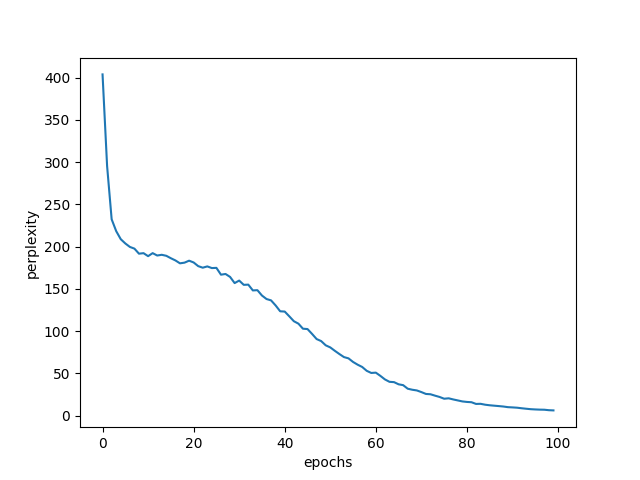

순환 신경망 (Recurrent Neural Network, RNN)
====

* 피드포워드 (feed forward) 신경망 : 흐름이 단방향인 신경망

  * 구성이 단순, 구조 이해하기 쉽다. => 많은 문제에 응용 가능

  * 시계열 데이터의 성질(패턴)을 충분히 학습하기 어렵다

## 확률과 언어 모델

지금까지 살펴본 CBOW 모델의 동작,"" 맥락(t-1, t+1)이 주어졌을 때 타겟(t) 을 찾을 확률""을 구해보면 아래와 같다.


즉, 맥락으로부터 타겟을 추측하는 것'이 목적인데, 이 목적의 실용적인 쓰임에는 어떤 것들이 있을까?

### 언어모델 (Language Model)

언어모델은 **특정한 단어의 시퀀스에 대해, 그 시퀀스가 일어날 가능성이 어느정도인지를 확률로 평가**한다. 즉, **단어의 배치/순서가 얼마나 자연스러운지** 확인하는 것이다.

* 음성 인식 시스템 : 음성 데이터로 부터 가장 자연스러운 문장을 생성하기
* 새로운 문장을 생성해내는 시스템

이를 수식으로 나타내보면 아래와 같이 동시 확률으로 표현할 수 있다:


즉, 동시확률은 사후확률의 총곱으로 나타낼 수 있다.

* 언어모델의 목표 : P(wt | w1, ... , wt-1) 을 구하는 것 => 동시확률 P(w1, ... , wt-1)을 구하기 위해

### CBOW 모델을 언어모델에 적용해보면?

이전에 익혔던 CBOW 모델을 억지로 언어 모델에 적용하면 어떻게 될까?


맥락(context)을 왼쪽 2개 단어라고 생각하면 위와 같이 근사적으로 식이 도출된다.

위에서 알 수 있듯이, CBOW를 언어모델로서 사용하게되면 맥락의 크기만큼 **고정** 되어 버린다. 즉, 맥락의 크기만큼의 단어들만 파악할 수 있고 그 크기보다 작거나 큰 위치에 있는 단어들은 아예 무시된다는 뜻이다. 이를 실제 문장에 대입하여 생각해보면 정말 CBOW는 언어모델로 사용될 수 없다는 것을 더 직접적으로 느끼게 될 것이다.


위의 문장을 예로 들어보자, `?` 에 들어갈 단어를 알아내기 위해서는 첫번째 단어인 `Tom` 을 기억하고 있어야 할 것이다. 하지만 맥락이 왼쪽 방향으로 2인 경우에는 `Tom` 을 기억할 수 있을리가 없다.

그렇다면 맥락의 크기를 키우면 해결되는 걸까? 하지만 **CBOW에서는 맥락안에 속하는 단어들의 순서가 무시**된다는 특징이 있다. 애초에 CBOW 모델은 맥락 파악과 같은 시퀀셜한 데이터를 위한 모델이 아니라 단어의 의도/의미와 같이 특정 단어의 벡터에 집중하는 모델이기 때문이다.

> CBOW = continous bag-of-words (가방속의 단어 : 그냥 주머니속에 단어들이 들어있는 모습을 상상하면 된다. 즉, 순서가 없다. '순서' 대신 '분포'를 이용한다.)

순서가 무시되는 모습을 좀 더 구조적으로 보기 위해 그림을 살펴보자.


CBOW 파트에서 익혔듯이, CBOW 모델은 입력들을 합하여 은닉층을 구성한다. 그렇다보니 각 입력들의 순서는 알 수 없게 되는 것이다. 그렇다면, 합하지 않고 오른쪽 그림처럼 이어붙이면 어떨까? 실제로 신경 확률론적 언어 모델(Neural Probabilistic Language Model)이 이러한 방식을 따르고 있긴하지만, 연결하는 방식으로 인해 가중치 매개변수가 맥락의 크기에 비례하여 늘어나게된다. 즉, 오버헤드가 너무 커지는 것이다.

그럼 뭘 어떻게 하라는 걸까? **맥락이 아무리 크고 길어도 그 맥락의 정보를 기억하는 메커니즘**이 필요하다!

## RNN (Recurrent Neural Network, 순환신경망)

RNN은 이름에서부터 느껴지듯이, "순환하는 신경망" 이다. 데이터가 순환되므로 과거의 정보를 기억하고 최신 데이터로 갱신할 수 있다. 즉, 정보가 계속 갱신된다.

* 순환 : 시간을 지나 다시 원래 장소로 돌아오는 과정을 반복하는 것.
  * 닫힌 경로(순환하는 경로)가 필요함


위의 그림을 살펴보면, 시간 t에 대한 입력값인 Xt가 RNN계층에 입력되고 ht가 출력되고 있음을 알 수 있다. 주목해야 할 부분은 출력 시 ht값이 **분기** 되는 부분이다. 분기 될 때, ht값은 그대로 복사되어 다시 RNN 계층으로 들어간다.

RNN계층을 시간순으로 펼쳐보면 아래와 같이 표현된다.


이는 마치 여러개의 계층이 순차적으로 연결되어있는 것 처럼 보인다. 하지만 이 구조는 RNN 계층 1개의 구조이다. 

위 그림을 살펴보면, 시계열 데이터인 X가 이전 시각의 출력값을 받아와 현재 시각의 출력을 계산하고 있다. 이를 수식으로 나타내면 아래와 같다.


* tanh 함수 (쌍곡탄젠트, hyperbolic tangent) : 활성화함수

하나의 계층에서 각 시각별로 일어나는 일로서 생각해보면 ht를 RNN 계층의 **'상태'** 로 볼 수 있다. 이 상태는 위의 규칙에 따라 갱신되는 것이다. 실제로 RNN 계층을 '상태를 가지는 계층' 또는 '메모리(기억력)가 있는 계층' 이라고도 부르곤 한다.

> RNN의 출력 h는 hidden state, hidden state vector 등으로 불린다.


### BPTT (Backpropagation Through Time)

RNN 계층은 시간 순대로 한방향으로 흘러가는 구조로 되어있기 때문에 RNN의 학습도 동일하게 거꾸로 진행하게(역전파) 된다.


이렇게 **시간 방향으로 펼친 신경망의 오차역전파법**을 BPTT 라고 부른다.

그림으로만 보면 굉장히 수월하게 진행될 것 처럼 보이지만, 시계열 데이터의 t가 크면 클수록 소비되는 메모리 등의 자원이 증가하게 되기 때문에 비효율적일 수 있다.

t의 크기가 커지면 커질수록 역전파 시 기울기가 불안정해지기도 한다. 왜냐하면 블록 연결이 길어짐에 따라 기울기 값이 점점 줄어들어, 역전파가 끝나기 전에 0이 되어버려 영영 소멸해버릴 확률이 높아지기 때문이다.

### Truncated BPTT

BPTT의 단점을 보완하기 위해, 큰 시계열 데이터를 처리할 때에는 역전파의 연결을 적당한 사이즈로 끊어주는 방법이 제시되었다. 역전파의 연결만 끊어야한다.


위의 그림에서도 알 수 있듯이, 10개 단위로 블록을 나눠 끊었지만 순전파의 연결은 끊지 않았다는 점에 주목하여야 한다. 즉, 데이터 입력시에 꼭 순서대로 데이터를 입력해줘야 한다.


#### Truncated BPTT 의 미니배치 학습

이전의 미니배치 학습시에는 데이터를 순서대로가 아닌, 무작위로 추출하여 미니배치 학습을 진행하였다. 이번에는 순서가 꼭 지켜져야 하니 예전처럼 무작위 추출 방식은 사용할 수 없다. 

Truncated BPTT 방식으로 미니배치 학습을 할 때에는 데이터를 입력할 '시작 위치'를 각 '미니 배치의 시작 위치'로 옮겨줘야 한다.


위 그림에서는 미니배치의 원소 위치(시각)에 맞는 RNN블록의 위치에 데이터를 옮겨서 입력해주고 있다.

즉, 각 미니배치의 시작 위치를 오프셋으로 옮겨준 후 순서대로 입력하면 된다! 계속 순서대로 넣어주다가 마지막 데이터에 다다르면 다시 첫번째 데이터로 돌아가서 입력해주면 된다!

### 꼭 기억해야 할 중요한 내용

* 데이털를 순서대로 제공하기!
* 미니배치별로 데이터를 제공하는 시작 블록 위치를 옮기기! (X100 데이터면 100번째 블록으로)


## RNN 구현

앞서 살펴본 RNN의 계층은 사실 **가로방향으로 성장한 신경망** 모습이라고 볼 수 있다. 그러므로 실제 구현은 가로 크기가 일정한 일련의 신경망을 구현하면 된다. 이렇게 가로방향으로 성장한 신경망을 모듈화하여 하나의 RNN계층으로 구현해야한다! 

| RNN 계층의 내부            | RNN계층                    |
| -------------------------- | -------------------------- |
|  |  |

오른쪽 그림에서와 같이 전체 신경망을 묶어서 입력 배열(xs)과 출력 배열(hs)을 하나로 출력하면 하나의 계층처럼 만들 수 있다!

위의 구조를 구현하기 위해 우리는 2가지 클래스를 구현할 것이다:

* `RNN` : RNN 계층의 내부를 구성하는 각각의 단계
* `TimeRNN` : 각 단계를 모두 모아 하나로 통합한 RNN 계층

### `RNN` 구현

 `TimeRNN` 을 구성할 `RNN` 을 먼저 구현해보자.

| RNN 순전파 수식          | 매트릭스 형상 확인         |
| ------------------------ | -------------------------- |
|  |  |

일단 순전파는 위의 수식을 그대로 구현하면된다.

```python
import numpy as np

class RNN:
    def __init__(self, Wx, Wh, b):
        self.params = [Wx, Wh, b]
        self.grads = [np.zeros_like(Wx), np.zeros_like(Wh), np.zeros_like(b)]
        self.cache = None
    
    def forward(self, x, h_prev):
        Wx, Wh, b = self.params
        t = np.matmul(h_prev, Wh) + np.matmul(x, Wx) + b
        h_next = np.tanh(t)
        
        # h_prev : RNN 계층으로부터 받는 입력
        # h_next : RNN 계층으로부터의 출력 (= 다음 시각 계층으로의 입력)
        self.cache = (x, h_prev, h_next)
        return h_next
```

역전파를 구현하기 전에, 순전파의 계산그래프를 그려보고 이를 참고하여 역전파를 그려보면 아래와 같다 :


| RNN 순전파          | RNN 역전파  |
| ------------------------ | -------------------------- |
| | |

> 편향(b) 입력시에는 사실 덧셈 브로드캐스트가 일어나므로 Repeat 노드로 그려져야 하나, 여기서는 간략한 그림을 그리고자 생략하였다고 한다.

역전파가 그려진 계산그래프를 그대로 코드로 옮겨보면 다음과 같다:

```python
    def backward(self, dh_next):
        Wx, Wh, b = self.params
        x, h_prev, h_next = self.cache

        dt = dh_next * (1 - h_next ** 2) # tanh의 역전파 수식
        db = np.sum(dt, axis=0)
        dWh = np.matmul(h_prev.T, dt)
        dh_prev = np.matmul(dt, Wh.T)
        dWx = np.matmul(x.T, dt)
        dx = np.matmul(dt, Wx.T)
        
        self.grads[0][...] = dWx
        self.grads[1][...] = dWh
        self.grads[2][...] = db
        
        return dx, dh_prev
```


### `TimeRNN` 구현

T개의 RNN으로 구성된 계층인 `TimeRNN` 을 구현해보자!


```python
class TimeRNN:
    def __init__(self, Wx, Wh, b, stateful=False):
        self.params = [Wx, Wh, b]
        self.grads = [np.zeros_like(Wx), np.zeros_like(Wh), np.zeros_like(b)]
        self.layers = None

        # h : forward 에서 마지막 RNN 계층의 은닉 상태를 저장
        # dh : backward 에서 하나 앞 블록의 은닉 상태의 기울기를 저장
        self.h, self.dh = None, None
        self.stateful = stateful

    def set_state(self, h):
        self.h = h

    def reset_state(self):
        self.h = None

    def forward(self, xs):
        Wx, Wh, b = self.params
        N, T, D = xs.shape
        D, H = Wx.shape

        self.layers = []
        hs = np.empty((N, T, H), dtype='f')

        if not self.stateful or self.h is None:
            self.h = np.zeros((N, H), dtype='f')

        for t in range(T):
            layer = RNN(*self.params) # params 의 아이템들(Wx, Wh, b)을 RNN의 파라미터로 보내준다
            self.h = layer.forward(xs[:, t, :], self.h)
            hs[:, t, :] = self.h
            self.layers.append(layer)

        return hs
```

`stateful` 변수 값에 따라 은닉상태 h를 유지할지 아닐지를 결정한다.

이제 역전파를 구현하기 위해 또 계산그래프를 살펴보자:

|`TimeRNN` 전반적인 역전파 | `TimeRNN` 내부 (RNN계층 끼리의 역전파) |
| -------------------------- | -------------------------- |
|  |  |

먼저 좌측의 그래프를 통해 전반적인 숲을 살펴보자. 지금은 Truncated BPTT 로 구현할 것이기 때문에 이 블록 이전 시각의 역전파는 필요하지 않다. 하지만 일단 계산된 기울기 값을 `dh` 변수에 저장해두기로 하자. (seq2seq 에 필요하기 때문)

블록 내부에 흐르는 역전파를 확대한 우측의 그래프를 살펴보자. dhnext 로 부터 전해지는 기울기와 순전파에서 분기해서 나갔던 현재 RNN의 기울기 dht를 더해 현재 RNN에 입력되고있다.

이를 바탕으로 역전파를 구현해보자:

```python
    def backward(self, dhs):
        Wx, Wh, b = self.params
        N, T, H = dhs.shape
        D, H = Wx.shape
        
        # dxs : 하류로 흘러보낼 기울기
        dxs = np.empty((N, T, D), dtype='f')
        dh = 0
        grads = [0, 0, 0]
        for t in reversed(range(T)):
            layer = self.layers[t]
            dx, dh = layer.backward(dhs[:, t, :] + dh) # dhnext와 dh를 합산한 기울기
            dxs[:, t, :] = dx # 현 시각의 기울기(dx)를 dxs의 해당 시각 인덱스에 저장
            
            for i, grad in enumerate(layer.grads):
                grads[i] += grad
        
        # 각 RNN 계층의 기울기 (grad)를 합산하여 self.grads 에 저장
        for i, grad in enumerate(grads):
            self.grads[i][...] = grad
        self.dh = dh
        
        return dxs
```


## RNNLM (RNN Language Model)

* RNNLM : RNN을 사용하는 언어 모델.

지금까지는 RNN 계층에만 주목하여 시계열 데이터를 처리하는 것을 알아봤다. 이제부터는 RNN 을 사용하는 언어모델을 구현하기 위해, 다른 계층들에 대해서도 시계열 데이터를 처리하도록 만들어보겠다.


위와 같이 실제 신경망을 그려보면, RNN 계층 뿐만 아니라 Embedding, Affine, Softmax 계층 또한 시각별로 존재하는 것을 알 수 있다. 더욱 직관적을로 알아 볼 수 있게 여기에 문장을 대입시켜보자.


위와 같이 문장의 단어가 순서대로(시각별로) 들어간다. 특히, `say` 를 살펴보면, 결과값으로 `hello` 와 `goodbye` 가 도출되어있다.  `you say` 라는 맥락과 어울리는 단어 선택으로서 `you say` 라는 맥락을 기억하고 있다는 뜻이다 (실제로는 은닉상태벡터로 보관(기억)한다). 즉, 지금까지 입력된 단어를 '기억' 하고 그것을 바탕으로 다음에 출현할 단어를 '예측' 한다. 이는 RNN 계층이 이 정보를 Affine 계층으로 보내고 다음 RNN계층으로도 보내는 역할을 하기 때문에 가능한 것이다.

### Time 계층 - T개의 시계열 데이터를 한꺼번에 처리하는 계층

RNN 계층을 모아 TimeRNN을 만들었던 것 처럼, Embedding, Affine, Softmax 계층을 모아 TimeEmbedding, TimeAffine, TimeSoftmax 를 만들어보도록 하자.


#### 1. Time Affine 계층


#### 2. Time Embedding

구조상으로, Time Affine 계층과 동일하게 구현하면 된다.

#### 3. Time Softmax with Losdd 계층


#### 구현

Time 계층들에 대한 구현은 [샘플코드](https://github.com/yenarue/TIL-sample-projects/blob/master/DataScience/DeepLearning-from-Scratch-2/common/time_layers.py)를 확인하도록 하자. 

### RNNLM 구현

간단한 RNNLM으로서 아래와 같이 4가지의 Time 계층들을 쌓은 `SimpleRnnlm` 을 구현해보자!


```python
import numpy as np
from common.time_layers import *

class SimpleRnnlm:
    def __init__(self, vocab_size, wordvec_size, hidden_size):
        V, D, H = vocab_size, wordvec_size, hidden_size
        rn = np.random.randn

        # 가중치 초기화
        embed_W = (rn(V, D) / 100).astype('f')
        rnn_b = np.zeros(H).astype('f')
        affine_b = np.zeros(V).astype('f')
        ## Xavier 초깃값을 이용하여 초기화
        rnn_Wx = (rn(D, H) / np.sqrt(D)).astype('f')
        rnn_Wh = (rn(H, H) / np.sqrt(H)).astype('f')
        affine_W = (rn(H, V) / np.sqrt(H)).astype('f')

        # 계층 생성
        self.layers = [
            TimeEmbedding(embed_W),
            TimeRNN(rnn_Wx, rnn_Wh, rnn_b, stateful=True),	# Truncated BPTT
            TimeAffine(affine_W, affine_b)
        ]

        self.loss_layer = TimeSoftmaxWithLoss()
        self.rnn_layer = self.layers[1]

        # 모든 가중치와 기울기를 리스트에 모은다
        self.params, self.grads = [], []
        for layer in self.layers:
            self.params += layer.params
            self.grads += layer.grads
            
    def forward(self, xs, ts):
        for layer in self.layers:
            xs = layer.forward(xs)
        loss = self.loss_layer.forward(xs, ts)
        return loss

    def backward(self, dout=1):
        dout = self.loss_layer.backward(dout)
        for layer in reversed(self.layers):
            dout = layer.backward(dout)
        return dout
    
    # 신경망의 상태를 초기화 한다
    def reset_state(self):
        self.rnn_layer.reset_state()
```

> *  Xavier Initialization (사비에르 초깃값) : 이전노드와 다음노드의 개수에 의존하여 초기화하는 방법. 표준정규분포를 입력개수의 표준편차로 나눈다. sigmoid, tanh와 같은 비선형 함수에서 효과적이며 ReLU 함수에서 사용하게 되면 출력 값이 0으로 수렴하게 되므로 사용하지 말아야 한다.
> *  언어 모델을 다루는 연구에서는 스케일을 변환한 균일분포를 이용하는 사례가 많다. (`0.01 *np.random.uniform(...)`)

### RNNLM 평가

언어모델은 과거의 정보로 부터 다음에 출현할 단어의 확률 분포를 출력한다. 즉, 예측을 하는 것이다. 언어모델의 예측 성능을 평가하는 척도로서 **퍼플렉서티(perplexity, 혼란도)**가 자주 사용된다.

#### 퍼플렉서티 (perplexity, 혼란도)

간단하게 수식으로서 이해하자면 '확률의 역수'라고 볼 수 있다.


위의 그림에서 모델2의 경우, 정답인 `say`의 확률이 0.2로 낮게 나오고 있다. 이 경우의 퍼플렉서티는 2/10의 역수인,  10/2 = 5 이다.  모델1의 경우에는 0.8의 확률을 보이고 있으며 이 경우의 퍼플렉서티는 8/10의 역수인, 10/8 = 1.25 이다. 즉, 퍼플렉서티는 값이 작을수록 더 좋다.

확률과는 달리 정규화 되어있지 않기 때문에 절대값으로 출력된다. 그렇다면 이 값은 어떤의미로 해석될 수 있을까? 바로 다음에 출현할 수 있는 단어 후보의 수, 즉, **분기수(number of branches, 선택사항의 수)**로 해석될 수 있다. 

분기수 관점에서 위의 모델1,2를 다시 살펴보자. 모델1의 경우 퍼플렉서티가 1.25이었다. 즉, `you` 다음에 출현할 단어의 수를 1.25개로 좁혔다는 뜻으로 해석할 수 있다. 모델2의 경우에는 퍼플렉서티가 5로서 `you` 다음에 출현할 단어의 수가 5개 정도로 불확실성이 높다는 뜻이 된다.

위의 예시는 입력데이터가 1개인 경우의 이야기이다. 입력데이터가 여러개인 경우에는 아래의 공식에 따라 퍼플렉서티를 구한다.


* N : 데이터의 총 개수
* tn : 원핫 벡터로 나타낸 정답 레이블
* tnk : n개째 데이터의 k번째 값
* ynk : 확률분포 (ex. softmax의 출력)
* L : 손실 (사실상 위의 식은 교차엔트로피오차(CSE) 식과 동일하다)
* eL : 퍼플렉서티

결론 : 퍼플렉서티가 작아질수록 분기 수가 줄어드니 더 좋은 모델이 된다!

### RNNLM 학습

1. 미니배치를 순차적으로 만든다
2. 모델의 순전파와 역전파를 호출한다
3. 옵티마이저로 가중치를 갱신한다
4. 퍼플렉서티를 구한다

```python
import matplotlib.pyplot as plt
import numpy as np
from common.optimizer import SGD
from dataset import ptb
from ch05.simple_rnnlm import SimpleRnnlm

# 하이퍼 파라미터
batch_size = 10
wordvec_size = 100
hidden_size = 100   # RNN의 은닉 상태 벡터의 원소 수
time_size = 5       # Truncated BPTT가 한 번에 펼치는 시간 크기
lr = 0.1
max_epoch = 100

# 학습 데이터 읽기
corpus, word_to_id, id_to_word = ptb.load_data('train')
corpus_size = 1000  # 1000개만 읽자
corpus = corpus[:corpus_size]
vocab_size = int(max(corpus) + 1)

xs = corpus[:-1]    # 입력
ts = corpus[1:]     # 출력(정답 레이블)
data_size = len(xs)
print('말뭉치 크기 : %d, 어휘 수 : %d' % (corpus_size, vocab_size))

# 학습 시 사용하는 변수
max_iters = data_size // (batch_size * time_size)
time_idx = 0
total_loss = 0
loss_count = 0
ppl_list = []

# 모델 생성하기
model = SimpleRnnlm(vocab_size, wordvec_size, hidden_size)
optimizer = SGD(lr)

# 각각의 미니 배치에서 데이터를 읽는 시작 위치를 조정하기 위해
jump = (corpus_size -1 ) // batch_size
offsets = [i * jump for i in range(batch_size)]

for epoch in range(max_epoch):
    for iter in range(max_iters):
        # 미니 배치
        batch_x = np.empty((batch_size, time_size), dtype='i')
        batch_t = np.empty((batch_size, time_size), dtype='i')
        # 순차적으로 데이터 읽기
        for t in range(time_size):
            for i, offset in enumerate(offsets):
                batch_x[i, t] = xs[(offset + time_idx) % data_size]
                batch_t[i, t] = ts[(offset + time_idx) % data_size]
            time_idx += 1

        # 기울기를 구하여 매개변수 갱신
        loss = model.forward(batch_x, batch_t)
        model.backward()
        optimizer.update(model.params, model.grads)
        total_loss += loss
        loss_count += 1

    # 각 epoch 마다 퍼플렉서티 계산하기
    ppl = np.exp(total_loss / loss_count)
    print('| 에폭 %d | 퍼플렉서티 %.2f' % (epoch + 1, ppl))
    ppl_list.append(float(ppl))
    total_loss, loss_count = 0, 0

# 그래프 그리기
x = np.arange(len(ppl_list))
plt.plot(x, ppl_list, label='train')
plt.xlabel('epochs')
plt.ylabel('perplexity')
plt.show()
```

학습 후 평가한 퍼플렉서티 값들을 에폭별로 그래프를 그려보면 아래와 같다.



학습을 진행할수록 퍼플렉서티가 순조롭게 낮아지고 있다! 성공적!

하지만 이는 1000개의 데이터를 대상으로 학습한 것으로서 상대적으로 작은 크기의 말뭉치로 실험한 결과이다. 현재의 모델으로서는 크기가 큰 말뭉치에서는 큰 효과를 나타내지 못한다.

## 마무리

순환 신경망(RNN)은 데이터를 순환시킴으로써 과거 -> 현재 -> 미래로 데이터를 흘려보낸다. 이를 위해 '은닉 상태'를 기억하는 계층이 추가 되었다. 이러한 특징을 이용하여 언어모델을 만들어 보았다. 아무리 긴 시계열 데이터가 들어오더라도 중요 정보를 은닉 상태에 기억시킬 수 있게 되었다. 하지만 데이터가 커질수록 잘 학습하지 못하는 문제가 있다. 이를 극복하려면 어떻게 해야할까?

## 참고자료

* [퍼플렉서티 (Perplexity) - 혼란도, 헷갈리는 정도](https://wikidocs.net/21697)

