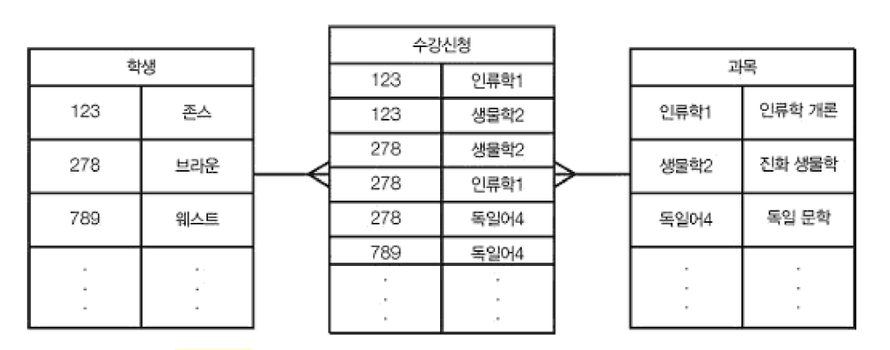
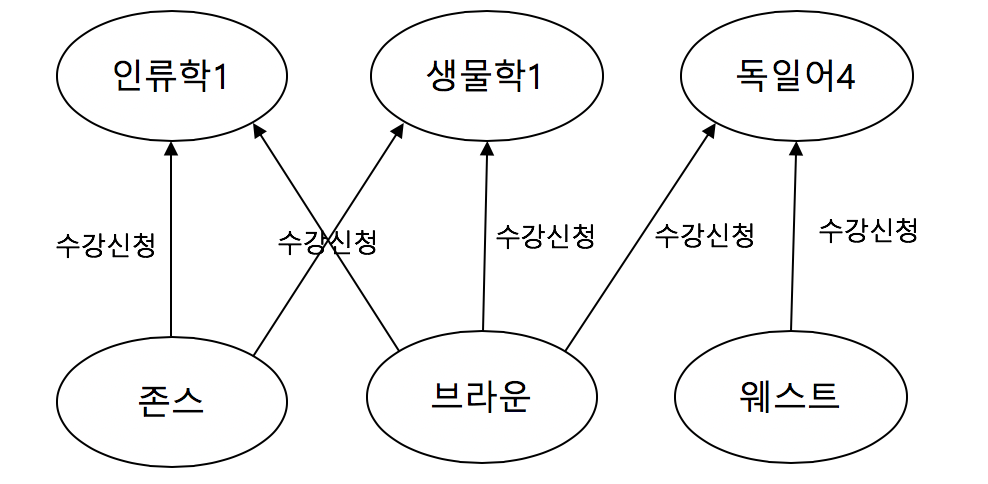
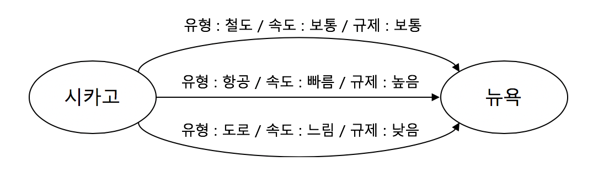

그래프 데이터베이스
====

네트워크 관계를 표현하기에 좋다. 사물간의 관계라는 관점에서 바라보면 거의 모든 것을 표현할 수 있다.

* 방향성을 가지는 관계
* 부분 관계
* 계층 관계
* 소셜 미디어

## 구성

### 정점 (vortex) : 엔터티

고유식별자로 표시된 엔터티. 속성을 가질 수 있다.

* 예시) 고속도로 시스템의 정점 : 도시 - 속성 : 인구, 위도/경도, 도시이름, 지리적위치 등...

### 에지 (edge) : 엔터티 간의 링크 / 연결 정보

정점들 간의 관계 / 정점들을 연결한 객체. 속성을 가질 수 있다

* 예시) 고속도로 시스템의 에지 : 도시를 연결한 고속도로 - 속성 : 거리, 제한속도, 차선 수 등...
* **가중치** 속성 : 관계에 대한 어떤 값을 표현함! 객체간 관계를 **측정**하는 다른 지표를 나타냄.
  * 예시) 고속도로 시스템의 에지의 가중치 속성 : 도시 간 거리
* 방향 에지 : 방향성을 가지며 관계해석이 필요한 경우. ex) 자식과 부모관계를 나타내는 그래프
* 무방향 에지 : 방향성이 필요없거나 양방향으로 이루어지는 관계일 경우. ex) 고속도로 그래프

### 경로

정점과 정점을 잇는 에지의 집합

* 방향 경로 (directed path) : 방향 에지의 집합인 경우
* 무방향 경로 (undirected path) : 무방향 에지의 집합인 경우

### 루프

한 정점에서 시작해 자기 자신으로 돌아오는 엣지

## 연산 작업

데이터 입력, 조회, 갱신, 삭제, **그래프 합집합, 교집합, 순회**

### 합집합

두개의 그래프를 합칠 수 있다. 집합의 합집합처럼 겹치는 정점을 기준으로 합쳐진다.

### 교집합

두개의 그래프의 공통된 정점과 에지를 나타난대

### 순회

그래프에 있는 모든 정점을 방문하는 프로세스.

## 정점의 속성 (특징)

### 동형성 (isomorphism)

두개의 그래프가 동일한 형태를 가지는 특성을 뜻함. 각 정점끼리 상응하는 정점이 있는 경우. 

그래프 집합에서 패턴을 탐지할 때 중요한 역할을 한다. (소셜네트워크, 전염병 등...)

### 순서와 크기

그래프가 얼마나 큰지 측정한다.

* 순서 : 정점의 개수
* 크기 : 에지의 개수

순서와 크기가 작업 수행에 필요한 시간과 공간에 영향을 줌. (커질수록 오래걸린다)

* 클라크 (clique) : 그래프에 있는 모든 정점이 서로 모두 연결된 것

### 차수 (degree)

한 정점에 연결된 에지의 개수. 정점의 **중요도**를 측정하는 수단

### 근접성 (closeness)

그래프에서 한 정점이 다른 모든 정점과 얼마나 떨어져 있는지를 나타낸다.

전파력(?)을 알기위한 매우 중요한 측정치. (소셜 네트워크에서의 정보 전파, 한 사회에서의 전염병 확산 등...)

근접성이 클수록 더 빠르게 다른 정점에 도달한다.

### 매개성 (betweenness)

주어진 정점에 병목현상이 얼마나 발생하는지 나타내는 측정치.

## 유형

### 무방향/방향 그래프

* 무방향 그래프 : 무방향 에지로 이루어진 그래프 (협력 관계)
* 방향 그래프 : 방향 에지로 이루어진 그래프 ('보고'와 같은 상하 관계 등)

### 유동 네트워크 (flow network, 교통 네트워크)

용량을 가진 각각의 에지와 진입/진출 에지로 이루어진 집합을 가진 정점들로 이루어진 방향 그래프

* 소스(source) 정점 : 진출 에지만 있는 정점
* 싱크(sink) 정점 : 진입 에지만 있는 정점

### 이분 네트워크 (biparrtie graph, bigraph)

구별되는 두 정점 집합으로 이루어진 그래프

### 다중 그래프 (multigraph)

정점 사이에 여러 에지가 있는 그래프

### 가중 그래프 (weighted graph)

각 에지에 번호(가중치)가 할당된 그래프

## 장점

### 조인을 피할 수 있어 질의 속도가 빠르다.

관계형 데이터로 표현한 경우, `학생`, `수강신청`, `과목`이라는 세가지 엔터티의 관계로 표현된다. 이 경우, 아래 그림처럼 조인이 필요해져 속도가 퍼포먼스가 좋지 않을 수 있다.

같은 관계를 그래프로 표현해보자. `수강신청`을 엔터티가 아닌 순수하게 관계를 뜻하는 에지로 표현하고 `과목`, `학생`을 정점으로 표현하여 조인이 필요없어지는 아래와 같은 그래프가 만들어진다.

### 단순화한 모델링

위의 예시처럼 모델링 시, 상호작용 정보는 제외하고 모델링하므로 좀 더 단순화시킬 수 있다.

### 엔터티 간의 여러 관계

다양한 유형의 에지를 사용하여 엔터티 간의 여러 관계를 모델링한다.

## 설계

