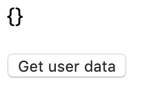
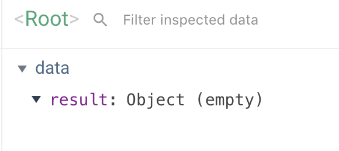
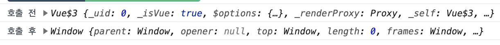
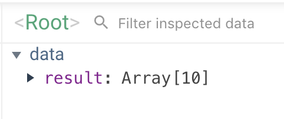

# Vue.js 정복 캠프 6기

출석번호 : 2055

* [강의 자료](https://joshua1988.github.io/vue-camp/)

* [강의 GitHub Repository](https://github.com/joshua1988/vue-camp)


# 사전지식

* [퍼블리셔에서 프론트엔드 개발자로 넘어갈 때애 알아두면 좋을 내용들](https://joshua1988.github.io/vue-camp/front-dev.html)

# 본강의

* 렌더링 코드로 변환되는 것을 직접 확인해볼 수 있는 사이트 : [Vue Template Explorer]([https://template-explorer.vuejs.org/#%3Cdiv%20id%3D%22app%22%3E%7B%7B%20msg%20%7D%7D%3C%2Fdiv%3E](https://template-explorer.vuejs.org/#{{ msg }}<%2Fdiv>))

## Axios

* [액시오스](https://joshua1988.github.io/vue-camp/vue/axios.html)

http 통신 가즈아~


### 아래의 과제를 풀어보자

```html
<html>

<head>
  <title>Vue Axios Sample</title>
</head>

<body>
  <div id="app">
    <p>{{ result }}</p>
    <button v-on:click="getData">Get user data</button>
  </div>

  <script src="https://cdn.jsdelivr.net/npm/vue@2.5.2/dist/vue.js"></script>
  <script src="https://unpkg.com/axios/dist/axios.min.js"></script>
  <script>
    new Vue({
      el: '#app',
      data: {
          result: {}
      },
      methods: {
        getData: function () {
          axios.get('https://jsonplaceholder.typicode.com/users/')
            .then(function (response) {
              console.log(response);
              // 할일 #1 - 전달 받은 10개의 사용자 정보를 화면에 출력
              
            })
        }
      }
    })
  </script>
</body>

</html>
```

http 요청을 보낸 비동기로직에서 `response`를 받아 `result`에 넣어주도록 하자!

아마도 아래와 같이 작성했을 것이다 :

```js
        getData: function () {
          axios.get('https://jsonplaceholder.typicode.com/users/')
            .then(function (response) {
              console.log(response);
              // 할일 #1 - 전달 받은 10개의 사용자 정보를 화면에 출력
              this.result = response;
            })
        }
```

결과를 확인해보자 : 



`Get user data` 버튼을 클릭해도 아무런 반응이 없을 것이다. 혹시모르니 Vue.js 개발자 도구도 확인해보자 : 



`result` 데이터의 값이 변하지 않는다. 이제 그 이유에 대해 알아보자!


### 비동기 로직에서의 this 이슈

그 이유는 바로 request를 하는 시점과 response를 받는 시점과 환경이 서로 다르며, response 를 받아오는 시점에는 `this` 가 변경되어있기 때문에 Vue 인스턴스에 저장되어있던 `data` 를 가져오지 못하기 때문이다.



실제로 전후 시점에 로그를 찍어보면 위와 같이 **Vue 인스턴스에서 Window 인스턴스로 변경**되었음을 확인할 수 있다. request를 하는 시점과 response를 받아오는 시점에서의 환경이 전혀 다르다는 뜻이다.

이를 해결하기 위해 호출 전의 `this` 를 변수에 저장하고 재사용해보자 : 

```js
        getData: function () {
          var vm = this;
          axios.get('https://jsonplaceholder.typicode.com/users/')
            .then(function (response) {
              // 할일 #1 - 전달 받은 10개의 사용자 정보를 화면에 출력
              vm.result = response.data;
            }).catch(err => {
              vm.result = err;
            });
        }
```



위와 같이 response 데이터가 정상적으로 들어오는 것을 확인할 수 있다.

비동기로직에서의 this에 대한 이슈에 대해서는 아래의 추가자료를 살펴보자 : 


* [자바스크립트의 동작원리: 엔진, 런타임, 호출 스택](https://joshua1988.github.io/web-development/translation/javascript/how-js-works-inside-engine/)


## Vue 프로젝트 만들기

* [Vue.js 공식 문서 - vue-cli](https://cli.vuejs.org/guide/installation.html)

