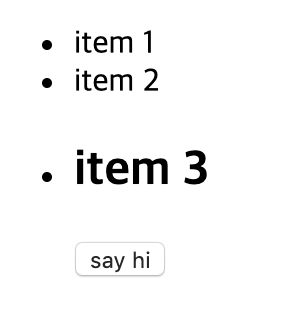

# Vue.js 정복 캠프 6기

출석번호 : 1722

* [강의 자료](https://joshua1988.github.io/vue-camp/)
* [강의 GitHub Repository](https://github.com/joshua1988/vue-camp)


## 8회차 수업 자료 안내

- [slot 글](https://joshua1988.github.io/vue-camp/reuse/slots.html)
- [Lazy Loading 글](https://developers.google.com/web/fundamentals/performance/lazy-loading-guidance/images-and-video)
- [뷰 인스턴스 라이프사이클 글](https://joshua1988.github.io/vue-camp/vue/life-cycle.html#라이프-사이클-다이어그램)
- [뷰 인스턴스 라이프사이클 공식 문서](https://vuejs.org/v2/guide/instance.html#Lifecycle-Diagram)
- [Chart.js](https://www.chartjs.org/docs/latest/)
- [HighChart.js](https://www.highcharts.com/)
- [AmChart.js](https://www.amcharts.com/)
- [D3.js](https://d3js.org/)
- [Three.js](https://threejs.org/)


## slot

```html
<!-- ListItem.vue -->
<template>
  <div>
    <li>
      <slot></slot>
    </li>
  </div>
</template>
```

해당 컴포넌트를 사용하는 곳에서 `<slot></slot>` 에 내용을 채워넣을 수 있다..

```html
<!-- App.vue -->
<template>
  <div id="app">
    <ul>
      <list-item>item 1</list-item>
      <list-item>item 2</list-item>
      <list-item>
        <h2>item 3</h2>
        <button>say hi</button>
      </list-item>
    </ul>
  </div>
</template>
```



### slot 이름 지정하기

```html
<!-- App.vue -->
<template>
  <div id="app">
    <ul>
      <list-item>
        <p slot="title">item 2</p>
        
      </list-item>
    </ul>
  </div>
</template>
```

```html
<!-- ListItem.vue -->
<template>
  <div>
    <li>
      <slot name="title"></slot>
      <slot name="image"></slot>
    </li>
  </div>
</template>
```


