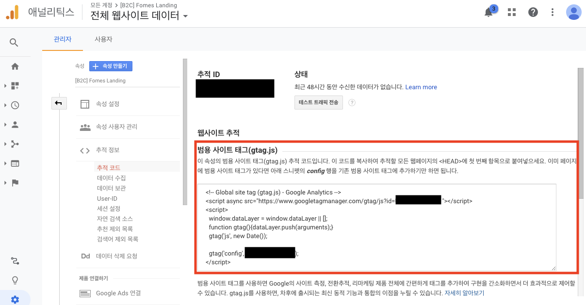

vue-analytics
====

Vue 프로젝트에 Google Analytics 를 편하게 붙일 수 있는 패키지.

Vue.js는 SPA 구조로 되어있다보니 build 후 산출되는 Single Page를 고려하여 Google Analytics 트래킹 코드를 제작하고 넣기가 번거롭다.



추가적인 이벤트가 발생할 일이 없는 단일 컴포넌트만 존재하는 경우이거나 웹 페이지 진입 여부만 체크하는 경우라면, `public/index.html` 에 Google Analytics에서 제공하는 임베디드 코드를 바로 넣어도 큰 상관은 없겠지만..... 여러 컴포넌트와 페이지, 그리고 이벤트들이 존재하는 경우에는 거의 불가능에 가깝다고 볼 수 있겠다. 그리고 대부분의 프로젝트가 후자의 케이스에 속할 것이다.

그럼 어쩌라는 말이냐ㅠㅠ!

ㅎㅎ하지만 정말 다행히도 **Vue.js를 위한 Google Analytics 패키지**가 몇가지 존재한다 😇

오늘은 그 중에서도 `vue-analytics` 에 대해 소개해보려 한다.

## vue-analytics

공식 Github 페이지에는 "Google Analytics를 붙이기 위한 Vue.js의 플러그인" 이라고 소개되어있다.

* npm : https://www.npmjs.com/package/vue-analytics
* github : https://github.com/MatteoGabriele/vue-analytics

공식 Github 페이지에서는 vue-analytics의 에 대해 아래와 같이 소개한다.

> 이 플러그인은 단순한 Google Analytics API의 Wrapper가 아니며, 그 뿐 아니라, 신경쓰고 싶지 않거나 신경쓰지 않아도 되는 이슈들에 대한 솔루션을 제공합니다.
>
> 예를 들면 : 
>
> * Automatic Google Analytics script loading
> * Automatic page tracking
> * Event batching
> * Opt-out from Google Analytics with promise support
> * Multiple domain ID tracking system
> * Vuex support
> * E-commerce API
> * Vue error exception tracking system
> * Debugging API

나도 처음에는 단순한 Google Analytics Plugin인 줄 알았는데 아니었다! Google Analytics에서 제공하는 대부분의 기능들을 Vue.js에서 매우 손쉽게 사용할 수 있도록 제공하고 있다.

패키지의 이름 때문인지ㅎㅎ 개발진들이 많은 오해를 받아왔었나보다. 그래도 깃헙 페이지에서 이렇게 대놓고 설명해주니 사용자도 속시원~

### 설치 및 간단 적용

일단 한번 사용해보기위해  `vue-analytics` 를 설치해보자!

```bash
$ npm install vue-analytics --save
```

그 다음은 `src/main.js` 에 `vue-analytics`를 적용해줄 차례이다. 기타 코드들은 생략 했다.

```js
import Vue from 'vue'
import VueAnalytics from 'vue-analytics'

Vue.use(VueAnalytics, {
    id: 'UA-000000000-0'   // Google Analytics의 Tracking ID를 넣어준다
});
```

위와 같이 적용하면 끝이다. 엄청나게 심플하다 ☺️

이번에 Google Analytics를 적용하는 프로젝트는 우리 회사 서비스를 소개하는 심플한 랜딩페이지라 router나 Vuex 등을 적용하지 않았다. 그렇기 때문에 이렇게 심플하게 끝난 것!

하지만 앞으로 개발될 수많은 Vue.js 프로젝트들은 이것보다 훨씬 복잡할 예정이기 때문에, 다양한 설정과 컨트롤이 가능한지 알아볼 필요가 있다는 생각이 들었다.

### 응용

* 공식 GitHub 페이지에서 제공하는 다양한 사용법 가이드 : https://github.com/MatteoGabriele/vue-analytics#user-guide

#### 1. 페이지별 트래킹은 어떻게 설정하는가?

#### 2. 이벤트별 트래킹은 어떻게 설정하는가?

버튼 클릭 등의 이벤트!

#### 3. 활성화 여부 설정은 없는가?


## 마무리

사실 패키지 사용법이라 굳이 포스팅으로까지 남겨야할까 살짝쿵 고민했었다. 그런데 의외로 vue-analytics에 대한 포스팅이 별로 없기도 하고 나중에 필요할 때 검색하는게 귀찮기도 해서 직접 정리해야겠다는 생각이 들었다.

Google Analytics 는 모바일에서 오래 사용해왔었는데 이번에 Vue.js 프로젝트에 적용하면서 웹쪽에서는 Google Analytics를 제대로 적용해본적이 없었다는 사실을 깨닫게 되었다. 지금까지는 간단한 웹페이지를 만들거나 사내에서만 사용하는 어드민 페이지만 만들어왔다보니 아예 Google Analytics를 붙일 필요가 없거나 단순 진입만 체크하면 되는 경우가 잦았다...!

다음에 진행될 프로젝트때! 이번 기회에 본격적으로 사용해봐야지 싶다! 재밌겠군~_~


## 참고자료

* [How to integrate Google Analytics on your Vue.js page](https://webdeasy.de/en/how-to-integrate-google-analytics-on-your-vue-js-page/)
* [Vue.js에 Google Anayltics 붙이기]([https://velog.io/@bluestragglr/Vue.js%EC%97%90-Google-Analytics-%EB%B6%99%EC%9D%B4%EA%B8%B0](https://velog.io/@bluestragglr/Vue.js에-Google-Analytics-붙이기))
* [Tips & Tricks for vue-analytics](https://medium.com/dailyjs/tips-tricks-for-vue-analytics-87a9d2838915)
* https://matteogabriele.gitbooks.io/vue-analytics/docs/page-tracking.html

